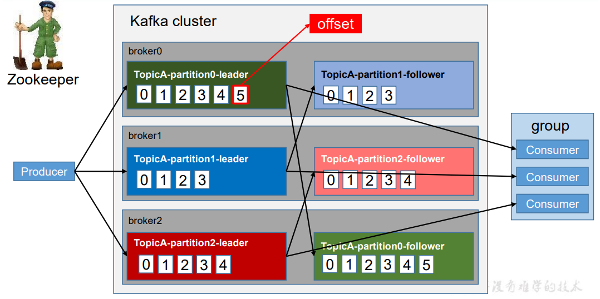
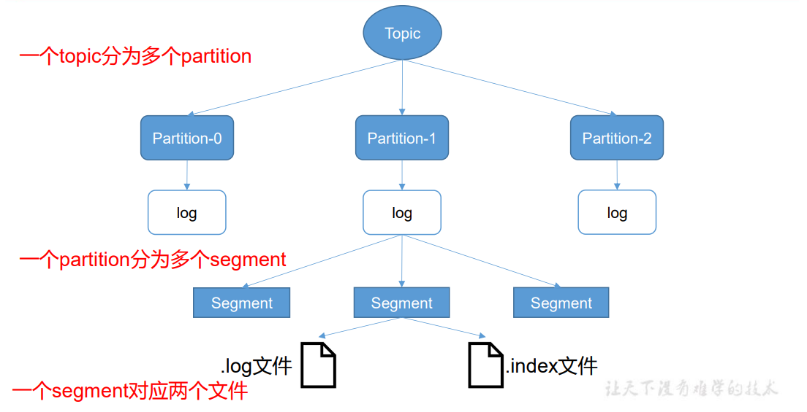
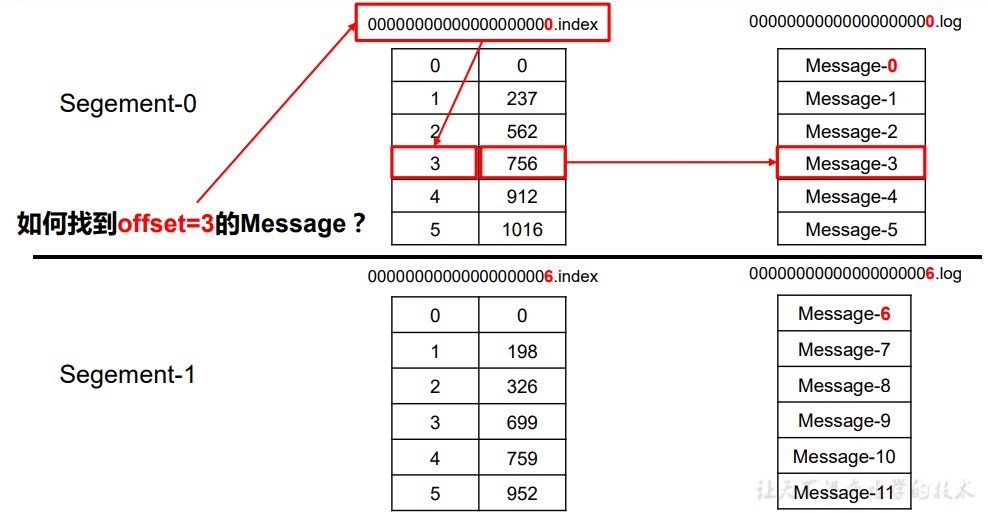
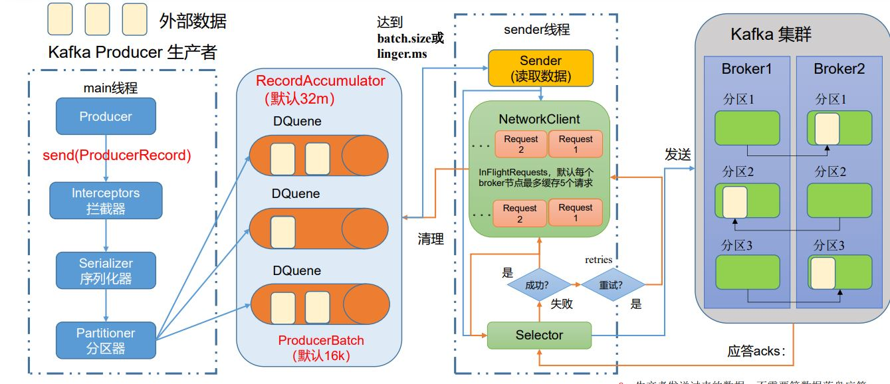

# Kafka 基本知识笔记

Kafka:（1）消息队列；（2）分布式流处理平台

## 0. kafka基本架构和术语


（1）**Producer**：消息生产者，就是向 Kafka broker 发消息的客户端。 

（2）**Consumer**：消息消费者，向 Kafka broker 取消息的客hadoop101户端。 

（3）**Consumer Group（CG）**：消费者组，由多个 consumer 组成。消费者组内每个消 费者负责消费不同分区的数据，一个分区只能由一个组内消费者消费；消费者组之间互不 影响。所有的消费者都属于某个消费者组，即消费者组是逻辑上的一个订阅者。 

（4）**Broker**：一台 Kafka 服务器就是一个 broker。一个集群由多个 broker 组成。一个 broker 可以容纳多个 topic。 

（5）**Topic**：可以理解为一个队列，生产者和消费者面向的都是一个 topic。 

（6）**Partition**：为了实现扩展性，一个非常大的 topic 可以分布到多个 broker（即服 务器）上，一个 topic 可以分为多个 partition，每个 partition 是一个有序的队列。 

（7）**Replica**：副本。一个 topic 的每个分区都有若干个副本，一个 Leader 和若干个 Follower。

 （8）**Leader**：每个分区多个副本的“主”，生产者发送数据的对象，以及消费者消费数 据的对象都是 Leader。 

（9）**Follower**：每个分区多个副本中的“从”，实时从 Leader 中同步数据，保持和 Leader 数据的同步。Leader 发生故障时，某个 Follower 会成为新的 Leader。

## 1. Kafka 安裝部署

### 1.1. 集群规划

三个linux服务器，命名为hadoop2，hadoop3，hadoop4 。运行一个zookeeper集群和hadoop集群

#### 1.1.1. zookeeper配置

**zookeeper集群配置文件**

```properties
# The number of milliseconds of each tick
tickTime=2000
# The number of ticks that the initial 
# synchronization phase can take
initLimit=10
# The number of ticks that can pass between 
# sending a request and getting an acknowledgement
syncLimit=5
# the directory where the snapshot is stored.
# do not use /tmp for storage, /tmp here is just 
# example sakes.
dataDir=/home/wade/zookeeper/zookeeper-3.5.10/zkData
dataLogDir=/home/wade/zookeeper/zookeeper-3.5.10/zkLog
# the port at which the clients will connect
clientPort=2181
# the maximum number of client connections.
# increase this if you need to handle more clients
#maxClientCnxns=60
#
# Be sure to read the maintenance section of the 
# administrator guide before turning on autopurge.
#
# http://zookeeper.apache.org/doc/current/zookeeperAdmin.html#sc_maintenance
#
# The number of snapshots to retain in dataDir
#autopurge.snapRetainCount=3
# Purge task interval in hours
# Set to "0" to disable auto purge feature
#autopurge.purgeInterval=1
# cluster config
server.2=192.168.102.131:2888:3888 # hadoop2:2888:3888
server.3=192.168.102.133:2888:3888
server.4=192.168.102.132:2888:3888
```

**zookeeper集群启动脚本**

```shell
#! /bin/bash
case $1 in
"start"){
 for i in 192.168.102.131 192.168.102.133 192.168.102.132
 do
 echo " --------启动 $i zookeeper-------"
 ssh $i "/home/wade/zookeeper/zookeeper-3.5.10/bin/zkServer.sh start"
 done
};;
"stop"){
 for i in 192.168.102.131 192.168.102.133 192.168.102.132
 do
 echo " --------停止 $i zookeeper-------"
 ssh $i "/home/wade/zookeeper/zookeeper-3.5.10/bin/zkServer.sh stop "
 done
};;
esac
```

#### 1.1.2. Kafka安装配置

**kafka集群配置**

```properties
#broker 的全局唯一编号，不能重复，只能是数字。
broker.id=0

advertised.listeners=PLAINTEXT://hadoop2:9092
#处理网络请求的线程数量
num.network.threads=3
#用来处理磁盘 IO 的线程数量
num.io.threads=8
#发送套接字的缓冲区大小
socket.send.buffer.bytes=102400
#接收套接字的缓冲区大小
socket.receive.buffer.bytes=102400
#请求套接字的缓冲区大小
socket.request.max.bytes=104857600
#kafka 运行日志(数据)存放的路径，路径不需要提前创建，kafka 自动帮你创建，可以配置多个磁盘路径，路径与路径之间可以用"，"分隔
log.dirs=/home/wade/kafka/kafka_2.12_3/datas
#topic 在当前 broker 上的分区个数
num.partitions=1
#用来恢复和清理 data 下数据的线程数量
num.recovery.threads.per.data.dir=1
# 每个 topic 创建时的副本数，默认时 1 个副本
offsets.topic.replication.factor=1
#segment 文件保留的最长时间，超时将被删除
log.retention.hours=168
#每个 segment 文件的大小，默认最大 1G
log.segment.bytes=1073741824
# 检查过期数据的时间，默认 5 分钟检查一次是否数据过期
log.retention.check.interval.ms=300000
#配置连接 Zookeeper 集群地址（在 zk 根目录下创建/kafka，方便管理）
zookeeper.connect=192.168.102.131:2181,192.168.102.133:2181,192.168.102.132:2181/kafka
```

**Kafka集群启动脚本**

```shell
#! /bin/bash
case $1 in
"start"){
 for i in 192.168.102.131 192.168.102.133 192.168.102.132
 do
 echo " --------启动 $i Kafka-------"
 ssh $i "/home/wade/kafka/kafka_2.12_3/bin/kafka-server-start.sh -daemon /home/wade/kafka/kafka_2.12_3/config/server.properties"
 done
};;
"stop"){
 for i in 192.168.102.131 192.168.102.133 192.168.102.132
 do
 echo " --------停止 $i Kafka-------"
 ssh $i "/home/wade/kafka/kafka_2.12_3/bin/kafka-server-stop.sh "
 done
};;
esac
```

**注意事项**：停止 Kafka 集群时，一定要等 Kafka 所有节点进程全部停止后再停止 Zookeeper 集群。因为 Zookeeper 集群当中记录着 Kafka 集群相关信息，Zookeeper 集群一旦先停止， Kafka 集群就没有办法再获取停止进程的信息，只能手动杀死 Kafka 进程了。

### 1.2. Kafka命令

#### 1.2.1. Topic相关命令

- 查看Topic命令以及参数：`bin/kafka-topics.sh`

- 创建一个Topic： `bin/kafka-topics.sh --bootstrap-server hadoop3:9092 --create --partitions 1 --replication-factor 3 --topic first`
- 查看指定Topic：`bin/kafka-topics.sh --bootstrap-server hadoop2:9092 --describe --topic first`
- 修改Topic的分区（只能增）：`bin/kafka-topics.sh --bootstrap-server hadoop2:9092 --alter --topic first --partitions 3`
- 删除Topic：`bin/kafka-topics.sh --bootstrap-server hadoop2:9092 --delete --topic first`

#### 1.2.2. Producer 相关命令

- 查看Producer的命令以及参数：`bin/kafka-console-producer.sh`
- 向指定Topic发送消息：`bin/kafka-console-producer.sh --bootstrap-server hadoop2:9092 --topic first`

#### 1.2.3. Consumer 相关命令

- 查看Producer的命令以及参数：`bin/kafka-console-consumer.sh`
- 从Topic拉取消息：`bin/kafka-console-consumer.sh --bootstrap-server hadoop2:9092 --topic first`
- 从Topic拉取所有消息（包括历史）：`bin/kafka-console-consumer.sh --bootstrap-server 192.168.102.131:9092 --from-beginning --topic first`

### 1.3. Kafka工作流程以及文件存储机制




Kafka 中消息是以 topic 进行分类的，生产者生产消息，消费者消费消息，都是面向 topic 的。

**topic** 是**逻辑**上的概念，而 **partition** 是物理上的概念，每个 **partition** 对应于一个 **log 文 件**，该 log 文件中存储的就是 producer 生产的数据。。Producer 生产的数据会被不断追加到该 log 文件末端，且每条数据都有自己的 **offset**。

消费者组中的每个消费者，都会实时记录自己 消费到了哪个 offset，以便出错恢复时，从上次的位置继续消费。



由于生产者生产的消息会不断追加到 log 文件末尾，为防止 log 文件过大导致数据定位 效率低下，Kafka 采取了**分片和索引机制**，将每个 partition 分为多个 segment。每个 segment 对应两个文件——**“.index”文件**和**“.log”文件**。这些文件位于一个文件夹下，该文件夹的命名 规则为：topic 名称+分区序号。例如，first 这个 topic 有三个分区，则其对应的文件夹为 first0,first-1,first-2。


**index 和 log 文件以当前 segment 的第一条消息的 offset 命名**。下图为 index 文件和 log 文件的结构示意图。



**“.index”文件存储大量的索引信息，“.log”文件存储大量的数据**，索引文件中的元数据指向对应数据文件中 message 的物理偏移地址。

## 2. Kafka Producer

### 2.1. 生产者 消息发送流程



**重要参数解释：**

- **batch.size**：只有数据积累到batch.size之后，sender才会发送数据。**默认16k**。
- **linger.ms**：如果数据迟迟未达到batch.size，sender等待linger.ms设置的时间 到了之后就会发送数据。单位ms，**默认值是0ms**，表示没有延迟。

**应答acks的值：**

- 0：生产者发送过来的数据，不需要等数据落盘应答。
-  1：生产者发送过来的数据，Leader收到数据后应答。
- -1（all）：生产者发送过来的数据，Leader和ISR队列 里面的所有节点收齐数据后应答。-1和all等价。

#### 2.1.1. 发送原理

- 在消息发送的过程中，涉及到了两个线程——<font color="red">**main 线程**</font>和<font color="red"> **Sender 线程**</font>。在 main 线程 中创建了一个**双端队列 RecordAccumulator**。

- main 线程将消息发送给 `RecordAccumulator`， Sender 线程不断从 `RecordAccumulator` 中拉取消息发送到 Kafka Broker。

#### 2.1.2. 生产者重要参数

| 参数名称                              | 描述                                                         |
| ------------------------------------- | ------------------------------------------------------------ |
| bootstrap.servers                     | 生产者连接集群所需的 broker 地 址 清 单 。 例 如 hadoop102:9092,hadoop103:9092,hadoop104:9092，可以 设置 1 个或者多个，中间用逗号隔开 |
| key.serializer 和 value.serializer    | 指定发送消息的 key 和 value 的序列化类型。一定要写 全类名    |
| buffer.memory                         | RecordAccumulator 缓冲区总大小，默认 32m。                   |
| batch.size                            | **缓冲区一批数据最大值**，**默认 16k**。适当增加该值，可 以提高吞吐量，但是如果该值设置太大，会导致数据 传输延迟增加。 |
| linger.ms                             | 如果数据迟迟未达到 batch.size，sender 等待 linger.time 之后就会发送数据。单位 ms，**默认值是 0ms**，表示没 有延迟。生产环境建议该值大小为 5-100ms 之间。 |
| acks                                  | 0：生产者发送过来的数据，不需要等数据落盘应答。<br /> 1：生产者发送过来的数据，Leader 收到数据后应答。<br /> -1（all）：生产者发送过来的数据，Leader+和 isr 队列 里面的所有节点收齐数据后应答。<br />默认值是-1，-1 和 all 是等价的。 |
| max.in.flight.requests.per.connection | 允许最多没有返回 ack 的次数，默认为 5，开启幂等性 要保证该值是 1-5 的数字。 |
| retries                               | 当消息发送出现错误的时候，系统会重发消息。**retries 表示重试次数**。默认是 int 最大值，2147483647。 如果设置了重试，还想保证消息的有序性，需要设置 MAX_IN_FLIGHT_REQUESTS_PER_CONNECTION=1 ,否则在重试此失败消息的时候，其他的消息可能发送 成功了。 |
| retry.backoff.ms                      | 两次重试之间的时间间隔，默认是 100ms。                       |
| enable.idempotence                    | 是否开启**幂等性**，默认 true，开启幂等性。                  |
| compression.type                      | 生产者发送的所有数据的压缩方式。默认是 none，也就是不压缩。<br /> 支持压缩类型：none、gzip、snappy、lz4 和 zstd。 |

### 2.2. 发送的API

#### 2.2.1. 普通异步发送 和 带回调函数的异步发送

```java
package com.uestc.kafkabasic.b1;

import org.apache.kafka.clients.producer.*;
import org.apache.kafka.common.serialization.StringSerializer;

import java.util.Properties;

public class Consumer1 {

    public static void main(String[] args) {
        Properties prop = new Properties();
        prop.put(ProducerConfig.BOOTSTRAP_SERVERS_CONFIG, "192.168.102.131:9092");
        prop.put(ProducerConfig.KEY_SERIALIZER_CLASS_CONFIG, StringSerializer.class.getName());
        prop.put(ProducerConfig.VALUE_SERIALIZER_CLASS_CONFIG, StringSerializer.class.getName());

        // 创建 KafkaProducer
        KafkaProducer<String, String> producer = new KafkaProducer<String, String>(prop);

        // 发送
        for (int i = 0; i < 10; i++) {
            // 无回调函数
//            producer.send(new ProducerRecord<String, String>("first", "uestc_kgr_" + i));
            // 有回调函数
            producer.send(new ProducerRecord<String, String>("first", "uestc_kgr_" + i), new Callback() {
                public void onCompletion(RecordMetadata recordMetadata, Exception e) {
                    if (null == e) {
                        System.out.println("Topic: " + recordMetadata.topic() + " partition: " + recordMetadata.partition());
                    } else {
                        System.out.println("Exception occur!");
                    }
                }
            });
        }
        // close
        producer.close();
    }
}
```

### 2.3. 同步发送API

`send().get()` 方法，即同步发送

```java
package com.uestc.kafkabasic.b1;

import org.apache.kafka.clients.producer.*;
import org.apache.kafka.common.serialization.StringSerializer;

import java.util.Properties;
import java.util.concurrent.ExecutionException;

public class Consumer1 {

    public static void main(String[] args) throws ExecutionException, InterruptedException {
        Properties prop = new Properties();
        prop.put(ProducerConfig.BOOTSTRAP_SERVERS_CONFIG, "192.168.102.131:9092");
        prop.put(ProducerConfig.KEY_SERIALIZER_CLASS_CONFIG, StringSerializer.class.getName());
        prop.put(ProducerConfig.VALUE_SERIALIZER_CLASS_CONFIG, StringSerializer.class.getName());

        // 创建 KafkaProducer
        KafkaProducer<String, String> producer = new KafkaProducer<String, String>(prop);

        // 发送
        for (int i = 0; i < 10; i++) {
            // 无回调函数
//            producer.send(new ProducerRecord<String, String>("first", "uestc_kgr_" + i));
            // 有回调函数
            producer.send(new ProducerRecord<String, String>("first", "uestc_kgr_" + i), new Callback() {
                public void onCompletion(RecordMetadata recordMetadata, Exception e) {
                    if (null == e) {
                        System.out.println("Topic: " + recordMetadata.topic() + " partition: " + recordMetadata.partition());
                    } else {
                        System.out.println("Exception occur!");
                    }
                }
            })
                    // send().get() 方法，即同步发送
                    .get();
        }
        // close
        producer.close();
    }
}
```

### 2.4. 生产者分区

#### 2.4.1. 分区好处

- **便于合理使用存储资源**，每个Partition在一个Broker上存储，可以把海量的数据按照分区切割成一 块一块数据存储在多台Broker上。合理控制分区的任务，可以实现负载均衡的效果
- **提高并行度**，生产者可以以分区为单位发送数据；消费者可以以分区为单位进行消费数据。


#### 2.4.2. 分区策略

##### 2.4.2.1. 默认分区器 DefaultPartitioner

```java
public class DefaultPartitioner implements Partitioner {
    private final StickyPartitionCache stickyPartitionCache = new StickyPartitionCache();

    public DefaultPartitioner() {
    }

    public void configure(Map<String, ?> configs) {
    }

    public int partition(String topic, Object key, byte[] keyBytes, Object value, byte[] valueBytes, Cluster cluster) {
        return this.partition(topic, key, keyBytes, value, valueBytes, cluster, cluster.partitionsForTopic(topic).size());
    }

    public int partition(String topic, Object key, byte[] keyBytes, Object value, byte[] valueBytes, Cluster cluster, int numPartitions) {
        return keyBytes == null ? this.stickyPartitionCache.partition(topic, cluster) : Utils.toPositive(Utils.murmur2(keyBytes)) % numPartitions;
    }

    public void close() {
    }

    public void onNewBatch(String topic, Cluster cluster, int prevPartition) {
        this.stickyPartitionCache.nextPartition(topic, cluster, prevPartition);
    }
}
```

- 在指明partition的情况下，直 接将指明的值作为partition值； 例如partition=0，所有数据写入 分区0
- 没有指明partition值但有key的情况下，将key的hash值与topic的 partition数进行取余得到partition值；
- 既没有partition值又没有key值的情况下，Kafka采用Sticky Partition（黏性分区器），会随机选择一个分区，并尽可能一直 使用该分区，待该分区的batch已满或者已完成，Kafka再随机一个分区进行使用（和上一次的分区不同）。

**案例一**：将数据发往指定 partition 的情况下，例如，将所有数据发往分区 1 中。

```java
public class CustomProducerCallbackPartitions {
    public static void main(String[] args) {
        Properties prop = new Properties();
        prop.put(ProducerConfig.BOOTSTRAP_SERVERS_CONFIG, "192.168.102.131:9092");
        prop.put(ProducerConfig.KEY_SERIALIZER_CLASS_CONFIG, StringSerializer.class.getName());
        prop.put(ProducerConfig.VALUE_SERIALIZER_CLASS_CONFIG, StringSerializer.class.getName());

        // 添加自定义分区器
        prop.put(ProducerConfig.PARTITIONER_CLASS_CONFIG, MyPartitioner.class.getName());

        // 创建 KafkaProducer
        KafkaProducer<String, String> producer = new KafkaProducer<>(prop);

        for (int i = 0; i < 10; i++) {
            producer.send(new ProducerRecord<>("first", 1, "", "uestc_kgr_" + i), (meta, e) -> {
            
                if (e == null) {
                    System.out.println("topic:" + meta.topic() + ",partition:" + meta.partition());
                } else {
                    e.printStackTrace();
                }
            });
        }

        producer.close();
    }
}
```

**案例二**：没有指明 partition 值但有 key 的情况下，将 key 的 hash 值与 topic 的 partition 数进行取 余得到 partition 值。

```java
public class CustomProducerCallbackPartitions {
    public static void main(String[] args) {
        Properties prop = new Properties();
        prop.put(ProducerConfig.BOOTSTRAP_SERVERS_CONFIG, "192.168.102.131:9092");
        prop.put(ProducerConfig.KEY_SERIALIZER_CLASS_CONFIG, StringSerializer.class.getName());
        prop.put(ProducerConfig.VALUE_SERIALIZER_CLASS_CONFIG, StringSerializer.class.getName());

        // 添加自定义分区器
        prop.put(ProducerConfig.PARTITIONER_CLASS_CONFIG, MyPartitioner.class.getName());

        // 创建 KafkaProducer
        KafkaProducer<String, String> producer = new KafkaProducer<>(prop);

        for (int i = 0; i < 10; i++) {
            // key 为 f
            producer.send(new ProducerRecord<>("first", "f", "_kgr_" + i), (meta, e) -> {
                if (e == null) {
                    System.out.println("topic:" + meta.topic() + ",partition:" + meta.partition());
                } else {
                    e.printStackTrace();
                }
            });
        }
        producer.close();
    }
}
```

##### 2.4.2.2. 自定义分区器

**需求**：例如我们实现一个分区器实现，发送过来的数据中如果包含 uestc，就发往 0 号分区， 不包含 uestc，就发往 1 号分区。

**实现步骤**：（1）定义类实现`Partitioner`接口；（2）重写`partition()`方法；（3）使用分区器的方法，在生产者的配置中添加分区器参数。

```java
public class MyPartitioner implements Partitioner {
    /**
     * 返回消息对应的分区
     * @param s 主题
     * @param o key
     * @param bytes keyBytes
     * @param o1 value
     * @param bytes1 valueBytes
     * @param cluster 集群元数据 可以查看分区信息
     * @return
     */
    @Override
    public int partition(String s, Object o, byte[] bytes, Object o1, byte[] bytes1, Cluster cluster) {
        String value = o1.toString();
        if(value.contains("uestc")) {
            return 1;
        } else {
            return 0;
        }
    }
}
```

```java

        Properties prop = new Properties();

        // 添加自定义分区器
        prop.put(ProducerConfig.PARTITIONER_CLASS_CONFIG, MyPartitioner.class.getName());

```


### 2.5. 生产经验：生产者如何提高吞吐量

```java
/**
 * batch.size：批次大小，默认16k
 * linger.ms：等待时间，修改为5-100ms
 * 一次拉一个，来了就走
 * compression.type：压缩snappy
 * RecordAccumulator：缓冲区大小，修改为64m
 */
public class CustomProducerParameters {
    public static void main(String[] args) {
        Properties prop = new Properties();
        prop.put(ProducerConfig.BOOTSTRAP_SERVERS_CONFIG, "192.168.102.131:9092");
        prop.put(ProducerConfig.KEY_SERIALIZER_CLASS_CONFIG, StringSerializer.class.getName());
        prop.put(ProducerConfig.VALUE_SERIALIZER_CLASS_CONFIG, StringSerializer.class.getName());

        // 批次大小：默认16k
        prop.put(ProducerConfig.BATCH_SIZE_CONFIG, 16 * (1 << 10));
        // 等待时间
        prop.put(ProducerConfig.LINGER_MS_CONFIG, 1);
        // 缓存区大小
        prop.put(ProducerConfig.BUFFER_MEMORY_CONFIG, 32 * (1 << 20));

        KafkaProducer<String, String> producer = new KafkaProducer<String, String>(prop);
        for (int i = 0; i < 10; i++) {
            producer.send(new ProducerRecord<>("first", "uestc_kgr_" + i));
        }
        producer.close();
    }
}
```


### 2.6. 生产经验：数据可靠性

**数据完全可靠条件 = ACK级别设置为-1 + 分区副本大于等于2 + ISR里应答的最小副本数量大于等于2**

**可靠性总结：**

- acks=0，生产者发送过来数据就不管了，可靠性差，效率高； 
- acks=1，生产者发送过来数据Leader应答，可靠性中等，效率中等； 
- acks=-1，生产者发送过来数据Leader和ISR队列里面所有Follwer应答，可靠性高，效率低；

**ISR队列**：Leader维护了一个动态的in-sync replica set（ISR），意为和 Leader保持同步的Follower+Leader集合(leader：0，isr:0,1,2)。

在生产环境中，acks=0很少使用；acks=1，一般用于传输普通日志，允许丢个别数据；acks=-1，一般用于传输和钱相关的数据， 对可靠性要求比较高的场景。

```java
public class CustomProducerParametersAck {
    public static void main(String[] args) {
        Properties prop = new Properties();
        prop.put(ProducerConfig.BOOTSTRAP_SERVERS_CONFIG, "192.168.102.131:9092");
        prop.put(ProducerConfig.KEY_SERIALIZER_CLASS_CONFIG, StringSerializer.class.getName());
        prop.put(ProducerConfig.VALUE_SERIALIZER_CLASS_CONFIG, StringSerializer.class.getName());
        
        // 配置ACK的值
        prop.put(ProducerConfig.ACKS_CONFIG, "all");
        prop.put(ProducerConfig.RETRIES_CONFIG, 3);

        KafkaProducer<String, String> producer = new KafkaProducer<>(prop);
        for (int i = 0; i < 10; i++) {
            producer.send(new ProducerRecord<>("first", "uestc_kgr_ack_" + i));
        }
        producer.close();
    }
}
```


### 2.7. 生产经验：数据去重

#### 2.7.1. 数据传递语义

- 至少一次（At Least Once）= ACK级别设置为-1 + 分区副本大于等于2 + ISR里应答的最小副本数量大于等于2 
- 最多一次（At Most Once）= ACK级别设置为0 

**总结：** At Least Once可以保证数据不丢失，但是不能保证数据不重复； At Most Once可以保证数据不重复，但是不能保证数据不丢失。

- 精确一次（Exactly Once）：对于一些非常重要的信息，比如和钱相关的数据，要求数据既不能重复也不丢失。 Kafka 0.11版本以后，引入了一项重大特性：幂等性和事务。

#### 2.7.2. 幂等性

**幂等性就是指Producer不论向Broker发送多少次重复数据，Broker端都只会持久化一条，保证了不重复**

精确一次（Exactly Once） = 幂等性 + 至少一次（ ack=-1 + 分区副本数>=2 + ISR最小副本数量>=2） 。

**重复数据的判断标准**：具有`<PID, Partition, SeqNumber>`相同主键的消息提交时，Broker只会持久化一条。其 中PID是Kafka每次重启都会分配一个新的；Partition 表示分区号；Sequence Number是单调自增的。 **所以幂等性只能保证的是在单分区单会话内不重复。**


使用方法：开启参数 enable.idempotence 默认为 true，false 关闭。

#### 2.7.3. 生产者事务

##### 2.7.3.1. 事务原理

**注意：开启事务的前提是开启幂等性**


##### 2.7.3.2. API

```java
// 1 初始化事务
void initTransactions();
// 2 开启事务
void beginTransaction() throws ProducerFencedException;
// 3 在事务内提交已经消费的偏移量（主要用于消费者）
void sendOffsetsToTransaction(Map<TopicPartition, OffsetAndMetadata> offsets, String consumerGroupId) throws ProducerFencedException;
// 4 提交事务
void commitTransaction() throws ProducerFencedException;
// 5 放弃事务（类似于回滚事务的操作）
void abortTransaction() throws ProducerFencedException;
```

具体代码：

```java
public class CustomProducerTransactions {
    public static void main(String[] args) {
        Properties prop = new Properties();
        prop.put(ProducerConfig.BOOTSTRAP_SERVERS_CONFIG, "192.168.102.131:9092");
        prop.put(ProducerConfig.KEY_SERIALIZER_CLASS_CONFIG, StringSerializer.class.getName());
        prop.put(ProducerConfig.VALUE_SERIALIZER_CLASS_CONFIG, StringSerializer.class.getName());
        prop.put(ProducerConfig.TRANSACTIONAL_ID_CONFIG, "trans_id_0");

        KafkaProducer<String, String> producer = new KafkaProducer<String, String>(prop);
        producer.initTransactions();
        producer.beginTransaction();
        try {
            for (int i = 0; i < 10; i++) {
                producer.send(new ProducerRecord<>("first", "uestc_kgr_trans_"+i));
                int x = i / 0; // error
                producer.commitTransaction();
            }
        } catch (Exception e) {
            producer.abortTransaction();
        } finally {
            producer.close();
        }
    }
}
```


### 2.8. 生产经验：数据有序

单分区：有序（按条件排序）

多分区：分区与分区间 无序

### 2.9. 生产经验：数据乱序

- kafka在1.x版本之前保证数据单分区有序，条件如下： max.in.flight.requests.per.connection=1（不需要考虑是否开启幂等性）。

- kafka在1.x及以后版本保证数据单分区有序，条件如下：

  - 未开启幂等性， max.in.flight.requests.per.connection需要设置为1。

  - max.in.flight.requests.per.connection需要设置小于等于5。

    **原因说明**：因为在kafka1.x以后，启用幂等后，kafka服务端会缓存producer发来的最近5个request的元数据， 故无论如何，都可以保证最近5个request的数据都是有序的（会在服务端重新排序）。

## 3. Kafka Broker

### 3.1. Broker工作流程

#### 3.1.1. zookeeper存储的Kafka信息


#### 3.1.2. Broker工作整体流程


#### 3.1.3. Broker重要参数

| 参数名称                                             | 描述                                                         |
| ---------------------------------------------------- | ------------------------------------------------------------ |
| replica.lag.time.max.ms                              | ISR 中，如果 Follower 长时间未向 Leader 发送通 信请求或同步数据，则该 Follower 将被踢出 ISR。 该时间阈值，默认 30s。 |
| auto.leader.rebalance.enable                         | 默认是 true。 自动 Leader Partition 平衡。                   |
| leader.imbalance.per.broker.percentage               | 默认是 10%。每个 broker 允许的不平衡的 leader 的比率。如果每个 broker 超过了这个值，控制器 会触发 leader 的平衡。 |
| leader.imbalance.check.interval.seconds              | 默认值 300 秒。检查 leader 负载是否平衡的间隔时 间。         |
| 默认值 300 秒。检查 leader 负载是否平衡的间隔时 间。 | Kafka 中 log 日志是分成一块块存储的，此配置是 指 log 日志划分 成块的大小，默认值 1G。 |
| log.retention.hours                                  | Kafka 中数据保存的时间，默认 7 天。                          |
| log.retention.minutes                                | Kafka 中数据保存的时间，分钟级别，默认关闭。                 |
| log.retention.ms                                     | Kafka 中数据保存的时间，毫秒级别，默认关闭。                 |
| log.retention.bytes                                  | 默认等于-1，表示无穷大。超过设置的所有日志总 大小，删除最早的 segment。 |
| log.cleanup.policy                                   | 默认是 delete，表示所有数据启用删除策略； 如果设置值为 compact，表示所有数据启用压缩策 略。 |
| num.io.threads                                       | 默认是 8。负责写磁盘的线程数。整个参数值要占 总核数的 50%。  |
| num.replica.fetchers                                 | 副本拉取线程数，这个参数占总核数的 50%的 1/3                 |
| num.network.threads                                  | 默认是 3。数据传输线程数，这个参数占总核数的 50%的 2/3 。    |
| log.flush.interval.messages                          | 强制页缓存刷写到磁盘的条数，默认是 long 的最 大值，9223372036854775807。一般不建议修改， 交给系统自己管理。 |
| log.flush.interval.ms                                | 每隔多久，刷数据到磁盘，默认是 null。一般不建 议修改，交给系统自己管理。 |

### 3.2. 生产经验：节点服役和退役

#### 3.2.1. 服役新节点

#### 3.2.2. 退役旧节点

### 3.3. Kafka副本

#### 3.3.1.  副本基本信息

（1）Kafka 副本作用：提高数据可靠性。

（2）Kafka 默认副本 1 个，生产环境一般配置为 2 个，保证数据可靠性；太多副本会 增加磁盘存储空间，增加网络上数据传输，降低效率。 

（3）Kafka 中副本分为：Leader 和 Follower。Kafka 生产者只会把数据发往 Leader， 然后 Follower 找 Leader 进行同步数据。 

（4）Kafka 分区中的所有副本统称为 AR（Assigned Repllicas）

AR = ISR + OSR

- ISR，表示和 Leader 保持同步的 Follower 集合。如果 Follower 长时间未向 Leader 发送通信请求或同步数据，则该 Follower 将被踢出 ISR。该时间阈值由 replica.lag.time.max.ms 参数设定，默认 30s。Leader 发生故障之后，就会从 ISR 中选举新的 Leader。

- OSR，表示 Follower 与 Leader 副本同步时，延迟过多的副本。

#### 3.3.2. Leader 选举流程

Kafka 集群中有一个 broker 的 Controller 会被选举为 Controller Leader，负责管理集群 broker 的上下线，所有 topic 的分区副本分配和 Leader 选举等工作。

Controller 的信息同步工作是依赖于 Zookeeper 的。


## 4. Kafka Consumer

### 4.1. Kafka消费方式

- **pull**：consumer采用从broker中主动拉取数据。 Kafka采用这种方式。
- **push**：Kafka没有采用这种方式，因为由broker 决定消息发送速率，很难适应所有消费者的 消费速率。例如推送的速度是50m/s， Consumer1、Consumer2就来不及处理消息。 pull模式不足之处是，如 果Kafka没有数 据，消费者可能会陷入循环中，一直返回 空数据。

### 4.2. 消费者工作流程


## 5. Spring-Kafka

