# 1.Spring Cloud Alibaba介绍

## 1.1.Spring Cloud Alibaba组件构成

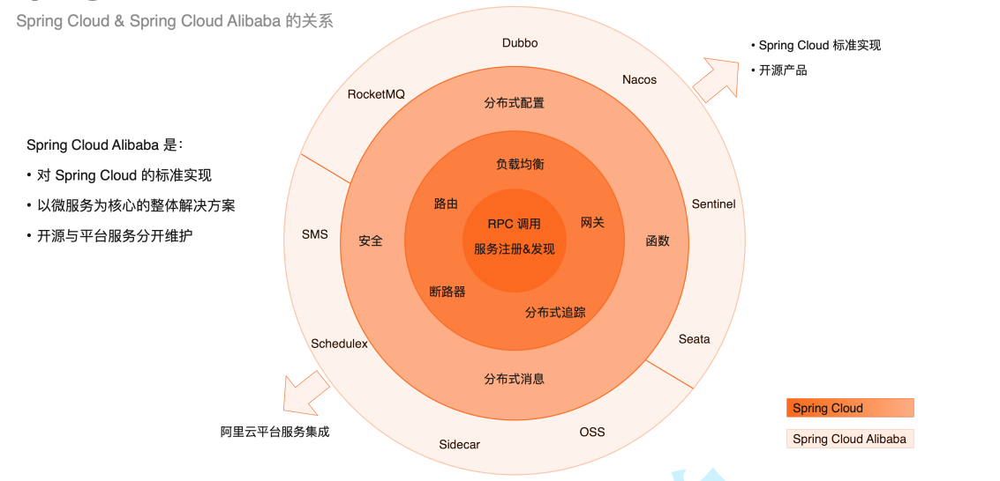


## 1.2.Spring Cloud Alibaba环境搭建
版本说明 · https://github.com/alibaba/spring-cloud-alibaba/wiki/%E7%89%88%E6%9C%AC%E8%AF%B4%E6%98%8E

本文推荐使用

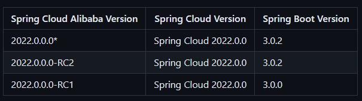


# 2.配置/注册中心Nacos
## 2.1.什么是Nacos
官方：一个更易于构建云原生应用的动态服务发现(Nacos Discovery )、服务配置(Nacos Config)和服务管理平台。集 注册中心+配置中心+服务管理 平台。
Nacos 的关键特性包括:

- 服务发现和服务健康监测动态配置
- 服务动态 DNS 服务
- 服务及其元数据管理

nacos的maven依赖导入注意事项：`spring-cloud-starter-alibaba-nacos-config`和`spring-cloud-starter-alibaba-nacos-discovery`

## 2.2.Nacos注册中心
管理所有微服务、解决微服务之间调用关系错综复杂、难以维护的问题；
### 2.2.1.注册中心演变及其设计思想
### 2.2.2.核心功能
- 服务注册：Nacos Client会通过发送REST请求的方式向Nacos Server注册自己的服务，提供自身的元数据，比如ip地址、端口等信息。Nacos Server接收到注册请求后，就会把这些元数据信息存储在一个双层的内存Map中。
- 服务心跳：在服务注册后，Nacos Client会维护一个定时心跳来持续通知Nacos Server，说明服务一直处于可用状态，防止被剔除。默认5s发送一次心跳。
  服务同步：Nacos Server集群之间会互相同步服务实例，用来保证服务信息的一致性。  
- 服务发现：服务消费者（Nacos Client）在调用服务提供者的服务时，会发送一个REST请求给Nacos Server，获取上面注册的服务清单，并且缓存在Nacos Client本地，同时会在Nacos Client本地开启一个定时任务定时拉取服务端最新的注册表信息更新到本地缓存。
- 服务健康检查：Nacos Server会开启一个定时任务用来检查注册服务实例的健康情况，对于超过15s没有收到客户端心跳的实例会将它的healthy属性置为false(客户端服务发现时不会发现)，如果某个实例超过30秒没有收到心跳，直接剔除该实例(被剔除的实例如果恢复发送心跳则会重新注册)

### 2.2.3.Nacos部署
安装包下载：https://github.com/alibaba/Nacos/releases
#### 2.2.3.1.单机模式
#### 2.2.3.2.集群模式
#### 2.2.4.SpringCloudAliababa组件版本选择

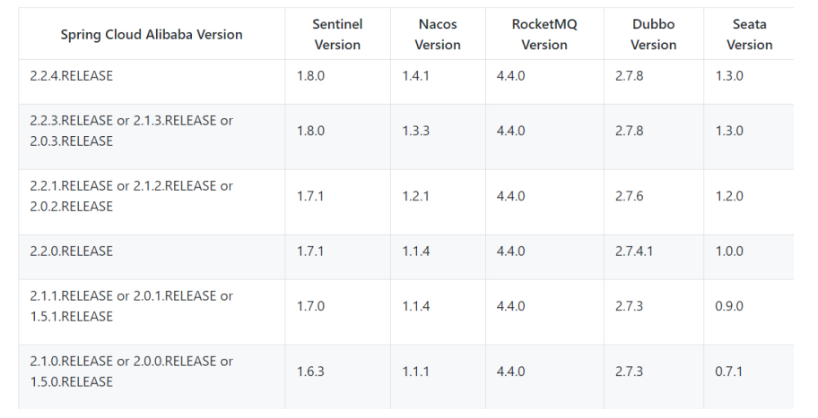


## 2.3.Nacos配置中心
官方文档： https://github.com/alibaba/spring­cloud­alibaba/wiki/Nacos­config
Nacos 提供用于存储配置和其他元数据的 key/value 存储，为分布式系统中的外部化配置提供服务器端和客户端支持。使用 Spring Cloud Alibaba Nacos Config，您可以在 Nacos Server 集中管理你 Spring Cloud 应用的外部属性配置。1.维护性 2.时效性 3.安全性

### 2.3.1. 快速开始
nacos配置中心页面如下图所示，分别包含 **名称空间（namespace）**，**Data ID**，和 **Group**。

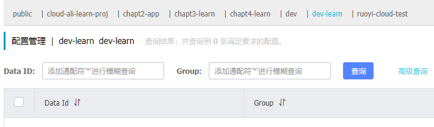

三者设计的最佳实践：

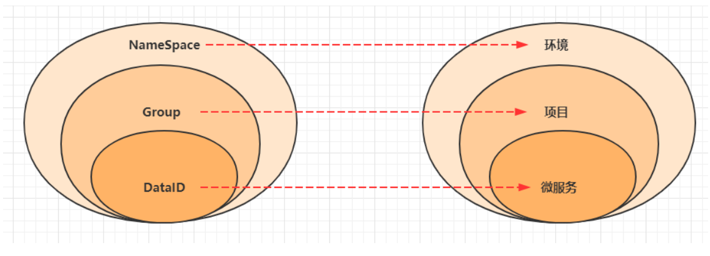

- Namespace：代表不同环境，如开发、测试、生产环境。
- Group：代表某项目，如XX医疗项目、XX电商项目
- DataId：每个项目下往往有若干个工程（微服务），每个配置集(DataId)是一个工程（微服务）的主配置文件

### 2.3.2.搭建nacos-config服务

构建一个Springboot项目，引入SpringcloudAliababa 的nacos-config的依赖。
bootstrap.yml配置文件为

```yaml
spring:
  profiles:
    active: dev
bootstrap-dev配置文件为
server:
  port: 7005
spring:
  application:
    name: nacos-config
  cloud:
    nacos:
      config:
        file-extension: yaml
        server-addr: localhost:8848
        namespace: dev-learn
        group: nacos-config
```

在nacos的配置文件

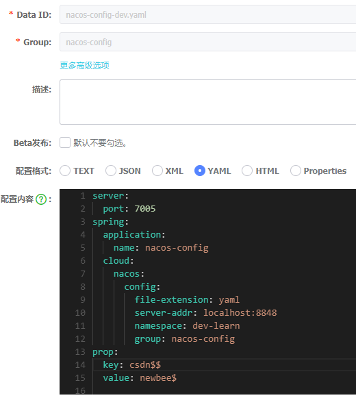

Java代码为：

```java
@Slf4j
@SpringBootApplication
public class NacosConfigApplication {
    public static void main(String[] args) throws InterruptedException {
        ConfigurableApplicationContext applicationContext = SpringApplication.run(NacosConfigApplication.class, args);
    }
}
```


```java
@RefreshScope // 在配置类上写 RefreshScope注解开启动态加载配置的功能
@Configuration
@RestController
public class NacosDynamicConfig {
	@Value("${prop.key}")
	private String key;
	@Value("${prop.value}")
	private String val;

	@PostMapping("/nacos-config")
	public String kv() {
	    return "".concat(key).concat("-").concat(val);
	}
}
```


# 3.微服务负载均衡

## 3.1. Ribbon

### 3.1.1.什么是Ribbon

目前主流的负载方案分为以下两种：

- 集中式负载均衡，在消费者和服务提供方中间使用独立的代理方式进行负载，有硬件的（比如 F5），也有软件的（比如 Nginx）。

- 客户端根据自己的请求情况做负载均衡，Ribbon 就属于客户端自己做负载均衡。

Spring Cloud  Ribbon是基于Netflix Ribbon 实现的一套客户端的负载均衡工具，Ribbon客户端组件提供一系列的完善的配置，如超时，重试等。通过Load Balancer获取到服务提供的所有机器实例，Ribbon会自动基于某种规则(轮询，随机)去调用这些服务。Ribbon也可以实现我们自己的负载均衡算法。

#### 3.1.1.1.客户端的负载均衡

例如spring cloud中的ribbon，客户端会有一个服务器地址列表，在发送请求前通过负载均衡算法选择一个服务器，然后进行访问，这是客户端负载均衡；即在客户端就进行负载均衡算法分配。

#### 3.1.1.2.服务端的负载均衡

例如Nginx，通过Nginx进行负载均衡，先发送请求，然后通过负载均衡算法，在多个服务器之间选择一个进行访问；即在服务器端再进行负载均衡算法分配。

#### 3.1.1.3.常见的负载均衡算法

- 随机，通过随机选择服务进行执行，一般这种方式使用较少;

- 轮训，负载均衡默认实现方式，请求来之后排队处理;

- 加权轮训，通过对服务器性能的分型，给高配置，低负载的服务器分配更高的权重，均衡各个服务器的压力;

- 地址Hash，通过客户端请求的地址的HASH值取模映射进行服务器调度。  ip --->hash

- 最小链接数，即使请求均衡了，压力不一定会均衡，最小连接数法就是根据服务器的情况，比如请求积压数等参数，将请求分配到当前压力最小的服务器上。  最小活跃数

### 3.1.2. Nacos使用Ribbon

nacos-discovery 添加了Ribbon，在代码中添加如下代码：

```java
@Bean
@LoadBalanced // 添加注解@LoadBalanced 
public RestTemplate restTemplate(RestTemplateBuilder builder){
    RestTemplate restTemplate = builder.build();
    return restTemplate;
}
```

### 3.1.3.Ribbon的核心原理

#### 3.1.3.1.Ribbon原理

IRule这是所有负载均衡策略的父接口，里边的核心方法就是choose方法，用来选择一个服务实例

```java
package com.netflix.loadbalancer;
public interface IRule {
    Server choose(Object var1);
    void setLoadBalancer(ILoadBalancer var1);
    ILoadBalancer getLoadBalancer();
}
```

`AbstractLoadBalancerRule`是一个抽象类，里边主要定义了一个`ILoadBalancer`，这里定义它的目的主要是辅助负责均衡策略选取合适的服务端实例。

```java
public abstract class AbstractLoadBalancerRule implements IRule, IClientConfigAware {
    private ILoadBalancer lb;
	public AbstractLoadBalancerRule() {
	}

	public void setLoadBalancer(ILoadBalancer lb) {
	    this.lb = lb;
	}

	public ILoadBalancer getLoadBalancer() {
	    return this.lb;
	}
}
```


`AbstractLoadBalancerRule`的实现类有以下：

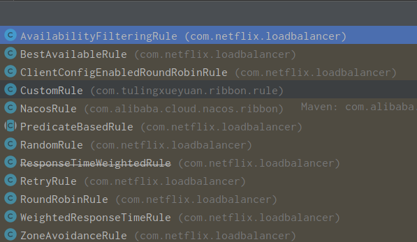

#### 3.1.3.2.Ribbon负载均衡策略

- `RandomRule`：随机选择一个服务实例，看源码我们知道，在RandomRule的无参构造方法中初始化了一个`Random`对象，然后在它重写的`choose`方法又调用了`choose(ILoadBalancer lb, Object key)`这个重载的`choose`方法，在这个重载的`choose`方法中，每次利用`random`对象生成一个不大于服务实例总数的随机数，并将该数作为下标所以获取一个服务实例。
- `RoundRobinRule：RoundRobinRule`这种负载均衡策略叫做线性轮询负载均衡策略。这个类的choose(ILoadBalancer lb, Object key)函数整体逻辑是这样的：开启一个计数器count，在while循环中遍历服务清单，获取清单之前先通过incrementAndGetModulo方法获取一个下标，这个下标是一个不断自增长的数先加1然后和服务清单总数取模之后获取到的（所以这个下标从来不会越界），拿着下标再去服务清单列表中取服务，每次循环计数器都会加1，如果连续10次都没有取到服务，则会报一个警告No available alive servers after 10 tries from load balancer: XXXX。
- `RetryRule`（在轮询的基础上进行重试）：看名字就知道这种负载均衡策略带有重试功能。首先RetryRule中又定义了一个subRule，它的实现类是RoundRobinRule，然后在RetryRule的choose(ILoadBalancer lb, Object key)方法中，每次还是采用RoundRobinRule中的choose规则来选择一个服务实例，如果选到的实例正常就返回，如果选择的服务实例为null或者已经失效，则在失效时间deadline之前不断的进行重试（重试时获取服务的策略还是RoundRobinRule中定义的策略），如果超过了deadline还是没取到则会返回一个null。
- `WeightedResponseTimeRule`（权重 —nacos的NacosRule ，Nacos还扩展了一个自己的基于配置的权重扩展）：WeightedResponseTimeRule是RoundRobinRule的一个子类，在WeightedResponseTimeRule中对RoundRobinRule的功能进行了扩展，WeightedResponseTimeRule中会根据每一个实例的运行情况来给计算出该实例的一个权重，然后在挑选实例的时候则根据权重进行挑选，这样能够实现更优的实例调用。WeightedResponseTimeRule中有一个名叫DynamicServerWeightTask的定时任务，默认情况下每隔30秒会计算一次各个服务实例的权重，权重的计算规则也很简单，如果一个服务的平均响应时间越短则权重越大，那么该服务实例被选中执行任务的概率也就越大。
- `ClientConfigEnabledRoundRobinRule`：ClientConfigEnabledRoundRobinRule选择策略的实现很简单，内部定义了RoundRobinRule，choose方法还是采用了RoundRobinRule的choose方法，所以它的选择策略和RoundRobinRule的选择策略一致，不赘述。
- `BestAvailableRule`：BestAvailableRule继承自ClientConfigEnabledRoundRobinRule，它在ClientConfigEnabledRoundRobinRule的基础上主要增加了根据loadBalancerStats中保存的服务实例的状态信息来过滤掉失效的服务实例的功能，然后顺便找出并发请求最小的服务实例来使用。然而loadBalancerStats有可能为null，如果loadBalancerStats为null，则BestAvailableRule将采用它的父类即ClientConfigEnabledRoundRobinRule的服务选取策略（线性轮询）。
- `ZoneAvoidanceRule` （默认规则，复合判断server所在区域的性能和server的可用性选择服务器。）ZoneAvoidanceRule是PredicateBasedRule的一个实现类，只不过这里多一个过滤条件，ZoneAvoidanceRule中的过滤条件是以ZoneAvoidancePredicate为主过滤条件和以AvailabilityPredicate为次过滤条件组成的一个叫做CompositePredicate的组合过滤条件，过滤成功之后，继续采用线性轮询(RoundRobinRule)的方式从过滤结果中选择一个出来。
- `AvailabilityFilteringRule`（先过滤掉故障实例，再选择并发较小的实例）： 过滤掉一直连接失败的被标记为circuit tripped的后端Server，并过滤掉那些高并发的后端Server或者使用一个AvailabilityPredicate来包含过滤server的逻辑，其实就是检查status里记录的各个Server的运行状态。
  如何修改负载均衡策略：

通过配置文件+配置类的方式，指定微服务采取指定的负载均衡策略：


利用`@RibbonClient`指定微服务及其负载均衡策略。

```yml
# 被调用的微服务名
mall‐order:
  ribbon:
   # 指定使用Nacos提供的负载均衡策略（优先调用同一集群的实例，基于随机&权重）
   NFLoadBalancerRuleClassName: com.alibaba.cloud.nacos.ribbon.NacosRule
```

在启动类上加配置，利用`@RibbonClient`指定微服务及其负载均衡策略。

```java
@RibbonClients({
        @RibbonClient(name = "", configuration = RibbonRandomRuleConfig.class),
        @RibbonClient(name = "", configuration = RibbonRandomRuleConfig.class)
})
```

如何自定义负载均衡策略：
通过实现 `IRule `接口可以自定义负载策略，主要的选择服务逻辑在 `choose `方法中。

#### 3.1.3.3.饥饿加载

在进行服务调用的时候，如果网络情况不好，第一次调用会超时。Ribbon默认懒加载，意味着只有在发起调用的时候才会创建客户端。
开启饥饿加载，解决第一次调用慢的问题。

```yml
ribbon:
  eager-load:
    # 开启ribbon饥饿加载
    enabled: true
    # 配置mall-user使用ribbon饥饿加载，多个使用逗号分隔
    clients: stock-service
```

源码对应属性配置类：`RibbonEagerLoadProperties`

## 3.2.LoadBalancer

### 3.2.1. LoadBalancer是什么

Spring Cloud LoadBalancer是Spring Cloud官方自己提供的客户端负载均衡器, 用来替代Ribbon。
Spring官方提供了两种负载均衡的客户端：

- `RestTemplate`：`RestTemplate`是Spring提供的用于访问Rest服务的客户端，`RestTemplate`提供了多种便捷访问远程Http服务的方法，能够大大提高客户端的编写效率。默认情况下，`RestTemplate`默认依赖jdk的HTTP连接工具。
- `WebClient`：`WebClient`是从Spring WebFlux 5.0版本开始提供的一个非阻塞的基于响应式编程的进行Http请求的客户端工具。它的响应式编程的基于Reactor的。`WebClient`中提供了标准Http请求方式对应的get、post、put、delete等方法，可以用来发起相应的请求。

### 3.2.2.RestTemplate整合LoadBalancer

pom配置如下，注意nacos-discovery需要移除Ribbon

```xml
<dependency>
    <groupId>org.springframework.cloud</groupId>
    <artifactId>spring-cloud-starter-loadbalancer</artifactId>
</dependency>

<dependency>
    <groupId>com.alibaba.cloud</groupId>
    <artifactId>spring-cloud-starter-alibaba-nacos-discovery</artifactId>
    <exclusions>
        <exclusion>
            <groupId>org.springframework.cloud</groupId>
            <artifactId>spring-cloud-netflix-ribbon</artifactId>
        </exclusion>
    </exclusions>
</dependency>
```

如果不移除Ribbon，可以在yml中配置不使用Ribbon。这是因为同时存在LoadBalancer和Ribbon的情况下是兼容的，并且默认使用的是Ribbon。

```yaml
spring:
  cloud:
    loadbalancer:
      ribbon:
        enabled: false
```

# 4.微服务调用组件Feign

Java如何实现接口调用：

- `HttpClient`：HttpClient 是 Apache Jakarta Common 下的子项目，用来提供高效的、最新的、功能丰富的支持 Http 协议的客户端编程工具包，并且它支持 HTTP 协议最新版本和建议。HttpClient 相比传统 JDK 自带的 URLConnection，提升了易用性和灵活性，使客户端发送 HTTP 请求变得容易，提高了开发的效率。
- `OkHttp`：一个处理网络请求的开源项目，是安卓端最火的轻量级框架，由 Square 公司贡献，用于替代 HttpUrlConnection 和 Apache HttpClient。OkHttp 拥有简洁的 API、高效的性能，并支持多种协议（HTTP/2 和 SPDY）
- `HttpURLConnection`：一个处理网络请求的开源项目，是安卓端最火的轻量级框架，由 Square 公司贡献，用于替代 HttpUrlConnection 和 Apache HttpClient。OkHttp 拥有简洁的 API、高效的性能，并支持多种协议（HTTP/2 和 SPDY）
- `RestTemplate`   :RestTemplate 是 Spring 提供的用于访问 Rest 服务的客户端，RestTemplate 提供了多种便捷访问远程 HTTP 服务的方法，能够大大提高客户端的编写效率。

## 4.1.什么是Feign

Feign是Netflix开发的声明式、模板化的HTTP客户端。Feign支持多种注解，例如Feign自带的注解或者JAX-RS注解等。Spring Cloud openfeign对Feign进行了增强，使其支持Spring MVC注解，另外还整合了Ribbon和Nacos，从而使得Feign的使用更加方便

### 4.1.1.优势

Feign可以做到使用 HTTP 请求远程服务时就像调用本地方法一样的体验，开发者完全感知不到这是远程方法，更感知不到这是个 HTTP 请求。它像 Dubbo 一样，consumer 直接调用接口方法调用 provider，而不需要通过常规的 Http Client 构造请求再解析返回数据。它解决了让开发者调用远程接口就跟调用本地方法一样，无需关注与远程的交互细节，更无需关注分布式环境开发。

## 4.2.Spring Cloud Alibaba快速整合OpenFeign

构建工程,my-sca-demo的pom文件为。主要对包版本进行统一管理
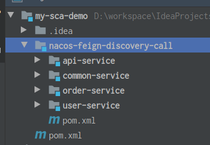

```xml
<parent>
        <artifactId>spring-boot-starter-parent</artifactId>
        <groupId>org.springframework.boot</groupId>
        <version>2.3.2.RELEASE</version>
</parent>
<groupId>cn.cscn</groupId>
<artifactId>my-sca-demo</artifactId>
<version>1.0-SNAPSHOT</version>
<packaging>pom</packaging>

<modules>
    <module>nacos-feign-discovery-call</module>
</modules>

<properties>
    <java.version>8</java.version>
<!--        <spring-boot.version>2.3.2.RELEASE</spring-boot.version>-->
        <spring.cloud.version>Hoxton.SR8</spring.cloud.version>
        <spring.cloud.alibaba.version>2.2.5.RELEASE</spring.cloud.alibaba.version>
        <lombok.version>1.18.10</lombok.version>
        <junit.version>4.10</junit.version>
        <java.version>1.8</java.version>
        <project.build.sourceEncoding>UTF-8</project.build.sourceEncoding>
    </properties>
<dependencyManagement>
    <dependencies>

        <dependency>
            <groupId>org.springframework.cloud</groupId>
            <artifactId>spring-cloud-dependencies</artifactId>
            <version>${spring.cloud.version}</version>
            <type>pom</type>
            <scope>import</scope>
        </dependency>

        <dependency>
            <groupId>com.alibaba.cloud</groupId>
            <artifactId>spring-cloud-alibaba-dependencies</artifactId>
            <version>${spring.cloud.alibaba.version}</version>
            <type>pom</type>
            <scope>import</scope>
        </dependency>
    </dependencies>
</dependencyManagement>
```
nacos-feign-discovery的pom为:

```xml
<parent>
    <groupId>cn.cscn</groupId>
    <artifactId>my-sca-demo</artifactId>
    <version>1.0-SNAPSHOT</version>
</parent>
<modelVersion>4.0.0</modelVersion>

<groupId>cn.cscn.myscademo</groupId>
<artifactId>nacos-feign-discovery-call</artifactId>
<version>1.0-SNAPSHOT</version>

<packaging>pom</packaging>

<modules>
    <module>api-service</module>
    <module>common-service</module>
    <module>order-service</module>
    <module>user-service</module>
</modules>
```

**引入依赖**,在common模块里加入所有的依赖

```xml
<parent>
    <groupId>cn.cscn.myscademo</groupId>
    <artifactId>nacos-feign-discovery-call</artifactId>
    <version>1.0-SNAPSHOT</version>
    <relativePath/>
</parent>
<modelVersion>4.0.0</modelVersion>

<groupId>cn.cscn.commonservice</groupId>
<artifactId>common-service</artifactId>
<version>1.0-SNAPSHOT</version>

<dependencies>
    <dependency>
        <groupId>org.springframework.boot</groupId>
        <artifactId>spring-boot-starter</artifactId>
</dependency>
<dependency>
    <groupId>org.springframework.boot</groupId>
    <artifactId>spring-boot-starter-web</artifactId>
</dependency>

<dependency>
    <groupId>org.springframework.boot</groupId>
    <artifactId>spring-boot-starter-test</artifactId>
</dependency>

<dependency>
    <groupId>org.projectlombok</groupId>
    <artifactId>lombok</artifactId>
    <optional>true</optional>
</dependency>

<dependency>
    <groupId>org.springframework.boot</groupId>
    <artifactId>spring-boot-starter-test</artifactId>
    <scope>test</scope>
</dependency>

<dependency>
    <groupId>junit</groupId>
    <artifactId>junit</artifactId>
    <scope>test</scope>
</dependency>

<dependency>
    <groupId>com.alibaba.cloud</groupId>
    <artifactId>spring-cloud-starter-alibaba-nacos-config</artifactId>
</dependency>

<dependency>
    <groupId>com.alibaba.cloud</groupId>
    <artifactId>spring-cloud-starter-alibaba-nacos-discovery</artifactId>
</dependency>

<dependency>
    <groupId>org.springframework.cloud</groupId>
    <artifactId>spring-cloud-starter-openfeign</artifactId>
</dependency>
</dependencies>
```

在api-service模块里加入openfeign的依赖。其他模块只需要引入common和api即可。

```xml
<parent>
    <groupId>cn.cscn.myscademo</groupId>
    <artifactId>nacos-feign-discovery-call</artifactId>
    <version>1.0-SNAPSHOT</version>
    <relativePath/>
</parent>
<modelVersion>4.0.0</modelVersion>

<artifactId>api-service</artifactId>
<version>1.0-SNAPSHOT</version>
<groupId>cn.cscn.apiservice</groupId>

<dependencies>
    <dependency>
        <groupId>cn.cscn.commonservice</groupId>
        <artifactId>common-service</artifactId>
        <version>1.0-SNAPSHOT</version>
    </dependency>
    <dependency>
        <groupId>org.projectlombok</groupId>
        <artifactId>lombok</artifactId>
    </dependency>
</dependencies>

<build>
    <plugins>
        <plugin>
            <groupId>org.springframework.boot</groupId>
            <artifactId>spring-boot-maven-plugin</artifactId>
            <configuration>
                <excludes>
                    <exclude>
                        <groupId>org.projectlombok</groupId>
                        <artifactId>lombok</artifactId>
                    </exclude>
                </excludes>
            </configuration>
        </plugin>
    </plugins>
</build>
```


**编写调用接口 + @FeignClient 注解**
（1）在api模块编写feign的接口。`@FeignClient`注解中的`value`表示服务名，`path`表示`uri`，`configuration`表示配置类（这里的配置类`DefaultFeignConfiguration`在局部生效）

```java
package cn.cscn.apiservice.orderservice;

import cn.cscn.apiservice.config.DefaultFeignConfiguration;
import cn.cscn.apiservice.orderservice.vo.OrderVo;
import org.springframework.cloud.openfeign.FeignClient;
import org.springframework.web.bind.annotation.PathVariable;
import org.springframework.web.bind.annotation.RequestMapping;


@FeignClient(value = "order-service", path = "/order", configuration = DefaultFeignConfiguration.class) // 局部生效配置类
//@FeignClient(value = "order-service", path = "/order") // 没有生效配置类
public interface OrderFeignApi {
    @RequestMapping("/findOrderById/{userId}")
    OrderVo findOrderById(@PathVariable("userId") Integer userId);
}
```

（2）在order模块新建类，实现` OrderFeignService `接口。方法名一模一样，注释几乎一样。

```java
package cn.cscn.orderservice.rpc;

import cn.cscn.apiservice.orderservice.OrderFeignService;
import cn.cscn.apiservice.orderservice.vo.OrderVo;
import org.springframework.web.bind.annotation.RequestMapping;
import org.springframework.web.bind.annotation.RestController;

@RequestMapping("/order")
@RestController
public class OrderFeignApiImpl implements OrderFeignApi {

    @RequestMapping("/findOrderById/{userId}")
    @Override
    public OrderVo findOrderById(@PathVariable("userId") Integer userId) {
        // 具体业务方法
        return new OrderVo(userId, "Wade");
    }
}
```

（3）在发起调用请求的user-service模块的启动类添加注解`@EnableFeignClients`，其中 `defaultConfiguration` 表示配置类在全局生效，`basePackages `的值为调用接口所在的包

```java
//@EnableFeignClients(defaultConfiguration = DefaultFeignConfiguration.class) // 全局生效配置类
@EnableFeignClients(basePackages = "cn.cscn.apiservice.orderservice") // 解决扫描包的问题
@SpringBootApplication
public class UserServiceApplication {
    public static void main(String[] args) {  SpringApplication.run(UserServiceApplication.class, args);    }
}
```

（4）在被调用接口所在的order-service模块的启动类添加注解

```java
package cn.cscn.orderservice;

import org.springframework.boot.SpringApplication;
import org.springframework.boot.autoconfigure.SpringBootApplication;
import org.springframework.cloud.openfeign.EnableFeignClients;

@EnableFeignClients
@SpringBootApplication
public class OrderServiceApplication {
    public static void main(String[] args) { SpringApplication.run(OrderServiceApplication.class, args);    }
}
```

（5）发起调用，像调用本地方式一样调用远程服务
在user-service模块里的业务方法编写远程调用逻辑代码：

```java
package cn.cscn.userservice.service.impl;

import cn.cscn.apiservice.orderservice.OrderFeignService;
import cn.cscn.apiservice.orderservice.vo.OrderVo;
import cn.cscn.userservice.service.IUserService;
import org.springframework.stereotype.Service;
import javax.annotation.Resource;

@Service
public class UserService implements IUserService {
    @Resource
    OrderFeignApi orderFeignApi;

    public OrderVo findOrderByUserId(int id) {
        return orderFeignApi.findOrderById(id);
    }
}
```

## 4.3. 自定义配置及使用

### 4.3.1.日志配置

日志配置有两种，一是通过配置类，二是通过配置文件。通过配置文件是全局生效，而通过配置类比较灵活，既可以全局生效也可以局部生效。
配置类代码如下，这里配置了日志级别为BASIC。日志级别有四种，分别是：

- NONE【性能最佳，适用于生产】：不记录任何日志（默认值）。
- BASIC【适用于生产环境追踪问题】：仅记录请求方法、URL、响应状态代码以及执行时间。
- HEADERS：记录BASIC级别的基础上，记录请求和响应的header。
- FULL【比较适用于开发及测试环境定位问题】：记录请求和响应的header、body和元数据。

```java
@Configuration
public class DefaultFeignConfiguration {
    @Bean
    public Logger.Level level() {   return Logger.Level.BASIC;    }
}
```

（1）局部生效/配置

```java
@FeignClient(value = "order-service", path = "/order", configuration = DefaultFeignConfiguration.class) // 局部生效配置类
public interface OrderFeignService {...}
```

（2）全局生效配置
配置类：

```java
@EnableFeignClients(defaultConfiguration = DefaultFeignConfiguration.class) // 全局生效配置类
@SpringBootApplication
public class UserServiceApplication {...}
```

配置文件：

```java
feign:
  client:
    config:
      default: # default全局的配置
        loggerLevel: BASIC # 日志级别，BASIC就是基本的请求和响应信息
```


### 4.3.2.契约配置

### 4.3.3.自定义拦截器实现认证逻辑

### 4.3.4.超时时间配置

### 4.3.5.客户端组件配置

### 4.3.6. GZIP压缩配置

# 5.熔断限流组件Sentinel

[Sentinel Github文档](https://github.com/alibaba/Sentinel/wiki/%E5%A6%82%E4%BD%95%E4%BD%BF%E7%94%A8#%E6%B5%81%E9%87%8F%E6%8E%A7%E5%88%B6%E8%A7%84%E5%88%99-flowrule)

## 5.1.Sentinel初步运用

### 5.1.1.Sentinel解决的问题

服务雪崩效应：因服务提供者的不可用导致服务调用者的不可用,并将不可用逐渐放大的过程，就叫服务雪崩效应。

#### 5.1.1.1.常见的容错机制

- **超时机制**：在不做任何处理的情况下，服务提供者不可用会导致消费者请求线程强制等待，而造成系统资源耗尽。加入超时机制，一旦超时，就释放资源。由于释放资源速度较快，一定程度上可以抑制资源耗尽的问题

- **服务限流**：对多余的流量直接Reject

- **隔离**：用户的请求将不再直接访问服务，而是通过线程池中的空闲线程来访问服务，如果线程池已满，则会进行降级处理，用户的请求不会被阻塞，至少可以看到一个执行结果（例如返回友好的提示信息），而不是无休止的等待或者看到系统崩溃

- **服务熔断**：远程服务不稳定或网络抖动时暂时关闭，就叫服务熔断。

- **服务降级**：有服务熔断，必然要有服务降级。所谓降级，就是当某个服务熔断之后，服务将不再被调用，此时客户端可以自己准备一个本地的fallback（回退）回调，返回一个缺省值。 例如：(备用接口/缓存/mock数据) 。这样做，虽然服务水平下降，但好歹可用，比直接挂掉要强，当然这也要看适合的业务场景。

#### 5.1.1.2. Sentinel：分步式系统的流量哨兵

随着微服务的流行，服务和服务之间的稳定性变得越来越重要。Sentinel 是面向分布式服务架构的流量控制组件，主要以流量为切入点，从限流、流量整形、熔断降级、系统负载保护、热点防护等多个维度来帮助开发者保障微服务的稳定性。

源码地址：https://github.com/alibaba/Sentinel
官方文档：https://github.com/alibaba/Sentinel/wiki

Sentinel具有以下特征:

- 丰富的应用场景： Sentinel 承接了阿里巴巴近 10 年的双十一大促流量的核心场景，例如秒杀（即突发流量控制在系统容量可以承受的范围）、消息削峰填谷、实时熔断下游不可用应用等。

- 完备的实时监控： Sentinel1 同时提供实时的监控功能。您可以在控制台中看到接入应用的单台机器秒级数据，甚至 500 台以下规模的集群的汇总运行情况。

- 广泛的开源生态： Sentinel 提供开箱即用的与其它开源框架/库的整合模块，例如与 Spring Cloud、Dubbo、gRPC 的整合。您只需要引入相应的依赖并进行简单的配置即可快速地接入 Sentinel。

- 完善的 SPI 扩展点： Sentinel 提供简单易用、完善的 SPI 扩展点。您可以通过实现扩展点，快速的定制逻辑。例如定制规则管理、适配数据源等。

#### 5.1.1.3. Sentinel与Hystrix的区别

|                | Sentinel                                       | Hystrix                       |
| -------------- | ---------------------------------------------- | ----------------------------- |
| 隔离策略       | 信号量隔离                                     | 线程池隔离/信号量隔离         |
| 熔断降级策略   | 基于响应时间或失败比率                         | 基于失败比率                  |
| 实时指标实现   | 滑动窗口                                       | 滑动窗口（基于 RxJava）       |
| 规则配置       | 支持多种数据源                                 | 支持多种数据源                |
| 扩展性         | 多个扩展点                                     | 插件的形式                    |
| 基于注解的支持 | 支持                                           | 支持                          |
| 限流           | 基于 QPS，支持基于调用关系的限流               | 有限的支持                    |
| 流量整形       | 支持慢启动、匀速器模式                         | 不支持                        |
| 系统负载保护   | 支持                                           | 不支持                        |
| 控制台         | 开箱即用，可配置规则、查看秒级监控、机器发现等 | 不完善                        |
| 常见框架的适配 | Servlet、Spring Cloud、Dubbo、gRPC 等          | Servlet、Spring Cloud Netflix |

### 5.1.2.Sentinel 快速开始

#### 5.1.2.1. 在业务代码里面开发

新建Springboot工程，pom文件依赖项为：

```xml
   <dependencies>
        <dependency>
            <groupId>org.springframework.boot</groupId>
            <artifactId>spring-boot-starter</artifactId>
        </dependency>
        <dependency>
            <groupId>org.springframework.boot</groupId>
            <artifactId>spring-boot-starter-web</artifactId>
        </dependency>
        <dependency>
            <groupId>com.alibaba.csp</groupId>
            <artifactId>sentinel-core</artifactId>
        </dependency>
        <dependency>
            <groupId>org.projectlombok</groupId>
            <artifactId>lombok</artifactId>
        </dependency>
    </dependencies>
```

在Controller类里面编写代码：

```java
@Slf4j
@RestController
public class HelloController {

    /**
     * 资源名称要跟接口（uri）名称保持一致
     */
    private static final String RESOURCE_NAME = "hello";
    private static final String USER_RESOURCE_NAME = "user";
    private static final String DEGRADE_RESOURCE_NAME = "degrade";

    @GetMapping("/hello")
    public String hello() {
        Entry entry = null;
        try {
            entry = SphU.entry(RESOURCE_NAME);
            String str = "hello sentinel";
            log.info("=========={}===================", str);
            return str;
        } catch (BlockException e) {
            log.info("block!");
            return "被流控了";
        } catch (Exception e) {
            Tracer.traceEntry(e, entry);
        } finally {
            if (entry != null) {
                entry.exit();
            }
        }
        return null;
    }

    /**
     * 定义流量控制
     */
    @PostConstruct // Spring初始化Bean的时候调用
    public static void initFlowRules() {
        // 流控规则
        List<FlowRule> rules = new ArrayList<>();
        FlowRule rule = new FlowRule();
        // 为哪一个资源设置流控规则
        rule.setResource(RESOURCE_NAME);
        // 设置流控规则模式： QPS
        rule.setGrade(RuleConstant.FLOW_GRADE_QPS);
        // 设置受保护的资源阈值 QPS 设置为1
        rule.setCount(1);
        rules.add(rule);
        FlowRuleManager.loadRules(rules);
    }
}
```

在网页里加快点击刷新的频率


#### 5.1.2.2.使用 `SentinelResource`注解实现

`@SentinelResource`注解用来标识资源是否被限流、降级。

- `blockHandler`:  定义当资源内部发生了`BlockException`应该进入的方法（捕获的是Sentinel定义的异常）。l流控降级后的方法必须满足：
  - 返回值必须一致
  - 参数列表要一致，`blockHandler`可以多一个`BlockException`参数
  - 方法必须是`public`
  - 方法默认是在同一个类里面，不在同一个类里面则需要设置`blockHandlerClass`设置所在的类，而方法必须是`public static`

- `fallback`:  定义的是资源内部发生了`Throwable`应该进入的方法，专门用来处理异常。方法配置跟`blockHandler`类似

- `exceptionsToIgnore`：配置fallback可以忽略的异常源码入口：`com.alibaba.csp.sentinel.annotation.aspectj.SentinelResourceAspect`

（1）在项目中加入新的依赖：

```xml
<!--        如果要使用@SentinelResource注解-->
        <dependency>
            <groupId>com.alibaba.csp</groupId>
            <artifactId>sentinel-annotation-aspectj</artifactId>
        </dependency>
```

（2）需要注入一个Bean:`SentinelResourceAspect`

```java
@SpringBootApplication
public class SentinelWithAnnoApplication {
    public static void main(String[] args) {
        SpringApplication.run(SentinelWithAnnoApplication.class, args);
    }

    @Bean
    public SentinelResourceAspect sentinelResourceAspect() {
        return new SentinelResourceAspect();
    }

}

```

（3）在HelloController中添加以下代码，增加一个pojo类`User`

```java
@Slf4j
@RestController
public class HelloController {

    int i = 0;
    /**
     * 资源名称要跟接口名称保持一致
     */
    private static final String RESOURCE_NAME = "hello";
    private static final String USER_RESOURCE_NAME = "user";
    private static final String DEGRADE_RESOURCE_NAME = "degrade";

    @SentinelResource(value = USER_RESOURCE_NAME,
            blockHandler = "blockHandlerForGetUser",
            fallback = "fallbackForGetUser")
    @GetMapping("/user")
    public User getUser() throws Exception {
        if (i++ % 3 == 0)
        {
            throw new Exception("i % 3 == 0");
        }
        return new User("weidehao");
    }

    public User blockHandlerForGetUser(BlockException e) {
        e.printStackTrace();
        return new User("被限流了 : " );
    }

    public User fallbackForGetUser(Throwable t) {
        return new User("发生异常了:".concat(t.getMessage()));
    }

    /**
     * 定义流量控制
     */
    @PostConstruct // Spring初始化Bean的时候调用
    public static void initFlowRules() {
        // 流控规则
        List<FlowRule> rules = new ArrayList<>();
        FlowRule rule = new FlowRule();
        // 为哪一个资源设置流控规则
        rule.setResource(USER_RESOURCE_NAME);
        // 设置流控规则模式： QPS
        rule.setGrade(RuleConstant.FLOW_GRADE_QPS);
        // 设置受保护的资源阈值 QPS 设置为1
        rule.setCount(1);
        rules.add(rule);
        FlowRuleManager.loadRules(rules);
    }
}
```

### 5.1.3. `Sentinel` 整合到 SpringCloudAlibaba

pom文件的依赖为：

```xml
        <dependency>
            <groupId>com.alibaba.cloud</groupId>
            <artifactId>spring-cloud-starter-alibaba-sentinel</artifactId>
        </dependency>
```

yml配置文件的依赖为：

```yml
spring:
  cloud:
    sentinel:
      transport:
        port: 9999
        dashboard: localhost:8080
  application:
    name: sentinel-sca-dashboard

server:
  port: 9005
```

## 5.2. Sentinel 控制台

下载好Sentinel的jar包，然后使用命令`java -Dserver.port=8080 -Dcsp.sentinel.dashboard.server=localhost:8080 -Dproject.name=sentinel-dashboard -jar sentinel-dashboard-1.8.6.jar`运行，在浏览器中输入`localhost:8080`进入`Sentinel Dashboard`

sentinel共有三种**流控模式**，分别是：

- 直接（默认）：接口达到限流条件时，开启限流
- 关联：当关联的资源达到限流条件时，开启限流 [适合做应用让步]
- 链路：当从某个接口过来的资源达到限流条件时，开启限流

### 5.2.1.流控规则

#### 5.2.1.1.QPS流控规则

#### 5.2.1.2.并发线程数流控规则

#### 5.2.1.3.关联流控规则

#### 5.2.1.4.链路流控规则

### 5.2.2.流控效果

- **快速失败**：直接失败，抛出异常，不做任何额外的处理，是最简单的效果
- **流控预热**：它从开始阈值到最大QPS阈值会有一个缓冲阶段，一开始的阈值是最大QPS阈值的 1/3，然后慢慢增长，直到最大阈值，适用于将突然增大的流量转换为缓步增长的场景。
- **排队等待**：让请求以均匀的速度通过，单机阈值为每秒通过数量，其余的排队等待； 它还会让设 置一个超时时间，当请求超过超时间时间还未处理，则会被丢弃。

### 5.2.3.熔断降级规则

降级规则就是设置当满足什么条件的时候，对服务进行降级。Sentinel提供了三个衡量条件：

- **平均响应时间**：当资源的平均响应时间超过阈值（以 ms 为单位）之后，资源进入准降级状态。 如果接下来 1s 内持续进入 5 个请求，它们的 RT都持续超过这个阈值，那么在接下的时间窗口 （以 s 为单位）之内，就会对这个方法进行服务降级。

- **异常比例**：当资源的每秒异常总数占通过量的比值超过阈值之后，资源进入降级状态，即在接下的 时间窗口（以 s 为单位）之内，对这个方法的调用都会自动地返回。异常比率的阈值范围是 [0.0, 1.0]。

- **异常数**：当资源近 1 分钟的异常数目超过阈值之后会进行服务降级。注意由于统计时间窗口是分 钟级别的，若时间窗口小于 60s，则结束熔断状态后仍可能再进入熔断状态。

### 5.2.4. 热点规则

**热点参数流控规则**是一种更细粒度的流控规则, 它允许将规则具体到参数上。

### 5.2.5. 授权规则

很多时候，我们需要根据调用来源来判断该次请求是否允许放行，这时候可以使用 Sentinel 的来源 访问控制的功能。来源访问控制根据资源的请求来源（origin）限制资源是否通过。

- 若配置白名单，则只有请求来源位于白名单内时才可通过；
- 若配置黑名单，则请求来源位于黑名单时不通过，其余的请求通过。

### 5.2.6.系统规则

系统保护规则是从应用级别的入口流量进行控制，从单台机器的总体 Load、RT、入口 QPS 、CPU 使用率和线程数五个维度监控应用数据，让系统尽可能跑在最大吞吐量的同时保证系统整体的稳定性。

系统保护规则是应用整体维度的，而不是资源维度的，并且仅对入口流量 (进入应用的流量) 生效

- **Load**（仅对 Linux/Unix-like 机器生效）：当系统 load1 超过阈值，且系统当前的并发线程数超过 系统容量时才会触发系统保护。系统容量由系统的 `maxQps * minRt` 计算得出。设定参考值一般 是` CPU cores * 2.5`。
- **RT**：当单台机器上所有入口流量的平均 RT 达到阈值即触发系统保护，单位是毫秒。 
- **线程数**：当单台机器上所有入口流量的并发线程数达到阈值即触发系统保护。 
- **入口 QPS**：当单台机器上所有入口流量的 QPS 达到阈值即触发系统保护。 
- **CPU使用率**：当单台机器上所有入口流量的 CPU使用率达到阈值即触发系统保护。

## 5.3. Sentinel规则持久化

`Sentinel`持久化模式：

| 推送模式 | 说明                                                         | 优点                         | 缺点                           |
| -------- | ------------------------------------------------------------ | ---------------------------- | ------------------------------ |
| 原始模式 | API 将规则推送至客户端并直接更新到 内存中，扩展写数据源 （WritableDataSource） | 简单，无任何依赖             | 重启就会消失，仅仅适合开发环境 |
| Pull模式 | 扩展写数据源 （WritableDataSource）， 客户端主 动向某个规则管理中心定期轮询拉取规 则，这个规则中心可以是 RDBMS、文 件 等 | 简单，无任何依赖；规则持久化 |                                |
| Push模式 | 扩展读数据源 （ReadableDataSource），规则中心 统一推送，客户端通过注册监听器的方 式时刻监听变化，比如使用 Nacos、 Zookeeper 等配置中心。这种方式有 更好的实时性和一致性保证。生产环境 下一般采用 push 模式的数据源。 | 规则持久化；一致性；快速     |                                |


# 6.服务网关Gateway

## 6.1. Gateway简介

Spring Cloud Gateway是Spring公司基于Spring 5.0，Spring Boot 2.0 和 Project Reactor 等技术开发的网关，它旨在为微服务架构提供一种简单有效的统一的 API 路由管理方式。它的目标是替代Netflix Zuul，其不仅提供统一的路由方式，并且基于 Filter 链的方式提供了网关基本的功能，例如：安全，监控和限流。

**优点：**

- 性能强劲：是第一代网关Zuul的1.6倍

- 功能强大：内置了很多实用的功能，例如转发、监控、限流等

- 设计优雅，容易扩展

**缺点：**

- 其实现依赖Netty与WebFlux，不是传统的Servlet编程模型，学习成本高

- 不能将其部署在Tomcat、Jetty等Servlet容器里，只能打成jar包执行

- 需要Spring Boot 2.0及以上的版本，才支持

## 6.2.Gateway快速入门

### 6.2.1. 基础版本

（1）项目结构

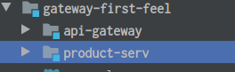

创建两个Springboot项目，`api-gateway`模块需要引入的依赖

```xml
<dependency>
    <groupId>org.springframework.boot</groupId>
    <artifactId>spring-boot-starter</artifactId>
</dependency>
<dependency>
    <groupId>org.springframework.boot</groupId>
    <artifactId>spring-boot-starter-web</artifactId>
    <exclusions>
        <exclusion>
            <groupId>org.springframework</groupId>
            <artifactId>spring-webmvc</artifactId>
        </exclusion>
    </exclusions>
</dependency>
<dependency>
    <groupId>org.springframework.cloud</groupId>
    <artifactId>spring-cloud-starter-gateway</artifactId>
</dependency>
```

`api-gateway`模块的配置文件

```yaml
server:
  port: 9100
spring:
  application:
    name: first-feel-gateway-api
  cloud:
    gateway:
      routes: # 路由数组[路由 就是指定当请求满足什么条件的时候转到哪个微服务]

   - id: product_route # 当前路由的标识, 要求唯一
     uri: localhost:9105
     order: 1 # 路由的优先级,数字越小级别越高
     predicates: # 断言(就是路由转发要满足的条件)
       - Path=/product-serv/** # 当请求路径满足Path指定的规则时,才进行路由转发
         filters: # 过滤器,请求在传递过程中可以通过过滤器对其进行一定的修改
       - StripPrefix=1 # 转发之前去掉1层路径
```

（2）启动两个项目，浏览器输入`http://localhost:9100/product-serv/hello`将访问product-serv里的hello接口。其中`localhost:9100`是网关服务地址，`product-serv`是微服务的名字，`hello`是微服务里的接口名

###  6.3.2. 进阶版本

引入nacos的服务发现,  只需要更改配置文件

 ```yml
server:
  port: 9100
spring:
  application:
    name: first-feel-gateway-api
  cloud:
    nacos:
      discovery:
        server-addr: localhost:8848
        namespace: dev-learn
        group: gateway-first-feel
    gateway:
      routes: # 路由数组[路由 就是指定当请求满足什么条件的时候转到哪个微服务]
        - id: product_route # 当前路由的标识, 要求唯一
          uri: lb://product-serv:9101 # lb指的是从nacos中按照名称获取微服务,并遵循负载均衡策略（基于nacos）
          order: 1 # 路由的优先级,数字越小级别越高
          predicates: # 断言(就是路由转发要满足的条件)
            - Path=/product-serv/** # 当请求路径满足Path指定的规则时,才进行路由转发
          filters: # 过滤器,请求在传递过程中可以通过过滤器对其进行一定的修改
            - StripPrefix=1 # 转发之前去掉1层路径

 ```

## 6.3.Gateway核心架构

### 6.3.1. 基本概念

**路由(Route)** 是 gateway 中最基本的组件之一，表示一个具体的路由信息载体。主要定义了下面的几个信息:

- id，路由标识符，区别于其他 Route。

- uri，路由指向的目的地 uri，即客户端请求最终被转发到的微服务。

- order，用于多个 Route 之间的排序，数值越小排序越靠前，匹配优先级越高。

- predicate，断言的作用是进行条件判断，只有断言都返回真，才会真正的执行路由。

- filter，过滤器用于修改请求和响应信息。

### 6.3.2. 执行流程

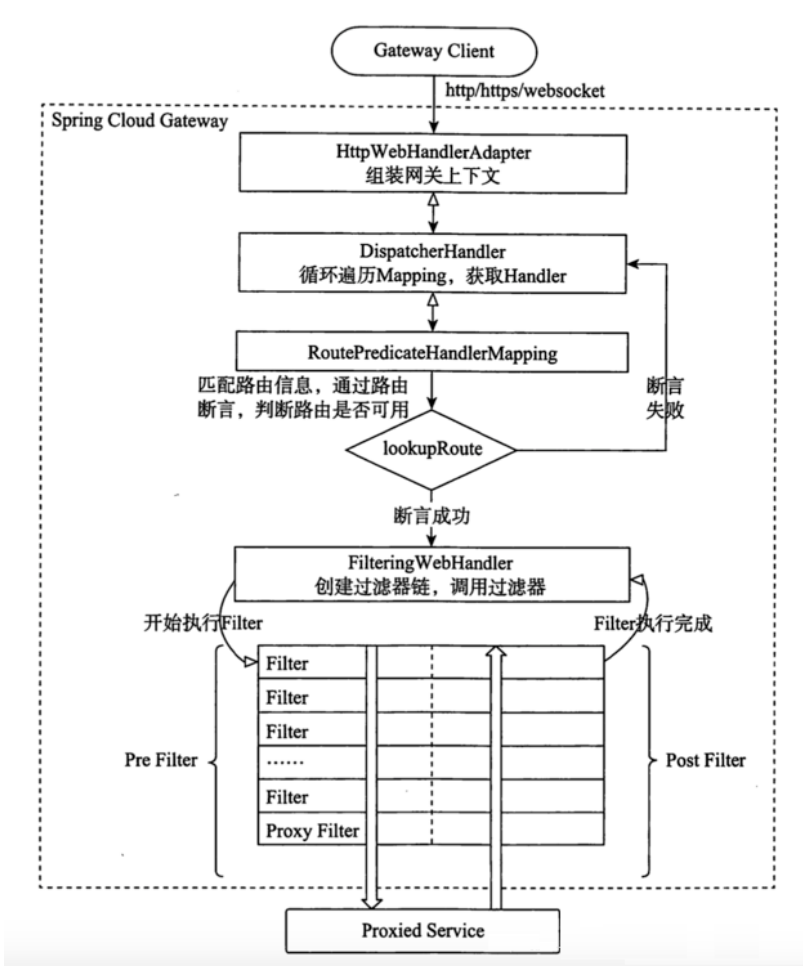

执行流程大体如下：

- Gateway Client向Gateway Server发送请求

- 请求首先会被HttpWebHandlerAdapter进行提取组装成网关上下文

- 然后网关的上下文会传递到DispatcherHandler，它负责将请求分发给RoutePredicateHandlerMapping

- RoutePredicateHandlerMapping负责路由查找，并根据路由断言判断路由是否可用

- 如果过断言成功，由FilteringWebHandler创建过滤器链并调用

- 请求会一次经过PreFilter--微服务--PostFilter的方法，最终返回响应

## 6.4.断言

**Predicate(断言, 谓词)** 用于进行条件判断，只有断言都返回真，才会真正的执行路由。
断言就是说: 在 什么条件下 才能进行路由转发

### 6.4.1.内置路由断言工厂

- 基于`Path`请求路径的断言工厂 `PathRoutePredicateFactory`：接收一个参数，判断请求的URI部分是否满足路径规则。
  `-Path=/foo/{segment}`

- 基于`Method`请求方法的断言工厂 `MethodRoutePredicateFactory`：接收一个参数，判断请求类型是否跟指定的类型匹配。
  `-Method=GET`
- .......

### 6.4.2.自定义路由断言工厂

设定一个场景: 假设我们的应用仅仅让age在(min,max)之间的人来访问

（1）在配置文件中,添加一个Age的断言配置

```yml
server:
  port: 7000
spring:
  application:
    name: api-gateway-predict
  cloud:
    nacos:
      discovery:
        server-addr: localhost:8848
        namespace: dev-learn
        group: gateway-predict-demo
    gateway:
      discovery:
        locator:
          enabled: true
      routes:
        - id: routh-inside-gateway-service
          uri: lb://inside-gateway-service
          predicates:
            - Path=/inside-gateway-service/**
            - Age=18,60
          filters:
            - StripPrefix=1
```

（2）自定义一个断言工厂, 实现断言方法。需要继承类`AbstractRoutePredicateFactory`实现`apply`方法

```java
@Component
public class AgeRoutePredicateFactory extends
        AbstractRoutePredicateFactory<AgeRoutePredicateFactory.Config> {

    public AgeRoutePredicateFactory() {
        super(AgeRoutePredicateFactory.Config.class);
    }

    /**
     * 断言方法
     *
     * @param config 从配置文件读取的配置信息
     * @return
     */
    @Override
    public Predicate<ServerWebExchange> apply(Config config) {
        return serverWebExchange -> {
            String age = serverWebExchange.getRequest().getQueryParams().getFirst("age");
            if (!StringUtils.isEmpty(age)) {
                int anInt = Integer.parseInt(age);
                return anInt > config.getMaxAge() && anInt < config.getMinAge();
            }
            return true;
        };
    }

    /**
     * 从配置文件中读取参数值并获取到配置类中
     *
     * @return
     */
    @Override
    public List<String> shortcutFieldOrder() {
        // 顺序要跟配置文件的顺序保持一致
        return Arrays.asList("minAge", "maxAge");
    }

    /**
     * 存储配置文件的信息
     */
    @Data
    static class Config {
        private int minAge;
        private int maxAge;
    }
}
```


## 6.5.过滤器

**三个知识点:**

- 作用: 过滤器就是在请求的传递过程中,对请求和响应做一些手脚

- 生命周期: Pre Post

- **分类**: 
  - 局部过滤器(作用在某一个路由上)
  -  全局过滤器(作用全部路由上)

在Gateway中, Filter的**生命周期**只有两个：“pre” 和 “post”。

- PRE： 这种过滤器在请求被路由之前调用。我们可利用这种过滤器实现身份验证、在集群中选择请求的微服务、记录调试信息等。

- POST：这种过滤器在路由到微服务以后执行。这种过滤器可用来为响应添加标准的HTTPHeader、收集统计信息和指标、将响应从微服务发送给客户端等。

Gateway 的Filter从**作用范围**可分为两种:`GatewayFilter`与`GlobalFilter`。

- GatewayFilter：应用到单个路由或者一个分组的路由上。

- GlobalFilter：应用到所有的路由上

### 6.5.1.局部过滤器

局部过滤器是针对**单个路由**的过滤器。

#### 6.5.1.1.内置局部Filter

#### 6.5.1.2.自定义局部Filter

（1）在配置文件中添加一个`log`的过滤器配置

```yml
server:
  port: 7000
spring:
  application:
    name: api-gateway-predict
  cloud:
    nacos:
      discovery:
        server-addr: localhost:8848
        namespace: dev-learn
        group: gateway-predict-demo
    gateway:
      discovery:
        locator:
          enabled: true
      routes:
        - id: routh-inside-gateway-service
          uri: lb://inside-gateway-service
          predicates:
            - Path=/inside-gateway-service/**
            - Age=18,60
          filters:
            - StripPrefix=1
            - Log=true,false
```

（2）自定义一个过滤器工厂,实现方法

```java

@Slf4j
@Component
public class LogGatewayFilterFactory extends
        AbstractGatewayFilterFactory<LogGatewayFilterFactory.Config> {

    public LogGatewayFilterFactory() {
        super(LogGatewayFilterFactory.Config.class);
    }

    @Override
    public GatewayFilter apply(Config config) {
        return (exchange, chain) -> {
            if (config.isCacheLog()) {
                log.info("config.isCacheLog");
            }
            if (config.isConsoleLog()) {
                log.info("config.isConsoleLog");
            }
            return chain.filter(exchange);
        };
    }

    @Data
    @NoArgsConstructor
    static class Config {
        private boolean consoleLog;
        private boolean cacheLog;
    }
}
```

### 6.5.2.全局过滤器

#### 6.5.2.1.内置局部Filter

#### 6.5.2.2.自定义局部Filter

## 6.6.网关限流

# 7.分布式事务Seata

## 7.1. What is it

### 7.1.1.什么是分布式事务

分布式的 多实例访问同一个数据库，需要保证数据的一致性

### 7.1.2. 两阶段提交协议

**常见分布式事务解决方案：**

- Seata
- 消息队列
- Saga
- XA

他们有一个共同点：**两阶段提交（2PC）协议**

- 阶段一: 表决阶段，所有参与者都将本事务执行预提交，并将能否成功的信息反馈发给协调者。
- 阶段二: 执行阶段，协调者根据所有参与者的反馈，通知所有参与者，步调一致地执行提交或者回滚。

两阶段提交协议的优缺点：

- 优点：
  - 提高了数据一致性的概率，实现成本较低
- 缺点：
  - 单点问题: 事务协调者宕机 
  - 同步阻塞: 延迟了提交时间，加长了资源阻塞时间
  - 数据不一致: 提交第二阶段，依然存在commit结果未知的情况，有可能导致数据不一致

### 7.1.3.什么是Seata

Seata是一款开源的分布式事务解决方案，致力于提高高性能和简单易用的分布式事务服务。Seata提供了**AT**、TCC、SAGA和XA事务模式，打造一站式解决方案。

Seata的三个**组成部分**：

- TC：Transaction Coordinator 事务协调器，管理全局的分支事务的状态，用于全局性事务的提交 和回滚。
- TM：Transaction Manager 事务管理器，用于开启、提交或者回滚全局事务。
- RM：Resource Manager 资源管理器，用于分支事务上的资源管理，向TC注册分支事务，上报分 支事务的状态，接受TC的命令来提交或者回滚分支事务。

### 7.1.4.Seata的执行流程

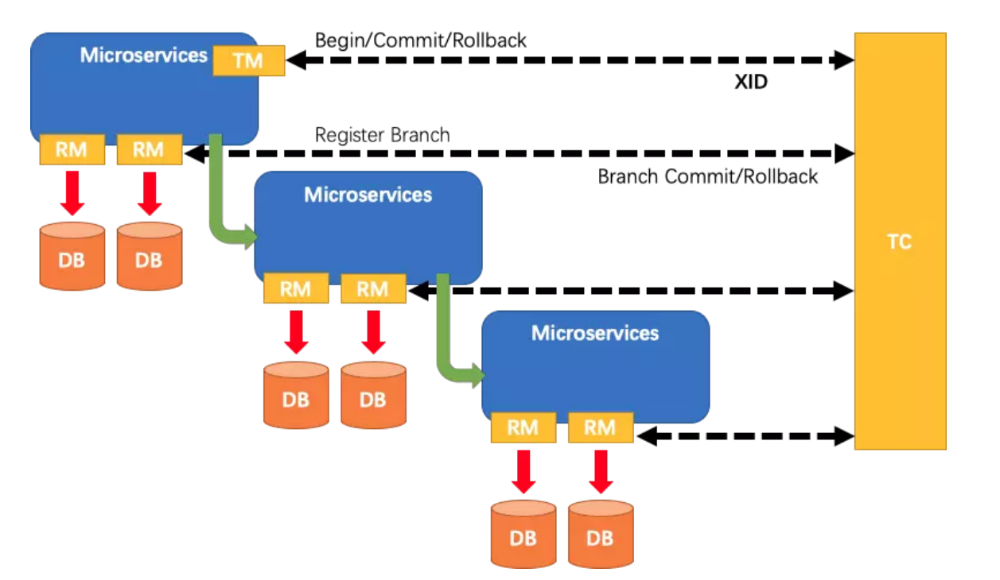

1. A服务的TM向TC申请开启一个全局事务，TC就会创建一个全局事务并返回一个唯一的XID
2. A服务的RM向TC注册分支事务，并及其纳入XID对应全局事务的管辖
3. A服务执行分支事务，向数据库做操作
4. A服务开始远程调用B服务，此时XID会在微服务的调用链上传播
5. B服务的RM向TC注册分支事务，并将其纳入XID对应的全局事务的管辖
6. B服务执行分支事务，向数据库做操作
7. 全局事务调用链处理完毕，TM根据有无异常向TC发起全局事务的提交或者回滚
8. TC协调其管辖之下的所有分支事务， 决定是否回滚


# 8.链路监控 Sleuth


