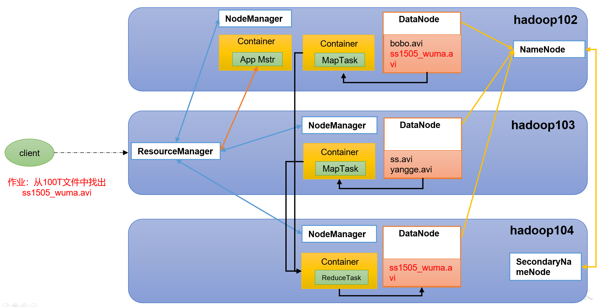

# Hadoop

## 1.概述

### 1.1组成


Hadoop3.x在组成上跟Hadoop2.x无变化。 HDFS负责文件存储，Yarn负责资源调度，MapReduce负责计算。

#### 1.1.1.HDFS组成

Hadoop Distributed File System，简称*HDFS*，是一个分布式文件系统。

包含NameNode、Secondary NameNode和DataNode：

- NameNode（nn）：存储文件的元数据，如文件名、文件目录结构、文件属性（生成时间、副本数、文件权限），以及每隔文件的块列表和块所在的DataNode等。
- DataNode（dn）：在本地文件系统存储文件块数据，以及块数据的校验和。
- Secondary NameNode（2nn）：每隔一段时间对NameNode元数据备份。

#### 1.1.2.YARN组成

Yet Another Resource Negotiator简称YARN ，另一种资源协调者，是Hadoop的资源管理器。

- ResourceManager（RM)：整个集群资源（内存，CPU等）的老大
- NodeManager（NM）：单个节点服务器资源老大
- ApplicationMaster（AM）：单个服务运行的老大。
- Container：容器，相当一台独立的服务器，里面封装了任务运行所需要的资源，如内存、CPU、磁盘、网络等。


#### 1.1.3.MapReduce组成

MapReduce将计算过程分为两个阶段：Map和Reduce

1）Map阶段并行处理输入数据

2）Reduce阶段对Map结果进行汇总


#### 1.1.4.三者关系



### 1.2.Hadoop运行环境搭建

#### 1.2.1.虚拟机

准备三台虚拟机，配置ip、dns、防火墙等

#### 1.2.2.安装JDK

注意：安装JDK前，一定确保提前删除了虚拟机自带的JDK。

#### 1.2.3.安装Hadoop

Hadoop下载地址：[https://archive.apache.org/dist/hadoop/common/hadoop-3.1.3/](https://archive.apache.org/dist/hadoop/common/hadoop-2.7.2/)，下载后解压到指定目录。

（1）添加Hadoop到环境变量

```shell
sudo vim /etc/profile.d/my_env.sh
```

追加到文件末尾

```shell
#HADOOP_HOME
export HADOOP_HOME=/opt/module/hadoop-3.1.3
export PATH=$PATH:$HADOOP_HOME/bin
export PATH=$PATH:$HADOOP_HOME/sbin
```

测试安装成功：

```shell
hadoop version
```

#### 1.2.4.hadoop目录结构

```shell
[atguigu@hadoop102 hadoop-3.1.3]$ ll
总用量 52
drwxr-xr-x. 2 atguigu atguigu  4096 5月  22 2017 bin
drwxr-xr-x. 3 atguigu atguigu  4096 5月  22 2017 etc
drwxr-xr-x. 2 atguigu atguigu  4096 5月  22 2017 include
drwxr-xr-x. 3 atguigu atguigu  4096 5月  22 2017 lib
drwxr-xr-x. 2 atguigu atguigu  4096 5月  22 2017 libexec
-rw-r--r--. 1 atguigu atguigu 15429 5月  22 2017 LICENSE.txt
-rw-r--r--. 1 atguigu atguigu   101 5月  22 2017 NOTICE.txt
-rw-r--r--. 1 atguigu atguigu  1366 5月  22 2017 README.txt
drwxr-xr-x. 2 atguigu atguigu  4096 5月  22 2017 sbin
drwxr-xr-x. 4 atguigu atguigu  4096 5月  22 2017 share
```

（1）bin目录：存放对Hadoop相关服务（hdfs，yarn，mapred）进行操作的脚本

（2）etc目录：Hadoop的配置文件目录，存放Hadoop的配置文件

（3）lib目录：存放Hadoop的本地库（对数据进行压缩解压缩功能）

（4）sbin目录：存放**启动或停止Hadoop**相关服务的脚本

（5）share目录：存放Hadoop的依赖jar包、文档、和官方案例

### 1.3.Hadoop运行模式

运行模式包括：本地模式，伪分布式模式 以及 完全分布式模式。

- **本地模式**：单机运行，只是用来演示一下官方案例。生产环境不用。
- **伪分布式模式：**也是单机运行，但是具备Hadoop集群的所有功能，一台服务器模拟一个分布式的环境。个别缺钱的公司用来测试，生产环境不用。
- **完全分布式模式：**多台服务器组成分布式环境。生产环境使用。

#### 1.3.1.本地模式


#### 1.3.2.完全分布式模式

##### 1.3.2.1. 集群配置

**（1）部署规划**

- NameNode和SecondaryNameNode不要安装在同一台服务器
- ResourceManager也很消耗内存，不要和NameNode、SecondaryNameNode配置在同一台机器上。

|      | hadoop102          | hadoop103                    | hadoop104                   |
| ---- | ------------------ | ---------------------------- | --------------------------- |
| HDFS | NameNode  DataNode | DataNode                     | SecondaryNameNode  DataNode |
| YARN | NodeManager        | ResourceManager  NodeManager | NodeManager                 |

**（2）配置文件3333333333333333333333333**

Hadoop配置文件分两类：**默认配置文件**和**自定义配置文件**，只有用户想修改某一默认配置值时，才需要修改自定义配置文件，更改相应属性值。

**默认配置文件：**

| 要获取的默认文件     | 文件存放在Hadoop的jar包中的位置                           |
| -------------------- | --------------------------------------------------------- |
| [core-default.xml]   | hadoop-common-3.1.3.jar/core-default.xml                  |
| [hdfs-default.xml]   | hadoop-hdfs-3.1.3.jar/hdfs-default.xml                    |
| [yarn-default.xml]   | hadoop-yarn-common-3.1.3.jar/yarn-default.xml             |
| [mapred-default.xml] | hadoop-mapreduce-client-core-3.1.3.jar/mapred-default.xml |

**自定义配置文件：**
**core-site.xml**、**hdfs-site.xml**、**yarn-site.xml**、**mapred-site.xml**四个配置文件存放在`$HADOOP_HOME/etc/hadoop`这个路径上，用户可以根据项目需求重新进行修改配置。

**（3）配置集群**

**核心配置文件 core-site.xml**

```shell
cd $HADOOP_HOME/etc/hadoop
vi  core-site.xml
```

文件内容如下：

```xml
<?xml version="1.0" encoding="UTF-8"?>
<?xml-stylesheet type="text/xsl" href="configuration.xsl"?>

<configuration>
    <!-- 指定NameNode的地址 -->
    <property>
        <name>fs.defaultFS</name>
        <value>hdfs://hadoop102:8020</value>
    </property>

    <!-- 指定hadoop数据的存储目录 -->
    <property>
        <name>hadoop.tmp.dir</name>
        <value>/opt/module/hadoop-3.1.3/data</value>
    </property>

    <!-- 配置HDFS网页登录使用的静态用户为atguigu -->
    <property>
        <name>hadoop.http.staticuser.user</name>
        <value>atguigu</value>
    </property>
</configuration>
```

**HDFS配置文件 hdfs-site.xml**

内容如下：

```xml
<?xml version="1.0" encoding="UTF-8"?>
<?xml-stylesheet type="text/xsl" href="configuration.xsl"?>

<configuration>
	<!-- nn web端访问地址-->
	<property>
        <name>dfs.namenode.http-address</name>
        <value>hadoop102:9870</value>
    </property>
	<!-- 2nn web端访问地址-->
    <property>
        <name>dfs.namenode.secondary.http-address</name>
        <value>hadoop104:9868</value>
    </property>
</configuration>
```

**YARN配置文件 yarn-site.xml**

```xml
<?xml version="1.0" encoding="UTF-8"?>
<?xml-stylesheet type="text/xsl" href="configuration.xsl"?>

<configuration>
    <!-- 指定MR走shuffle -->
    <property>
        <name>yarn.nodemanager.aux-services</name>
        <value>mapreduce_shuffle</value>
    </property>

    <!-- 指定ResourceManager的地址-->
    <property>
        <name>yarn.resourcemanager.hostname</name>
        <value>hadoop103</value>
    </property>

    <!-- 环境变量的继承 -->
    <property>
        <name>yarn.nodemanager.env-whitelist</name>
        <value>JAVA_HOME,HADOOP_COMMON_HOME,HADOOP_HDFS_HOME,HADOOP_CONF_DIR,CLASSPATH_PREPEND_DISTCACHE,HADOOP_YARN_HOME,HADOOP_MAPRED_HOME</value>
    </property>
</configuration>
```

**MapReduce配置文件 mapred-site.xml**

```xml
<?xml version="1.0" encoding="UTF-8"?>
<?xml-stylesheet type="text/xsl" href="configuration.xsl"?>

<configuration>
	<!-- 指定MapReduce程序运行在Yarn上 -->
    <property>
        <name>mapreduce.framework.name</name>
        <value>yarn</value>
    </property>
</configuration>
```

##### 1.3.2.2.启动集群

**（1）配置worker**

```shell
vim $HADOOP_HOME/etc/hadoop/workers
```

```txt
hadoop102
hadoop103
hadoop104
```

将文件分发到所有节点

**（2）启动集群**

**如果集群是第一次启动**，需要在hadoop102节点格式e化NameNode（注意：格式化NameNode，会产生新的集群id，导致NameNode和DataNode的集群id不一致，集群找不到已往数据。如果集群在运行过程中报错，需要重新格式化NameNode的话，一定要先停止namenode和datanode进程，并且要删除所有机器的data和logs目录，然后再进行格式化。）

```shell
hdfs namenode -format
```

**启动HDFS**

```shell
bash sbin/start-dfs.sh
```

**启动yarn**

```11111110000000000000shell
bash sbin/start-yarn.sh
```

**Web端访问**

hdfs：查看存储的数据，http://hadoop102:9870

yarn：查看ResourceManager，http://hadoop103:8088

##### 1.3.2.3.配置历史服务器

**配置文件 mapred-site.xml**

```shell
 vim mapred-site.xml
```

增加配置

```xml
<!-- 历史服务器端地址 -->
<property>
    <name>mapreduce.jobhistory.address</name>
    <value>hadoop102:10020</value>
</property>

<!-- 历史服务器web端地址 -->
<property>
    <name>mapreduce.jobhistory.webapp.address</name>
    <value>hadoop102:19888</value>
</property>
```

**将文件分发到每个节点**

**在hadoop102启动历史服务器**

`mapred --daemon start historyserver`

WEB端查看历史服务器：http://hadoop102:19888/jobhistory

jps查看

```shell
root@hadoop102 sbin]# jps
15350 JobHistoryServer # 
2232 StandaloneSessionClusterEntrypoint
11403 NameNode
13116 NodeManager
15373 Jps
15022 DataNode
2590 TaskManagerRunner
```


##### 1.3.2.4.配置日志的聚集

##### 1.3.2.5.集群启停方式总结

**1）各个模块分开启动/停止（配置ssh是前提）常用**

整体启动/停止HDFS

`start-dfs.sh/stop-dfs.sh`

整体启动/停止YARN

`start-yarn.sh/stop-yarn.sh`

**各个服务组件逐一启动/停止**

分别启动/停止HDFS组件

`hdfs --daemon start/stop namenode/datanode/secondarynamenode`

启动/停止YARN

`yarn --daemon start/stop resourcemanager/nodemanager`

##### 1.3.2.6.常用端口

| 端口名称                  | Hadoop2.x   | Hadoop3.x         |
| ------------------------- | ----------- | ----------------- |
| NameNode内部通信端口      | 8020 / 9000 | 8020 /  9000/9820 |
| NameNode HTTP UI          | 50070       | 9870              |
| MapReduce查看执行任务端口 | 8088        | 8088              |
| 历史服务器通信端口        | 19888       | 19888             |

##### 1.3.2.7.集群时间同步


### 1.4.常见错误以及解决方案

## 2.HDFS

### 2.1.概述

#### 2.1.1.背景定义

HDFS只是分布式文件管理系统中的一种。

HDFS（Hadoop Distributed File System），它是一个文件系统，用于存储文件，**通过目录树来定位文件**；其次，它是分布式的，由很多服务器联合起来实现其功能，集群中的服务器有各自的角色。

**HDFS的使用场景：适合一次写入，多次读出的场景。**一个文件经过创建、写入和关闭之后就不需要改变。

#### 2.1.2.优缺点

优点：

- 高容错性：副本机制，一个副本丢失后会自动修复
- 适合处理大数据
- 可构建在廉价的机器上：多副本机制提供可靠性

缺点：

- 不适合低延时数据访问，比如毫秒级的存储数据，做不到
- 无法高效对大量小文件进行存储
- 不支持并发写入，不支持文件随机修改，仅支持数据追加（append）

#### 2.1.3.组成架构


- NameNode（nn）：就是Master
  - 管理hdfs的名称空间
  - 配置副本策略
  - 管理数据块（block）映射信息
  - 处理客户端读写请求

- DataNode（dn）：就是Slave，执行实际的操作
  - 存储实际的数据块
  - 执行数据块的读写操作
- Client：就是客户端：
  - 文件切分。文件上传时，client将文件切分成block，然后上传
  - 与NameNode交互，获取文件的位置信息
  - 与DataNode交互，获取文件位置信息，数据读取或者写入
  - 提供命令管理hdfs，比如NameNode格式化 
  - 提供命令访问hdfs，比如对hdfs的增删改查操作

- SecondaryNameNode（snn）：不是NameNode热备份，NameNode挂掉，snn不会马上替换nn。
  - 辅助NameNode，分担其工作量，比如定期合并Fsimage和Edits，并推送给NameNode
  - 在紧急情况下可以复制回复NameNode

#### 2.1.4.文件块大小

hdfs的文件在物理上是分块存储，块（block）的大小可以通过配置参数(dfs.blocksize)来指定，默认大小在Hadoop2/3版本是128M，在Hadoop1版本中是64M

### 2.2.hdfs的shell操作

#### 2.2.1.基本语法

`hadoop fs 具体命令` OR `hdfs dfs 具体命令`

两个是完全相同的。

#### 2.2.2.命令大全

```shell
atguigu@hadoop102 hadoop-3.1.3]$ bin/hadoop fs

[-appendToFile <localsrc> ... <dst>]
        [-cat [-ignoreCrc] <src> ...]
        [-chgrp [-R] GROUP PATH...]
        [-chmod [-R] <MODE[,MODE]... | OCTALMODE> PATH...]
        [-chown [-R] [OWNER][:[GROUP]] PATH...]
        [-copyFromLocal [-f] [-p] <localsrc> ... <dst>]
        [-copyToLocal [-p] [-ignoreCrc] [-crc] <src> ... <localdst>]
        [-count [-q] <path> ...]
        [-cp [-f] [-p] <src> ... <dst>]
        [-df [-h] [<path> ...]]
        [-du [-s] [-h] <path> ...]
        [-get [-p] [-ignoreCrc] [-crc] <src> ... <localdst>]
        [-getmerge [-nl] <src> <localdst>]
        [-help [cmd ...]]
        [-ls [-d] [-h] [-R] [<path> ...]]
        [-mkdir [-p] <path> ...]
        [-moveFromLocal <localsrc> ... <dst>]
        [-moveToLocal <src> <localdst>]
        [-mv <src> ... <dst>]
        [-put [-f] [-p] <localsrc> ... <dst>]
        [-rm [-f] [-r|-R] [-skipTrash] <src> ...]
        [-rmdir [--ignore-fail-on-non-empty] <dir> ...]
<acl_spec> <path>]]
        [-setrep [-R] [-w] <rep> <path> ...]
        [-stat [format] <path> ...]
        [-tail [-f] <file>]
        [-test -[defsz] <path>]
        [-text [-ignoreCrc] <src> ...]
```

### 2.3.hdfs的API操作

### 2.4.hdfs的读写流程

### 2.5.NameNode和SecondaryNameNode

### 2.6.DataNode

## 3.MapReduce

## 4.Yarn

### 4.1.Yarn基础架构

​    YARN主要由ResourceManager、NodeManager、ApplicationMaster和Container等组件构成。


- ResourceManager（RM）：
  - 处理客户端请求
  - 监控NodeManager
  - 启动、监控ApplicationMaster
  - 资源分配与调度
- NodeManager（NM）：
  - 管理单个节点的资源
  - 处理来自ResourceManager的命令
  - 处理来自ApplicationMaster的命令
- ApplicationMaster
  - 为应用程序申请资源并分配给内部的任务
  - 任务的监控与容错
- Container：Yarn中资源抽象，封装了某个节点的多维度资源，如内存、CPU、磁盘、网络。

### 4.2.工作机制


​	（1）MR程序提交到客户端所在的节点。

​    （2）YarnRunner向ResourceManager申请一个Application。

​    （3）RM将该应用程序的资源路径返回给YarnRunner。

​    （4）该程序将运行所需资源提交到HDFS上。

​    （5）程序资源提交完毕后，申请运行mrAppMaster。

​    （6）RM将用户的请求初始化成一个Task。

​    （7）其中一个NodeManager领取到Task任务。

​    （8）该NodeManager创建容器Container，并产生MRAppmaster。

​    （9）Container从HDFS上拷贝资源到本地。

​    （10）MRAppmaster向RM 申请运行MapTask资源。

​    （11）RM将运行MapTask任务分配给另外两个NodeManager，另两个NodeManager分别领取任务并创建容器。

​    （12）MR向两个接收到任务的NodeManager发送程序启动脚本，这两个NodeManager分别启动MapTask，MapTask对数据分区排序。

​	（13）MrAppMaster等待所有MapTask运行完毕后，向RM申请容器，运行ReduceTask。

​    （14）ReduceTask向MapTask获取相应分区的数据。

​    （15）程序运行完毕后，MR会向RM申请注销自己。

### 4.3.作业提交流程

作业提交全过程详解

（1）作业提交

第1步：Client调用job.waitForCompletion方法，向整个集群提交MapReduce作业。

第2步：Client向RM申请一个作业id。

第3步：RM给Client返回该job资源的提交路径和作业id。

第4步：Client提交jar包、切片信息和配置文件到指定的资源提交路径。

第5步：Client提交完资源后，向RM申请运行MrAppMaster。

（2）作业初始化

第6步：当RM收到Client的请求后，将该job添加到容量调度器中。

第7步：某一个空闲的NM领取到该Job。

第8步：该NM创建Container，并产生MRAppmaster。

第9步：下载Client提交的资源到本地。

（3）任务分配

第10步：MrAppMaster向RM申请运行多个MapTask任务资源。

第11步：RM将运行MapTask任务分配给另外两个NodeManager，另两个NodeManager分别领取任务并创建容器。

（4）任务运行

第12步：MR向两个接收到任务的NodeManager发送程序启动脚本，这两个NodeManager分别启动MapTask，MapTask对数据分区排序。

第13步：MrAppMaster等待所有MapTask运行完毕后，向RM申请容器，运行ReduceTask。

第14步：ReduceTask向MapTask获取相应分区的数据。

第15步：程序运行完毕后，MR会向RM申请注销自己。

（5）进度和状态更新

YARN中的任务将其进度和状态(包括counter)返回给应用管理器, 客户端每秒(通过mapreduce.client.progressmonitor.pollinterval设置)向应用管理器请求进度更新, 展示给用户。

（6）作业完成

除了向应用管理器请求作业进度外, 客户端每5秒都会通过调用waitForCompletion()来检查作业是否完成。时间间隔可以通过mapreduce.client.completion.pollinterval来设置。作业完成之后, 应用管理器和Container会清理工作状态。作业的信息会被作业历史服务器存储以备之后用户核查。

### 4.4.调度器和调度算法

目前，Hadoop作业调度器主要有三种：FIFO、容量（Capacity Scheduler）和公平（Fair Scheduler）。Apache Hadoop3.1.3默认的资源调度器是Capacity Scheduler。

具体设置详见：yarn-default.xml文件

```xml
<property>
    <description>The class to use as the resource scheduler.</description>
    <name>yarn.resourcemanager.scheduler.class</name>
<value>org.apache.hadoop.yarn.server.resourcemanager.scheduler.capacity.CapacityScheduler</value>
</property>
```

#### 4.4.1.FIFO调度器

优点：简单易懂；

缺点：不支持多队列，生产环境很少使用；

#### 4.4.2.容量调度器（Capacity Scheduler）

Capacity Scheduler是Yahoo开发的多用户调度器。

#### 4.4.3.公平调度器（Fair Scheduler）

Fair Schedulere是Facebook开发的多用户调度器。

### 4.5.Yarn常用命令

Yarn状态的查询，除了可以在hadoop103:8088页面查看外，还可以通过命令操作。

- yarn application 查看任务
  - yarn application -list：列出所有
  - yarn application -list -appStates :根据状态过滤。所有状态：ALL、NEW、NEW_SAVING、SUBMITTED、ACCEPTED、RUNNING、FINISHED、FAILED、KILLED
  - yarn application -kill {Application-Id}：Kill掉Application

- yarn logs 查看日志
  - yarn logs -applicationId {ApplicationId}：查询指定app的日志
  - yarn logs -applicationId <ApplicationId> -containerId <ContainerId> ：查询指定app的Container的日志
- yarn applicationattempt ：看尝试运行的任务
  - yarn applicationattempt -list <ApplicationId>：

### 4.6.Yarn生成环境核心参数