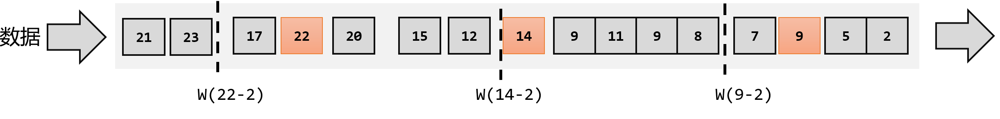

# Flink-Basic

## 1. 概述

### 1.1. 是什么

Flink是一个框架和分布式处理引擎，用于对无界和有界数据流进行有状态计算

Flink 的核心目标是“有数据流上的有状态计算”。

- 有界数据：有定义流的开始和结束，可以等所有数据都到齐才计算，可以对数据进行排序。
- 无界数据：有定义流的开始，没有定义流的结束。无休止的产生数据。数据必须立即处理，持续处理，不能等到所有数据都到了才处理。

状态：

- 把流处理需要的额外数据保存成一个**“状态”**，然后针对这条数据进行处理，并更新状态，这就是“有状态的流处理”
- 状态在内存中：速度快，可靠性差
- 状态在分布式系统中：可靠性高、速度慢。

### 1.2. 特点

目标：低延迟、高吞吐、结果的准确性和良好的容错率

- 高吞吐、低延迟
- 结果准确性：提供 **事件时间** 和 **处理时间**语义，对于乱序事件流，事件时间语义仍然能提供一致且准确的结果。
- 精确一次的状态一致性保护
- 可以连接到常用的外部系统，如db、kafka、hdfs等
- 高可用

### 1.3.Flink VS Spark Streaming

|              | **Flink**          | **Streaming**                        |
| ------------ | ------------------ | ------------------------------------ |
| **计算模型** | 流计算             | 微批处理                             |
| **时间语义** | 事件时间、处理时间 | 处理时间                             |
| **窗口**     | 多、灵活           | 少、不灵活（窗口必须是批次的整数倍） |
| **状态**     | 有                 | 没有                                 |
| **流式SQL**  | 有                 | 没有                                 |

### 1.4.分层API


- 越顶层越抽象、表达含义越简明、使用越方便
- 越底层越具体、表达能力越丰富、使用越灵活


## 2.部署

### 2.1.集群角色

Flink 提交作业和执行任务，需要几个关键的组件：

- 客户端：代码由客户端获取并做转换，之后提交给JobManager
- JobManager：Flink集群的“管事人”，对作业进行中央调度管理；获取到要执行的作业后，会进一步处理转换，然后分发给众多的TaskManager
- TaskManager：真正“干活的人”，负责数据的处理操作


### 2.2.集群搭建

#### 2.2.1. 集群启动

##### 2.2.1.1. 集群规划

| **节点服务器** | **hadoop102**                 | **hadoop103** | **hadoop104** |
| -------------- | ----------------------------- | ------------- | ------------- |
| **角色**       | JobManager  <br />TaskManager | TaskManager   | TaskManager   |

##### 2.2.1.2.下载并解压安装包

下载安装包flink-1.17.0-bin-scala_2.12.tgz，并解压

##### 2.2.1.3.修改进群配置

（1）进入conf路径，修改flink-conf.yaml文件，指定hadoop102节点服务器为JobManager 

修改如下内容：

```properties
$ vim flink-conf.yaml
# JobManager节点地址.
jobmanager.rpc.address: hadoop102
jobmanager.bind-host: 0.0.0.0
rest.address: hadoop102
rest.bind-address: 0.0.0.0
# TaskManager节点地址.需要配置为当前机器名
taskmanager.bind-host: 0.0.0.0
taskmanager.host: hadoop102
```

（2）修改workers文件，指定hadoop102、hadoop103和hadoop104为TaskManager

```properties
$ vim workers
hadoop102
hadoop103
hadoop104
```

（3）修改masters文件

```properties
$ vim masters
hadoop102:8081
```

（4）另外，在flink-conf.yaml文件中还可以对集群中的JobManager和TaskManager组件进行优化配置，主要配置项如下：

- **jobmanager.memory.process.size**：对JobManager进程可使用到的全部内存进行配置，包括JVM元空间和其他开销，默认为1600M，可以根据集群规模进行适当调整。
- **taskmanager.memory.process.size**：对TaskManager进程可使用到的全部内存进行配置，包括JVM元空间和其他开销，默认为1728M，可以根据集群规模进行适当调整。
- **taskmanager.numberOfTaskSlots**：对每个TaskManager能够分配的Slot数量进行配置，默认为1，可根据TaskManager所在的机器能够提供给Flink的CPU数量决定。所谓Slot就是TaskManager中具体运行一个任务所分配的计算资源。
- **parallelism.default**：Flink任务执行的并行度，默认为1。优先级低于代码中进行的并行度配置和任务提交时使用参数指定的并行度数量。

（5）对主节点修改后，分发到从节点，然后进行以下修改

```properties
$ vim flink-conf.yaml
# TaskManager节点地址.需要配置为当前机器名
taskmanager.host: hadoop103


# TaskManager节点地址.需要配置为当前机器名
taskmanager.host: hadoop104
```

（6）启动集群

在主节点hadoop102上执行 start-cluster.sh启动Flink集群 `bin/start-cluster.sh`

（7）访问 WebUI

可以访问http://hadoop102:8081对flink集群和任务进行监控管理


这里可以明显看到，当前集群的TaskManager数量为3；由于默认每个TaskManager的Slot数量为1，所以总Slot数和可用Slot数都为3。

#### 2.2.2.向集群提交作业

##### 2.2.2.1.环境准备

##### 2.2.2.2.程序打包

maven依赖添加shade插件配置，然后使用命令进行打包

```xml
<build>
    <plugins>
        <plugin>
            <groupId>org.apache.maven.plugins</groupId>
            <artifactId>maven-shade-plugin</artifactId>
            <version>3.2.4</version>
            <executions>
                <execution>
                    <phase>package</phase>
                    <goals>
                        <goal>shade</goal>
                    </goals>
                    <configuration>
                        <artifactSet>
                            <excludes>
                                <exclude>com.google.code.findbugs:jsr305</exclude>
                                <exclude>org.slf4j:*</exclude>
                                <exclude>log4j:*</exclude>
                            </excludes>
                        </artifactSet>
                        <filters>
                            <filter>
                                <!-- Do not copy the signatures in the META-INF folder.
                                Otherwise, this might cause SecurityExceptions when using the JAR. -->
                                <artifact>*:*</artifact>
                                <excludes>
                                    <exclude>META-INF/*.SF</exclude>
                                    <exclude>META-INF/*.DSA</exclude>
                                    <exclude>META-INF/*.RSA</exclude>
                                </excludes>
                            </filter>
                        </filters>
                        <transformers combine.children="append">
                            <transformer
                                    implementation="org.apache.maven.plugins.shade.resource.ServicesResourceTransformer">
                            </transformer>
                        </transformers>
                    </configuration>
                </execution>
            </executions>
        </plugin>
    </plugins>
</build>
```

##### 2.2.2.3.在WebUI上提交


##### 2.2.2.4.命令行提交

（1）启动集群

（2）将Flink程序运行jar包上传到服务器上

（3）使用命令`bin/flink run -m hadoop102:8081 -c com.atguigu.wc.SocketStreamWordCount path/to/jar`。这里的参数 `-m`指定了提交到的JobManager，`-c`指定了入口类。

### 2.3.部署模式

在一些应用场景中，对于集群资源分配和占用的方式，可能会有特定的需求。Flink为各种场景提供了不同的部署模式，主要有以下三种：会话模式（Session Mode）、单作业模式（Per-Job Mode）、应用模式（Application Mode）。

它们的区别主要在于：集群的生命周期以及资源的分配方式；以及应用的main方法到底在哪里执行——客户端（Client）还是JobManager。

#### 2.3.1.会话模式（Session Mode）

启动一个集群，保持一个会话，在整个会话中通过客户端提交作业。

集群启动时所有的资源都已经确定，所以所有提交的作业会竞争集群中的资源。

会话模式比较适用于单个规模小，执行时间短的大量作业。


#### 2.3.2.单作业模式（Pre-Job mode）

会话模式因为资源共享会导致狠毒哦问题，所以为了更好的隔离资源，可以考虑为每一个提交的作业启动一个集群——单作业模式。


作业完成后，集群就会关闭，所有资源也会被释放。在生产环境中更加稳定，所以是实际应用首选的模式。

Flink本身无法这样运行，所以但作业模式一般需要**借助一些资源管理框架来启动集群**，比如Yarn、K8S。

#### 2.3.3.应用模式（Application Mode）

上述两种模式下，应用代码都是在客户端上执行，然后由客户端提交给JobManager。但是这种方式需要占用大量网络带宽，并且会加重客户端所在节点的资源消耗。

解决办法就是不需要客户端，直接把应用提交给JobManager上运行。即为每一个提交的应用单独启动了一个集群，整个集群只为执行这一个应用而存在，执行完成后关闭这个集群。


### 2.4.Standalone运行模式

#### 2.4.1.会话模式部署

提前启动集群，并通过Web页面客户端提交任务（可以多个任务，但是集群资源固定）。

#### 2.4.2.单作业模式部署

Flink的Standalone集群并不支持单作业模式部署。因为单作业模式需要借助一些资源管理平台。

#### 2.4.3.应用模式部署

### 2.5.Yarn运行模式


#### 2.5.1.相关准备和配置

#### 2.5.2.会话部署模式

#### 2.5.3.单作业部署模式

#### 2.5.4.应用部署模式

### 2.6.K8S运行模式（了解）

### 2.7.历史服务器

## 3.运行时架构

### 3.1.系统架构

YARN上部署的过程是：客户端把Flink应用提交给Yarn的`ResourceManager`，Yarn的`ResourceManager`会向Yarn的`NodeManager`申请容器。在这些容器上，Flink会部署`JobManager`和`TaskManager`的实例，从而启动集群。Flink会根据运行在`JobManger`上的作业所需要的`Slot`数量动态分配`TaskManager`资源。


#### 3.1.1. 作业管理器（JobManager）

JobManager是一个Flink集群中任务管理和调度的核心，是控制应用执行的主进程。也就是说，每个应用都应该被唯一的JobManager所控制执行。

JobManger又包含3个不同的组件。

**（1）JobMaster**

JobMaster是JobManager中最核心的组件，负责处理单独的作业（Job）。所以JobMaster和具体的Job是一一对应的，多个Job可以同时运行在一个Flink集群中, 每个Job都有一个自己的JobMaster。

**（2）资源管理器（ResourceManager）**

ResourceManager主要负责资源的分配和管理，在Flink 集群中只有一个。所谓“资源”，主要是指TaskManager的任务槽（task slots）。任务槽就是Flink集群中的资源调配单元，包含了机器用来执行计算的一组CPU和内存资源。每一个任务（Task）都需要分配到一个slot上执行。

这里注意要把Flink内置的ResourceManager和其他资源管理平台（比如YARN）的ResourceManager区分开。

**（3）分发器（Dispatcher）**

Dispatcher主要负责提供一个REST接口，用来提交应用，并且负责为每一个新提交的作业启动一个新的JobMaster 组件。Dispatcher也会启动一个Web UI，用来方便地展示和监控作业执行的信息。Dispatcher在架构中并不是必需的，在不同的部署模式下可能会被忽略掉。

#### 3.1.2.任务管理器（TaskManager）

TaskManager是Flink中的工作进程，数据流的具体计算就是它来做的。Flink集群中必须至少有一个TaskManager；每一个TaskManager都包含了一定数量的任务槽（task slots）。Slot是资源调度的最小单位，slot的数量限制了TaskManager能够并行处理的任务数量。

启动之后，TaskManager会向资源管理器注册它的slots；收到资源管理器的指令后，TaskManager就会将一个或者多个槽位提供给JobMaster调用，JobMaster就可以分配任务来执行了。

在执行过程中，TaskManager可以缓冲数据，还可以跟其他运行同一应用的TaskManager交换数据。

### 3.2.核心概念

#### 3.2.1.并行度

**（1）并行子任务和并行度**

当要处理的数据量非常大时，我们可以把一个算子操作，“复制”多份到多个节点，数据来了之后就可以到其中任意一个执行。这样一来，一个算子任务就被拆分成了多个并行的**“子任务”（subtasks）**，再将它们分发到不同节点，就真正实现了并行计算。

在Flink执行过程中，每一个算子（operator）可以包含一个或多个子任务（operator subtask），这些子任务在不同的线程、不同的物理机或不同的容器中完全独立地执行。

**一个特定算子的子任务（subtask）的个数被称之为其并行度（parallelism）**。这样，包含并行子任务的数据流，就是并行数据流，它需要多个分区（stream partition）来分配并行任务。一般情况下，一个流程序的并行度，可以认为就是其所有算子中最大的并行度。

**（2）并行度的设置**

**代码中设置**：

- 可以很简单地在**算子**后跟着调用`setParallelism()`方法，表示设置当前算子的并行度
- 直接调用执行**环境**的`setParallelism()`方法，全局设定并行度。`env.setParallelism(2);`

**提交时设置**：

- 在使用flink run命令提交应用时，可以增加-p参数来指定当前应用程序执行的并行度，它的作用类似于执行环境的全局设置：`bin/flink run –p 2 –c MainClass path/to/jar`
- 在WebUI提交作业时设置

**配置文件中设置**：

在 flink-conf.yaml 文件中更改默认并行度：

`parallelism.default: 2`

**（3）并行度优先级**

代码(算子>全局) > 命令 > 配置文件

#### 3.2.2.算子链

##### 3.2.2.1.算子之间的数据传输

**（1）一对一（One-to-One，forwarding）**

这种模式下，数据流维护着分区以及元素的顺序。

map、filter、flatMap等算子都是这种one-to-one的对应关系。

**（2）重分区（Redsitribution）**

在这种模式下，数据流的分区会发生改变。每一个算子的子任务，会根据数据传输的策略，把数据发送到不同的下游目标任务。这些传输方式都会引起重分区的过程，这一过程类似于Spark中的shuffle。

##### 3.2.2.2.合并算子链

并行度相同的一对一（one to one）算子操作，可以直接链接在一起形成一个“大”的任务（task），这样原来的算子就成为了真正任务里的一部分。途中source和map合并在一起。


Flink默认会按照算子链的原则进行链接合并，如果我们想要禁止合并或者自行定义，也可以在代码中对算子做一些特定的设置：

```java
// 禁用算子链
.map(word -> Tuple2.of(word, 1L)).disableChaining();

// 从当前算子开始新链
.map(word -> Tuple2.of(word, 1L)).startNewChain()
```

#### 3.2.3.任务槽

##### 3.2.3.1. Slot

很显然，TaskManager的计算资源是有限的，并行的任务越多，每个线程的资源就会越少。那一个TaskManager到底能并行处理多少个任务呢？为了控制并发量，我们需要在TaskManager上对每个任务运行所占用的资源做出明确的划分，这就是所谓的**任务槽（task slots）**。

**每个任务槽（task slot）其实表示了TaskManager拥有计算资源的一个固定大小的子集。这些资源就是用来独立执行一个子任务的**


##### 3.2.3.2.slot数量配置

在 conf/flink-conf.yaml 文件中，配置项为：

```properties
taskmanager.numberOfTaskSlots: 8  # 默认是1
```

**需要注意的是，slot目前仅仅用来隔离内存，不会涉及CPU的隔离。**在具体应用时，可以将slot数量配置为机器的CPU核心数，尽量避免不同任务之间对CPU的竞争。这也是开发环境默认并行度设为机器CPU数量的原因。

##### 3.2.3.3.任务对slot的共享

在同一个作业中，不同任务节点（算子）的并行子任务 可以放到同一个slot上执行。

优点：允许我们保存完整的作业管道，如下图第一个slot。


Flink默认是允许slot共享的，如果希望某个算子对应的任务完全独占一个slot，或者只有某一部分算子共享slot，我们也可以通过设置“slot共享组”手动指定：

```java
.map(word -> Tuple2.of(word, 1L)).slotSharingGroup("1");
```

这样，只有属于同一个slot共享组的子任务，才会开启slot共享；不同组之间的任务是完全隔离的，必须分配到不同的slot上。在这种场景下，总共需要的slot数量，就是各个slot共享组最大并行度的总和。

#### 3.2.4.并行度和任务槽的关系

- 任务槽是静态的概念，是指TaskManager具有的并发执行能力，可以通过参数`taskmanager.numberOfTaskSlots`进行配置；

- 并行度是动态概念，也就是TaskManager运行程序时实际使用的并发能力，可以通过参数`parallelism.default`进行配置。

**整个流处理程序的并行度，就应该是所有算子并行度中最大的那个，这代表了运行程序需要的slot数量。**

### 3.3.作业提交流程

#### 3.3.1.Standalone模式提交流程

#### 3.3.2.逻辑流图/作业图/执行图/物理流图

#### 3.3.3.Yarn模式作业提交流程

## 4.DataStream API

### 4.1. 执行环境

我们在提交作业执行计算时，首先必须获取当前Flink的运行环境，从而建立起与Flink框架之间的联系。

#### 4.1.1.创建执行环境

在代码中创建执行环境的方式，就是调用`StreamExecutionEnvironment`这个类的静态方法:具体有三种：

**（1）getExecutionEnvironment**：根据当前运行的方式，自行决定该返回什么样的运行环境

最简单的方式，就是直接调用`getExecutionEnvironment`方法。它会根据当前运行的上下文直接得到正确的结果：

- 如果程序是独立运行的，就返回一个本地执行环境；
- 如果是创建了jar包，然后从命令行调用它并提交到集群执行，那么就返回集群的执行环境。

```java
StreamExecutionEnvironment env = StreamExecutionEnvironment.getExecutionEnvironment();
```

**（2）createLocalEnvironment**：这个方法返回一个本地执行环境

可以在调用时传入一个参数，指定默认的并行度；如果不传入，则默认并行度就是本地的CPU核心数。

```java
StreamExecutionEnvironment localEnv = StreamExecutionEnvironment.createLocalEnvironment();
```

**（3）createRemoteEnvironment**：这个方法返回集群执行环境。

需要在调用时指定JobManager的主机名和端口号，并指定要在集群中运行的Jar包。

```java
StreamExecutionEnvironment remoteEnv = StreamExecutionEnvironment
  		.createRemoteEnvironment(
    		"host",                   // JobManager主机名
    		1234,                     // JobManager进程端口号
   			"path/to/jarFile.jar"  // 提交给JobManager的JAR包
		); 
```

#### 4.1.2.执行模式

从Flink 1.12开始，官方推荐的做法是直接使用DataStream API，在提交任务时通过将执行模式设为BATCH来进行批处理。

DataStream API执行模式包括：

- 流执行模式（Streaming）：默认
- 批执行模式（Batch）：专门用于批处理的执行模式。
- 自动模式（AutoMatic）：在这种模式下，将由程序根据输入数据源是否有界，来自动选择执行模式。

指定执行模式为批处理的方法：

- 通过命令行配置：`bin/flink run -Dexecution.runtime-mode=BATCH ...`或者提交作业时增加`execution.runtime-mode`参数，指定值为`BATCH`
- 通过代码配置：`env.setRuntimeMode(RuntimeExecutionMode.BATCH);`

实际应用中一般不会在代码中配置，而是使用命令行，这样更加灵活。

#### 4.1.3.触发程序执行

需要注意的是，写完输出（sink）操作并不代表程序已经结束。**因为当main()方法被调用时，其实只是定义了作业的每个执行操作，然后添加到数据流图中**；这时并没有真正处理数据——因为数据可能还没来。Flink是由事件驱动的，只有等到数据到来，才会触发真正的计算，这也被称为“延迟执行”或“懒执行”。

所以我们需要显式地调用执行环境的execute()方法，来触发程序执行。execute()方法将一直等待作业完成，然后返回一个执行结果（JobExecutionResult）。

### 4.2.源算子Source

Flink一般将数据的输入来源称为数据源（data source），而读取数据的算子就是源算子（source operator）。


在Flink 1.12以前，添加Source的方法是调用执行环境的addSource()

```java
DataStream<String> stream = env.addSource(...);
```

从Flink1.12开始，主要使用流批统一的新Source架构：

```java
DataStreamSource<String> stream = env.fromSource(…)
```

#### 4.2.1. 准备一个POJO类

```java
// lombok
public class WaterSensor {
    public String id;
    public Long ts;
    public Integer vc;
}
```

#### 4.2.2.从集合中读取数据

```java
env.fromCollection(...)
```

#### 4.2.3.从文件中读取数据

添加文件连接器依赖：

```xml
<dependency>
            <groupId>org.apache.flink</groupId>
            <artifactId>flink-connector-files</artifactId>
            <version>${flink.version}</version>
</dependency>
```

代码如下：

```java
public static void main(String[] args) throws Exception {
        StreamExecutionEnvironment env = StreamExecutionEnvironment.getExecutionEnvironment();
        FileSource<String> fileSource = FileSource.forRecordStreamFormat(new TextLineInputFormat(), new Path("input/word.txt")).build();
        env.fromSource(fileSource,WatermarkStrategy.noWatermarks(),"file").print();
        env.execute();
}
```

- 参数可以是目录，也可以是文件；还可以从HDFS目录下读取，使用路径`hdfs://...`；
- 路径可以是相对路径，也可以是绝对路径；
- 相对路径是从系统属性user.dir获取路径：idea下是project的根目录，standalone模式下是集群节点根目录；

#### 4.2.4.从Socket

一般用于测试

```java
DataStream<String> stream = env.socketTextStream("localhost", 7777);
```

#### 4.2.5.从Kafka

Flink官方提供了连接工具flink-connector-kafka，直接帮我们实现了一个消费者FlinkKafkaConsumer，它就是用来读取Kafka数据的SourceFunction。

maven依赖：

```xml
<dependency>
    <groupId>org.apache.flink</groupId>
    <artifactId>flink-connector-kafka</artifactId>
    <version>${flink.version}</version>
</dependency>
```

demo如下：

```java
public class SourceKafka {
    public static void main(String[] args) throws Exception {
        StreamExecutionEnvironment env = StreamExecutionEnvironment.getExecutionEnvironment();
        KafkaSource<String> kafkaSource = KafkaSource.<String>builder()
            .setBootstrapServers("hadoop102:9092")
            .setTopics("topic_1")
            .setGroupId("atguigu")
            .setStartingOffsets(OffsetsInitializer.latest())
            .setValueOnlyDeserializer(new SimpleStringSchema()) 
            .build();
        DataStreamSource<String> stream = env.fromSource(kafkaSource, WatermarkStrategy.noWatermarks(), "kafka-source");
        stream.print("Kafka");
        env.execute();
    }
}
```


#### 4.2.6.从数据生成器读取数据

Flink从1.11开始提供了一个内置的DataGen 连接器，主要是用于生成一些随机数，用于在没有数据源的时候，进行流任务的测试以及性能测试等。

maven依赖：

```xml
        <dependency>
            <groupId>org.apache.flink</groupId>
            <artifactId>flink-connector-datagen</artifactId>
            <version>${flink.version}</version>
        </dependency>
```

demo如下：

```java
public class DataGeneratorDemo {
    public static void main(String[] args) throws Exception {
        StreamExecutionEnvironment env = StreamExecutionEnvironment.getExecutionEnvironment();
        env.setParallelism(1);
        DataGeneratorSource<String> dataGeneratorSource =
                new DataGeneratorSource<>(
                        new GeneratorFunction<Long, String>() {
                            @Override
                            public String map(Long value) throws Exception {
                                return "Number:"+value;
                            }
                        },
                        Long.MAX_VALUE,
                        RateLimiterStrategy.perSecond(10),
                        Types.STRING
                );
        env.fromSource(dataGeneratorSource, WatermarkStrategy.noWatermarks(), "datagenerator")
                .print();
        env.execute();
    }
}
```

#### 4.2.7.Flink支持的数据类型

**（1）Flink类型系统**

Flink使用“类型信息”（**TypeInformation**）来统一表示数据类型。TypeInformation类是Flink中所有类型描述符的基类。它涵盖了类型的一些基本属性，并为每个数据类型生成特定的序列化器、反序列化器和比较器。

**（2）Flink支持的数据类型**

对于常见的Java和Scala数据类型，Flink都是支持的。Flink在内部，Flink对支持不同的类型进行了划分，这些类型可以在Types工具类中找到：

**基本类型**

所有Java基本类型及其包装类，再加上Void、String、Date、BigDecimal和BigInteger。

**数组类型**

包括基本类型数组（PRIMITIVE_ARRAY）和对象数组（OBJECT_ARRAY）。

**复合数据类型**

- Java元组类型（TUPLE）：这是Flink内置的元组类型，是Java API的一部分。最多25个字段，也就是从Tuple0~Tuple25，不支持空字段。
- Scala 样例类及Scala元组：不支持空字段。
- 行类型（ROW）：可以认为是具有任意个字段的元组，并支持空字段。
- POJO：Flink自定义的类似于Java bean模式的类。

**辅助类型**

Option、Either、List、Map等。

**泛型类型（GENERIC）**

Flink支持所有的Java类和Scala类。不过如果没有按照上面POJO类型的要求来定义，就会被Flink当作泛型类来处理。Flink会把泛型类型当作黑盒，无法获取它们内部的属性；它们也不是由Flink本身序列化的，而是由Kryo序列化的。

在这些类型中，元组类型和POJO类型最为灵活，因为它们支持创建复杂类型。而相比之下，POJO还支持在键（key）的定义中直接使用字段名，这会让我们的代码可读性大大增加。所以，在项目实践中，往往会将流处理程序中的元素类型定为Flink的POJO类型。

Flink对POJO类型的要求如下：

- 类是公有（public）的
-  有一个无参的构造方法
-  所有属性都是公有（public）的
-  所有属性的类型都是可以序列化的

**（3）类型提示（Type Hints）**

Flink还具有一个类型提取系统，可以分析函数的输入和返回类型，自动获取类型信息，从而获得对应的序列化器和反序列化器。

由于Java中泛型擦除的存在，在某些特殊情况下（比如Lambda表达式中），自动提取的信息是不够精细。为了解决这类问题，Java API提供了专门的“类型提示”（type hints）。

```java
.map(word -> Tuple2.of(word, 1L))
.returns(Types.TUPLE(Types.STRING, Types.LONG)); // 避免泛型擦除
```

Flink还专门提供了TypeHint类，它可以捕获泛型的类型信息，并且一直记录下来，为运行时提供足够的信息。我们同样可以通过.returns()方法，明确地指定转换之后的DataStream里元素的类型。

```java
returns(new TypeHint<Tuple2<Integer, SomeType>>(){})  // 避免泛型擦除
```

### 4.3.转换算子Transformation

转换算子：将一个或多个DataStream转换为新的DataStream

#### 4.3.1. 基本转换算子

##### 4.3.1.1.映射Map

一个“一一映射”，消费一个元素就产出一个元素。

只需基于DataStream调用map()方法就可以进行转换处理。

```java
public class TransMap {
    public static void main(String[] args) throws Exception {

        StreamExecutionEnvironment env = StreamExecutionEnvironment.getExecutionEnvironment();

        DataStreamSource<WaterSensor> stream = env.fromElements(
                new WaterSensor("sensor_1", 1, 1),
                new WaterSensor("sensor_2", 2, 2)
        );

        // 方式一：传入匿名类，实现MapFunction
        stream.map(new MapFunction<WaterSensor, String>() {
            @Override
            public String map(WaterSensor e) throws Exception {
                return e.id;
            }
        }).print();

        // 方式二：传入MapFunction的实现类
        // stream.map(new UserMap()).print();

        env.execute();
    }

    public static class UserMap implements MapFunction<WaterSensor, String> {
        @Override
        public String map(WaterSensor e) throws Exception {
            return e.id;
        }
    }
}
```

##### 4.3.1.2.过滤fliter

filter转换操作，顾名思义是对数据流执行一个过滤，通过一个布尔条件表达式设置过滤条件，对于每一个流内元素进行判断，若为true则元素正常输出，若为false则元素被过滤掉。

```java
public class TransFilter {
    public static void main(String[] args) throws Exception {

        StreamExecutionEnvironment env = StreamExecutionEnvironment.getExecutionEnvironment();

        DataStreamSource<WaterSensor> stream = env.fromElements(
                
new WaterSensor("sensor_1", 1, 1),
new WaterSensor("sensor_1", 2, 2),
new WaterSensor("sensor_2", 2, 2),
new WaterSensor("sensor_3", 3, 3)
        );

        // 方式一：传入匿名类实现FilterFunction
        stream.filter(new FilterFunction<WaterSensor>() {
            @Override
            public boolean filter(WaterSensor e) throws Exception {
                return e.id.equals("sensor_1");
            }
        }).print();

        // 方式二：传入FilterFunction实现类
        // stream.filter(new UserFilter()).print();
        
        env.execute();
    }
    public static class UserFilter implements FilterFunction<WaterSensor> {
        @Override
        public boolean filter(WaterSensor e) throws Exception {
            return e.id.equals("sensor_1");
        }
    }
}
```

##### 4.3.1.3.扁平映射（flatmap）

消费一个元素，可以产生0到多个元素。flatMap可以认为是“扁平化”（flatten）和“映射”（map）两步操作的结合，也就是先按照某种规则对数据进行打散拆分，再对拆分后的元素做转换处理。

```java
public class TransFlatmap {
    public static void main(String[] args) throws Exception {

        StreamExecutionEnvironment env = StreamExecutionEnvironment.getExecutionEnvironment();

        DataStreamSource<WaterSensor> stream = env.fromElements(
                
new WaterSensor("sensor_1", 1, 1),
new WaterSensor("sensor_1", 2, 2),
new WaterSensor("sensor_2", 2, 2),
new WaterSensor("sensor_3", 3, 3)

        );

        stream.flatMap(new MyFlatMap()).print();

        env.execute();
    }

    public static class MyFlatMap implements FlatMapFunction<WaterSensor, String> {

        @Override
        public void flatMap(WaterSensor value, Collector<String> out) throws Exception {

            if (value.id.equals("sensor_1")) {
                out.collect(String.valueOf(value.vc));
            } else if (value.id.equals("sensor_2")) {
                out.collect(String.valueOf(value.ts));
                out.collect(String.valueOf(value.vc));
            }
        }
    }
} 
```

#### 4.3.2. 聚合算子（Aggregate）

##### 4.3.2.1.按键分区（keyBy）

**在Flink中，要做聚合，需要先进行分区**；这个操作就是通过`keyBy`来完成的。`keyBy`是聚合前必须要用到的一个算子。keyBy通过指定键（key），可以将一条流从逻辑上划分成不同的分区（partitions）。

```java
public class TransKeyBy {
    public static void main(String[] args) throws Exception {

        StreamExecutionEnvironment env = StreamExecutionEnvironment.getExecutionEnvironment();

        DataStreamSource<WaterSensor> stream = env.fromElements(
new WaterSensor("sensor_1", 1, 1),
new WaterSensor("sensor_1", 2, 2),
new WaterSensor("sensor_2", 2, 2),
new WaterSensor("sensor_3", 3, 3)
        );

        // 方式一：使用Lambda表达式
        KeyedStream<WaterSensor, String> keyedStream = stream.keyBy(e -> e.id);

        // 方式二：使用匿名类实现KeySelector
        KeyedStream<WaterSensor, String> keyedStream1 = stream.keyBy(new KeySelector<WaterSensor, String>() {
            @Override
            public String getKey(WaterSensor e) throws Exception {
                return e.id;
            }
        });

        env.execute();
    }
}
```

`keyBy`得到的结果将不再是DataStream，而是会将DataStream转换为`KeyedStream`。`KeyedStream`可以认为是“分区流”或者“键控流”，它是对DataStream按照key的一个逻辑分区，所以泛型有两个类型：除去当前流中的元素类型外，还需要指定key的类型。

##### 4.3.2.2.简单聚合

Flink 内置了几种最简单的聚合API：

- `sum()`：在输入流上，对指定的字段做叠加求和的操作。
- `min()`：在输入流上，对指定的字段求最小值。
- `max()`：求最大值
- `minBy`：与`min()`类似，在输入流上针对指定字段求最小值。`minBy()`会返回包含字段最小值的整条数据。
- `maxBy`：返回指定字段中最大的整条数据

Flink 指定字段的方式有两种： 指定位置 ， 指定名称。**元组类型**的数据，可以使用这两种方式来指定字段，f0、f1、f2、…来命名。POJO类型只能通过名称来指定。

```java
public class TransAggregation {

    public static void main(String[] args) throws Exception {

        StreamExecutionEnvironment env = StreamExecutionEnvironment.getExecutionEnvironment();

        DataStreamSource<WaterSensor> stream = env.fromElements(
new WaterSensor("sensor_1", 1, 1),
new WaterSensor("sensor_1", 2, 2),
new WaterSensor("sensor_2", 2, 2),
new WaterSensor("sensor_3", 3, 3)
        );

        stream.keyBy(e -> e.id).max("vc");    // 指定字段名称

        env.execute();
    }
}
```

- keyBy和聚合是成对出现的，先分区、后聚合，得到的依然是一个DataStream。而且经过简单聚合之后的数据流，元素的数据类型保持不变。
- 一个聚合算子，会为每一个key保存一个聚合的值，在Flink中我们把它叫作“状态”（state）。

##### 4.3.2.3.归约聚合（Reduce）

`reduce`可以对已有的数据进行归约处理，把每一个新输入的数据和当前已经归约出来的值，再做一个聚合计算。调用KeyedStream的reduce方法时，需要传入一个参数，实现`ReduceFunction`接口

```java
public interface ReduceFunction<T> extends Function, Serializable {
    T reduce(T value1, T value2) throws Exception;
}
```

`ReduceFunction`接口里需要实现reduce()方法，这个方法接收两个输入事件，经过转换处理之后输出一个相同类型的事件。在流处理的底层实现过程中，实际上是将中间“合并的结果”作为任务的一个状态保存起来的；之后每来一个新的数据，就和之前的聚合状态进一步做归约。

```java
StreamExecutionEnvironment env = StreamExecutionEnvironment.getExecutionEnvironment();

env
   .socketTextStream("hadoop102", 7777)
   .map(new WaterSensorMapFunction())
   .keyBy(WaterSensor::getId)
   .reduce(new ReduceFunction<WaterSensor>()
   {
       @Override
       public WaterSensor reduce(WaterSensor value1, WaterSensor value2) throws Exception {
           System.out.println("Demo7_Reduce.reduce");

           int maxVc = Math.max(value1.getVc(), value2.getVc());
           //实现max(vc)的效果  取最大值，其他字段以当前组的第一个为主
           //value1.setVc(maxVc);
           //实现maxBy(vc)的效果  取当前最大值的所有字段
           if (value1.getVc() > value2.getVc()){
               value1.setVc(maxVc);
               return value1;
           }else {
               value2.setVc(maxVc);
               return value2;
           }
       }
   })
   .print();
env.execute();
```

`reduce`同简单聚合算子一样，也要针对每一个key保存状态。因为状态不会清空，所以我们需要将`reduce`算子作用在一个有限key的流上。

#### 4.3.3.用户自定义函数（UDF）

##### 4.3.3.1.函数类

Flink暴露了所有UDF函数的接口，具体实现方式为接口或者抽象类，例如MapFunction、FilterFunction、ReduceFunction等。

##### 4.3.3.2.富函数类

“富函数类”也是DataStream API提供的一个函数类的接口，所有的Flink函数类都有其Rich版本。富函数类一般是以抽象类的形式出现的。例如：RichMapFunction、RichFilterFunction、RichReduceFunction等。

与常规函数类的不同主要在于，富函数类可以获取运行环境的上下文，并拥有一些生命周期方法，所以可以实现更复杂的功能。

Rich Function有生命周期的概念。典型的生命周期方法有：

- `open`方法：初始化方法，也就是会开启一个算子的生命周期。当一个算子的实际工作方法被调用之前，`open`方法会首先被调用
- `close`方法：l 是生命周期中的最后一个调用的方法，类似于结束方法。一般用来做一些清理工作。

**需要注意的是**，这里的生命周期方法，对于一个并行子任务来说只会调用一次；而对应的，实际工作方法，例如RichMapFunction中的map()，在每条数据到来后都会触发一次调用。

#### 4.3.4.物理分区算子（**Physical Partitioning**）

##### 4.3.4.1. 随机分区（Shuffle）

最简单的重分区方式就是直接“洗牌”。通过调用`DataStream`的`.shuffle()`方法，将数据随机地分配到下游算子的并行任务中去。

随机分区服从均匀分布（uniform distribution），所以可以把流中的数据随机打乱，均匀地传递到下游任务分区。


##### 4.3.4.2.轮训分区（Round-Robin）

轮询，简单来说就是“发牌”，按照先后顺序将数据做依次分发。通过调用`DataStream`的`.rebalance()`方法，就可以实现轮询重分区。


##### 4.3.4.3.重缩放分区（Rescale）

重缩放分区和轮询分区非常相似。当调用`rescale()`方法时，其实底层也是使用Round-Robin算法进行轮询，但是只会将数据轮询发送到下游并行任务的一部分中。`rescale`的做法是分成小团体，发牌人只给自己团体内的所有人轮流发牌。


##### 4.3.4.4.广播（Broadcast）

这种方式其实不应该叫做“重分区”，因为经过广播之后，数据会在不同的分区都保留一份，可能进行重复处理。可以通过调用DataStream的broadcast()方法，将输入数据复制并发送到下游算子的所有并行任务中去。

`stream.broadcast()`

##### 4.3.4.5.全局分区（Global）

全局分区也是一种特殊的分区方式。这种做法非常极端，通过调用.global()方法，会将所有的输入流数据都发送到下游算子的第一个并行子任务中去。这就相当于强行让下游任务并行度变成了1，所以使用这个操作需要非常谨慎，可能对程序造成很大的压力。

##### 4.3.4.6.自定义分区（Custom）

通过实现接口`Partitioner<String> `来实现自定义分区器，可以通过使用 `DataStream.partitionCustom()`方法来自定义分区策略。

#### 4.3.5.分流

所谓“分流”，就是将一条数据流拆分成完全独立的两条、甚至多条流。也就是基于一个DataStream，定义一些筛选条件，将符合条件的数据拣选出来放到对应的流里。


##### 4.3.5.1. 简单实现

其实根据条件筛选数据的需求，本身非常容易实现：只要针对同一条流多次独立调用`.filter()`方法进行筛选，就可以得到拆分之后的流了。但是这种方法会将原始数据流复制多份。

##### 4.3.5.2.使用侧输出流

简单来说，只需要调用上下文ctx的.output()方法，就可以输出任意类型的数据了。而侧输出流的标记和提取，都离不开一个“输出标签”（OutputTag），指定了侧输出流的id和类型。

```java
public class SplitStreamByOutputTag {    
public static void main(String[] args) throws Exception {
        StreamExecutionEnvironment env = StreamExecutionEnvironment.getExecutionEnvironment();

        SingleOutputStreamOperator<WaterSensor> ds = env.socketTextStream("hadoop102", 7777)
              .map(new WaterSensorMapFunction());


        OutputTag<WaterSensor> s1 = new OutputTag<>("s1", Types.POJO(WaterSensor.class)){};
        OutputTag<WaterSensor> s2 = new OutputTag<>("s2", Types.POJO(WaterSensor.class)){};
       //返回的都是主流
        SingleOutputStreamOperator<WaterSensor> ds1 = ds.process(new ProcessFunction<WaterSensor, WaterSensor>()
        {
            @Override
            public void processElement(WaterSensor value, Context ctx, Collector<WaterSensor> out) throws Exception {

                if ("s1".equals(value.getId())) {
                    ctx.output(s1, value);
                } else if ("s2".equals(value.getId())) {
                    ctx.output(s2, value);
                } else {
                    //主流
                    out.collect(value);
                }

            }
        });

        ds1.print("主流，非s1,s2的传感器");
        SideOutputDataStream<WaterSensor> s1DS = ds1.getSideOutput(s1);
        SideOutputDataStream<WaterSensor> s2DS = ds1.getSideOutput(s2);

        s1DS.printToErr("s1");
        s2DS.printToErr("s2");
        
        env.execute();
 
}
}
```

#### 4.3.6.合流

##### 4.3.6.1.联合（union）

最简单的合流操作，就是直接将多条流合在一起，叫作流的“联合”（union）。联合操作要求必须流中的数据类型必须相同，合并之后的新流会包括所有流中的元素，数据类型不变。


基于DataStream直接调用.union()方法，传入其他DataStream作为参数，就可以实现流的联合了；得到的依然是一个DataStream。`stream1.union(stream2, stream3, ...)`

```java
public class UnionExample {

    public static void main(String[] args) throws Exception {

        StreamExecutionEnvironment env = StreamExecutionEnvironment.getExecutionEnvironment();

        env.setParallelism(1);

        DataStreamSource<Integer> ds1 = env.fromElements(1, 2, 3);
        DataStreamSource<Integer> ds2 = env.fromElements(2, 2, 3);
        DataStreamSource<String> ds3 = env.fromElements("2", "2", "3");

        ds1.union(ds2,ds3.map(Integer::valueOf))
           .print();

        env.execute();
    }
}
```


##### 4.3.6.1.连接（connect）

连接操作允许流的数据类型不同。得到的是一个“连接流”，连接流可以看成是两条流的“统一”，被放在了同一个流中；事实上内部仍然保持各自的数据形式不变，彼此之间是相互独立的。

此外还需要定义一个“同处理（co-process）”转换操作，用来说明对于不同来源、类型的数据，怎样分别处理转换，得到统一的输出类型。

```java
public class ConnectDemo {

    public static void main(String[] args) throws Exception {

        StreamExecutionEnvironment env = StreamExecutionEnvironment.getExecutionEnvironment();
        env.setParallelism(1);

//        DataStreamSource<Integer> source1 = env.fromElements(1, 2, 3);
//        DataStreamSource<String> source2 = env.fromElements("a", "b", "c");

        SingleOutputStreamOperator<Integer> source1 = env
                .socketTextStream("hadoop102", 7777)
                .map(i -> Integer.parseInt(i));

        DataStreamSource<String> source2 = env.socketTextStream("hadoop102", 8888);

        /**
         * TODO 使用 connect 合流
         * 1、一次只能连接 2条流
         * 2、流的数据类型可以不一样
         * 3、 连接后可以调用 map、flatmap、process来处理，但是各处理各的
         */
        ConnectedStreams<Integer, String> connect = source1.connect(source2);

        SingleOutputStreamOperator<String> result = connect.map(new CoMapFunction<Integer, String, String>() {
            @Override
            public String map1(Integer value) throws Exception {
                return "来源于数字流:" + value.toString();
            }

            @Override
            public String map2(String value) throws Exception {
                return "来源于字母流:" + value;
            }
        });

        result.print();

        env.execute();    }
}
```

**CoMapFunction**

`ConnectedStreams`有两个类型参数，分别表示内部包含的两条流各自的数据类型,因此调用`.map()`方法时传入的不再是一个简单的`MapFunction`，而是一个`CoMapFunction`，表示分别对两条流中的数据执行map操作。需要实现的方法也非常直白：.map1()就是对第一条流中数据的map操作，.map2()则是针对第二条流。

**CoProcessFunction**

与`CoMapFunction`类似，如果是调用.map()就需要传入一个`CoMapFunction`，需要实现`map1()`、`map2()`两个方法；而调用.process()时，传入的则是一个`CoProcessFunction`。它需要实现的就是`processElement1()`、`processElement2()`两个方法，在每个数据到来时，会根据来源的流调用其中的一个方法进行处理。

**KeyBy**

ConnectedStreams也可以直接调用.keyBy()进行按键分区的操作，得到的还是一个ConnectedStreams：

`connectedStreams.keyBy(keySelector1, keySelector2);`

```java
public class ConnectKeybyDemo {
    public static void main(String[] args) throws Exception {
        StreamExecutionEnvironment env = StreamExecutionEnvironment.getExecutionEnvironment();
        env.setParallelism(2);

        DataStreamSource<Tuple2<Integer, String>> source1 = env.fromElements(
                Tuple2.of(1, "a1"),
                Tuple2.of(1, "a2"),
                Tuple2.of(2, "b"),
                Tuple2.of(3, "c")
        );
        DataStreamSource<Tuple3<Integer, String, Integer>> source2 = env.fromElements(
                Tuple3.of(1, "aa1", 1),
                Tuple3.of(1, "aa2", 2),
                Tuple3.of(2, "bb", 1),
                Tuple3.of(3, "cc", 1)
        );

        ConnectedStreams<Tuple2<Integer, String>, Tuple3<Integer, String, Integer>> connect = source1.connect(source2);

        // 多并行度下，需要根据 关联条件 进行keyby，才能保证key相同的数据到一起去，才能匹配上
        ConnectedStreams<Tuple2<Integer, String>, Tuple3<Integer, String, Integer>> connectKey = connect.keyBy(s1 -> s1.f0, s2 -> s2.f0);

        SingleOutputStreamOperator<String> result = connectKey.process(
                new CoProcessFunction<Tuple2<Integer, String>, Tuple3<Integer, String, Integer>, String>() {
                    // 定义 HashMap，缓存来过的数据，key=id，value=list<数据>
                    Map<Integer, List<Tuple2<Integer, String>>> s1Cache = new HashMap<>();
                    Map<Integer, List<Tuple3<Integer, String, Integer>>> s2Cache = new HashMap<>();

                    @Override
                    public void processElement1(Tuple2<Integer, String> value, Context ctx, Collector<String> out) throws Exception {
                        Integer id = value.f0;
                        // TODO 1.来过的s1数据，都存起来
                        if (!s1Cache.containsKey(id)) {
                            // 1.1 第一条数据，初始化 value的list，放入 hashmap
                            List<Tuple2<Integer, String>> s1Values = new ArrayList<>();
                            s1Values.add(value);
                            s1Cache.put(id, s1Values);
                        } else {
                            // 1.2 不是第一条，直接添加到 list中
                            s1Cache.get(id).add(value);
                        }

                        //TODO 2.根据id，查找s2的数据，只输出 匹配上 的数据
                        if (s2Cache.containsKey(id)) {
                            for (Tuple3<Integer, String, Integer> s2Element : s2Cache.get(id)) {
                                out.collect("s1:" + value + "<--------->s2:" + s2Element);
                            }
                        }
                    }

                    @Override
                    public void processElement2(Tuple3<Integer, String, Integer> value, Context ctx, Collector<String> out) throws Exception {
                        Integer id = value.f0;
                        // TODO 1.来过的s2数据，都存起来
                        if (!s2Cache.containsKey(id)) {
                            // 1.1 第一条数据，初始化 value的list，放入 hashmap
                            List<Tuple3<Integer, String, Integer>> s2Values = new ArrayList<>();
                            s2Values.add(value);
                            s2Cache.put(id, s2Values);
                        } else {
                            // 1.2 不是第一条，直接添加到 list中
                            s2Cache.get(id).add(value);
                        }

                        //TODO 2.根据id，查找s1的数据，只输出 匹配上 的数据
                        if (s1Cache.containsKey(id)) {
                            for (Tuple2<Integer, String> s1Element : s1Cache.get(id)) {
                                out.collect("s1:" + s1Element + "<--------->s2:" + value);
                            }
                        }
                    }
                });

        result.print();

        env.execute();
    }
}
```


### 4.4.输出算子Sink

#### 4.4.1.输出到外部系统

Flink的DataStream API专门提供了向外部写入数据的方法：`addSink`。与`addSource`类似，`addSink`方法对应着一个“Sink”算子，主要就是用来实现与外部系统连接、并将数据提交写入的；Flink程序中所有对外的输出操作，一般都是利用Sink算子完成的。

`addSink`方法同样需要传入一个参数，实现的是SinkFunction接口。在这个接口中只需要重写一个方法`invoke()`，用来将指定的值写入到外部系统中。这个方法在每条数据记录到来时都会调用。

Flink1.12之前是通过`stream.addSink()`方法，Flink 1.12之后通过`stream.sinkTo()`方法。

我们可以看到，像Kafka之类流式系统，Flink提供了完美对接，source/sink两端都能连接，可读可写；而对于Elasticsearch、JDBC等数据存储系统，则只提供了输出写入的sink连接器。

#### 4.4.2.输出到文件

Flink专门提供了一个流式文件系统的连接器：FileSink，为批处理和流处理提供了一个统一的Sink，它可以将分区文件写入Flink支持的文件系统。

FileSink支持行编码（Row-encoded）和批量编码（Bulk-encoded）格式。这两种不同的方式都有各自的构建器（`builder`），可以直接调用FileSink的静态方法：

- 行编码： `FileSink.forRowFormat`（basePath，rowEncoder）。

- 批量编码：` FileSink.forBulkFormat`（basePath，bulkWriterFactory）。

#### 4.4.3.输出到Kafka

步骤：

（1）添加Kafka 连接器依赖；由于我们已经测试过从Kafka数据源读取数据，连接器相关依赖已经引入，这里就不重复介绍了。

（2）启动Kafka集群

（3）编写输出到Kafka的示例代码


#### 4.4.4.输出到MySQL（未完成）

#### 4.4.5.自定义Sink输出（未完成）


## 5.Flink中的时间和窗口

### 5.1.窗口

#### 5.1.1. 概念

Flink想要更加方便高效地处理无界流，一种方式就是将无限数据切割成有限的“数据块”进行处理，这就是所谓的“窗口”（Window）。

在Flink中，窗口其实并不是一个“框”，而是一个“桶“”。**窗口将流切割成有限大小的多个“存储桶（bucket）“**，当到达窗口结束时间时，就对每个桶中收集的数据进行计算处理。

**Flink中的窗口是动态创建的**——当有落在这个窗口区间范围的数据达到时，才创建对应的窗口


#### 5.1.2. 分类

**按照驱动类型分类**：

- 时间窗口（time window）：以时间点来定义窗口的开始和结束，所以截取除的就是某一时间段的数据。“定点发车”
- 计数窗口（count window）：基于元素个数来截取数据。“人齐就发车”。

**按照窗口分配数据的规则分类**：

- 滚动窗口（tumbling window）：窗口之间没有重叠，没有间隔。窗口有固定大小。每个数据只会分配到一个窗口。
- 滑动窗口（sliding window）：窗口之间可以有重叠。窗口有固定大小。多一个配置项“滑动步长”。每个数据不一定只会分配到一个窗口。
- 会话窗口（session window）：基于会话来对数据进行分组。最重要的参数是“会话超时时间”，也就是两个窗口之间的最小距离。窗口长度不固定，窗口之间一定不会重叠，至少会留下间隔。
- 全局窗口（global window）：全局有效，将相同的key的所有数据分配到同一个窗口中；窗口没有结束的时候，默认不会触发计算。

#### 5.1.3. API概览

##### 5.1.3.1. 按键分区和非按键分区

**按键分区窗口（Keyed Windows）**

经过按键分区keyBy操作后，数据流会按照key被分为多条逻辑流（logical streams），这就是KeyedStream。基于KeyedStream进行窗口操作时，**窗口计算会在多个并行子任务上同时执行。相同key的数据会被发送到同一个并行子任务，而窗口操作会基于每个key进行单独的处理。**

```java
// 先keyby 再 调用window
stream.keyBy(...)
       .window(...)
```

**非按键分区（Non-Keyed Windows）**

如果没有进行keyBy，那么原始的DataStream就不会分成多条逻辑流。这时窗口逻辑只能在一个任务（task）上执行，就相当于并行度变成了1。代码：

```java
stream.windowAll(...)
```

非按键分区的窗口操作，手动调大窗口算子的并行度也是无效的，`windowAll`本身就是一个非并行的操作。

##### 5.1.3.2.窗口API 的调用

窗口操作主要有两个部分：窗口分配器（Window Assigners）和窗口函数（Window Functions）。

```java
stream.keyBy(<key selector>)
       .window(<window assigner>)
       .aggregate(<window function>)
```

- `.window()`方法需要传入一个窗口分配器，它指明了窗口的类型
- `.aggregate()`方法传入一个窗口函数作为参数，它用来定义窗口具体的处理逻辑。窗口函数调用方法不止这一种。

#### 5.1.4.窗口分配器

**窗口分配器其实就是在指定窗口的类型**

方法：

- 直接调用`.window()`方法，传入一个`WindowAssigner`参数，返回一个`WindowedStream`
- 不需要keyBy，则调用`.windowAll()`方法，参数同上，返回的是`AllWindowedStream`

##### 5.1.4.1.时间窗口

时间窗口是最常用的窗口类型，又可以细分为滚动、滑动和会话三种。

**滚动处理时间窗口**：

窗口分配器由类`TumblingProcessingTimeWindows`提供,需要调用它的静态方法`.of()`，入参表示窗口的大小。滑动窗口同样可以追加第二个参数，用于指定窗口起始点的偏移量，用法与滚动窗口完全一致。

```java
stream.keyBy(...)
       .window(TumblingProcessingTimeWindows.of(Time.seconds(5)))
       .aggregate(...)
```

**滑动处理时间窗口**:

窗口分配器由类`SlidingProcessingTimeWindows`提供，同样需要调用它的静态方法`.of()`，需要传入两个参数`size`和`slide`，分别表示窗口大小和滑动步长。滑动窗口同样可以追加第三个参数，用于指定窗口起始点的偏移量，用法与滚动窗口完全一致。

```java
stream.keyBy(...)
       .window(SlidingProcessingTimeWindows.of(Time.seconds(10)，Time.seconds(5)))
       .aggregate(...)
```

**处理时间会话窗口**

窗口分配器由类`ProcessingTimeSessionWindows`提供，需要调用它的静态方法`.withGap()`或者`.withDynamicGap()`。

这里`.withGap()`方法需要传入一个Time类型的参数size，表示会话的超时时间，也就是最小间隔session gap。

```java
stream.keyBy(...)
       .window(ProcessingTimeSessionWindows.withGap(Time.seconds(10)))
       .aggregate(...)
```

**滚动事件时间窗口**

窗口分配器由类`TumblingEventTimeWindows`提供，用法与滚动处理事件窗口完全一致。

```java
stream.keyBy(...)
       .window(TumblingEventTimeWindows.of(Time.seconds(5)))
       .aggregate(...)
```

**滑动事件时间窗口**

窗口分配器由类`SlidingEventTimeWindows`提供，用法与滑动处理事件窗口完全一致。

```java
stream.keyBy(...)
       .window(SlidingEventTimeWindows.of(Time.seconds(10)，Time.seconds(5)))
       .aggregate(...)
```

**事件时间会话窗口**

窗口分配器由类`EventTimeSessionWindows`提供，用法与处理事件会话窗口完全一致。

```java
stream.keyBy(...)
       .window(EventTimeSessionWindows.withGap(Time.seconds(10)))
       .aggregate(...)
```

##### 5.1.4.2.计数窗口

计数窗口概念非常简单，本身底层是基于全局窗口（Global Window）实现的。在Flink中直接调用`stream.countWindow()`方法。

**滚动计数窗口**

滚动计数窗口只需要传入一个长整型的参数size，表示窗口的大小。

```java
stream.keyBy(...)
       .countWindow(10)
```

**滑动计数窗口**

与滚动计数窗口类似，不过需要在.countWindow()调用时传入两个参数：size和slide，前者表示窗口大小，后者表示滑动步长。

```java
stream.keyBy(...)
       .countWindow(10，3)
```

##### 5.1.4.3.全局窗口

全局窗口是计数窗口的底层实现，一般在需要自定义窗口时使用。它的定义同样是直接调用.window()，分配器由`GlobalWindows`类提供。

```java
stream.keyBy(...)
       .window(GlobalWindows.create());
```

需要注意使用全局窗口，必须自行定义触发器才能实现窗口计算，否则起不到任何作用。

#### 5.1.5.窗口函数

窗口将数据收集起来，而窗口函数将收集的数据进行计算。

##### 5.1.5.1.增量聚合函数（ReduceFunction / AggregateFunction）

我们可以每来一个数据就在之前结果上聚合一次，这就是“增量聚合”。

典型的增量聚合函数有两个：ReduceFunction和AggregateFunction。

**归约函数 ReduceFunction**

聚合状态的类型、输出结果的类型都必须和输入数据类型一样。

```java
public class WindowReduceDemo {

    public static void main(String[] args) throws Exception {

        StreamExecutionEnvironment env = StreamExecutionEnvironment.getExecutionEnvironment();
        env.setParallelism(1);

        env
                .socketTextStream("hadoop102", 7777)
                .map(new WaterSensorMapFunction())
                .keyBy(r -> r.getId())
                // 设置滚动事件时间窗口
                .window(TumblingProcessingTimeWindows.of(Time.seconds(10)))
                .reduce(new ReduceFunction<WaterSensor>() {

                    @Override
                    public WaterSensor reduce(WaterSensor value1, WaterSensor value2) throws Exception {
                        System.out.println("调用reduce方法，之前的结果:"+value1 + ",现在来的数据:"+value2);
                        return new WaterSensor(value1.getId(), System.currentTimeMillis(),value1.getVc()+value2.getVc());
                    }
                })
                .print();

        env.execute();
    }
}
```


**聚合函数 AggregateFunction**

`AggregateFunction`可以看作是`ReduceFunction`的通用版本，这里有三种类型：输入类型（IN）、累加器类型（ACC）和输出类型（OUT）。输入类型IN就是输入流中元素的数据类型；累加器类型ACC则是我们进行聚合的中间状态类型；而输出类型当然就是最终计算结果的类型了。

接口中有四个方法：

- `createAccumulator()`：创建一个累加器，这就是为聚合创建了一个初始状态，每个聚合任务只会调用一次。

- `add()`：将输入的元素添加到累加器中。

- `getResult()`：从累加器中提取聚合的输出结果。

- `merge()`：合并两个累加器，并将合并后的状态作为一个累加器返回。

`AggregateFunction`的工作原理是：首先调用`createAccumulator()`为任务初始化一个状态（累加器）；而后每来一个数据就调用一次`add()`方法，对数据进行聚合，得到的结果保存在状态中；等到了窗口需要输出时，再调用`getResult()`方法得到计算结果。

```java
public class WindowAggregateDemo {

    public static void main(String[] args) throws Exception {

        StreamExecutionEnvironment env = StreamExecutionEnvironment.getExecutionEnvironment();
        env.setParallelism(1);


        SingleOutputStreamOperator<WaterSensor> sensorDS = env
                .socketTextStream("hadoop102", 7777)
                .map(new WaterSensorMapFunction());


        KeyedStream<WaterSensor, String> sensorKS = sensorDS.keyBy(sensor -> sensor.getId());

        // 1. 窗口分配器
        WindowedStream<WaterSensor, String, TimeWindow> sensorWS = sensorKS.window(TumblingProcessingTimeWindows.of(Time.seconds(10)));

        SingleOutputStreamOperator<String> aggregate = sensorWS
                .aggregate(
                        new AggregateFunction<WaterSensor, Integer, String>() {
                            @Override
                            public Integer createAccumulator() {
                                System.out.println("创建累加器");
                                return 0;
                            }

                            @Override
                            public Integer add(WaterSensor value, Integer accumulator) {
                                System.out.println("调用add方法,value="+value);
                                return accumulator + value.getVc();
                            }

                            @Override
                            public String getResult(Integer accumulator) {
                                System.out.println("调用getResult方法");
                                return accumulator.toString();
                            }

                            @Override
                            public Integer merge(Integer a, Integer b) {
                                System.out.println("调用merge方法");
                                return null;
                            }
                        }
                );
        
        aggregate.print();

        env.execute();
    }
}
```

Flink也为窗口的聚合提供了一系列预定义的简单聚合方法，可以直接基于`WindowedStream`调用。主要包括`.sum()/max()/maxBy()/min()/minBy()`，与`KeyedStream`的简单聚合非常相似。它们的底层，其实都是通过`AggregateFunction`来实现的。

##### 5.1.5.2.全窗口函数

全窗口函数需要先收集窗口中的数据，并在内部缓存起来，等到窗口要输出结果的时候再取出数据进行计算。

在Flink中，全窗口函数有两种：WindowFunction和ProcessWindowFunction。

**窗口函数（WindowFunction）**

这个类中可以获取到包含窗口所有数据的可迭代集合（Iterable），还可以拿到窗口（Window）本身的信息。

可以基于WindowedStream调用.apply()方法，传入一个WindowFunction的实现类

```java
stream
    .keyBy(<key selector>)
    .window(<window assigner>)
    .apply(new MyWindowFunction());
```

**处理窗口函数（ProcessWindowFunction）**

`ProcessWindowFunction`可以拿到窗口中的所有数据之外，还可以获取到一个“上下文对象”（Context）。Context对象非常强大，不仅能够获取窗口信息，还可以访问当前的时间和状态信息。这里的时间就包括了处理时间（processing time）和事件时间水位线（event time watermark）。

事实上，`ProcessWindowFunction`是Flink底层API——处理函数（process function）中的一员，关于处理函数我们会在后续章节展开讲解。

```java
public class WindowProcessDemo {
    public static void main(String[] args) throws Exception {

        StreamExecutionEnvironment env = StreamExecutionEnvironment.getExecutionEnvironment();
        env.setParallelism(1);


        SingleOutputStreamOperator<WaterSensor> sensorDS = env
                .socketTextStream("hadoop102", 7777)
                .map(new WaterSensorMapFunction());

        KeyedStream<WaterSensor, String> sensorKS = sensorDS.keyBy(sensor -> sensor.getId());

        // 1. 窗口分配器
        WindowedStream<WaterSensor, String, TimeWindow> sensorWS = sensorKS.window(TumblingProcessingTimeWindows.of(Time.seconds(10)));

        SingleOutputStreamOperator<String> process = sensorWS
                .process(
                        new ProcessWindowFunction<WaterSensor, String, String, TimeWindow>() {
                            @Override
                            public void process(String s, Context context, Iterable<WaterSensor> elements, Collector<String> out) throws Exception {
                                long count = elements.spliterator().estimateSize();
                                long windowStartTs = context.window().getStart();
                                long windowEndTs = context.window().getEnd();
                                String windowStart = DateFormatUtils.format(windowStartTs, "yyyy-MM-dd HH:mm:ss.SSS");
                                String windowEnd = DateFormatUtils.format(windowEndTs, "yyyy-MM-dd HH:mm:ss.SSS");

                                out.collect("key=" + s + "的窗口[" + windowStart + "," + windowEnd + ")包含" + count + "条数据===>" + elements.toString());
                            }
                        }
                );

        process.print();

        env.execute();
    }
}
```

##### 5.1.5.3.增量聚合和全窗口函数的结合

在实际应用中，我们往往希望兼具这两者的优点，把它们结合在一起使用。Flink的Window API就给我们实现了这样的用法。

我们之前在调用WindowedStream的.reduce()和.aggregate()方法时，只是简单地直接传入了一个ReduceFunction或AggregateFunction进行增量聚合，此外还可以传入第二个参数：一个全窗口函数，可以是WindowFunction或者ProcessWindowFunction。

```java
// ReduceFunction与WindowFunction结合
public <R> SingleOutputStreamOperator<R> reduce(
        ReduceFunction<T> reduceFunction，WindowFunction<T，R，K，W> function) 

// ReduceFunction与ProcessWindowFunction结合
public <R> SingleOutputStreamOperator<R> reduce(
        ReduceFunction<T> reduceFunction，ProcessWindowFunction<T，R，K，W> function)

// AggregateFunction与WindowFunction结合
public <ACC，V，R> SingleOutputStreamOperator<R> aggregate(
        AggregateFunction<T，ACC，V> aggFunction，WindowFunction<V，R，K，W> windowFunction)

// AggregateFunction与ProcessWindowFunction结合
public <ACC，V，R> SingleOutputStreamOperator<R> aggregate(
        AggregateFunction<T，ACC，V> aggFunction,
        ProcessWindowFunction<V，R，K，W> windowFunction)
```

**处理机制**是：基于第一个参数（增量聚合函数）来处理窗口数据，每来一个数据就做一次聚合；等到窗口需要触发计算时，则调用第二个参数（全窗口函数）的处理逻辑输出结果。

```java
public class CombineWindowDemo {
    public static void main(String[] args) throws Exception {
        StreamExecutionEnvironment env = StreamExecutionEnvironment.getExecutionEnvironment();
        env.addSource(new SelfDefineSource(true))
                .keyBy(Event::getUrl)
                .window(TumblingEventTimeWindows.of(Time.seconds(10)))
                .aggregate(new UrlViewCountIncrFunc(), new UrlViewAllFunc())
                .print();

        env.execute();
    }

    /**
     * 增量 聚合
     */
    private static class UrlViewCountIncrFunc implements AggregateFunction<Event, Long, Long> {

        @Override
        public Long createAccumulator() {
            return 0L;
        }

        @Override
        public Long add(Event value, Long accumulator) {
            return accumulator + 1;
        }

        @Override
        public Long getResult(Long accumulator) {
            return accumulator;
        }

        @Override
        public Long merge(Long a, Long b) {
            return null;
        }
    }

    private static class UrlViewAllFunc extends ProcessWindowFunction<Long, UrlViewCount, String, TimeWindow> {
        @Override
        public void process(String s, ProcessWindowFunction<Long, UrlViewCount, String, TimeWindow>.Context context,
                            Iterable<Long> elements, Collector<UrlViewCount> out) throws Exception {
            out.collect(new UrlViewCount(s, elements.iterator().next(),
                    CommonUtils.getDate(context.window().getStart()),
                    CommonUtils.getDate(context.window().getEnd()))
            );
        }
    }
}
```

#### 5.1.6.其他API

##### 5.1.6.1.触发器（Trigger）

触发器主要是用来控制窗口什么时候触发计算。所谓的“触发计算”，本质上就是执行窗口函数，所以可以认为是计算得到结果并输出的过程。

```java
stream.keyBy(...)
       .window(...)
       .trigger(new MyTrigger())
```

##### 5.1.6.2.移除器（Evictor）

移除器主要用来定义移除某些数据的逻辑。基于WindowedStream调用`.evictor()`方法，就可以传入一个自定义的移除器（Evictor）。`Evictor`是一个接口，不同的窗口类型都有各自预实现的移除器。

```java
stream.keyBy(...)
       .window(...)
```

### 5.2.时间语义


**事件时间**：一个数据产生的时间

**处理时间**：数据真正被处理的时刻

从Flink1.12版本开始，Flink已经将事件时间作为默认的时间语义了。

### 5.3.水位线（Watermark）

在窗口的处理过程中，可以基于数据的时间戳，自定义一个**“逻辑时钟”**，其时间的进展靠着新到数据的时间戳来推动。

#### 5.3.1. What

在Flink中，用来衡量事件时间进展的标记，就被称作**“水位线”（Watermark）**。

水位线可以看作一条特殊的数据记录，它是插入到数据流中的一个标记点，主要内容就是一个时间戳，用来指示当前的事件时间。

**水位线插入流中的位置，就应该是在某个数据到来之后；**这样就可以从这个数据中提取时间戳，作为当前水位线的时间戳了。

##### 5.3.1.1. 有序流中的水位线

数据按照生成的先后顺序进入流中。

##### 5.3.1.2.乱序流中的水位线

**乱序+小数据量**

靠数据驱动，每来一个数据就提取它的时间戳、插入一个水位线。乱序情况下插入新的水位线，要先判断一下时间戳是否比之前的大，否则就不再生成新的水位线。**即只有数据的时间戳比当前水位线大，才插入水位线，才能推动管时钟前进。**


**乱序+大数据量**

大量数据同时到来，如果考虑效率，可以周期性的生成水位线。这时需要保存之前所有数据的最大时间戳。


**乱序+迟到数据**

为了让窗口能够正确收集到迟到数据，可以让窗口等上一段时间，比如2秒。窗口必须等到结束时间+2秒才会触发处理。



**水位线的特性：**

- 是插入到数据流中的一个标记，可以认为是一个特殊的数据
- 主要内容是一个时间戳，表示当前事件时间的进展
- 基于数据的时间戳产生
- 单调递增
- 可以设置延迟，正确处理乱序数据
- `Watermart(t)`表示当前流中事件时间已经达到了时间戳`t`，这代表`t`之前的所有数据都到齐了，之后流中不会出现时间戳`<t`的数据

#### 5.3.2. 水位线和窗口的工作原理

窗口的定义是包含起始时间，不包含结束时间，即左闭右开的区间`[start_time, end_time)`。

在Flink中，窗口不是一个“框”，而是一个**”桶“**。窗口可以把流切割成有限大小的多个**“存储桶（bucket）”**。每个数据都会分发到对应的桶中，当到达窗口结束时间时，就会对桶中的数据进行计算处理。


- 窗口是动态创建：有落在窗口的数据到达时才创建。
- 到达窗口结束时间时，窗口就触发计算并关闭，事实上“触发计算”和“窗口关闭”两个行为也可以分开。

#### 5.3.3.生成水位线

##### 5.3.3.1.生成总体原则


##### 5.3.3.2.生成策略

##### 5.3.3.3.Flink内置水位线

##### 5.3.3.4.自定义水位线生成器

#### 5.3.4.水位线传递

#### 5.3.5.迟到数据的处理

### 5.4.基于时间的合流——双流联结（join）

## Flink SQL


