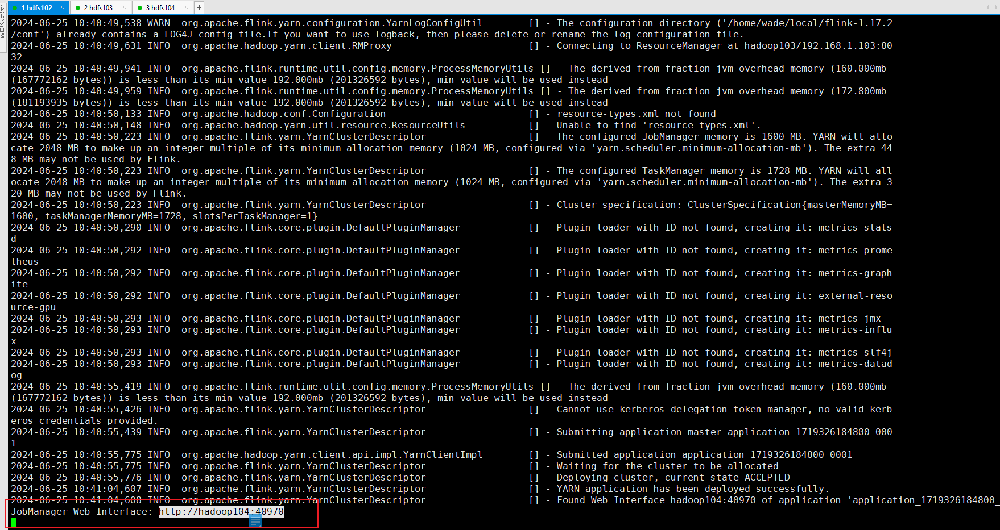

# Flink-Basic

## 1. 概述

### 1.1. 是什么

Flink是一个框架和分布式处理引擎，用于对无界和有界数据流进行有状态计算

Flink 的核心目标是“有数据流上的有状态计算”。

- 有界数据：有定义流的开始和结束，可以等所有数据都到齐才计算，可以对数据进行排序。
- 无界数据：有定义流的开始，没有定义流的结束。无休止的产生数据。数据必须立即处理，持续处理，不能等到所有数据都到了才处理。

状态：

- 把流处理需要的额外数据保存成一个**“状态”**，然后针对这条数据进行处理，并更新状态，这就是“有状态的流处理”
- 状态在内存中：速度快，可靠性差
- 状态在分布式系统中：可靠性高、速度慢。

### 1.2. 特点

目标：低延迟、高吞吐、结果的准确性和良好的容错率

- 高吞吐、低延迟
- 结果准确性：提供 **事件时间** 和 **处理时间**语义，对于乱序事件流，事件时间语义仍然能提供一致且准确的结果。
- 精确一次的状态一致性保护
- 可以连接到常用的外部系统，如db、kafka、hdfs等
- 高可用

### 1.3.Flink VS Spark Streaming

|              | **Flink**          | **Streaming**                        |
| ------------ | ------------------ | ------------------------------------ |
| **计算模型** | 流计算             | 微批处理                             |
| **时间语义** | 事件时间、处理时间 | 处理时间                             |
| **窗口**     | 多、灵活           | 少、不灵活（窗口必须是批次的整数倍） |
| **状态**     | 有                 | 没有                                 |
| **流式SQL**  | 有                 | 没有                                 |

### 1.4.分层API


- 越顶层越抽象、表达含义越简明、使用越方便
- 越底层越具体、表达能力越丰富、使用越灵活


## 2.部署

### 2.1.集群角色

Flink 提交作业和执行任务，需要几个关键的组件：

- 客户端：代码由客户端获取并做转换，之后提交给JobManager
- JobManager：Flink集群的“管事人”，对作业进行中央调度管理；获取到要执行的作业后，会进一步处理转换，然后分发给众多的TaskManager
- TaskManager：真正“干活的人”，负责数据的处理操作


### 2.2.集群搭建

#### 2.2.1. 集群启动

##### 2.2.1.1. 集群规划

| **节点服务器** | **hadoop102**                 | **hadoop103** | **hadoop104** |
| -------------- | ----------------------------- | ------------- | ------------- |
| **角色**       | JobManager  <br />TaskManager | TaskManager   | TaskManager   |

##### 2.2.1.2.下载并解压安装包

下载安装包flink-1.17.0-bin-scala_2.12.tgz，并解压

##### 2.2.1.3.修改进群配置

（1）进入conf路径，修改flink-conf.yaml文件，指定hadoop102节点服务器为JobManager 

修改如下内容：

```properties
$ vim flink-conf.yaml
# JobManager节点地址.
jobmanager.rpc.address: hadoop102
jobmanager.bind-host: 0.0.0.0
rest.address: hadoop102
rest.bind-address: 0.0.0.0
# TaskManager节点地址.需要配置为当前机器名
taskmanager.bind-host: 0.0.0.0
taskmanager.host: hadoop102
```

（2）修改workers文件，指定hadoop102、hadoop103和hadoop104为TaskManager

```properties
$ vim workers
hadoop102
hadoop103
hadoop104
```

（3）修改masters文件

```properties
$ vim masters
hadoop102:8081
```

（4）另外，在flink-conf.yaml文件中还可以对集群中的JobManager和TaskManager组件进行优化配置，主要配置项如下：

- **jobmanager.memory.process.size**：对JobManager进程可使用到的全部内存进行配置，包括JVM元空间和其他开销，默认为1600M，可以根据集群规模进行适当调整。
- **taskmanager.memory.process.size**：对TaskManager进程可使用到的全部内存进行配置，包括JVM元空间和其他开销，默认为1728M，可以根据集群规模进行适当调整。
- **taskmanager.numberOfTaskSlots**：对每个TaskManager能够分配的Slot数量进行配置，默认为1，可根据TaskManager所在的机器能够提供给Flink的CPU数量决定。所谓Slot就是TaskManager中具体运行一个任务所分配的计算资源。
- **parallelism.default**：Flink任务执行的并行度，默认为1。优先级低于代码中进行的并行度配置和任务提交时使用参数指定的并行度数量。

（5）对主节点修改后，分发到从节点，然后进行以下修改

```properties
$ vim flink-conf.yaml
# TaskManager节点地址.需要配置为当前机器名
taskmanager.host: hadoop103


# TaskManager节点地址.需要配置为当前机器名
taskmanager.host: hadoop104
```

（6）启动集群

在主节点hadoop102上执行 start-cluster.sh启动Flink集群 `bin/start-cluster.sh`

（7）访问 WebUI

可以访问http://hadoop102:8081对flink集群和任务进行监控管理


这里可以明显看到，当前集群的TaskManager数量为3；由于默认每个TaskManager的Slot数量为1，所以总Slot数和可用Slot数都为3。

#### 2.2.2.向集群提交作业

##### 2.2.2.1.环境准备

##### 2.2.2.2.程序打包

maven依赖添加shade插件配置，然后使用命令进行打包

```xml
<build>
    <plugins>
        <plugin>
            <groupId>org.apache.maven.plugins</groupId>
            <artifactId>maven-shade-plugin</artifactId>
            <version>3.2.4</version>
            <executions>
                <execution>
                    <phase>package</phase>
                    <goals>
                        <goal>shade</goal>
                    </goals>
                    <configuration>
                        <artifactSet>
                            <excludes>
                                <exclude>com.google.code.findbugs:jsr305</exclude>
                                <exclude>org.slf4j:*</exclude>
                                <exclude>log4j:*</exclude>
                            </excludes>
                        </artifactSet>
                        <filters>
                            <filter>
                                <!-- Do not copy the signatures in the META-INF folder.
                                Otherwise, this might cause SecurityExceptions when using the JAR. -->
                                <artifact>*:*</artifact>
                                <excludes>
                                    <exclude>META-INF/*.SF</exclude>
                                    <exclude>META-INF/*.DSA</exclude>
                                    <exclude>META-INF/*.RSA</exclude>
                                </excludes>
                            </filter>
                        </filters>
                        <transformers combine.children="append">
                            <transformer
                                    implementation="org.apache.maven.plugins.shade.resource.ServicesResourceTransformer">
                            </transformer>
                        </transformers>
                    </configuration>
                </execution>
            </executions>
        </plugin>
    </plugins>
</build>
```

##### 2.2.2.3.在WebUI上提交


##### 2.2.2.4.命令行提交

（1）启动集群

（2）将Flink程序运行jar包上传到服务器上

（3）使用命令`bin/flink run -m hadoop102:8081 -c com.atguigu.wc.SocketStreamWordCount path/to/jar`。这里的参数 `-m`指定了提交到的JobManager，`-c`指定了入口类。

### 2.3.部署模式

在一些应用场景中，对于集群资源分配和占用的方式，可能会有特定的需求。Flink为各种场景提供了不同的部署模式，主要有以下三种：会话模式（Session Mode）、单作业模式（Per-Job Mode）、应用模式（Application Mode）。

它们的区别主要在于：集群的生命周期以及资源的分配方式；以及应用的main方法到底在哪里执行——客户端（Client）还是JobManager。

#### 2.3.1.会话模式（Session Mode）

启动一个集群，保持一个会话，在整个会话中通过客户端提交作业。

集群启动时所有的资源都已经确定，所以所有提交的作业会竞争集群中的资源。

会话模式比较适用于单个规模小，执行时间短的大量作业。


#### 2.3.2.单作业模式（Pre-Job mode）

会话模式因为资源共享会导致狠毒哦问题，所以为了更好的隔离资源，可以考虑为每一个提交的作业启动一个集群——单作业模式。


作业完成后，集群就会关闭，所有资源也会被释放。在生产环境中更加稳定，所以是实际应用首选的模式。

Flink本身无法这样运行，所以但作业模式一般需要**借助一些资源管理框架来启动集群**，比如Yarn、K8S。

#### 2.3.3.应用模式（Application Mode）

上述两种模式下，应用代码都是在客户端上执行，然后由客户端提交给JobManager。但是这种方式需要占用大量网络带宽，并且会加重客户端所在节点的资源消耗。

解决办法就是不需要客户端，直接把应用提交给JobManager上运行。即为每一个提交的应用单独启动了一个集群，整个集群只为执行这一个应用而存在，执行完成后关闭这个集群。


### 2.4.Standalone运行模式

#### 2.4.1.会话模式部署

提前启动集群，并通过Web页面客户端提交任务（可以多个任务，但是集群资源固定）。

#### 2.4.2.单作业模式部署

Flink的Standalone集群并不支持单作业模式部署。因为单作业模式需要借助一些资源管理平台。

#### 2.4.3.应用模式部署

### 2.5.Yarn运行模式

#### 2.5.0.相关准备和配置

在将Flink任务部署至YARN集群之前，需要确认集群是否安装有Hadoop，保证Hadoop版本至少在2.2以上，并且集群中安装有HDFS服务。

配置步骤：

- 配置环境变量，增加环境变量配置如下：

  ```shell
  $ sudo vim /etc/profile.d/my_env.sh
  
  HADOOP_HOME=/opt/module/hadoop-3.3.4
  export PATH=$PATH:$HADOOP_HOME/bin:$HADOOP_HOME/sbin
  export HADOOP_CONF_DIR=${HADOOP_HOME}/etc/hadoop
  export HADOOP_CLASSPATH=`hadoop classpath`
  ```

- 启动Hadoop集群，包括hdfs和yarn

  ```shell
  start-dfs.sh
  start-yarn.sh
  ```

  

#### 2.5.1.会话部署模式

YARN的会话模式与独立集群略有不同，需要首先申请一个YARN会话（YARN Session）来启动Flink集群。具体步骤如下：

**（1）启动集群**

- 启动Hadoop集群（HDFS、YARN）。

- 执行脚本命令向YARN集群申请资源，开启一个YARN会话，启动Flink集群。

  ```shell
  bin/yarn-session.sh -nm test
  ```

  可用参数：

  - -d：不想让Flink YARN客户端一直前台运行，可以使用这个参数，即使关掉当前对话窗口，YARN session也可以后台运行。
  - -jm（--jobManagerMemory）：配置JobManager所需内存，默认单位MB。
  - -nm（--name）：配置在YARN UI界面上显示的任务名。
  - -qu（--queue）：指定YARN队列名。
  - -tm（--taskManager）：配置每个TaskManager所使用内存。

  Flink1.11.0版本不再使用-n参数和-s参数分别指定TaskManager数量和slot数量，**YARN会按照需求动态分配TaskManager和slot**。所以从这个意义上讲，YARN的会话模式也不会把集群资源固定，同样是动态分配的。

  YARN Session启动之后会给出一个Web UI地址以及一个YARN application ID，如下所示，用户可以通过Web UI或者命令行两种方式提交作业。

  

  

**（2）关闭集群**

```yarn app -kill app_id```


#### 2.5.3.应用模式部署

### 2.6.K8S运行模式（了解）

### 2.7.历史服务器

## 3.运行时架构

### 3.1.系统架构

YARN上部署的过程是：客户端把Flink应用提交给Yarn的`ResourceManager`，Yarn的`ResourceManager`会向Yarn的`NodeManager`申请容器。在这些容器上，Flink会部署`JobManager`和`TaskManager`的实例，从而启动集群。Flink会根据运行在`JobManger`上的作业所需要的`Slot`数量动态分配`TaskManager`资源。


#### 3.1.1. 作业管理器（JobManager）

JobManager是一个Flink集群中任务管理和调度的核心，是控制应用执行的主进程。也就是说，每个应用都应该被唯一的JobManager所控制执行。

JobManger又包含3个不同的组件。

**（1）JobMaster**

JobMaster是JobManager中最核心的组件，负责处理单独的作业（Job）。所以JobMaster和具体的Job是一一对应的，多个Job可以同时运行在一个Flink集群中, 每个Job都有一个自己的JobMaster。

**（2）资源管理器（ResourceManager）**

ResourceManager主要负责资源的分配和管理，在Flink 集群中只有一个。所谓“资源”，主要是指TaskManager的任务槽（task slots）。任务槽就是Flink集群中的资源调配单元，包含了机器用来执行计算的一组CPU和内存资源。每一个任务（Task）都需要分配到一个slot上执行。

这里注意要把Flink内置的ResourceManager和其他资源管理平台（比如YARN）的ResourceManager区分开。

**（3）分发器（Dispatcher）**

Dispatcher主要负责提供一个REST接口，用来提交应用，并且负责为每一个新提交的作业启动一个新的JobMaster 组件。Dispatcher也会启动一个Web UI，用来方便地展示和监控作业执行的信息。Dispatcher在架构中并不是必需的，在不同的部署模式下可能会被忽略掉。

#### 3.1.2.任务管理器（TaskManager）

TaskManager是Flink中的工作进程，数据流的具体计算就是它来做的。Flink集群中必须至少有一个TaskManager；每一个TaskManager都包含了一定数量的任务槽（task slots）。Slot是资源调度的最小单位，slot的数量限制了TaskManager能够并行处理的任务数量。

启动之后，TaskManager会向资源管理器注册它的slots；收到资源管理器的指令后，TaskManager就会将一个或者多个槽位提供给JobMaster调用，JobMaster就可以分配任务来执行了。

在执行过程中，TaskManager可以缓冲数据，还可以跟其他运行同一应用的TaskManager交换数据。

### 3.2.核心概念

#### 3.2.1.并行度

**（1）并行子任务和并行度**

当要处理的数据量非常大时，我们可以把一个算子操作，“复制”多份到多个节点，数据来了之后就可以到其中任意一个执行。这样一来，一个算子任务就被拆分成了多个并行的**“子任务”（subtasks）**，再将它们分发到不同节点，就真正实现了并行计算。

在Flink执行过程中，每一个算子（operator）可以包含一个或多个子任务（operator subtask），这些子任务在不同的线程、不同的物理机或不同的容器中完全独立地执行。

**一个特定算子的子任务（subtask）的个数被称之为其并行度（parallelism）**。这样，包含并行子任务的数据流，就是并行数据流，它需要多个分区（stream partition）来分配并行任务。一般情况下，一个流程序的并行度，可以认为就是其所有算子中最大的并行度。

**（2）并行度的设置**

**代码中设置**：

- 可以很简单地在**算子**后跟着调用`setParallelism()`方法，表示设置当前算子的并行度
- 直接调用执行**环境**的`setParallelism()`方法，全局设定并行度。`env.setParallelism(2);`

**提交时设置**：

- 在使用flink run命令提交应用时，可以增加-p参数来指定当前应用程序执行的并行度，它的作用类似于执行环境的全局设置：`bin/flink run –p 2 –c MainClass path/to/jar`
- 在WebUI提交作业时设置

**配置文件中设置**：

在 flink-conf.yaml 文件中更改默认并行度：

`parallelism.default: 2`

**（3）并行度优先级**

代码(算子>全局) > 命令 > 配置文件

#### 3.2.2.算子链

##### 3.2.2.1.算子之间的数据传输

**（1）一对一（One-to-One，forwarding）**

这种模式下，数据流维护着分区以及元素的顺序。

map、filter、flatMap等算子都是这种one-to-one的对应关系。

**（2）重分区（Redsitribution）**

在这种模式下，数据流的分区会发生改变。每一个算子的子任务，会根据数据传输的策略，把数据发送到不同的下游目标任务。这些传输方式都会引起重分区的过程，这一过程类似于Spark中的shuffle。

##### 3.2.2.2.合并算子链

并行度相同的一对一（one to one）算子操作，可以直接链接在一起形成一个“大”的任务（task），这样原来的算子就成为了真正任务里的一部分。途中source和map合并在一起。


Flink默认会按照算子链的原则进行链接合并，如果我们想要禁止合并或者自行定义，也可以在代码中对算子做一些特定的设置：

```java
// 禁用算子链
.map(word -> Tuple2.of(word, 1L)).disableChaining();

// 从当前算子开始新链
.map(word -> Tuple2.of(word, 1L)).startNewChain()
```

#### 3.2.3.任务槽

##### 3.2.3.1. Slot

很显然，TaskManager的计算资源是有限的，并行的任务越多，每个线程的资源就会越少。那一个TaskManager到底能并行处理多少个任务呢？为了控制并发量，我们需要在TaskManager上对每个任务运行所占用的资源做出明确的划分，这就是所谓的**任务槽（task slots）**。

**每个任务槽（task slot）其实表示了TaskManager拥有计算资源的一个固定大小的子集。这些资源就是用来独立执行一个子任务的**


##### 3.2.3.2.slot数量配置

在 conf/flink-conf.yaml 文件中，配置项为：

```properties
taskmanager.numberOfTaskSlots: 8  # 默认是1
```

**需要注意的是，slot目前仅仅用来隔离内存，不会涉及CPU的隔离。**在具体应用时，可以将slot数量配置为机器的CPU核心数，尽量避免不同任务之间对CPU的竞争。这也是开发环境默认并行度设为机器CPU数量的原因。

##### 3.2.3.3.任务对slot的共享

在同一个作业中，不同任务节点（算子）的并行子任务 可以放到同一个slot上执行。

优点：允许我们保存完整的作业管道，如下图第一个slot。


Flink默认是允许slot共享的，如果希望某个算子对应的任务完全独占一个slot，或者只有某一部分算子共享slot，我们也可以通过设置“slot共享组”手动指定：

```java
.map(word -> Tuple2.of(word, 1L)).slotSharingGroup("1");
```

这样，只有属于同一个slot共享组的子任务，才会开启slot共享；不同组之间的任务是完全隔离的，必须分配到不同的slot上。在这种场景下，总共需要的slot数量，就是各个slot共享组最大并行度的总和。

#### 3.2.4.并行度和任务槽的关系

- 任务槽是静态的概念，是指TaskManager具有的并发执行能力，可以通过参数`taskmanager.numberOfTaskSlots`进行配置；

- 并行度是动态概念，也就是TaskManager运行程序时实际使用的并发能力，可以通过参数`parallelism.default`进行配置。

**整个流处理程序的并行度，就应该是所有算子并行度中最大的那个，这代表了运行程序需要的slot数量。**

### 3.3.作业提交流程

#### 3.3.1.Standalone模式提交流程

#### 3.3.2.逻辑流图/作业图/执行图/物理流图

#### 3.3.3.Yarn模式作业提交流程

## 4.DataStream API

### 4.1. 执行环境

我们在提交作业执行计算时，首先必须获取当前Flink的运行环境，从而建立起与Flink框架之间的联系。

#### 4.1.1.创建执行环境

在代码中创建执行环境的方式，就是调用`StreamExecutionEnvironment`这个类的静态方法:具体有三种：

**（1）getExecutionEnvironment**：根据当前运行的方式，自行决定该返回什么样的运行环境

最简单的方式，就是直接调用`getExecutionEnvironment`方法。它会根据当前运行的上下文直接得到正确的结果：

- 如果程序是独立运行的，就返回一个本地执行环境；
- 如果是创建了jar包，然后从命令行调用它并提交到集群执行，那么就返回集群的执行环境。

```java
StreamExecutionEnvironment env = StreamExecutionEnvironment.getExecutionEnvironment();
```

**（2）createLocalEnvironment**：这个方法返回一个本地执行环境

可以在调用时传入一个参数，指定默认的并行度；如果不传入，则默认并行度就是本地的CPU核心数。

```java
StreamExecutionEnvironment localEnv = StreamExecutionEnvironment.createLocalEnvironment();
```

**（3）createRemoteEnvironment**：这个方法返回集群执行环境。

需要在调用时指定JobManager的主机名和端口号，并指定要在集群中运行的Jar包。

```java
StreamExecutionEnvironment remoteEnv = StreamExecutionEnvironment
  		.createRemoteEnvironment(
    		"host",                   // JobManager主机名
    		1234,                     // JobManager进程端口号
   			"path/to/jarFile.jar"  // 提交给JobManager的JAR包
		); 
```

#### 4.1.2.执行模式

从Flink 1.12开始，官方推荐的做法是直接使用DataStream API，在提交任务时通过将执行模式设为BATCH来进行批处理。

DataStream API执行模式包括：

- 流执行模式（Streaming）：默认
- 批执行模式（Batch）：专门用于批处理的执行模式。
- 自动模式（AutoMatic）：在这种模式下，将由程序根据输入数据源是否有界，来自动选择执行模式。

指定执行模式为批处理的方法：

- 通过命令行配置：`bin/flink run -Dexecution.runtime-mode=BATCH ...`或者提交作业时增加`execution.runtime-mode`参数，指定值为`BATCH`
- 通过代码配置：`env.setRuntimeMode(RuntimeExecutionMode.BATCH);`

实际应用中一般不会在代码中配置，而是使用命令行，这样更加灵活。

#### 4.1.3.触发程序执行

需要注意的是，写完输出（sink）操作并不代表程序已经结束。**因为当main()方法被调用时，其实只是定义了作业的每个执行操作，然后添加到数据流图中**；这时并没有真正处理数据——因为数据可能还没来。Flink是由事件驱动的，只有等到数据到来，才会触发真正的计算，这也被称为“延迟执行”或“懒执行”。

所以我们需要显式地调用执行环境的execute()方法，来触发程序执行。execute()方法将一直等待作业完成，然后返回一个执行结果（JobExecutionResult）。

### 4.2.源算子Source

Flink一般将数据的输入来源称为数据源（data source），而读取数据的算子就是源算子（source operator）。


在Flink 1.12以前，添加Source的方法是调用执行环境的addSource()

```java
DataStream<String> stream = env.addSource(...);
```

从Flink1.12开始，主要使用流批统一的新Source架构：

```java
DataStreamSource<String> stream = env.fromSource(…)
```

#### 4.2.1. 准备一个POJO类

```java
// lombok
public class WaterSensor {
    public String id;
    public Long ts;
    public Integer vc;
}
```

#### 4.2.2.从集合中读取数据

```java
env.fromCollection(...)
```

#### 4.2.3.从文件中读取数据

添加文件连接器依赖：

```xml
<dependency>
            <groupId>org.apache.flink</groupId>
            <artifactId>flink-connector-files</artifactId>
            <version>${flink.version}</version>
</dependency>
```

代码如下：

```java
public static void main(String[] args) throws Exception {
        StreamExecutionEnvironment env = StreamExecutionEnvironment.getExecutionEnvironment();
        FileSource<String> fileSource = FileSource.forRecordStreamFormat(new TextLineInputFormat(), new Path("input/word.txt")).build();
        env.fromSource(fileSource,WatermarkStrategy.noWatermarks(),"file").print();
        env.execute();
}
```

- 参数可以是目录，也可以是文件；还可以从HDFS目录下读取，使用路径`hdfs://...`；
- 路径可以是相对路径，也可以是绝对路径；
- 相对路径是从系统属性user.dir获取路径：idea下是project的根目录，standalone模式下是集群节点根目录；

#### 4.2.4.从Socket

一般用于测试

```java
DataStream<String> stream = env.socketTextStream("localhost", 7777);
```

#### 4.2.5.从Kafka

Flink官方提供了连接工具flink-connector-kafka，直接帮我们实现了一个消费者FlinkKafkaConsumer，它就是用来读取Kafka数据的SourceFunction。

maven依赖：

```xml
<dependency>
    <groupId>org.apache.flink</groupId>
    <artifactId>flink-connector-kafka</artifactId>
    <version>${flink.version}</version>
</dependency>
```

demo如下：

```java
public class SourceKafka {
    public static void main(String[] args) throws Exception {
        StreamExecutionEnvironment env = StreamExecutionEnvironment.getExecutionEnvironment();
        KafkaSource<String> kafkaSource = KafkaSource.<String>builder()
            .setBootstrapServers("hadoop102:9092")
            .setTopics("topic_1")
            .setGroupId("atguigu")
            .setStartingOffsets(OffsetsInitializer.latest())
            .setValueOnlyDeserializer(new SimpleStringSchema()) 
            .build();
        DataStreamSource<String> stream = env.fromSource(kafkaSource, WatermarkStrategy.noWatermarks(), "kafka-source");
        stream.print("Kafka");
        env.execute();
    }
}
```


#### 4.2.6.从数据生成器读取数据

Flink从1.11开始提供了一个内置的DataGen 连接器，主要是用于生成一些随机数，用于在没有数据源的时候，进行流任务的测试以及性能测试等。

maven依赖：

```xml
        <dependency>
            <groupId>org.apache.flink</groupId>
            <artifactId>flink-connector-datagen</artifactId>
            <version>${flink.version}</version>
        </dependency>
```

demo如下：

```java
public class DataGeneratorDemo {
    public static void main(String[] args) throws Exception {
        StreamExecutionEnvironment env = StreamExecutionEnvironment.getExecutionEnvironment();
        env.setParallelism(1);
        DataGeneratorSource<String> dataGeneratorSource =
                new DataGeneratorSource<>(
                        new GeneratorFunction<Long, String>() {
                            @Override
                            public String map(Long value) throws Exception {
                                return "Number:"+value;
                            }
                        },
                        Long.MAX_VALUE,
                        RateLimiterStrategy.perSecond(10),
                        Types.STRING
                );
        env.fromSource(dataGeneratorSource, WatermarkStrategy.noWatermarks(), "datagenerator")
                .print();
        env.execute();
    }
}
```

#### 4.2.7.Flink支持的数据类型

**（1）Flink类型系统**

Flink使用“类型信息”（**TypeInformation**）来统一表示数据类型。TypeInformation类是Flink中所有类型描述符的基类。它涵盖了类型的一些基本属性，并为每个数据类型生成特定的序列化器、反序列化器和比较器。

**（2）Flink支持的数据类型**

对于常见的Java和Scala数据类型，Flink都是支持的。Flink在内部，Flink对支持不同的类型进行了划分，这些类型可以在Types工具类中找到：

**基本类型**

所有Java基本类型及其包装类，再加上Void、String、Date、BigDecimal和BigInteger。

**数组类型**

包括基本类型数组（PRIMITIVE_ARRAY）和对象数组（OBJECT_ARRAY）。

**复合数据类型**

- Java元组类型（TUPLE）：这是Flink内置的元组类型，是Java API的一部分。最多25个字段，也就是从Tuple0~Tuple25，不支持空字段。
- Scala 样例类及Scala元组：不支持空字段。
- 行类型（ROW）：可以认为是具有任意个字段的元组，并支持空字段。
- POJO：Flink自定义的类似于Java bean模式的类。

**辅助类型**

Option、Either、List、Map等。

**泛型类型（GENERIC）**

Flink支持所有的Java类和Scala类。不过如果没有按照上面POJO类型的要求来定义，就会被Flink当作泛型类来处理。Flink会把泛型类型当作黑盒，无法获取它们内部的属性；它们也不是由Flink本身序列化的，而是由Kryo序列化的。

在这些类型中，元组类型和POJO类型最为灵活，因为它们支持创建复杂类型。而相比之下，POJO还支持在键（key）的定义中直接使用字段名，这会让我们的代码可读性大大增加。所以，在项目实践中，往往会将流处理程序中的元素类型定为Flink的POJO类型。

Flink对POJO类型的要求如下：

- 类是公有（public）的
-  有一个无参的构造方法
-  所有属性都是公有（public）的
-  所有属性的类型都是可以序列化的

**（3）类型提示（Type Hints）**

Flink还具有一个类型提取系统，可以分析函数的输入和返回类型，自动获取类型信息，从而获得对应的序列化器和反序列化器。

由于Java中泛型擦除的存在，在某些特殊情况下（比如Lambda表达式中），自动提取的信息是不够精细。为了解决这类问题，Java API提供了专门的“类型提示”（type hints）。

```java
.map(word -> Tuple2.of(word, 1L))
.returns(Types.TUPLE(Types.STRING, Types.LONG)); // 避免泛型擦除
```

Flink还专门提供了TypeHint类，它可以捕获泛型的类型信息，并且一直记录下来，为运行时提供足够的信息。我们同样可以通过.returns()方法，明确地指定转换之后的DataStream里元素的类型。

```java
returns(new TypeHint<Tuple2<Integer, SomeType>>(){})  // 避免泛型擦除
```

### 4.3.转换算子Transformation

转换算子：将一个或多个DataStream转换为新的DataStream

#### 4.3.1. 基本转换算子

##### 4.3.1.1.映射Map

一个“一一映射”，消费一个元素就产出一个元素。

只需基于DataStream调用map()方法就可以进行转换处理。

```java
public class TransMap {
    public static void main(String[] args) throws Exception {

        StreamExecutionEnvironment env = StreamExecutionEnvironment.getExecutionEnvironment();

        DataStreamSource<WaterSensor> stream = env.fromElements(
                new WaterSensor("sensor_1", 1, 1),
                new WaterSensor("sensor_2", 2, 2)
        );

        // 方式一：传入匿名类，实现MapFunction
        stream.map(new MapFunction<WaterSensor, String>() {
            @Override
            public String map(WaterSensor e) throws Exception {
                return e.id;
            }
        }).print();

        // 方式二：传入MapFunction的实现类
        // stream.map(new UserMap()).print();

        env.execute();
    }

    public static class UserMap implements MapFunction<WaterSensor, String> {
        @Override
        public String map(WaterSensor e) throws Exception {
            return e.id;
        }
    }
}
```

##### 4.3.1.2.过滤fliter

filter转换操作，顾名思义是对数据流执行一个过滤，通过一个布尔条件表达式设置过滤条件，对于每一个流内元素进行判断，若为true则元素正常输出，若为false则元素被过滤掉。

```java
public class TransFilter {
    public static void main(String[] args) throws Exception {

        StreamExecutionEnvironment env = StreamExecutionEnvironment.getExecutionEnvironment();

        DataStreamSource<WaterSensor> stream = env.fromElements(
                
new WaterSensor("sensor_1", 1, 1),
new WaterSensor("sensor_1", 2, 2),
new WaterSensor("sensor_2", 2, 2),
new WaterSensor("sensor_3", 3, 3)
        );

        // 方式一：传入匿名类实现FilterFunction
        stream.filter(new FilterFunction<WaterSensor>() {
            @Override
            public boolean filter(WaterSensor e) throws Exception {
                return e.id.equals("sensor_1");
            }
        }).print();

        // 方式二：传入FilterFunction实现类
        // stream.filter(new UserFilter()).print();
        
        env.execute();
    }
    public static class UserFilter implements FilterFunction<WaterSensor> {
        @Override
        public boolean filter(WaterSensor e) throws Exception {
            return e.id.equals("sensor_1");
        }
    }
}
```

##### 4.3.1.3.扁平映射（flatmap）

消费一个元素，可以产生0到多个元素。flatMap可以认为是“扁平化”（flatten）和“映射”（map）两步操作的结合，也就是先按照某种规则对数据进行打散拆分，再对拆分后的元素做转换处理。

```java
public class TransFlatmap {
    public static void main(String[] args) throws Exception {

        StreamExecutionEnvironment env = StreamExecutionEnvironment.getExecutionEnvironment();

        DataStreamSource<WaterSensor> stream = env.fromElements(
                
new WaterSensor("sensor_1", 1, 1),
new WaterSensor("sensor_1", 2, 2),
new WaterSensor("sensor_2", 2, 2),
new WaterSensor("sensor_3", 3, 3)

        );

        stream.flatMap(new MyFlatMap()).print();

        env.execute();
    }

    public static class MyFlatMap implements FlatMapFunction<WaterSensor, String> {

        @Override
        public void flatMap(WaterSensor value, Collector<String> out) throws Exception {

            if (value.id.equals("sensor_1")) {
                out.collect(String.valueOf(value.vc));
            } else if (value.id.equals("sensor_2")) {
                out.collect(String.valueOf(value.ts));
                out.collect(String.valueOf(value.vc));
            }
        }
    }
} 
```

#### 4.3.2. 聚合算子（Aggregate）

##### 4.3.2.1.按键分区（keyBy）

**在Flink中，要做聚合，需要先进行分区**；这个操作就是通过`keyBy`来完成的。`keyBy`是聚合前必须要用到的一个算子。keyBy通过指定键（key），可以将一条流从逻辑上划分成不同的分区（partitions）。

```java
public class TransKeyBy {
    public static void main(String[] args) throws Exception {

        StreamExecutionEnvironment env = StreamExecutionEnvironment.getExecutionEnvironment();

        DataStreamSource<WaterSensor> stream = env.fromElements(
new WaterSensor("sensor_1", 1, 1),
new WaterSensor("sensor_1", 2, 2),
new WaterSensor("sensor_2", 2, 2),
new WaterSensor("sensor_3", 3, 3)
        );

        // 方式一：使用Lambda表达式
        KeyedStream<WaterSensor, String> keyedStream = stream.keyBy(e -> e.id);

        // 方式二：使用匿名类实现KeySelector
        KeyedStream<WaterSensor, String> keyedStream1 = stream.keyBy(new KeySelector<WaterSensor, String>() {
            @Override
            public String getKey(WaterSensor e) throws Exception {
                return e.id;
            }
        });

        env.execute();
    }
}
```

`keyBy`得到的结果将不再是DataStream，而是会将DataStream转换为`KeyedStream`。`KeyedStream`可以认为是“分区流”或者“键控流”，它是对DataStream按照key的一个逻辑分区，所以泛型有两个类型：除去当前流中的元素类型外，还需要指定key的类型。

##### 4.3.2.2.简单聚合

Flink 内置了几种最简单的聚合API：

- `sum()`：在输入流上，对指定的字段做叠加求和的操作。
- `min()`：在输入流上，对指定的字段求最小值。
- `max()`：求最大值
- `minBy`：与`min()`类似，在输入流上针对指定字段求最小值。`minBy()`会返回包含字段最小值的整条数据。
- `maxBy`：返回指定字段中最大的整条数据

Flink 指定字段的方式有两种： 指定位置 ， 指定名称。**元组类型**的数据，可以使用这两种方式来指定字段，f0、f1、f2、…来命名。POJO类型只能通过名称来指定。

```java
public class TransAggregation {

    public static void main(String[] args) throws Exception {

        StreamExecutionEnvironment env = StreamExecutionEnvironment.getExecutionEnvironment();

        DataStreamSource<WaterSensor> stream = env.fromElements(
new WaterSensor("sensor_1", 1, 1),
new WaterSensor("sensor_1", 2, 2),
new WaterSensor("sensor_2", 2, 2),
new WaterSensor("sensor_3", 3, 3)
        );

        stream.keyBy(e -> e.id).max("vc");    // 指定字段名称

        env.execute();
    }
}
```

- keyBy和聚合是成对出现的，先分区、后聚合，得到的依然是一个DataStream。而且经过简单聚合之后的数据流，元素的数据类型保持不变。
- 一个聚合算子，会为每一个key保存一个聚合的值，在Flink中我们把它叫作“状态”（state）。

##### 4.3.2.3.归约聚合（Reduce）

`reduce`可以对已有的数据进行归约处理，把每一个新输入的数据和当前已经归约出来的值，再做一个聚合计算。调用KeyedStream的reduce方法时，需要传入一个参数，实现`ReduceFunction`接口

```java
public interface ReduceFunction<T> extends Function, Serializable {
    T reduce(T value1, T value2) throws Exception;
}
```

`ReduceFunction`接口里需要实现reduce()方法，这个方法接收两个输入事件，经过转换处理之后输出一个相同类型的事件。在流处理的底层实现过程中，实际上是将中间“合并的结果”作为任务的一个状态保存起来的；之后每来一个新的数据，就和之前的聚合状态进一步做归约。

```java
StreamExecutionEnvironment env = StreamExecutionEnvironment.getExecutionEnvironment();

env
   .socketTextStream("hadoop102", 7777)
   .map(new WaterSensorMapFunction())
   .keyBy(WaterSensor::getId)
   .reduce(new ReduceFunction<WaterSensor>()
   {
       @Override
       public WaterSensor reduce(WaterSensor value1, WaterSensor value2) throws Exception {
           System.out.println("Demo7_Reduce.reduce");

           int maxVc = Math.max(value1.getVc(), value2.getVc());
           //实现max(vc)的效果  取最大值，其他字段以当前组的第一个为主
           //value1.setVc(maxVc);
           //实现maxBy(vc)的效果  取当前最大值的所有字段
           if (value1.getVc() > value2.getVc()){
               value1.setVc(maxVc);
               return value1;
           }else {
               value2.setVc(maxVc);
               return value2;
           }
       }
   })
   .print();
env.execute();
```

`reduce`同简单聚合算子一样，也要针对每一个key保存状态。因为状态不会清空，所以我们需要将`reduce`算子作用在一个有限key的流上。

#### 4.3.3.用户自定义函数（UDF）

##### 4.3.3.1.函数类

Flink暴露了所有UDF函数的接口，具体实现方式为接口或者抽象类，例如MapFunction、FilterFunction、ReduceFunction等。

##### 4.3.3.2.富函数类

“富函数类”也是DataStream API提供的一个函数类的接口，所有的Flink函数类都有其Rich版本。富函数类一般是以抽象类的形式出现的。例如：RichMapFunction、RichFilterFunction、RichReduceFunction等。

与常规函数类的不同主要在于，富函数类可以获取运行环境的上下文，并拥有一些生命周期方法，所以可以实现更复杂的功能。

Rich Function有生命周期的概念。典型的生命周期方法有：

- `open`方法：初始化方法，也就是会开启一个算子的生命周期。当一个算子的实际工作方法被调用之前，`open`方法会首先被调用
- `close`方法：l 是生命周期中的最后一个调用的方法，类似于结束方法。一般用来做一些清理工作。

**需要注意的是**，这里的生命周期方法，对于一个并行子任务来说只会调用一次；而对应的，实际工作方法，例如RichMapFunction中的map()，在每条数据到来后都会触发一次调用。

#### 4.3.4.物理分区算子（**Physical Partitioning**）

##### 4.3.4.1. 随机分区（Shuffle）

最简单的重分区方式就是直接“洗牌”。通过调用`DataStream`的`.shuffle()`方法，将数据随机地分配到下游算子的并行任务中去。

随机分区服从均匀分布（uniform distribution），所以可以把流中的数据随机打乱，均匀地传递到下游任务分区。


##### 4.3.4.2.轮训分区（Round-Robin）

轮询，简单来说就是“发牌”，按照先后顺序将数据做依次分发。通过调用`DataStream`的`.rebalance()`方法，就可以实现轮询重分区。


##### 4.3.4.3.重缩放分区（Rescale）

重缩放分区和轮询分区非常相似。当调用`rescale()`方法时，其实底层也是使用Round-Robin算法进行轮询，但是只会将数据轮询发送到下游并行任务的一部分中。`rescale`的做法是分成小团体，发牌人只给自己团体内的所有人轮流发牌。


##### 4.3.4.4.广播（Broadcast）

这种方式其实不应该叫做“重分区”，因为经过广播之后，数据会在不同的分区都保留一份，可能进行重复处理。可以通过调用DataStream的broadcast()方法，将输入数据复制并发送到下游算子的所有并行任务中去。

`stream.broadcast()`

##### 4.3.4.5.全局分区（Global）

全局分区也是一种特殊的分区方式。这种做法非常极端，通过调用.global()方法，会将所有的输入流数据都发送到下游算子的第一个并行子任务中去。这就相当于强行让下游任务并行度变成了1，所以使用这个操作需要非常谨慎，可能对程序造成很大的压力。

##### 4.3.4.6.自定义分区（Custom）

通过实现接口`Partitioner<String> `来实现自定义分区器，可以通过使用 `DataStream.partitionCustom()`方法来自定义分区策略。

#### 4.3.5.分流

所谓“分流”，就是将一条数据流拆分成完全独立的两条、甚至多条流。也就是基于一个DataStream，定义一些筛选条件，将符合条件的数据拣选出来放到对应的流里。


##### 4.3.5.1. 简单实现

其实根据条件筛选数据的需求，本身非常容易实现：只要针对同一条流多次独立调用`.filter()`方法进行筛选，就可以得到拆分之后的流了。但是这种方法会将原始数据流复制多份。

##### 4.3.5.2.使用侧输出流

简单来说，只需要调用上下文ctx的.output()方法，就可以输出任意类型的数据了。而侧输出流的标记和提取，都离不开一个“输出标签”（OutputTag），指定了侧输出流的id和类型。

```java
public class SplitStreamByOutputTag {    
public static void main(String[] args) throws Exception {
        StreamExecutionEnvironment env = StreamExecutionEnvironment.getExecutionEnvironment();

        SingleOutputStreamOperator<WaterSensor> ds = env.socketTextStream("hadoop102", 7777)
              .map(new WaterSensorMapFunction());


        OutputTag<WaterSensor> s1 = new OutputTag<>("s1", Types.POJO(WaterSensor.class)){};
        OutputTag<WaterSensor> s2 = new OutputTag<>("s2", Types.POJO(WaterSensor.class)){};
       //返回的都是主流
        SingleOutputStreamOperator<WaterSensor> ds1 = ds.process(new ProcessFunction<WaterSensor, WaterSensor>()
        {
            @Override
            public void processElement(WaterSensor value, Context ctx, Collector<WaterSensor> out) throws Exception {

                if ("s1".equals(value.getId())) {
                    ctx.output(s1, value);
                } else if ("s2".equals(value.getId())) {
                    ctx.output(s2, value);
                } else {
                    //主流
                    out.collect(value);
                }

            }
        });

        ds1.print("主流，非s1,s2的传感器");
        SideOutputDataStream<WaterSensor> s1DS = ds1.getSideOutput(s1);
        SideOutputDataStream<WaterSensor> s2DS = ds1.getSideOutput(s2);

        s1DS.printToErr("s1");
        s2DS.printToErr("s2");
        
        env.execute();
 
}
}
```

#### 4.3.6.合流

##### 4.3.6.1.联合（union）

最简单的合流操作，就是直接将多条流合在一起，叫作流的“联合”（union）。联合操作要求必须流中的数据类型必须相同，合并之后的新流会包括所有流中的元素，数据类型不变。


基于DataStream直接调用.union()方法，传入其他DataStream作为参数，就可以实现流的联合了；得到的依然是一个DataStream。`stream1.union(stream2, stream3, ...)`

```java
public class UnionExample {

    public static void main(String[] args) throws Exception {

        StreamExecutionEnvironment env = StreamExecutionEnvironment.getExecutionEnvironment();

        env.setParallelism(1);

        DataStreamSource<Integer> ds1 = env.fromElements(1, 2, 3);
        DataStreamSource<Integer> ds2 = env.fromElements(2, 2, 3);
        DataStreamSource<String> ds3 = env.fromElements("2", "2", "3");

        ds1.union(ds2,ds3.map(Integer::valueOf))
           .print();

        env.execute();
    }
}
```


##### 4.3.6.1.连接（connect）

连接操作允许流的数据类型不同。得到的是一个“连接流”，连接流可以看成是两条流的“统一”，被放在了同一个流中；事实上内部仍然保持各自的数据形式不变，彼此之间是相互独立的。

此外还需要定义一个“同处理（co-process）”转换操作，用来说明对于不同来源、类型的数据，怎样分别处理转换，得到统一的输出类型。

```java
public class ConnectDemo {

    public static void main(String[] args) throws Exception {

        StreamExecutionEnvironment env = StreamExecutionEnvironment.getExecutionEnvironment();
        env.setParallelism(1);

//        DataStreamSource<Integer> source1 = env.fromElements(1, 2, 3);
//        DataStreamSource<String> source2 = env.fromElements("a", "b", "c");

        SingleOutputStreamOperator<Integer> source1 = env
                .socketTextStream("hadoop102", 7777)
                .map(i -> Integer.parseInt(i));

        DataStreamSource<String> source2 = env.socketTextStream("hadoop102", 8888);

        /**
         * TODO 使用 connect 合流
         * 1、一次只能连接 2条流
         * 2、流的数据类型可以不一样
         * 3、 连接后可以调用 map、flatmap、process来处理，但是各处理各的
         */
        ConnectedStreams<Integer, String> connect = source1.connect(source2);

        SingleOutputStreamOperator<String> result = connect.map(new CoMapFunction<Integer, String, String>() {
            @Override
            public String map1(Integer value) throws Exception {
                return "来源于数字流:" + value.toString();
            }

            @Override
            public String map2(String value) throws Exception {
                return "来源于字母流:" + value;
            }
        });

        result.print();

        env.execute();    }
}
```

**CoMapFunction**

`ConnectedStreams`有两个类型参数，分别表示内部包含的两条流各自的数据类型,因此调用`.map()`方法时传入的不再是一个简单的`MapFunction`，而是一个`CoMapFunction`，表示分别对两条流中的数据执行map操作。需要实现的方法也非常直白：.map1()就是对第一条流中数据的map操作，.map2()则是针对第二条流。

**CoProcessFunction**

与`CoMapFunction`类似，如果是调用.map()就需要传入一个`CoMapFunction`，需要实现`map1()`、`map2()`两个方法；而调用.process()时，传入的则是一个`CoProcessFunction`。它需要实现的就是`processElement1()`、`processElement2()`两个方法，在每个数据到来时，会根据来源的流调用其中的一个方法进行处理。

**KeyBy**

ConnectedStreams也可以直接调用.keyBy()进行按键分区的操作，得到的还是一个ConnectedStreams：

`connectedStreams.keyBy(keySelector1, keySelector2);`

```java
public class ConnectKeybyDemo {
    public static void main(String[] args) throws Exception {
        StreamExecutionEnvironment env = StreamExecutionEnvironment.getExecutionEnvironment();
        env.setParallelism(2);

        DataStreamSource<Tuple2<Integer, String>> source1 = env.fromElements(
                Tuple2.of(1, "a1"),
                Tuple2.of(1, "a2"),
                Tuple2.of(2, "b"),
                Tuple2.of(3, "c")
        );
        DataStreamSource<Tuple3<Integer, String, Integer>> source2 = env.fromElements(
                Tuple3.of(1, "aa1", 1),
                Tuple3.of(1, "aa2", 2),
                Tuple3.of(2, "bb", 1),
                Tuple3.of(3, "cc", 1)
        );

        ConnectedStreams<Tuple2<Integer, String>, Tuple3<Integer, String, Integer>> connect = source1.connect(source2);

        // 多并行度下，需要根据 关联条件 进行keyby，才能保证key相同的数据到一起去，才能匹配上
        ConnectedStreams<Tuple2<Integer, String>, Tuple3<Integer, String, Integer>> connectKey = connect.keyBy(s1 -> s1.f0, s2 -> s2.f0);

        SingleOutputStreamOperator<String> result = connectKey.process(
                new CoProcessFunction<Tuple2<Integer, String>, Tuple3<Integer, String, Integer>, String>() {
                    // 定义 HashMap，缓存来过的数据，key=id，value=list<数据>
                    Map<Integer, List<Tuple2<Integer, String>>> s1Cache = new HashMap<>();
                    Map<Integer, List<Tuple3<Integer, String, Integer>>> s2Cache = new HashMap<>();

                    @Override
                    public void processElement1(Tuple2<Integer, String> value, Context ctx, Collector<String> out) throws Exception {
                        Integer id = value.f0;
                        // TODO 1.来过的s1数据，都存起来
                        if (!s1Cache.containsKey(id)) {
                            // 1.1 第一条数据，初始化 value的list，放入 hashmap
                            List<Tuple2<Integer, String>> s1Values = new ArrayList<>();
                            s1Values.add(value);
                            s1Cache.put(id, s1Values);
                        } else {
                            // 1.2 不是第一条，直接添加到 list中
                            s1Cache.get(id).add(value);
                        }

                        //TODO 2.根据id，查找s2的数据，只输出 匹配上 的数据
                        if (s2Cache.containsKey(id)) {
                            for (Tuple3<Integer, String, Integer> s2Element : s2Cache.get(id)) {
                                out.collect("s1:" + value + "<--------->s2:" + s2Element);
                            }
                        }
                    }

                    @Override
                    public void processElement2(Tuple3<Integer, String, Integer> value, Context ctx, Collector<String> out) throws Exception {
                        Integer id = value.f0;
                        // TODO 1.来过的s2数据，都存起来
                        if (!s2Cache.containsKey(id)) {
                            // 1.1 第一条数据，初始化 value的list，放入 hashmap
                            List<Tuple3<Integer, String, Integer>> s2Values = new ArrayList<>();
                            s2Values.add(value);
                            s2Cache.put(id, s2Values);
                        } else {
                            // 1.2 不是第一条，直接添加到 list中
                            s2Cache.get(id).add(value);
                        }

                        //TODO 2.根据id，查找s1的数据，只输出 匹配上 的数据
                        if (s1Cache.containsKey(id)) {
                            for (Tuple2<Integer, String> s1Element : s1Cache.get(id)) {
                                out.collect("s1:" + s1Element + "<--------->s2:" + value);
                            }
                        }
                    }
                });

        result.print();

        env.execute();
    }
}
```


### 4.4.输出算子Sink

#### 4.4.1.输出到外部系统

Flink的DataStream API专门提供了向外部写入数据的方法：`addSink`。与`addSource`类似，`addSink`方法对应着一个“Sink”算子，主要就是用来实现与外部系统连接、并将数据提交写入的；Flink程序中所有对外的输出操作，一般都是利用Sink算子完成的。

`addSink`方法同样需要传入一个参数，实现的是SinkFunction接口。在这个接口中只需要重写一个方法`invoke()`，用来将指定的值写入到外部系统中。这个方法在每条数据记录到来时都会调用。

Flink1.12之前是通过`stream.addSink()`方法，Flink 1.12之后通过`stream.sinkTo()`方法。

我们可以看到，像Kafka之类流式系统，Flink提供了完美对接，source/sink两端都能连接，可读可写；而对于Elasticsearch、JDBC等数据存储系统，则只提供了输出写入的sink连接器。

#### 4.4.2.输出到文件

Flink专门提供了一个流式文件系统的连接器：FileSink，为批处理和流处理提供了一个统一的Sink，它可以将分区文件写入Flink支持的文件系统。

FileSink支持行编码（Row-encoded）和批量编码（Bulk-encoded）格式。这两种不同的方式都有各自的构建器（`builder`），可以直接调用FileSink的静态方法：

- 行编码： `FileSink.forRowFormat`（basePath，rowEncoder）。

- 批量编码：` FileSink.forBulkFormat`（basePath，bulkWriterFactory）。

#### 4.4.3.输出到Kafka

步骤：

（1）添加Kafka 连接器依赖；由于我们已经测试过从Kafka数据源读取数据，连接器相关依赖已经引入，这里就不重复介绍了。

（2）启动Kafka集群

（3）编写输出到Kafka的示例代码


#### 4.4.4.输出到MySQL（未完成）

#### 4.4.5.自定义Sink输出（未完成）


## 5.Flink中的时间和窗口

### 5.1.窗口

#### 5.1.1. 概念

Flink想要更加方便高效地处理无界流，一种方式就是将无限数据切割成有限的“数据块”进行处理，这就是所谓的“窗口”（Window）。

在Flink中，窗口其实并不是一个“框”，而是一个“桶“”。**窗口将流切割成有限大小的多个“存储桶（bucket）“**，当到达窗口结束时间时，就对每个桶中收集的数据进行计算处理。

**Flink中的窗口是动态创建的**——当有落在这个窗口区间范围的数据达到时，才创建对应的窗口


#### 5.1.2. 分类

**按照驱动类型分类**：

- 时间窗口（time window）：以时间点来定义窗口的开始和结束，所以截取除的就是某一时间段的数据。“定点发车”
- 计数窗口（count window）：基于元素个数来截取数据。“人齐就发车”。

**按照窗口分配数据的规则分类**：

- 滚动窗口（tumbling window）：窗口之间没有重叠，没有间隔。窗口有固定大小。每个数据只会分配到一个窗口。
- 滑动窗口（sliding window）：窗口之间可以有重叠。窗口有固定大小。多一个配置项“滑动步长”。每个数据不一定只会分配到一个窗口。
- 会话窗口（session window）：基于会话来对数据进行分组。最重要的参数是“会话超时时间”，也就是两个窗口之间的最小距离。窗口长度不固定，窗口之间一定不会重叠，至少会留下间隔。
- 全局窗口（global window）：全局有效，将相同的key的所有数据分配到同一个窗口中；窗口没有结束的时候，默认不会触发计算。

#### 5.1.3. API概览

##### 5.1.3.1. 按键分区和非按键分区

**按键分区窗口（Keyed Windows）**

经过按键分区keyBy操作后，数据流会按照key被分为多条逻辑流（logical streams），这就是KeyedStream。基于KeyedStream进行窗口操作时，**窗口计算会在多个并行子任务上同时执行。相同key的数据会被发送到同一个并行子任务，而窗口操作会基于每个key进行单独的处理。**

```java
// 先keyby 再 调用window
stream.keyBy(...)
       .window(...)
```

**非按键分区（Non-Keyed Windows）**

如果没有进行keyBy，那么原始的DataStream就不会分成多条逻辑流。这时窗口逻辑只能在一个任务（task）上执行，就相当于并行度变成了1。代码：

```java
stream.windowAll(...)
```

非按键分区的窗口操作，手动调大窗口算子的并行度也是无效的，`windowAll`本身就是一个非并行的操作。

##### 5.1.3.2.窗口API 的调用

窗口操作主要有两个部分：窗口分配器（Window Assigners）和窗口函数（Window Functions）。

```java
stream.keyBy(<key selector>)
       .window(<window assigner>)
       .aggregate(<window function>)
```

- `.window()`方法需要传入一个窗口分配器，它指明了窗口的类型
- `.aggregate()`方法传入一个窗口函数作为参数，它用来定义窗口具体的处理逻辑。窗口函数调用方法不止这一种。

#### 5.1.4.窗口分配器

**窗口分配器其实就是在指定窗口的类型**

方法：

- 直接调用`.window()`方法，传入一个`WindowAssigner`参数，返回一个`WindowedStream`
- 不需要keyBy，则调用`.windowAll()`方法，参数同上，返回的是`AllWindowedStream`

##### 5.1.4.1.时间窗口

时间窗口是最常用的窗口类型，又可以细分为滚动、滑动和会话三种。

**滚动处理时间窗口**：

窗口分配器由类`TumblingProcessingTimeWindows`提供,需要调用它的静态方法`.of()`，入参表示窗口的大小。滑动窗口同样可以追加第二个参数，用于指定窗口起始点的偏移量，用法与滚动窗口完全一致。

```java
stream.keyBy(...)
       .window(TumblingProcessingTimeWindows.of(Time.seconds(5)))
       .aggregate(...)
```

**滑动处理时间窗口**:

窗口分配器由类`SlidingProcessingTimeWindows`提供，同样需要调用它的静态方法`.of()`，需要传入两个参数`size`和`slide`，分别表示窗口大小和滑动步长。滑动窗口同样可以追加第三个参数，用于指定窗口起始点的偏移量，用法与滚动窗口完全一致。

```java
stream.keyBy(...)
       .window(SlidingProcessingTimeWindows.of(Time.seconds(10)，Time.seconds(5)))
       .aggregate(...)
```

**处理时间会话窗口**

窗口分配器由类`ProcessingTimeSessionWindows`提供，需要调用它的静态方法`.withGap()`或者`.withDynamicGap()`。

这里`.withGap()`方法需要传入一个Time类型的参数size，表示会话的超时时间，也就是最小间隔session gap。

```java
stream.keyBy(...)
       .window(ProcessingTimeSessionWindows.withGap(Time.seconds(10)))
       .aggregate(...)
```

**滚动事件时间窗口**

窗口分配器由类`TumblingEventTimeWindows`提供，用法与滚动处理事件窗口完全一致。

```java
stream.keyBy(...)
       .window(TumblingEventTimeWindows.of(Time.seconds(5)))
       .aggregate(...)
```

**滑动事件时间窗口**

窗口分配器由类`SlidingEventTimeWindows`提供，用法与滑动处理事件窗口完全一致。

```java
stream.keyBy(...)
       .window(SlidingEventTimeWindows.of(Time.seconds(10)，Time.seconds(5)))
       .aggregate(...)
```

**事件时间会话窗口**

窗口分配器由类`EventTimeSessionWindows`提供，用法与处理事件会话窗口完全一致。

```java
stream.keyBy(...)
       .window(EventTimeSessionWindows.withGap(Time.seconds(10)))
       .aggregate(...)
```

##### 5.1.4.2.计数窗口

计数窗口概念非常简单，本身底层是基于全局窗口（Global Window）实现的。在Flink中直接调用`stream.countWindow()`方法。

**滚动计数窗口**

滚动计数窗口只需要传入一个长整型的参数size，表示窗口的大小。

```java
stream.keyBy(...)
       .countWindow(10)
```

**滑动计数窗口**

与滚动计数窗口类似，不过需要在.countWindow()调用时传入两个参数：size和slide，前者表示窗口大小，后者表示滑动步长。

```java
stream.keyBy(...)
       .countWindow(10，3)
```

##### 5.1.4.3.全局窗口

全局窗口是计数窗口的底层实现，一般在需要自定义窗口时使用。它的定义同样是直接调用.window()，分配器由`GlobalWindows`类提供。

```java
stream.keyBy(...)
       .window(GlobalWindows.create());
```

需要注意使用全局窗口，必须自行定义触发器才能实现窗口计算，否则起不到任何作用。

#### 5.1.5.窗口函数

窗口将数据收集起来，而窗口函数将收集的数据进行计算。

##### 5.1.5.1.增量聚合函数（ReduceFunction / AggregateFunction）

我们可以每来一个数据就在之前结果上聚合一次，这就是“增量聚合”。

典型的增量聚合函数有两个：ReduceFunction和AggregateFunction。

**归约函数 ReduceFunction**

聚合状态的类型、输出结果的类型都必须和输入数据类型一样。

```java
public class WindowReduceDemo {

    public static void main(String[] args) throws Exception {

        StreamExecutionEnvironment env = StreamExecutionEnvironment.getExecutionEnvironment();
        env.setParallelism(1);

        env
                .socketTextStream("hadoop102", 7777)
                .map(new WaterSensorMapFunction())
                .keyBy(r -> r.getId())
                // 设置滚动事件时间窗口
                .window(TumblingProcessingTimeWindows.of(Time.seconds(10)))
                .reduce(new ReduceFunction<WaterSensor>() {

                    @Override
                    public WaterSensor reduce(WaterSensor value1, WaterSensor value2) throws Exception {
                        System.out.println("调用reduce方法，之前的结果:"+value1 + ",现在来的数据:"+value2);
                        return new WaterSensor(value1.getId(), System.currentTimeMillis(),value1.getVc()+value2.getVc());
                    }
                })
                .print();

        env.execute();
    }
}
```


**聚合函数 AggregateFunction**

`AggregateFunction`可以看作是`ReduceFunction`的通用版本，这里有三种类型：输入类型（IN）、累加器类型（ACC）和输出类型（OUT）。输入类型IN就是输入流中元素的数据类型；累加器类型ACC则是我们进行聚合的中间状态类型；而输出类型当然就是最终计算结果的类型了。

接口中有四个方法：

- `createAccumulator()`：创建一个累加器，这就是为聚合创建了一个初始状态，每个聚合任务只会调用一次。

- `add()`：将输入的元素添加到累加器中。

- `getResult()`：从累加器中提取聚合的输出结果。

- `merge()`：合并两个累加器，并将合并后的状态作为一个累加器返回。

`AggregateFunction`的工作原理是：首先调用`createAccumulator()`为任务初始化一个状态（累加器）；而后每来一个数据就调用一次`add()`方法，对数据进行聚合，得到的结果保存在状态中；等到了窗口需要输出时，再调用`getResult()`方法得到计算结果。

```java
public class WindowAggregateDemo {

    public static void main(String[] args) throws Exception {

        StreamExecutionEnvironment env = StreamExecutionEnvironment.getExecutionEnvironment();
        env.setParallelism(1);


        SingleOutputStreamOperator<WaterSensor> sensorDS = env
                .socketTextStream("hadoop102", 7777)
                .map(new WaterSensorMapFunction());


        KeyedStream<WaterSensor, String> sensorKS = sensorDS.keyBy(sensor -> sensor.getId());

        // 1. 窗口分配器
        WindowedStream<WaterSensor, String, TimeWindow> sensorWS = sensorKS.window(TumblingProcessingTimeWindows.of(Time.seconds(10)));

        SingleOutputStreamOperator<String> aggregate = sensorWS
                .aggregate(
                        new AggregateFunction<WaterSensor, Integer, String>() {
                            @Override
                            public Integer createAccumulator() {
                                System.out.println("创建累加器");
                                return 0;
                            }

                            @Override
                            public Integer add(WaterSensor value, Integer accumulator) {
                                System.out.println("调用add方法,value="+value);
                                return accumulator + value.getVc();
                            }

                            @Override
                            public String getResult(Integer accumulator) {
                                System.out.println("调用getResult方法");
                                return accumulator.toString();
                            }

                            @Override
                            public Integer merge(Integer a, Integer b) {
                                System.out.println("调用merge方法");
                                return null;
                            }
                        }
                );
        
        aggregate.print();

        env.execute();
    }
}
```

Flink也为窗口的聚合提供了一系列预定义的简单聚合方法，可以直接基于`WindowedStream`调用。主要包括`.sum()/max()/maxBy()/min()/minBy()`，与`KeyedStream`的简单聚合非常相似。它们的底层，其实都是通过`AggregateFunction`来实现的。

##### 5.1.5.2.全窗口函数

全窗口函数需要先收集窗口中的数据，并在内部缓存起来，等到窗口要输出结果的时候再取出数据进行计算。

在Flink中，全窗口函数有两种：WindowFunction和ProcessWindowFunction。

**窗口函数（WindowFunction）**

这个类中可以获取到包含窗口所有数据的可迭代集合（Iterable），还可以拿到窗口（Window）本身的信息。

可以基于WindowedStream调用.apply()方法，传入一个WindowFunction的实现类

```java
stream
    .keyBy(<key selector>)
    .window(<window assigner>)
    .apply(new MyWindowFunction());
```

**处理窗口函数（ProcessWindowFunction）**

`ProcessWindowFunction`可以拿到窗口中的所有数据之外，还可以获取到一个“上下文对象”（Context）。Context对象非常强大，不仅能够获取窗口信息，还可以访问当前的时间和状态信息。这里的时间就包括了处理时间（processing time）和事件时间水位线（event time watermark）。

事实上，`ProcessWindowFunction`是Flink底层API——处理函数（process function）中的一员，关于处理函数我们会在后续章节展开讲解。

```java
public class WindowProcessDemo {
    public static void main(String[] args) throws Exception {

        StreamExecutionEnvironment env = StreamExecutionEnvironment.getExecutionEnvironment();
        env.setParallelism(1);


        SingleOutputStreamOperator<WaterSensor> sensorDS = env
                .socketTextStream("hadoop102", 7777)
                .map(new WaterSensorMapFunction());

        KeyedStream<WaterSensor, String> sensorKS = sensorDS.keyBy(sensor -> sensor.getId());

        // 1. 窗口分配器
        WindowedStream<WaterSensor, String, TimeWindow> sensorWS = sensorKS.window(TumblingProcessingTimeWindows.of(Time.seconds(10)));

        SingleOutputStreamOperator<String> process = sensorWS
                .process(
                        new ProcessWindowFunction<WaterSensor, String, String, TimeWindow>() {
                            @Override
                            public void process(String s, Context context, Iterable<WaterSensor> elements, Collector<String> out) throws Exception {
                                long count = elements.spliterator().estimateSize();
                                long windowStartTs = context.window().getStart();
                                long windowEndTs = context.window().getEnd();
                                String windowStart = DateFormatUtils.format(windowStartTs, "yyyy-MM-dd HH:mm:ss.SSS");
                                String windowEnd = DateFormatUtils.format(windowEndTs, "yyyy-MM-dd HH:mm:ss.SSS");

                                out.collect("key=" + s + "的窗口[" + windowStart + "," + windowEnd + ")包含" + count + "条数据===>" + elements.toString());
                            }
                        }
                );

        process.print();

        env.execute();
    }
}
```

##### 5.1.5.3.增量聚合和全窗口函数的结合

在实际应用中，我们往往希望兼具这两者的优点，把它们结合在一起使用。Flink的Window API就给我们实现了这样的用法。

我们之前在调用WindowedStream的.reduce()和.aggregate()方法时，只是简单地直接传入了一个ReduceFunction或AggregateFunction进行增量聚合，此外还可以传入第二个参数：一个全窗口函数，可以是WindowFunction或者ProcessWindowFunction。

```java
// ReduceFunction与WindowFunction结合
public <R> SingleOutputStreamOperator<R> reduce(
        ReduceFunction<T> reduceFunction，WindowFunction<T，R，K，W> function) 

// ReduceFunction与ProcessWindowFunction结合
public <R> SingleOutputStreamOperator<R> reduce(
        ReduceFunction<T> reduceFunction，ProcessWindowFunction<T，R，K，W> function)

// AggregateFunction与WindowFunction结合
public <ACC，V，R> SingleOutputStreamOperator<R> aggregate(
        AggregateFunction<T，ACC，V> aggFunction，WindowFunction<V，R，K，W> windowFunction)

// AggregateFunction与ProcessWindowFunction结合
public <ACC，V，R> SingleOutputStreamOperator<R> aggregate(
        AggregateFunction<T，ACC，V> aggFunction,
        ProcessWindowFunction<V，R，K，W> windowFunction)
```

**处理机制**是：基于第一个参数（增量聚合函数）来处理窗口数据，每来一个数据就做一次聚合；等到窗口需要触发计算时，则调用第二个参数（全窗口函数）的处理逻辑输出结果。

```java
public class CombineWindowDemo {
    public static void main(String[] args) throws Exception {
        StreamExecutionEnvironment env = StreamExecutionEnvironment.getExecutionEnvironment();
        env.addSource(new SelfDefineSource(true))
                .keyBy(Event::getUrl)
                .window(TumblingEventTimeWindows.of(Time.seconds(10)))
                .aggregate(new UrlViewCountIncrFunc(), new UrlViewAllFunc())
                .print();

        env.execute();
    }

    /**
     * 增量 聚合
     */
    private static class UrlViewCountIncrFunc implements AggregateFunction<Event, Long, Long> {

        @Override
        public Long createAccumulator() {
            return 0L;
        }

        @Override
        public Long add(Event value, Long accumulator) {
            return accumulator + 1;
        }

        @Override
        public Long getResult(Long accumulator) {
            return accumulator;
        }

        @Override
        public Long merge(Long a, Long b) {
            return null;
        }
    }

    private static class UrlViewAllFunc extends ProcessWindowFunction<Long, UrlViewCount, String, TimeWindow> {
        @Override
        public void process(String s, ProcessWindowFunction<Long, UrlViewCount, String, TimeWindow>.Context context,
                            Iterable<Long> elements, Collector<UrlViewCount> out) throws Exception {
            out.collect(new UrlViewCount(s, elements.iterator().next(),
                    CommonUtils.getDate(context.window().getStart()),
                    CommonUtils.getDate(context.window().getEnd()))
            );
        }
    }
}
```

#### 5.1.6.其他API

##### 5.1.6.1.触发器（Trigger）

触发器主要是用来控制窗口什么时候触发计算。所谓的“触发计算”，本质上就是执行窗口函数，所以可以认为是计算得到结果并输出的过程。

```java
stream.keyBy(...)
       .window(...)
       .trigger(new MyTrigger())
```

##### 5.1.6.2.移除器（Evictor）

移除器主要用来定义移除某些数据的逻辑。基于WindowedStream调用`.evictor()`方法，就可以传入一个自定义的移除器（Evictor）。`Evictor`是一个接口，不同的窗口类型都有各自预实现的移除器。

```java
stream.keyBy(...)
       .window(...)
```

### 5.2.时间语义


**事件时间**：一个数据产生的时间

**处理时间**：数据真正被处理的时刻

从Flink1.12版本开始，Flink已经将事件时间作为默认的时间语义了。

### 5.3.水位线（Watermark）

在窗口的处理过程中，可以基于数据的时间戳，自定义一个**“逻辑时钟”**，其时间的进展靠着新到数据的时间戳来推动。

#### 5.3.1. What

在Flink中，用来衡量事件时间进展的标记，就被称作**“水位线”（Watermark）**。

水位线可以看作一条特殊的数据记录，它是插入到数据流中的一个标记点，主要内容就是一个时间戳，用来指示当前的事件时间。

**水位线插入流中的位置，就应该是在某个数据到来之后；**这样就可以从这个数据中提取时间戳，作为当前水位线的时间戳了。

##### 5.3.1.1. 有序流中的水位线

数据按照生成的先后顺序进入流中。

##### 5.3.1.2.乱序流中的水位线

**乱序+小数据量**

靠数据驱动，每来一个数据就提取它的时间戳、插入一个水位线。乱序情况下插入新的水位线，要先判断一下时间戳是否比之前的大，否则就不再生成新的水位线。**即只有数据的时间戳比当前水位线大，才插入水位线，才能推动管时钟前进。**


**乱序+大数据量**

大量数据同时到来，如果考虑效率，可以周期性的生成水位线。这时需要保存之前所有数据的最大时间戳。


**乱序+迟到数据**

为了让窗口能够正确收集到迟到数据，可以让窗口等上一段时间，比如2秒。窗口必须等到结束时间+2秒才会触发处理。


**水位线的特性：**

- 是插入到数据流中的一个标记，可以认为是一个特殊的数据
- 主要内容是一个时间戳，表示当前事件时间的进展
- 基于数据的时间戳产生
- 单调递增
- 可以设置延迟，正确处理乱序数据
- `Watermart(t)`表示当前流中事件时间已经达到了时间戳`t`，这代表`t`之前的所有数据都到齐了，之后流中不会出现时间戳`<t`的数据

#### 5.3.2. 水位线和窗口的工作原理

窗口的定义是包含起始时间，不包含结束时间，即左闭右开的区间`[start_time, end_time)`。

在Flink中，窗口不是一个“框”，而是一个**”桶“**。窗口可以把流切割成有限大小的多个**“存储桶（bucket）”**。每个数据都会分发到对应的桶中，当到达窗口结束时间时，就会对桶中的数据进行计算处理。


- 窗口是动态创建：有落在窗口的数据到达时才创建。
- 到达窗口结束时间时，窗口就触发计算并关闭，事实上“触发计算”和“窗口关闭”两个行为也可以分开。

#### 5.3.3.生成水位线

##### 5.3.3.1.生成总体原则

乱序数据：需要考虑准确性和时延。

##### 5.3.3.2.生成策略

在Flink中，调用流的`.assignTimestampsAndWatermarks()`方法为流数据分配时间戳，生成水位线。`

```java
DataStream<Event> stream = env.addSource(new ClickSource());

DataStream<Event> withTimestampsAndWatermarks = 
stream.assignTimestampsAndWatermarks(<watermark strategy>);
```

`WatermarkStrategy`作为参数，这就是所谓的“水位线生成策略”。`WatermarkStrategy`是一个接口，该接口中包含了一个“时间戳分配器”`TimestampAssigner`和一个“水位线生成器”`WatermarkGenerator`。

```java
public interface WatermarkStrategy<T> 
    extends TimestampAssignerSupplier<T>,
            WatermarkGeneratorSupplier<T>{

    // 负责从流中数据元素的某个字段中提取时间戳，并分配给元素。时间戳的分配是生成水位线的基础。
    @Override
    TimestampAssigner<T> createTimestampAssigner(TimestampAssignerSupplier.Context context);

    // 主要负责按照既定的方式，基于时间戳生成水位线
    @Override
    WatermarkGenerator<T> createWatermarkGenerator(WatermarkGeneratorSupplier.Context context);
}
```


##### 5.3.3.3.Flink内置水位线

**有序流的内置水位线设置**：调用`WatermarkStrategy.forMonotonousTimestamps()`方法

```java
public class WatermarkMonoDemo {
    public static void main(String[] args) throws Exception {
        StreamExecutionEnvironment env = StreamExecutionEnvironment.getExecutionEnvironment();
        env.setParallelism(1);

        SingleOutputStreamOperator<WaterSensor> sensorDS = env
                .socketTextStream("hadoop102", 7777)
                .map(new WaterSensorMapFunction());

        // TODO 1.定义Watermark策略
        WatermarkStrategy<WaterSensor> watermarkStrategy = WatermarkStrategy
                // 1.1 指定watermark生成：升序的watermark，没有等待时间
                .<WaterSensor>forMonotonousTimestamps()
                // 1.2 指定 时间戳分配器，从数据中提取
                .withTimestampAssigner(new SerializableTimestampAssigner<WaterSensor>() {
                    @Override
                    public long extractTimestamp(WaterSensor element, long recordTimestamp) {
                        // 返回的时间戳，要 毫秒
                        System.out.println("数据=" + element + ",recordTs=" + recordTimestamp);
                        return element.getTs() * 1000L;
                    }
                });

        // TODO 2. 指定 watermark策略
        SingleOutputStreamOperator<WaterSensor> sensorDSwithWatermark = sensorDS.assignTimestampsAndWatermarks(watermarkStrategy);


        sensorDSwithWatermark.keyBy(sensor -> sensor.getId())
                // TODO 3.使用 事件时间语义 的窗口
                .window(TumblingEventTimeWindows.of(Time.seconds(10)))
                .process(
                        new ProcessWindowFunction<WaterSensor, String, String, TimeWindow>() {

                            @Override
                            public void process(String s, Context context, Iterable<WaterSensor> elements, Collector<String> out) throws Exception {
                                long startTs = context.window().getStart();
                                long endTs = context.window().getEnd();
                                String windowStart = DateFormatUtils.format(startTs, "yyyy-MM-dd HH:mm:ss.SSS");
                                String windowEnd = DateFormatUtils.format(endTs, "yyyy-MM-dd HH:mm:ss.SSS");

                                long count = elements.spliterator().estimateSize();

                                out.collect("key=" + s + "的窗口[" + windowStart + "," + windowEnd + ")包含" + count + "条数据===>" + elements.toString());
                            }
                        }
                )
                .print();

        env.execute();
    }
}
```


**无序流的内置水位线设置**:调用`WatermarkStrategy.forBoundedOutOfOrderness()`,这个方法需要传入一个`maxOutOfOrderness`参数，表示“最大乱序程度”，它表示数据流中乱序数据时间戳的最大差值,就是窗口等待时间；

```java
public class WatermarkOutOfOrdernessDemo {
    public static void main(String[] args) throws Exception {
        StreamExecutionEnvironment env = StreamExecutionEnvironment.getExecutionEnvironment();
        env.setParallelism(1);


        SingleOutputStreamOperator<WaterSensor> sensorDS = env
                .socketTextStream("hadoop102", 7777)
                .map(new WaterSensorMapFunction());


        // TODO 1.定义Watermark策略
        WatermarkStrategy<WaterSensor> watermarkStrategy = WatermarkStrategy
                // 1.1 指定watermark生成：乱序的，等待3s
                .<WaterSensor>forBoundedOutOfOrderness(Duration.ofSeconds(3))
                // 1.2 指定 时间戳分配器，从数据中提取
                .withTimestampAssigner(
                        (element, recordTimestamp) -> {
                            // 返回的时间戳，要 毫秒
                            System.out.println("数据=" + element + ",recordTs=" + recordTimestamp);
                            return element.getTs() * 1000L;
                        });

        // TODO 2. 指定 watermark策略
        SingleOutputStreamOperator<WaterSensor> sensorDSwithWatermark = sensorDS.assignTimestampsAndWatermarks(watermarkStrategy);


        sensorDSwithWatermark.keyBy(sensor -> sensor.getId())
                // TODO 3.使用 事件时间语义 的窗口
                .window(TumblingEventTimeWindows.of(Time.seconds(10)))
                .process(
                        new ProcessWindowFunction<WaterSensor, String, String, TimeWindow>() {

                            @Override
                            public void process(String s, Context context, Iterable<WaterSensor> elements, Collector<String> out) throws Exception {
                                long startTs = context.window().getStart();
                                long endTs = context.window().getEnd();
                                String windowStart = DateFormatUtils.format(startTs, "yyyy-MM-dd HH:mm:ss.SSS");
                                String windowEnd = DateFormatUtils.format(endTs, "yyyy-MM-dd HH:mm:ss.SSS");

                                long count = elements.spliterator().estimateSize();

                                out.collect("key=" + s + "的窗口[" + windowStart + "," + windowEnd + ")包含" + count + "条数据===>" + elements.toString());
                            }
                        }
                )
                .print();

        env.execute();
    }
}
```

##### 5.3.3.4.自定义水位线生成器

**周期性WM生成器**：周期性生成器一般是通过onEvent()观察判断输入的事件，而在onPeriodicEmit()里发出水位线。

```java
// 自定义水位线的产生
public class CustomPeriodicWatermarkExample {

    public static void main(String[] args) throws Exception {

        StreamExecutionEnvironment env = StreamExecutionEnvironment.getExecutionEnvironment();

        env
                .addSource(new ClickSource())
                .assignTimestampsAndWatermarks(new CustomWatermarkStrategy())
                .print();

        env.execute();
    }

    public static class CustomWatermarkStrategy implements WatermarkStrategy<Event> {

        @Override
        public TimestampAssigner<Event> createTimestampAssigner(TimestampAssignerSupplier.Context context) {

            return new SerializableTimestampAssigner<Event>() {

                @Override
                public long extractTimestamp(Event element，long recordTimestamp) {
                    return element.timestamp; // 告诉程序数据源里的时间戳是哪一个字段
                }
            };
        }

        @Override
        public WatermarkGenerator<Event> createWatermarkGenerator(WatermarkGeneratorSupplier.Context context) {
            return new CustomBoundedOutOfOrdernessGenerator();
        }
    }

    public static class CustomBoundedOutOfOrdernessGenerator implements WatermarkGenerator<Event> {

        private Long delayTime = 5000L; // 延迟时间
        private Long maxTs = -Long.MAX_VALUE + delayTime + 1L; // 观察到的最大时间戳

        @Override
        public void onEvent(Event event，long eventTimestamp，WatermarkOutput output) {
            // 每来一条数据就调用一次
            maxTs = Math.max(event.timestamp，maxTs); // 更新最大时间戳
        }

        @Override
        public void onPeriodicEmit(WatermarkOutput output) {
            // 发射水位线，默认200ms调用一次
            output.emitWatermark(new Watermark(maxTs - delayTime - 1L));
        }
    }
}
```

在`onPeriodicEmit()`里调用`output.emitWatermark()`，就可以发出水位线了；这个方法由系统框架周期性地调用，默认200ms一次。

如果想修改默认周期时间，可以通过下面方法修改。例如：修改为400ms

`env.getConfig().setAutoWatermarkInterval(400L)`;

**断点式水位线生成器（Punctuated Generator）**

断点式生成器会不停地检测`onEvent()`中的事件，当发现带有水位线信息的事件时，就立即发出水位线。我们把发射水位线的逻辑写在`onEvent`方法当中即可。

**在数据源中发送水位线**

我们也可以在自定义的数据源中抽取事件时间，然后发送水位线。这里要注意的是，在自定义数据源中发送了水位线以后，就不能再在程序中使用assignTimestampsAndWatermarks方法来生成水位线了。

```java
env.fromSource(
kafkaSource, WatermarkStrategy.forBoundedOutOfOrderness(Duration.ofSeconds(3)), "kafkasource"
)
```

#### 5.3.4.水位线传递


在流处理中，上游任务处理完水位线、时钟改变之后，要把当前的水位线再次发出，广播给所有的下游子任务。**而当一个任务接收到多个上游并行任务传递来的水位线时，应该以最小的那个作为当前任务的事件时钟。**

```java
public class WatermarkIdlenessDemo {
    public static void main(String[] args) throws Exception {
        StreamExecutionEnvironment env = StreamExecutionEnvironment.getExecutionEnvironment();

        env.setParallelism(2);


        // 自定义分区器：数据%分区数，只输入奇数，都只会去往map的一个子任务
        SingleOutputStreamOperator<Integer> socketDS = env
                .socketTextStream("hadoop102", 7777)
                .partitionCustom(new MyPartitioner(), r -> r)
                .map(r -> Integer.parseInt(r))
                .assignTimestampsAndWatermarks(
                        WatermarkStrategy
                                .<Integer>forMonotonousTimestamps()
                                .withTimestampAssigner((r, ts) -> r * 1000L)
                                .withIdleness(Duration.ofSeconds(5))  //空闲等待5s
                );


        // 分成两组： 奇数一组，偶数一组 ， 开10s的事件时间滚动窗口
        socketDS
                .keyBy(r -> r % 2)
                .window(TumblingEventTimeWindows.of(Time.seconds(10)))
                .process(new ProcessWindowFunction<Integer, String, Integer, TimeWindow>() {
                    @Override
                    public void process(Integer integer, Context context, Iterable<Integer> elements, Collector<String> out) throws Exception {
                        long startTs = context.window().getStart();
                        long endTs = context.window().getEnd();
                        String windowStart = DateFormatUtils.format(startTs, "yyyy-MM-dd HH:mm:ss.SSS");
                        String windowEnd = DateFormatUtils.format(endTs, "yyyy-MM-dd HH:mm:ss.SSS");

                        long count = elements.spliterator().estimateSize();

                        out.collect("key=" + integer + "的窗口[" + windowStart + "," + windowEnd + ")包含" + count + "条数据===>" + elements.toString());

                    }
                })
                .print();


        env.execute();
    }
}
```


#### 5.3.5.迟到数据的处理

##### 5.3.5.1.推迟水印推进

在水印产生时，设置一个乱序容忍度，推迟系统时间的推进，保证窗口计算被延迟执行，为乱序的数据争取更多的时间进入窗口。

```java
WatermarkStrategy.forBoundedOutOfOrderness(Duration.ofSeconds(10));
```

##### 5.3.5.2.设置窗口延迟关闭

 Flink的窗口，也允许迟到数据。当触发了窗口计算后，会先计算当前的结果，但是此时并不会关闭窗口。

以后每来一条迟到数据，就触发一次这条数据所在窗口计算(增量计算)。直到wartermark 超过了窗口结束时间+推迟时间，此时窗口会真正关闭。

```java
.window(TumblingEventTimeWindows.of(Time.seconds(5)))
.allowedLateness(Time.seconds(3))
```

##### 5.3.5.3.用侧流接收迟到的数据

在上述中添加``，使用测流接收迟到数据。

```java
.windowAll(TumblingEventTimeWindows.of(Time.seconds(5)))
.allowedLateness(Time.seconds(3))
.sideOutputLateData(lateWS)
```

```java
public class WaterMarkLateDemo {
    public static void main(String[] args) throws Exception {
        StreamExecutionEnvironment env = StreamExecutionEnvironment.getExecutionEnvironment();
        env.setParallelism(1);


        SingleOutputStreamOperator<WaterSensor> sensorDS = env
                .socketTextStream("hadoop102", 7777)
                .map(new WaterSensorMapFunction());

        WatermarkStrategy<WaterSensor> watermarkStrategy = WatermarkStrategy
                .<WaterSensor>forBoundedOutOfOrderness(Duration.ofSeconds(3))
                .withTimestampAssigner((element, recordTimestamp) -> element.getTs() * 1000L);

        SingleOutputStreamOperator<WaterSensor> sensorDSwithWatermark = sensorDS.assignTimestampsAndWatermarks(watermarkStrategy);


        OutputTag<WaterSensor> lateTag = new OutputTag<>("late-data", Types.POJO(WaterSensor.class));

        SingleOutputStreamOperator<String> process = sensorDSwithWatermark.keyBy(sensor -> sensor.getId())
                .window(TumblingEventTimeWindows.of(Time.seconds(10)))
                .allowedLateness(Time.seconds(2)) // 推迟2s关窗
                .sideOutputLateData(lateTag) // 关窗后的迟到数据，放入侧输出流
                .process(
                        new ProcessWindowFunction<WaterSensor, String, String, TimeWindow>() {

                            @Override
                            public void process(String s, Context context, Iterable<WaterSensor> elements, Collector<String> out) throws Exception {
                                long startTs = context.window().getStart();
                                long endTs = context.window().getEnd();
                                String windowStart = DateFormatUtils.format(startTs, "yyyy-MM-dd HH:mm:ss.SSS");
                                String windowEnd = DateFormatUtils.format(endTs, "yyyy-MM-dd HH:mm:ss.SSS");

                                long count = elements.spliterator().estimateSize();

                                out.collect("key=" + s + "的窗口[" + windowStart + "," + windowEnd + ")包含" + count + "条数据===>" + elements.toString());
                            }
                        }
                );


        process.print();
        // 从主流获取侧输出流，打印
        process.getSideOutput(lateTag).printToErr("关窗后的迟到数据");

        env.execute();
    }

}
```


### 5.4.基于时间的合流——双流联结（join）

Flink中两条流的`connect`操作，就可以通过`keyBy`指定键进行分组后合并，实现了类似于SQL中的join操作；

如果我们希望统计固定时间内两条流数据的匹配情况，那就需要自定义来实现——其实这完全可以用窗口（window）来表示。为了更方便地实现基于时间的合流操作，Flink的DataStrema API提供了内置的join算子。

#### 5.4.1.窗口联结（window join）

Flink为基于一段时间的双流合并专门提供了一个窗口联结算子，可以定义时间窗口，并将两条流中共享一个公共键（key）的数据放在窗口中进行配对处理。

窗口联结在代码中的实现，首先需要调用`DataStream`的`.join()`方法来合并两条流，得到一个`JoinedStreams`；接着通过`.where()`和`.equalTo()`方法指定两条流中联结的`key`；然后通过`.window()`开窗口，并调用`.apply()`传入联结窗口函数进行处理计算。通用调用形式如下：

```java
stream1.join(stream2)
        .where(<KeySelector>)
        .equalTo(<KeySelector>)
        .window(<WindowAssigner>)
        .apply(<JoinFunction>)
```

`.where()`的参数是键选择器（`KeySelector`），用来指定第一条流中的`key`；而`.equalTo()`传入的`KeySelector`则指定了第二条流中的key。两者相同的元素，如果在同一窗口中，就可以匹配起来，并通过一个“联结函数”（`JoinFunction`）进行处理了。

`.window()`传入的就是窗口分配器，之前讲到的三种时间窗口都可以用在这里：滚动窗口（tumbling window）、滑动窗口（sliding window）和会话窗口（session window）。

调用`.apply()`可以看作实现了一个特殊的窗口函数。注意这里只能调用`.apply()`，没有其他替代的方法。

传入的`JoinFunction`也是一个函数类接口，使用时需要实现内部的`.join()`方法。这个方法有两个参数，分别表示两条流中成对匹配的数据。

而Flink中的`window join`，同样类似于`inner join`。也就是说，最后处理输出的，只有两条流中数据按key配对成功的那些；如果某个窗口中一条流的数据没有任何另一条流的数据匹配，那么就不会调用`JoinFunction`的`.join()`方法，也就没有任何输出了。

**demo**:

```java
public class WindowJoinDemo {
    public static void main(String[] args) throws Exception {

        StreamExecutionEnvironment env = StreamExecutionEnvironment.getExecutionEnvironment();
        env.setParallelism(1);

        SingleOutputStreamOperator<Tuple2<String, Integer>> ds1 = env
                .fromElements(
                        Tuple2.of("a", 1),
                        Tuple2.of("a", 2),
                        Tuple2.of("b", 3),
                        Tuple2.of("c", 4)
                )
                .assignTimestampsAndWatermarks(
                        WatermarkStrategy
                                .<Tuple2<String, Integer>>forMonotonousTimestamps()
                                .withTimestampAssigner((value, ts) -> value.f1 * 1000L)
                );


        SingleOutputStreamOperator<Tuple3<String, Integer,Integer>> ds2 = env
                .fromElements(
                        Tuple3.of("a", 1,1),
                        Tuple3.of("a", 11,1),
                        Tuple3.of("b", 2,1),
                        Tuple3.of("b", 12,1),
                        Tuple3.of("c", 14,1),
                        Tuple3.of("d", 15,1)
                )
                .assignTimestampsAndWatermarks(
                        WatermarkStrategy
                                .<Tuple3<String, Integer,Integer>>forMonotonousTimestamps()
                                .withTimestampAssigner((value, ts) -> value.f1 * 1000L)
                );

        // TODO window join
        // 1. 落在同一个时间窗口范围内才能匹配
        // 2. 根据keyby的key，来进行匹配关联
        // 3. 只能拿到匹配上的数据，类似有固定时间范围的inner join
        DataStream<String> join = ds1.join(ds2)
                .where(r1 -> r1.f0)  // ds1的keyby
                .equalTo(r2 -> r2.f0) // ds2的keyby
                .window(TumblingEventTimeWindows.of(Time.seconds(10)))
                .apply(new JoinFunction<Tuple2<String, Integer>, Tuple3<String, Integer, Integer>, String>() {
                    /**
                     * 关联上的数据，调用join方法
                     * @param first  ds1的数据
                     * @param second ds2的数据
                     * @return
                     * @throws Exception
                     */
                    @Override
                    public String join(Tuple2<String, Integer> first, Tuple3<String, Integer, Integer> second) throws Exception {
                        return first + "<----->" + second;
                    }
                });

        join.print();

        env.execute();
    }
}
```


#### 5.4.2.间隔联结（interval join）

**间隔联结的思路**就是针对一条流的每个数据，开辟出其时间戳前后的一段时间间隔，看这期间是否有来自另一条流的数据匹配。

**原理**：给定两个时间点，分别叫作间隔的“上界”（`upperBound`）和“下界”（`lowerBound`）；于是对于一条流（不妨叫作A）中的任意一个数据元素a，就可以开辟一段时间间隔：`[a.timestamp + lowerBound, a.timestamp + upperBound]`,即以a的时间戳为中心，下至下界点、上至上界点的一个闭区间：我们就把这段时间作为可以匹配另一条流数据的“窗口”范围。所以对于另一条流（不妨叫B）中的数据元素b，如果它的时间戳落在了这个区间范围内，a和b就可以成功配对，进而进行计算输出结果。所以匹配的条件为：

`a.timestamp + lowerBound <= b.timestamp <= a.timestamp + upperBound`


所以我们可以看到，间隔联结同样是一种内连接（`inner join`）。与窗口联结不同的是，`interval join`做匹配的时间段是基于流中数据的，所以并不确定；而且流B中的数据可以不只在一个区间内被匹配。

**API调用**：

基于`KeyedStream`的联结（`join`）操作。

`DataStream`在`keyBy`得到`KeyedStream`之后，可以调用`.intervalJoin()`来合并两条流，传入的参数同样是一个`KeyedStream`，两者的key类型应该一致；得到的是一个`IntervalJoin`类型。

先通过`.between()`方法指定间隔的上下界，再调用`.process()`方法，定义对匹配数据对的处理操作。调用`.process()`需要传入一个处理函数，这是处理函数家族的最后一员：“处理联结函数”`ProcessJoinFunction`。

```java
stream1
    .keyBy(<KeySelector>)
    .intervalJoin(stream2.keyBy(<KeySelector>))
    .between(Time.milliseconds(-2), Time.milliseconds(1))
    .process (new ProcessJoinFunction<Integer, Integer, String(){

        @Override
        public void processElement(Integer left, Integer right, Context ctx, Collector<String> out) {
            out.collect(left + "," + right);
        }
    });
```

抽象类`ProcessJoinFunction`就像是`ProcessFunction`和`JoinFunction`的结合，内部同样有一个抽象方法`.processElement()`。与其他处理函数不同的是，它多了一个参数，这自然是因为有来自两条流的数据。参数中`left`指的就是第一条流中的数据，`right`则是第二条流中与它匹配的数据。每当检测到一组匹配，就会调用这里的`.processElement()`方法，经处理转换之后输出结果。

**Demo**

```java
public class IntervalJoinDemo {
    public static void main(String[] args) throws Exception {
        StreamExecutionEnvironment env = StreamExecutionEnvironment.getExecutionEnvironment();
        env.setParallelism(1);

        SingleOutputStreamOperator<Tuple2<String, Integer>> ds1 = env
                .fromElements(
                        Tuple2.of("a", 1),
                        Tuple2.of("a", 2),
                        Tuple2.of("b", 3),
                        Tuple2.of("c", 4)
                )
                .assignTimestampsAndWatermarks(
                        WatermarkStrategy
                                .<Tuple2<String, Integer>>forMonotonousTimestamps()
                                .withTimestampAssigner((value, ts) -> value.f1 * 1000L)
                );


        SingleOutputStreamOperator<Tuple3<String, Integer, Integer>> ds2 = env
                .fromElements(
                        Tuple3.of("a", 1, 1),
                        Tuple3.of("a", 11, 1),
                        Tuple3.of("b", 2, 1),
                        Tuple3.of("b", 12, 1),
                        Tuple3.of("c", 14, 1),
                        Tuple3.of("d", 15, 1)
                )
                .assignTimestampsAndWatermarks(
                        WatermarkStrategy
                                .<Tuple3<String, Integer, Integer>>forMonotonousTimestamps()
                                .withTimestampAssigner((value, ts) -> value.f1 * 1000L)
                );

        // TODO interval join
        //1. 分别做keyby，key其实就是关联条件
        KeyedStream<Tuple2<String, Integer>, String> ks1 = ds1.keyBy(r1 -> r1.f0);
        KeyedStream<Tuple3<String, Integer, Integer>, String> ks2 = ds2.keyBy(r2 -> r2.f0);

        //2. 调用 interval join
        ks1.intervalJoin(ks2)
                .between(Time.seconds(-2), Time.seconds(2))
                .process(
                        new ProcessJoinFunction<Tuple2<String, Integer>, Tuple3<String, Integer, Integer>, String>() {
                            /**
                             * 两条流的数据匹配上，才会调用这个方法
                             * @param left  ks1的数据
                             * @param right ks2的数据
                             * @param ctx   上下文
                             * @param out   采集器
                             * @throws Exception
                             */
                            @Override
                            public void processElement(Tuple2<String, Integer> left, Tuple3<String, Integer, Integer> right, Context ctx, Collector<String> out) throws Exception {
                                // 进入这个方法，是关联上的数据
                                out.collect(left + "<------>" + right);
                            }
                        })
                .print();


        env.execute();
    }
}
```

## 6.处理函数

流处理API，无论是基本的转换、聚合，还是更为复杂的窗口操作，其实都是基于DataStream进行转换的，所以可以统称为DataStream API。

在Flink更底层，我们可以不定义任何具体的算子（比如`map`，`filter`，或者`window`），而只是提炼出一个**统一的“处理”（`process`）操作**——它是所有转换算子的一个概括性的表达，可以自定义处理逻辑，所以这一层接口就被叫作“处理函数”（`process function`）。


### 6.1.基本处理函数 ProcessFunction

#### 6.1.1. 处理函数功能和使用

处理函数提供了一个“定时服务”（TimerService），我们可以通过它访问流中的事件（event）、时间戳（timestamp）、水位线（watermark），甚至可以注册“定时事件”。而且处理函数继承了`AbstractRichFunction`抽象类，所以拥有**富函数类**的所有特性，同样可以访问状态（state）和其他运行时信息。处理函数还可以直接将数据输出到侧输出流（side output）中。

处理函数的使用与基本的转换操作类似，只需要直接基于`DataStream`调用`.process()`方法就可以了。方法需要传入一个`ProcessFunction`作为参数，用来定义处理逻辑。


#### 6.1.2.ProcessFunction解析

```java
public abstract class ProcessFunction<I, O> extends AbstractRichFunction {

    ...
    public abstract void processElement(I value, Context ctx, Collector<O> out) throws Exception;

    public void onTimer(long timestamp, OnTimerContext ctx, Collector<O> out) throws Exception {}
    ...

}
```

抽象类`ProcessFunction`继承了`AbstractRichFunction`，有两个泛型类型参数：`I`表示`Input`，也就是输入的数据类型；`O`表示`Output`，也就是处理完成之后输出的数据类型。

内部单独定义了两个方法：一个是必须要实现的抽象方法`.processElement()`；另一个是非抽象方法`.onTimer()`。

**抽象方法`.processElement()`**

- 用于“处理元素”，定义了处理的核心逻辑。这个方法对于流中的每个元素都会调用一次.

- 参数包括三个：输入数据值`value`，上下文`ctx`，以及“收集器”（Collector）`out`。方法没有返回值，处理之后的输出数据是通过收集器out来定义的。
  - `value`：当前**流中的输入元素**，也就是正在处理的数据，类型与流中数据类型一致。
  - `ctx`：类型是`ProcessFunction`中定义的内部抽象类Context，**表示当前运行的上下文**，可以获取到当前的时间戳，并提供了用于查询时间和注册定时器的“定时服务”（TimerService），以及可以将数据发送到“侧输出流”（side output）的方法`.output()`。
  - `out`：“收集器”（类型为Collector）**，用于返回输出数据**。使用方式与`flatMap`算子中的收集器完全一样，直接调用`out.collect()`方法就可以向下游发出一个数据。这个方法可以多次调用，也可以不调用。

`ProcessFunction`可以轻松实现`flatMap、map、filter`这样的基本转换功能；而通过富函数提供的获取上下文方法`.getRuntimeContext()`，也可以自定义状态（state）进行处理，这也就能实现聚合操作的功能了。

**非抽象方法`.onTimer()`**

方法只有在注册好的定时器触发的时候才会调用，而定时器是通过“定时服务”TimerService来注册的。

本质上是一个基于时间的“回调”（callback）方法，通过时间的进展来触发；在事件时间语义下就是由水位线（watermark）来触发了。

定时方法.onTimer()也有三个参数：时间戳（timestamp），上下文（ctx），以及收集器（out）

- timestamp是指设定好的触发时间，事件时间语义下当然就是水位线了

既然有`.onTimer()`方法做定时触发，我们用`ProcessFunction`也可以自定义数据按照时间分组、定时触发计算输出结果；这其实就实现了窗口（window）的功能。

**注意：在Flink中，只有“按键分区流”`KeyedStream`才支持设置定时器的操作。**

#### 6.1.3.处理函数分类

对于不同类型的流，其实都可以直接调用`.process()`方法进行自定义处理，这时传入的参数就都叫作处理函数。

Flink提供了8个不同的处理函数：

- `ProcessFunction` 最基本的处理函数，基于`DataStream`直接调用`.process()`时作为参数传入。
- `KeyedProcessFunction`对流按键分区后的处理函数，基于`KeyedStream`调用`.process()`时作为参数传入。要想使用定时器，比如基于`KeyedStream`。
- `ProcessWindowFunction`
- `ProcessAllWindowFunction`
- `CoProcessFunction`：合并（connect）两条流之后的处理函数，基于ConnectedStreams调用.process()时作为参数传入。
- `ProcessJoinFunction`：间隔连接（interval join）两条流之后的处理函数，基于IntervalJoined调用.process()时作为参数传入。
- `BroadcastProcessFunction`：广播连接流处理函数，基于`BroadcastConnectedStream`调用.process()时作为参数传入。这里的“广播连接流”`BroadcastConnectedStream`，是一个未keyBy的普通DataStream与一个广播流（BroadcastStream）做连接（conncet）之后的产物。
- `KeyedBroadcastProcessFunction`：按键分区的广播连接流处理函数，同样是基于BroadcastConnectedStream调用.process()时作为参数传入。

### 6.2.按键分区处理函数 KeyedProcessFunction

#### 6.2.1.定时器（Timer）和定时服务（TimerService）

在`.onTimer()`方法中可以实现定时处理的逻辑，而它能触发的前提，就是之前曾经注册过定时器、并且现在已经到了触发时间。注册定时器的功能，是通过上下文中提供的“定时服务”来实现的。

定时服务与当前运行的环境有关。`ProcessFunction`的上下文（Context）中提供了`.timerService()`方法，可以直接返回一个`TimerService`对象。`TimerService`是基础服务接口，包含六个方法：

```java
// 获取当前的处理时间
long currentProcessingTime();

// 获取当前的水位线（事件时间）
long currentWatermark();

// 注册处理时间定时器，当处理时间超过time时触发
void registerProcessingTimeTimer(long time);

// 注册事件时间定时器，当水位线超过time时触发
void registerEventTimeTimer(long time);

// 删除触发时间为time的处理时间定时器
void deleteProcessingTimeTimer(long time);

// 删除触发时间为time的处理时间定时器
void deleteEventTimeTimer(long time);
```

六个方法可以分成两大类：基于处理时间和基于事件时间。而对应的操作主要有三个：获取当前时间，注册定时器，以及删除定时器。

**尽管处理函数中都可以直接访问TimerService，不过只有基于KeyedStream的处理函数，才能去调用注册和删除定时器的方法；未作按键分区的DataStream不支持定时器操作，只能获取当前时间。**

`TimerService`会以键（key）和时间戳为标准，对定时器进行去重；也就是说对于每个key和时间戳，最多只有一个定时器，如果注册了多次，`onTimer()`方法也将只被调用一次。

#### 6.2.2.KeyedProcessFunction案例

```java
public class KeyedProcessTimerDemo {
    public static void main(String[] args) throws Exception {
        StreamExecutionEnvironment env = StreamExecutionEnvironment.getExecutionEnvironment();
        env.setParallelism(1);


        SingleOutputStreamOperator<WaterSensor> sensorDS = env
                .socketTextStream("hadoop102", 7777)
                .map(new WaterSensorMapFunction())
                .assignTimestampsAndWatermarks(
                        WatermarkStrategy
                                .<WaterSensor>forBoundedOutOfOrderness(Duration.ofSeconds(3))
                                .withTimestampAssigner((element, ts) -> element.getTs() * 1000L)
                );


        KeyedStream<WaterSensor, String> sensorKS = sensorDS.keyBy(sensor -> sensor.getId());

        // TODO Process:keyed
        SingleOutputStreamOperator<String> process = sensorKS.process(
                new KeyedProcessFunction<String, WaterSensor, String>() {
                    /**
                     * 来一条数据调用一次
                     * @param value
                     * @param ctx
                     * @param out
                     * @throws Exception
                     */
                    @Override
                    public void processElement(WaterSensor value, Context ctx, Collector<String> out) throws Exception {
                        //获取当前数据的key
                        String currentKey = ctx.getCurrentKey();

                        // TODO 1.定时器注册
                        TimerService timerService = ctx.timerService();

                        // 1、事件时间的案例
                        Long currentEventTime = ctx.timestamp(); // 数据中提取出来的事件时间
                        timerService.registerEventTimeTimer(5000L);
                        System.out.println("当前key=" + currentKey + ",当前时间=" + currentEventTime + ",注册了一个5s的定时器");

                        // 2、处理时间的案例
//                        long currentTs = timerService.currentProcessingTime();
//                        timerService.registerProcessingTimeTimer(currentTs + 5000L);
//                        System.out.println("当前key=" + currentKey + ",当前时间=" + currentTs + ",注册了一个5s后的定时器");


                        // 3、获取 process的 当前watermark
//                        long currentWatermark = timerService.currentWatermark();
//                        System.out.println("当前数据=" + value + ",当前watermark=" + currentWatermark);


                        // 注册定时器： 处理时间、事件时间
//                        timerService.registerProcessingTimeTimer();
//                        timerService.registerEventTimeTimer();
                        // 删除定时器： 处理时间、事件时间
//                        timerService.deleteEventTimeTimer();
//                        timerService.deleteProcessingTimeTimer();

                        // 获取当前时间进展： 处理时间-当前系统时间，  事件时间-当前watermark
//                        long currentTs = timerService.currentProcessingTime();
//                        long wm = timerService.currentWatermark();
                    }


                    /**
                     * TODO 2.时间进展到定时器注册的时间，调用该方法
                     * @param timestamp 当前时间进展，就是定时器被触发时的时间
                     * @param ctx       上下文
                     * @param out       采集器
                     * @throws Exception
                     */
                    @Override
                    public void onTimer(long timestamp, OnTimerContext ctx, Collector<String> out) throws Exception {
                        super.onTimer(timestamp, ctx, out);
                        String currentKey = ctx.getCurrentKey();

                        System.out.println("key=" + currentKey + "现在时间是" + timestamp + "定时器触发");
                    }
                }
        );

        process.print();

        env.execute();
    }

}
```


### 6.3.窗口处理函数 ProcessWindowFunction

#### 6.3.1.窗口处理函数的使用

窗口处理函数`ProcessWindowFunction`的使用与其他窗口函数类似，也是基于`WindowedStream`直接调用方法就可以，只不过这时调用的是`.process()`。

```java
stream.keyBy( t -> t.f0 )
        .window( TumblingEventTimeWindows.of(Time.seconds(10)) )
        .process(new MyProcessWindowFunction())
```

#### 6.3.2.ProcessWindowFunction解析

`ProcessWindowFunction`既是处理函数又是全窗口函数。

```java
public abstract class ProcessWindowFunction<IN, OUT, KEY, W extends Window> extends AbstractRichFunction {
    ...

    public abstract void process(
            KEY key, Context context, Iterable<IN> elements, Collector<OUT> out) throws Exception;

    public void clear(Context context) throws Exception {}

    public abstract class Context implements java.io.Serializable {...}
}
```

`ProcessWindowFunction`依然是一个继承了`AbstractRichFunction`的抽象类，它有四个类型参数：

- IN：input，数据流中窗口任务的输入数据类型。
- OUT：output，窗口任务进行计算之后的输出数据类型。
- KEY：数据中键key的类型。
- W：窗口的类型，是Window的子类型。一般情况下我们定义时间窗口，W就是TimeWindow。

`ProcessWindowFunction`里面处理数据的核心方法`.process()`。方法包含四个参数。

- key：窗口做统计计算基于的键，也就是之前keyBy用来分区的字段。
- context：当前窗口进行计算的上下文，它的类型就是`ProcessWindowFunction`内部定义的抽象类Context。
- elements：窗口收集到用来计算的所有数据，这是一个可迭代的集合类型。
- out：用来发送数据输出计算结果的收集器，类型为Collector。

内部类`Context `的代码：

```java
    public abstract class Context implements java.io.Serializable {
        /** Returns the window that is being evaluated. */
        public abstract W window();

        /** Returns the current processing time. */
        public abstract long currentProcessingTime();

        /** Returns the current event-time watermark. */
        public abstract long currentWatermark();

        /**
         * State accessor for per-key and per-window state.
         *
         * <p><b>NOTE:</b>If you use per-window state you have to ensure that you clean it up by
         * implementing {@link ProcessWindowFunction#clear(Context)}.
         */
        public abstract KeyedStateStore windowState();

        /** State accessor for per-key global state. */
        public abstract KeyedStateStore globalState();

        /**
         * Emits a record to the side output identified by the {@link OutputTag}.
         *
         * @param outputTag the {@code OutputTag} that identifies the side output to emit to.
         * @param value The record to emit.
         */
        public abstract <X> void output(OutputTag<X> outputTag, X value);
    }
```

除了可以通过`.output()`方法定义侧输出流不变外，其他部分都有所变化。这里不再持有TimerService对象，只能通过`currentProcessingTime()`和`currentWatermark()`来获取当前时间，所以失去了设置定时器的功能；另外由于当前不是只处理一个数据，所以也不再提供`.timestamp()`方法。

与此同时，也增加了一些获取其他信息的方法：比如可以通过`.window()`直接获取到当前的窗口对象，也可以通过`.windowState()`和`.globalState()`获取到当前自定义的窗口状态和全局状态。注意这里的“窗口状态”是自定义的，不包括窗口本身已经有的状态，针对当前key、当前窗口有效；而“全局状态”同样是自定义的状态，针对当前key的所有窗口有效。


`ProcessWindowFunction`中除了`.process()`方法外，并没有`.onTimer()`方法，而是多出了一个.clear()方法。从名字就可以看出，这主要是方便我们进行窗口的清理工作。如果我们自定义了窗口状态，那么必须在`.clear()`方法中进行显式地清除，避免内存溢出。


至于另一种窗口处理函数`ProcessAllWindowFunction`，它的用法非常类似。区别在于它基于的是`AllWindowedStream`，相当于对没有`keyBy`的数据流直接开窗并调用`.process()`方法：

```java
stream.windowAll( TumblingEventTimeWindows.of(Time.seconds(10)) )
    .process(new MyProcessAllWindowFunction())
```


### 6.4.案例TopN

**案例需求：**实时统计一段时间内的出现次数最多的水位。


#### 6.4.1.使用 ProcessAllWindowFunction

**思路一：**一种最简单的想法是，我们干脆不区分不同水位，而是将所有访问数据都收集起来，统一进行统计计算。所以可以不做`keyBy`，直接基于`DataStream`开窗，然后使用全窗口函数`ProcessAllWindowFunction`来进行处理。

```java
public class ProcessAllWindowTopNDemo {
    public static void main(String[] args) throws Exception {
        StreamExecutionEnvironment env = StreamExecutionEnvironment.getExecutionEnvironment();
        env.setParallelism(1);


        SingleOutputStreamOperator<WaterSensor> sensorDS = env
                .socketTextStream("hadoop102", 7777)
                .map(new WaterSensorMapFunction())
                .assignTimestampsAndWatermarks(
                        WatermarkStrategy
                                .<WaterSensor>forBoundedOutOfOrderness(Duration.ofSeconds(3))
                                .withTimestampAssigner((element, ts) -> element.getTs() * 1000L)
                );


        // 最近10秒= 窗口长度， 每5秒输出 = 滑动步长
        // TODO 思路一： 所有数据到一起， 用hashmap存， key=vc，value=count值
        sensorDS.windowAll(SlidingEventTimeWindows.of(Time.seconds(10), Time.seconds(5)))
                .process(new MyTopNPAWF())
                .print();


        env.execute();
    }


    public static class MyTopNPAWF extends ProcessAllWindowFunction<WaterSensor, String, TimeWindow> {

        @Override
        public void process(Context context, Iterable<WaterSensor> elements, Collector<String> out) throws Exception {
            // 定义一个hashmap用来存，key=vc，value=count值
            Map<Integer, Integer> vcCountMap = new HashMap<>();
            // 1.遍历数据, 统计 各个vc出现的次数
            for (WaterSensor element : elements) {
                Integer vc = element.getVc();
                if (vcCountMap.containsKey(vc)) {
                    // 1.1 key存在，不是这个key的第一条数据，直接累加
                    vcCountMap.put(vc, vcCountMap.get(vc) + 1);
                } else {
                    // 1.2 key不存在，初始化
                    vcCountMap.put(vc, 1);
                }
            }

            // 2.对 count值进行排序: 利用List来实现排序
            List<Tuple2<Integer, Integer>> datas = new ArrayList<>();
            for (Integer vc : vcCountMap.keySet()) {
                datas.add(Tuple2.of(vc, vcCountMap.get(vc)));
            }
            // 对List进行排序，根据count值 降序
            datas.sort(new Comparator<Tuple2<Integer, Integer>>() {
                @Override
                public int compare(Tuple2<Integer, Integer> o1, Tuple2<Integer, Integer> o2) {
                    // 降序， 后 减 前
                    return o2.f1 - o1.f1;
                }
            });

            // 3.取出 count最大的2个 vc
            StringBuilder outStr = new StringBuilder();

            outStr.append("================================\n");
            // 遍历 排序后的 List，取出前2个， 考虑可能List不够2个的情况  ==》 List中元素的个数 和 2 取最小值
            for (int i = 0; i < Math.min(2, datas.size()); i++) {
                Tuple2<Integer, Integer> vcCount = datas.get(i);
                outStr.append("Top" + (i + 1) + "\n");
                outStr.append("vc=" + vcCount.f0 + "\n");
                outStr.append("count=" + vcCount.f1 + "\n");
                outStr.append("窗口结束时间=" + DateFormatUtils.format(context.window().getEnd(), "yyyy-MM-dd HH:mm:ss.SSS") + "\n");
                outStr.append("================================\n");
            }

            out.collect(outStr.toString());

        }
    }

}
```

#### 6.4.2.使用KeyedProcessFunction

在 6.4.1. 的基础上做两个优化：

- 一是对数据进行按键分区，分别统计vc的出现次数；
- 二是进行增量聚合，得到结果最后再做排序输出。

```java
public class KeyedProcessFunctionTopNDemo {
    public static void main(String[] args) throws Exception {
        StreamExecutionEnvironment env = StreamExecutionEnvironment.getExecutionEnvironment();
        env.setParallelism(1);


        SingleOutputStreamOperator<WaterSensor> sensorDS = env
                .socketTextStream("hadoop102", 7777)
                .map(new WaterSensorMapFunction())
                .assignTimestampsAndWatermarks(
                        WatermarkStrategy
                                .<WaterSensor>forBoundedOutOfOrderness(Duration.ofSeconds(3))
                                .withTimestampAssigner((element, ts) -> element.getTs() * 1000L)
                );


        // 最近10秒= 窗口长度， 每5秒输出 = 滑动步长
        /**
         * TODO 思路二： 使用 KeyedProcessFunction实现
         * 1、按照vc做keyby，开窗，分别count
         *    ==》 增量聚合，计算 count
         *    ==》 全窗口，对计算结果 count值封装 ，  带上 窗口结束时间的 标签
         *          ==》 为了让同一个窗口时间范围的计算结果到一起去
         *
         * 2、对同一个窗口范围的count值进行处理： 排序、取前N个
         *    =》 按照 windowEnd做keyby
         *    =》 使用process， 来一条调用一次，需要先存，分开存，用HashMap,key=windowEnd,value=List
         *      =》 使用定时器，对 存起来的结果 进行 排序、取前N个
         */

        // 1. 按照 vc 分组、开窗、聚合（增量计算+全量打标签）
        //  开窗聚合后，就是普通的流，没有了窗口信息，需要自己打上窗口的标记 windowEnd
        SingleOutputStreamOperator<Tuple3<Integer, Integer, Long>> windowAgg = sensorDS.keyBy(sensor -> sensor.getVc())
                .window(SlidingEventTimeWindows.of(Time.seconds(10), Time.seconds(5)))
                .aggregate(
                        new VcCountAgg(),
                        new WindowResult()
                );


        // 2. 按照窗口标签（窗口结束时间）keyby，保证同一个窗口时间范围的结果，到一起去。排序、取TopN
        windowAgg.keyBy(r -> r.f2)
                .process(new TopN(2))
                .print();


        env.execute();
    }


    public static class VcCountAgg implements AggregateFunction<WaterSensor, Integer, Integer> {

        @Override
        public Integer createAccumulator() {
            return 0;
        }

        @Override
        public Integer add(WaterSensor value, Integer accumulator) {
            return accumulator + 1;
        }

        @Override
        public Integer getResult(Integer accumulator) {
            return accumulator;
        }

        @Override
        public Integer merge(Integer a, Integer b) {
            return null;
        }
    }


    /**
     * 泛型如下：
     * 第一个：输入类型 = 增量函数的输出  count值，Integer
     * 第二个：输出类型 = Tuple3(vc，count，windowEnd) ,带上 窗口结束时间 的标签
     * 第三个：key类型 ， vc，Integer
     * 第四个：窗口类型
     */
    public static class WindowResult extends ProcessWindowFunction<Integer, Tuple3<Integer, Integer, Long>, Integer, TimeWindow> {

        @Override
        public void process(Integer key, Context context, Iterable<Integer> elements, Collector<Tuple3<Integer, Integer, Long>> out) throws Exception {
            // 迭代器里面只有一条数据，next一次即可
            Integer count = elements.iterator().next();
            long windowEnd = context.window().getEnd();
            out.collect(Tuple3.of(key, count, windowEnd));
        }
    }


    public static class TopN extends KeyedProcessFunction<Long, Tuple3<Integer, Integer, Long>, String> {
        // 存不同窗口的 统计结果，key=windowEnd，value=list数据
        private Map<Long, List<Tuple3<Integer, Integer, Long>>> dataListMap;
        // 要取的Top数量
        private int threshold;

        public TopN(int threshold) {
            this.threshold = threshold;
            dataListMap = new HashMap<>();
        }

        @Override
        public void processElement(Tuple3<Integer, Integer, Long> value, Context ctx, Collector<String> out) throws Exception {
            // 进入这个方法，只是一条数据，要排序，得到齐才行 ===》 存起来，不同窗口分开存
            // 1. 存到HashMap中
            Long windowEnd = value.f2;
            if (dataListMap.containsKey(windowEnd)) {
                // 1.1 包含vc，不是该vc的第一条，直接添加到List中
                List<Tuple3<Integer, Integer, Long>> dataList = dataListMap.get(windowEnd);
                dataList.add(value);
            } else {
                // 1.1 不包含vc，是该vc的第一条，需要初始化list
                List<Tuple3<Integer, Integer, Long>> dataList = new ArrayList<>();
                dataList.add(value);
                dataListMap.put(windowEnd, dataList);
            }

            // 2. 注册一个定时器， windowEnd+1ms即可（
            // 同一个窗口范围，应该同时输出，只不过是一条一条调用processElement方法，只需要延迟1ms即可
            ctx.timerService().registerEventTimeTimer(windowEnd + 1);

        }


        @Override
        public void onTimer(long timestamp, OnTimerContext ctx, Collector<String> out) throws Exception {
            super.onTimer(timestamp, ctx, out);
            // 定时器触发，同一个窗口范围的计算结果攒齐了，开始 排序、取TopN
            Long windowEnd = ctx.getCurrentKey();
            // 1. 排序
            List<Tuple3<Integer, Integer, Long>> dataList = dataListMap.get(windowEnd);
            dataList.sort(new Comparator<Tuple3<Integer, Integer, Long>>() {
                @Override
                public int compare(Tuple3<Integer, Integer, Long> o1, Tuple3<Integer, Integer, Long> o2) {
                    // 降序， 后 减 前
                    return o2.f1 - o1.f1;
                }
            });


            // 2. 取TopN
            StringBuilder outStr = new StringBuilder();

            outStr.append("================================\n");
            // 遍历 排序后的 List，取出前 threshold 个， 考虑可能List不够2个的情况  ==》 List中元素的个数 和 2 取最小值
            for (int i = 0; i < Math.min(threshold, dataList.size()); i++) {
                Tuple3<Integer, Integer, Long> vcCount = dataList.get(i);
                outStr.append("Top" + (i + 1) + "\n");
                outStr.append("vc=" + vcCount.f0 + "\n");
                outStr.append("count=" + vcCount.f1 + "\n");
                outStr.append("窗口结束时间=" + vcCount.f2 + "\n");
                outStr.append("================================\n");
            }

            // 用完的List，及时清理，节省资源
            dataList.clear();

            out.collect(outStr.toString());
        }
    }
}
```


### 6.5.侧输出流

处理函数还有另外一个特有功能，就是将自定义的数据放入“侧输出流”（side output）输出。

我们之前讲到的绝大多数转换算子，输出的都是单一流，流里的数据类型只能有一种。而侧输出流可以认为是“主流”上分叉出的“支流”，所以可以由一条流产生出多条流，而且这些流中的数据类型还可以不一样。利用这个功能可以很容易地实现**“分流”**操作。

具体应用时，只要在处理函数的`.processElement()`或者`.onTimer()`方法中，调用上下文的`.output()`方法就可以了。如果想要获取这个侧输出流，可以基于处理之后的DataStream直接调用`.getSideOutput()`方法，传入对应的OutputTag。

```java
DataStream<Integer> stream = env.fromSource(...);

// 在外部先将OutputTag声明出来：
OutputTag<String> outputTag = new OutputTag<String>("side-output") {};

SingleOutputStreamOperator<Long> longStream = stream.process(new ProcessFunction<Integer, Long>() {

    @Override
    public void processElement( Integer value, Context ctx, Collector<Integer> out) throws Exception {

      // 转换成Long，输出到主流中
      out.collect(Long.valueOf(value));
      
      // 转换成String，输出到侧输出流中
      ctx.output(outputTag, "side-output: " + String.valueOf(value));
    }
});

// 获取这个侧输出流
DataStream<String> stringStream = longStream.getSideOutput(outputTag);
```

## 7.状态管理

### 7.1.Flink中的状态

#### 7.1.1.状态概述

Flink中的任务可以分为**无状态**和**有状态**两种。

无状态算子任务只需要观察每个独立事件，根据当前的输入数据直接转换输出结果，例如`map,fliter,flatMap`属于无状态算子。

有状态算子任务除了当前数据之外，还需要一些其他数据来得到计算结果。此**“其他数据”即状态（state）**，聚合算子、窗口算子属于有状态算子。

有状态算子任务的一般处理流程如下图：


#### 7.1.2.状态分类

**托管状态（Managed State）和原始状态（Raw State）**

- 托管状态（更常用）：由Flink 统一管理，状态的存储访问、故障恢复和重组等一系列问题都由Flink实现，开发只需要调接口。
- 原始状态：自定义的，相当于就是开辟了一块内存，需要自己管理，实现状态的序列化和故障恢复。

**算子状态（Operator State）和按键分区状态（Keyed State）**

一个算子任务一般有多个并行子任务执行，子任务会占据不同的任务槽（slot），slot之间是隔离的。

Flink能管理的状态在并行任务间是无法共享的，每个状态只能针对当前子任务的实例有效。

而很多有状态的操作（比如聚合、窗口）都是要先做keyBy进行按键分区的。按键分区之后，任务所进行的所有计算都应该只针对当前key有效，所以状态也应该按照key彼此隔离。基于此，可以将托管状态分为两类：算子状态和按键分区状态。

- 算子状态：作用范围限定为当前的算子任务实例，对当前并行子任务实例有效。算子状态也可以用在所有算子之上。

  

- 按键分区状态：状态是根据输入流中定义的key来维护和访问的，只能定义在KeyedStream中。

  

另外，也可以通过富函数类（Rich Function）来自定义Keyed State，所以只要提供了富函数类接口的算子，也都可以使用Keyed State。所以即使是map、filter这样无状态的基本转换算子，我们也可以通过富函数类给它们“追加”Keyed State。比如`RichMapFunction`、`RichFilterFunction`。

在富函数中，我们可以调用`.getRuntimeContext()`获取当前的运行时上下文（`RuntimeContext`），进而获取到访问状态的句柄；这种富函数中自定义的状态也是Keyed State。从这个角度讲，Flink中所有的算子都可以是有状态的。

无论是Keyed State还是Operator State，它们都是在本地实例上维护的，也就是说每个并行子任务维护着对应的状态，算子的子任务之间状态不共享。

### 7.2.按键分区状态 （Keyed State）

任务按照键（key）来访问和维护的状态。它的特点非常鲜明，就是以key为作用范围进行隔离。

#### 7.2.1.值状态 ValueState

顾名思义，状态中只保存一个“值”（value）。`ValueState<T>`本身是一个接口，源码中定义如下：

```java
public interface ValueState<T> extends State {
    // 获取当前状态
    T value() throws IOException;
    // 对状态进行更新
    void update(T value) throws IOException;
}
```

在具体使用时，为了让运行时上下文清楚到底是哪个状态，我们还需要创建一个“状态描述器”（StateDescriptor）来提供状态的基本信息。

`ValueState`的状态描述器`ValueStateDescriptor`构造方法如下:

```java
public ValueStateDescriptor(String name, Class<T> typeClass) {
    super(name, typeClass, null);
}
```

demo:

```java

/**
 * 连续两个 wm 的差值 超过阈值，告警
 */
public class KeyedValueStateDemo {
    public static void main(String[] args) throws Exception {
        StreamExecutionEnvironment env = StreamExecutionEnvironment.getExecutionEnvironment();
        env.setParallelism(1);


        SingleOutputStreamOperator<WaterSensor> sensorDS = env
                .socketTextStream("hadoop102", 7777)
                .map(new WaterSensorMapFunction())
                .assignTimestampsAndWatermarks(
                        WatermarkStrategy
                                .<WaterSensor>forBoundedOutOfOrderness(Duration.ofSeconds(3))
                                .withTimestampAssigner((element, ts) -> element.getTs() * 1000L)
                );

        sensorDS.keyBy(WaterSensor::getId)
                .process(new KeyedProcessFunction<String, WaterSensor, String>() {
                    ValueState<Integer> lastVcState;

                    /**
                     * 状态只能在 open 方法里初始化
                     * @param parameters The configuration containing the parameters attached to the contract.
                     * @throws Exception
                     */
                    @Override
                    public void open(Configuration parameters) throws Exception {
                        super.open(parameters);
                        lastVcState = getRuntimeContext()
                                .getState(new ValueStateDescriptor<>("lastVcState", Types.INT));
                    }

                    @Override
                    public void processElement(WaterSensor value, KeyedProcessFunction<String,
                            WaterSensor, String>.Context ctx, Collector<String> out) throws Exception {
                        Integer lastVc = lastVcState.value() == null ? 0 : lastVcState.value();
                        Integer curVc = value.getVc();
                        int diff = Math.abs(curVc - lastVc);
                        if (diff > 10) {
                            out.collect("传感器=" + value.getId() + "当前水位值="
                                    + curVc + ",上一条水位值=" + lastVc + ",相差=" + curVc);
                        }
                        lastVcState.update(curVc);
                    }
                }).print();
        env.execute();
    }
}
```


#### 7.2.2.列表状态 ListState

将需要保存的数据，以列表（List）的形式组织起来。在`ListState<T>`接口中同样有一个类型参数T，表示列表中数据的类型。

```java
	Iterable<T> get()：获取当前的列表状态，返回的是一个可迭代类型Iterable<T>；
	update(List<T> values)：传入一个列表values，直接对状态进行覆盖；
	add(T value)：在状态列表中添加一个元素value；
	addAll(List<T> values)：向列表中添加多个元素，以列表values形式传入。
```

demo:

```java
/**
 * 输出最大的三个 WM
 */
public class KeyedListStateDemo {
    public static void main(String[] args) throws Exception {
        StreamExecutionEnvironment env = StreamExecutionEnvironment.getExecutionEnvironment();
        env.setParallelism(1);


        SingleOutputStreamOperator<WaterSensor> sensorDS = env
                .socketTextStream("hadoop102", 7777)
                .map(new WaterSensorMapFunction())
                .assignTimestampsAndWatermarks(
                        WatermarkStrategy
                                .<WaterSensor>forBoundedOutOfOrderness(Duration.ofSeconds(3))
                                .withTimestampAssigner((element, ts) -> element.getTs() * 1000L)
                );

        sensorDS.keyBy(WaterSensor::getId)
                .process(new KeyedProcessFunction<String, WaterSensor, String>() {

                    ListState<Integer> vcListState;

                    @Override
                    public void open(Configuration parameters) throws Exception {
                        super.open(parameters);
                        vcListState = getRuntimeContext().getListState(
                                new ListStateDescriptor<>("vcListState", Types.INT));
                    }

                    @Override
                    public void processElement(WaterSensor value, KeyedProcessFunction<String,
                            WaterSensor, String>.Context ctx, Collector<String> out) throws Exception {
                        Iterable<Integer> iter = vcListState.get();
                        List<Integer> li = new ArrayList<>();
                        iter.forEach(li::add);
                        li.add(value.getVc());
                        li.sort((v1, v2) -> v2 - v1);
                        if (li.size() > 3) {
                            li.remove(3);
                        }
                        vcListState.update(li);
                        out.collect("sensorId=" + value.getId() + ",top3 WM=" + li);
                    }
                }).print();
        env.execute();
    }
}
```

#### 7.2.3.Map状态 MapState

把一些键值对（key-value）作为状态整体保存起来，可以认为就是一组key-value映射的列表。对应的`MapState<UK, UV>`接口中，就会有`UK`、`UV`两个泛型，分别表示保存的key和value的类型。

```java
	UV get(UK key)：传入一个key作为参数，查询对应的value值；
	put(UK key, UV value)：传入一个键值对，更新key对应的value值；
	putAll(Map<UK, UV> map)：将传入的映射map中所有的键值对，全部添加到映射状态中；
	remove(UK key)：将指定key对应的键值对删除；
	boolean contains(UK key)：判断是否存在指定的key，返回一个boolean值。
另外，MapState也提供了获取整个映射相关信息的方法；
	Iterable<Map.Entry<UK, UV>> entries()：获取映射状态中所有的键值对；
	Iterable<UK> keys()：获取映射状态中所有的键（key），返回一个可迭代Iterable类型；
	Iterable<UV> values()：获取映射状态中所有的值（value），返回一个可迭代Iterable类型；
	boolean isEmpty()：判断映射是否为空，返回一个boolean值。

```

demo:

```java
/**
 * 输出 每种传感器 每种WM的个数
 */
public class KeyedMapStateDemo {
    public static void main(String[] args) throws Exception {
        StreamExecutionEnvironment env = StreamExecutionEnvironment.getExecutionEnvironment();
        env.setParallelism(1);


        SingleOutputStreamOperator<WaterSensor> sensorDS = env
                .socketTextStream("hadoop102", 7777)
                .map(new WaterSensorMapFunction())
                .assignTimestampsAndWatermarks(
                        WatermarkStrategy
                                .<WaterSensor>forBoundedOutOfOrderness(Duration.ofSeconds(3))
                                .withTimestampAssigner((element, ts) -> element.getTs() * 1000L)
                );

        sensorDS.keyBy(WaterSensor::getId)
                .process(new KeyedProcessFunction<String, WaterSensor, String>() {
                    MapState<Integer, Integer> mapState;

                    @Override
                    public void open(Configuration parameters) throws Exception {
                        super.open(parameters);
                        mapState = getRuntimeContext().getMapState(
                                new MapStateDescriptor<>("mapState", Types.INT, Types.INT));
                    }

                    @Override
                    public void processElement(WaterSensor value, KeyedProcessFunction<String,
                            WaterSensor, String>.Context ctx, Collector<String> out) throws Exception {
                        Integer vc = value.getVc();
                        Integer cnt = mapState.get(vc);
                        if (cnt == null) {
                            cnt = 1;
                        } else {
                            cnt++;
                        }
                        mapState.put(vc, cnt);
                        // print
                        StringBuilder sb = new StringBuilder();
                        for (Map.Entry<Integer, Integer> entry : mapState.entries()) {
                            sb.append(entry.getKey()).append("=>").append(entry.getValue()).append("\n");
                        }
                        out.collect("传感器Id:" + value.getId() + "\n" + sb);
                    }
                }).print();
        env.execute();
    }
}
```


#### 7.2.4.**归约**状态 ReduceState

类似于值状态（Value），不过需要对添加进来的所有数据进行归约，将归约聚合之后的值作为状态保存下来。

`ReducingState<T>`这个接口调用的方法类似于`ListState`，只不过它保存的只是一个聚合值，所以调用`.add()`方法时，不是在状态列表里添加元素，而是直接把新数据和之前的状态进行归约，并用得到的结果更新状态。

归约逻辑的定义，是在归约状态描述器（ReducingStateDescriptor）中，通过传入一个归约函数（ReduceFunction）来实现的。

```java
public ReducingStateDescriptor(
    String name, 
    ReduceFunction<T> reduceFunction, // 
    Class<T> typeClass) {...}
```

demo：

```java
/**
 * 求水位线之和
 */
public class KeyedReduceStateDemo {
    public static void main(String[] args) throws Exception {
        StreamExecutionEnvironment env = StreamExecutionEnvironment.getExecutionEnvironment();
        env.setParallelism(1);


        SingleOutputStreamOperator<WaterSensor> sensorDS = env
                .socketTextStream("hadoop102", 7777)
                .map(new WaterSensorMapFunction())
                .assignTimestampsAndWatermarks(
                        WatermarkStrategy
                                .<WaterSensor>forBoundedOutOfOrderness(Duration.ofSeconds(3))
                                .withTimestampAssigner((element, ts) -> element.getTs() * 1000L)
                );

        sensorDS.keyBy(WaterSensor::getId)
                .process(new KeyedProcessFunction<String, WaterSensor, String>() {

                    ReducingState<Integer> vcSumReduceState;

                    @Override
                    public void open(Configuration parameters) throws Exception {
                        super.open(parameters);
                        vcSumReduceState = getRuntimeContext().getReducingState(
                                new ReducingStateDescriptor<>("", new ReduceFunction<Integer>() {
                                    @Override
                                    public Integer reduce(Integer value1, Integer value2) throws Exception {
                                        return value1 + value2;
                                    }
                                }, Types.INT));
                    }

                    @Override
                    public void processElement(WaterSensor value, KeyedProcessFunction<String, WaterSensor, String>.Context ctx, Collector<String> out) throws Exception {
                        vcSumReduceState.add(value.getVc());
                        out.collect("SensorId:" + value.getId() + ",sum ts:" + vcSumReduceState.get());
                    }
                }).print();
        env.execute();
    }
}
```


#### 7.2.5.聚合状态 AggregatingState

与归约状态非常类似，聚合状态也是一个值，用来保存添加进来的所有数据的聚合结果。与ReducingState不同的是，它的聚合逻辑是由在描述器中传入一个更加一般化的聚合函数（AggregateFunction）来定义的；

聚合状态描述器（AggregatingStateDescriptor）中传入一个 AggregateFunction

```java
    public AggregatingStateDescriptor(
            String name,
            AggregateFunction<IN, ACC, OUT> aggFunction,
            TypeInformation<ACC> stateType) {
    }
```


demo

```java
/**
 * 求水位线平均值
 */
public class KeyedAggregateStateDemo {
    public static void main(String[] args) throws Exception {
        StreamExecutionEnvironment env = StreamExecutionEnvironment.getExecutionEnvironment();
        env.setParallelism(1);


        SingleOutputStreamOperator<WaterSensor> sensorDS = env
                .socketTextStream("hadoop102", 7777)
                .map(new WaterSensorMapFunction())
                .assignTimestampsAndWatermarks(
                        WatermarkStrategy
                                .<WaterSensor>forBoundedOutOfOrderness(Duration.ofSeconds(3))
                                .withTimestampAssigner((element, ts) -> element.getTs() * 1000L)
                );

        sensorDS.keyBy(WaterSensor::getId)
                .process(new KeyedProcessFunction<String, WaterSensor, String>() {
                    AggregatingState<Integer, Double> vcAggrState;

                    @Override
                    public void open(Configuration parameters) throws Exception {
                        super.open(parameters);
                        vcAggrState = getRuntimeContext().getAggregatingState(
                                new AggregatingStateDescriptor<Integer, Tuple2<Integer, Integer>, Double>(
                                        "vcAggrState", new AggregateFunction<Integer, Tuple2<Integer, Integer>, Double>() {
                                    @Override
                                    public Tuple2<Integer, Integer> createAccumulator() {
                                        return Tuple2.of(0, 0);
                                    }

                                    @Override
                                    public Tuple2<Integer, Integer> add(Integer value, Tuple2<Integer, Integer> accumulator) {
                                        return Tuple2.of(accumulator.f0 + value, accumulator.f1 + 1);
                                    }

                                    @Override
                                    public Double getResult(Tuple2<Integer, Integer> accumulator) {
                                        return (double) accumulator.f0 / accumulator.f1;
                                    }

                                    @Override
                                    public Tuple2<Integer, Integer> merge(Tuple2<Integer, Integer> a, Tuple2<Integer, Integer> b) {
                                        return Tuple2.of(a.f0 + b.f0, a.f1 + b.f1);
                                    }
                                }, Types.TUPLE(Types.INT, Types.INT))
                        );
                    }

                    @Override
                    public void processElement(WaterSensor value, KeyedProcessFunction<String,
                            WaterSensor, String>.Context ctx, Collector<String> out) throws Exception {
                        vcAggrState.add(value.getVc());
                        Double avg = vcAggrState.get();
                        out.collect("SensorId:" + value.getVc() + ",avg value:" + avg);
                    }
                }).print();
        env.execute();
    }
}
```


#### 7.2.6.状态生存时间TTL

在实际应用中，很多状态会随着时间的推移逐渐增长，如果不加以限制，最终就会导致存储空间的耗尽。一个优化的思路是直接在代码中调用`.clear()`方法去清除状态，但是有时候我们的逻辑要求不能直接清除。这时就需要配置一个状态的“生存时间”（time-to-live，TTL），当状态在内存中存在的时间超出这个值时，就将它清除。

```java
StateTtlConfig ttlConfig = StateTtlConfig
    .newBuilder(Time.seconds(10))
    .setUpdateType(StateTtlConfig.UpdateType.OnCreateAndWrite)
    .setStateVisibility(StateTtlConfig.StateVisibility.NeverReturnExpired)
    .build();

ValueStateDescriptor<String> stateDescriptor = new ValueStateDescriptor<>("my state", String.class);

stateDescriptor.enableTimeToLive(ttlConfig);
```

上述过程用到了几个配置项：

- `.newBuilder()`：**状态TTL配置的构造器方法**，必须调用，返回一个Builder之后再调用.build()方法就可以得到StateTtlConfig了。方法需要传入一个Time作为参数，这就是设定的状态生存时间。
- `.setUpdateType()`：**设置更新类型**。更新类型指定了什么时候更新状态失效时间，这里的OnCreateAndWrite表示只有创建状态和更改状态（写操作）时更新失效时间。另一种类型OnReadAndWrite则表示无论读写操作都会更新失效时间，也就是只要对状态进行了访问，就表明它是活跃的，从而延长生存时间。这个配置默认为`OnCreateAndWrite`。
- `.setStateVisibility()`：**设置状态的可见性**。所谓的“状态可见性”，是指因为清除操作并不是实时的，所以当状态过期之后还有可能继续存在，这时如果对它进行访问，能否正常读取到就是一个问题了。`NeverReturnExpired`是默认行为，表示从不返回过期值，也就是只要过期就认为它已经被清除了，应用不能继续读取；这在处理会话或者隐私数据时比较重要。对应的另一种配置是`ReturnExpireDefNotCleanedUp`，就是如果过期状态还存在，就返回它的值。

demo:

```java
/**
 * 连续两个 wm 的差值 超过阈值，告警
 */
public class StateTtlDemo {
    public static void main(String[] args) throws Exception {
        StreamExecutionEnvironment env = StreamExecutionEnvironment.getExecutionEnvironment();
        env.setParallelism(1);


        SingleOutputStreamOperator<WaterSensor> sensorDS = env
                .socketTextStream("hadoop102", 7777)
                .map(new WaterSensorMapFunction())
                .assignTimestampsAndWatermarks(
                        WatermarkStrategy
                                .<WaterSensor>forBoundedOutOfOrderness(Duration.ofSeconds(3))
                                .withTimestampAssigner((element, ts) -> element.getTs() * 1000L)
                );

        sensorDS.keyBy(WaterSensor::getId)
                .process(new KeyedProcessFunction<String, WaterSensor, String>() {
                    ValueState<Integer> lastVcState;

                    /**
                     * 状态只能在 open 方法里初始化
                     * @param parameters The configuration containing the parameters attached to the contract.
                     * @throws Exception
                     */
                    @Override
                    public void open(Configuration parameters) throws Exception {
                        super.open(parameters);
                        ValueStateDescriptor<Integer> stateDescriptor = new ValueStateDescriptor<>("lastVcState", Types.INT);
                        StateTtlConfig ttlConfig = StateTtlConfig.newBuilder(Time.seconds(5))
                                .setUpdateType(StateTtlConfig.UpdateType.OnReadAndWrite)
                                .setStateVisibility(StateTtlConfig.StateVisibility.NeverReturnExpired)
                                .build();
                        stateDescriptor.enableTimeToLive(ttlConfig);
                        lastVcState = getRuntimeContext().getState(stateDescriptor);
                    }

                    @Override
                    public void processElement(WaterSensor value, KeyedProcessFunction<String,
                            WaterSensor, String>.Context ctx, Collector<String> out) throws Exception {
                        out.collect("sensorId:" + value.getId() + ",state:" + lastVcState.value());
                        lastVcState.update(value.getVc());
                    }
                }).print();
        env.execute();
    }
}
```


### 7.3.算子状态（Operator State）

算子状态（Operator State）就是一个算子并行实例上定义的状态，作用范围被限定为当前算子任务。算子状态跟数据的key无关，所以不同key的数据只要被分发到同一个并行子任务，就会访问到同一个Operator State。

#### 7.3.1.列表状态 ListState

与Keyed State中的`ListState`一样，将状态表示为一组数据的列表。

与Keyed State中的列表状态的区别是：在算子状态的上下文中，不会按键（key）分别处理状态，所以每一个并行子任务上只会保留一个“列表”（list），也就是当前并行子任务上所有状态项的集合。列表中的状态项就是可以重新分配的最细粒度，彼此之间完全独立。

当算子并行度进行缩放调整时，算子的列表状态中的所有元素项会被统一收集起来，相当于把多个分区的列表合并成了一个“大列表”，然后再均匀地分配给所有并行任务。这种“均匀分配”的具体方法就是“轮询”（round-robin），与之前介绍的rebanlance数据传输方式类似，是通过逐一“发牌”的方式将状态项平均分配的。这种方式也叫作“平均分割重组”（even-split redistribution）。

算子状态中不会存在“键组”（key group）这样的结构，所以为了方便重组分配，就把它直接定义成了“列表”（list）。这也就解释了，为什么算子状态中没有最简单的值状态（ValueState）。

demo:在map算子中计算数据的个数。

```java
public class OperatorListStateDemo {
    public static void main(String[] args) throws Exception {
        StreamExecutionEnvironment env = StreamExecutionEnvironment.getExecutionEnvironment();
        env.setParallelism(3);

        env
                .socketTextStream("hadoop102", 7777)
                .map(new MyCountMapFunction())
                .print();


        env.execute();
    }

    /**
     * 状态： 收到消息的计数器
     */
    public static class MyCountMapFunction implements MapFunction<String, Long>, CheckpointedFunction {

        private Long count = 0L;

        // 算子状态
        private ListState<Long> state;

        @Override
        public Long map(String value) throws Exception {
            return ++count;
        }

        /**
         * 本地变量持久化：将本地变量拷贝到算子状态中。 开启check point时才会调用
         *
         * @param context the context for drawing a snapshot of the operator
         * @throws Exception
         */
        @Override
        public void snapshotState(FunctionSnapshotContext context) throws Exception {
            System.out.println("snapshotState...");
            // 清空算子状态
            state.clear();
            // 将本地状态添加到算子状态中
            state.add(count);
        }

        /**
         * 初始化本地变量：从状态中，把数据添加到本地变量，每个子任务调用一次
         *
         * @param context the context for initializing the operator
         * @throws Exception
         */
        @Override
        public void initializeState(FunctionInitializationContext context) throws Exception {
            System.out.println("initializeState....");
            // 从上下文初始化算子状态
            context.getOperatorStateStore().getListState(new ListStateDescriptor<Long>("state", Types.LONG));
            // 从算子状态中 把数据添加到 本地变量中
            if (context.isRestored()) {
                for (Long c : state.get()) {
                    count += c;
                }
            }
        }
    }
}
```


#### 7.3.2.联合列表状态 UnionListState

与ListState类似，联合列表状态也会将状态表示为一个列表。它与常规列表状态的区别在于，算子并行度进行缩放调整时对于状态的分配方式不同。

UnionListState的重点就在于“联合”（union）。在并行度调整时，常规列表状态是轮询分配状态项，而联合列表状态的算子则会直接**广播**状态的完整列表。这种分配也叫作“联合重组”（union redistribution）。

使用方式：

```java
state = context
              .getOperatorStateStore()
              .getUnionListState(new ListStateDescriptor<Long>("union-state", Types.LONG));
```


#### 7.3.3.广播状态 **BroadcastState**

有时我们希望算子并行子任务都保持同一份**“全局”状态**，用来做统一的配置和规则设定。这时所有分区的所有数据都会访问到同一个状态，状态就像被“广播”到所有分区一样，这种特殊的算子状态，就叫作广播状态（BroadcastState）。

因为广播状态在每个并行子任务上的实例都一样，所以在并行度调整的时候就比较简单，只要复制一份到新的并行任务就可以实现扩展；而对于并行度缩小的情况，可以将多余的并行子任务连同状态直接砍掉——因为状态都是复制出来的，并不会丢失。

demo:水位超过指定的阈值发送告警，阈值可以动态修改。

```java
public class OperatorBroadcastStateDemo {
    public static void main(String[] args) throws Exception {
        StreamExecutionEnvironment env = StreamExecutionEnvironment.getExecutionEnvironment();
        env.setParallelism(3);

        // 数据流
        SingleOutputStreamOperator<WaterSensor> dataStream = env.socketTextStream("hadoop102", 7777)
                .map(new WaterSensorMapFunction());

        // 配置流
        DataStreamSource<String> configStream = env.socketTextStream("hadoop102", 8888);

        // 将配置流 广播
        MapStateDescriptor<String, Integer> broadcastMapState = new MapStateDescriptor<>("broadcast-state", Types.STRING, Types.INT);
        BroadcastStream<String> configBs = configStream.broadcast(broadcastMapState);

        // 将 数据流 和 配置流 connect
        BroadcastConnectedStream<WaterSensor, String> sensorBCS = dataStream.connect(configBs);

        // 调用 process
        sensorBCS.process(new BroadcastProcessFunction<WaterSensor, String, String>() {
            /**
             * 数据流处理方法：数据流只读广播状态
             */
            @Override
            public void processElement(WaterSensor value, BroadcastProcessFunction<WaterSensor, String,
                    String>.ReadOnlyContext ctx, Collector<String> out) throws Exception {
                ReadOnlyBroadcastState<String, Integer> broadcastState = ctx.getBroadcastState(broadcastMapState);
                Integer threshold = broadcastState.get("threshold");
                threshold = threshold == null ? 0 : threshold;
                if (value.getVc() > threshold) {
                    out.collect(value + "over threshold:" + threshold);
                }
            }

            /**
             * 广播流处理方法：广播流可以更新广播状态
             */
            @Override
            public void processBroadcastElement(String value, BroadcastProcessFunction<WaterSensor, String,
                    String>.Context ctx, Collector<String> out) throws Exception {
                // 读取广播状态
                BroadcastState<String, Integer> broadcastState = ctx.getBroadcastState(broadcastMapState);
                broadcastState.put("threshold", Integer.valueOf(value));
            }
        }).print();

        env.execute();
    }
}

```


### 7.4.状态后端（State Backends）

在Flink中，状态的存储、访问以及维护，都是由一个可插拔的组件决定的，这个组件就叫作状态后端（state backend）。状态后端主要负责管理本地状态的存储方式和位置。

#### 7.4.1.状态后端分类

状态后端是一个“开箱即用”的组件，可以在不改变应用程序逻辑的情况下独立配置。Flink中提供了两类不同的状态后端，一种是**“哈希表状态后端”**（HashMapStateBackend），另一种是**“内嵌RocksDB状态后端”**（EmbeddedRocksDBStateBackend）。如果没有特别配置，系统默认的状态后端是HashMapStateBackend。

**HashMapStateBackend**：把状态存放在内存里。具体实现上，哈希表状态后端在内部会直接把状态当作对象（objects），保存在Taskmanager的JVM堆上。普通的状态，以及窗口中收集的数据和触发器，都会以键值对的形式存储起来，所以底层是一个哈希表（HashMap），这种状态后端也因此得名。

**EmbeddedRocksDBStateBackend**：RocksDB是一种内嵌的key-value存储介质，可以把数据持久化到本地硬盘。配置EmbeddedRocksDBStateBackend后，会将处理中的数据全部放入RocksDB数据库中，RocksDB默认存储在TaskManager的本地数据目录里。


RocksDB的状态数据被存储为序列化的字节数组，读写操作需要序列化/反序列化，因此状态的访问性能要差一些。另外，因为做了序列化，key的比较也会按照字节进行，而不是直接调用.hashCode()和.equals()方法。

EmbeddedRocksDBStateBackend始终执行的是异步快照，所以不会因为保存检查点而阻塞数据的处理；而且它还提供了增量式保存检查点的机制，这在很多情况下可以大大提升保存效率。

#### 7.4.2.如何选择正确的状态后端

HashMapStateBackend是内存计算，读写速度非常快；但是，状态的大小会受到集群可用内存的限制，如果应用的状态随着时间不停地增长，就会耗尽内存资源。


而RocksDB是硬盘存储，所以可以根据可用的磁盘空间进行扩展，所以它非常适合于超级海量状态的存储。不过由于每个状态的读写都需要做序列化/反序列化，而且可能需要直接从磁盘读取数据，这就会导致性能的降低，平均读写性能要比HashMapStateBackend慢一个数量级。

#### 7.4.3.状态后端的配置

**配置默认的状态后端**

在`flink-conf.yaml`中，可以使用`state.backend`来配置默认状态后端。

配置demo：

```yaml
# 默认状态后端
state.backend: hashmap

# 存放检查点的文件路径
state.checkpoints.dir: hdfs://hadoop102:8020/flink/checkpoints
```

这里的state.checkpoints.dir配置项，定义了检查点和元数据写入的目录。


**为每个作业（Per-job/Application）单独配置状态后端**

通过执行环境设置 HashMapStateBackend。

```java

StreamExecutionEnvironment env = StreamExecutionEnvironment.getExecutionEnvironment(); 

env.setStateBackend(new HashMapStateBackend());

```

通过执行环境设置 EmbeddedRocksDBStateBackend。
```java
StreamExecutionEnvironment env = StreamExecutionEnvironment.getExecutionEnvironment();

env.setStateBackend(new EmbeddedRocksDBStateBackend());
```
如果使用 EmbeddedRocksDBStateBackend 需要添加maven依赖：
```xml
<dependency>
    <groupId>org.apache.flink</groupId>
    <artifactId>flink-statebackend-rocksdb</artifactId>
    <version>${flink.version}</version>
</dependency>

```

## 8.容错机制

### 8.1.检查点 CheckPoint

#### 8.1.1.检查点的保存

#### 8.1.2.从检查点恢复状态

#### 8.1.3.检查点算法

#### 8.1.4.检查点配置

##### 8.1.4.1.启动检查点

### 8.2.状态一致性

#### 8.2.1.一致性的概念和级别

#### 8.2.2.端到端的状态一致性

### 8.3.端到端精确一次

#### 8.3.1.输入端保证

#### 8.3.2.输出端保证

#### 8.3.3.Flink和Kafka连接时的精确一次保证

## 9.Flink SQL

### 9.1. sql-client准备

#### 9.1.1.基于yarn模式

启动flink

```shell
/opt/module/flink-1.17.0/bin/yarn-session.sh -d
```

启动flink的sql-client

```shell
flink-1.17.0/bin/sql-client.sh embedded -s yarn-session
```

#### 9.1.2.常用配置

**（1）结果显示模式**

```shell
#默认table，还可以设置为tableau、changelog
SET sql-client.execution.result-mode=tableau;
```

**（2）执行环境**

```shell
SET execution.runtime-mode=streaming; #默认streaming，也可以设置batch
```

**（3）默认并行度**

```shell
SET parallelism.default=1;
```

**（4）状态TTL**

```shell
SET table.exec.state.ttl=1000;
```

**（5）通过sql文件初始化**

创建sql文件

```shell
vim conf/sql-client-init.sql

SET sql-client.execution.result-mode=tableau;
CREATE DATABASE mydatabase;
```

启动时，指定sql文件

```shell
flink-1.17.0/bin/sql-client.sh embedded -s yarn-session -i conf/sql-client-init.sql
```

### 9.2.流处理中的表

|                                             | **关系型表****/SQL**       | **流处理**                                   |
| ------------------------------------------- | -------------------------- | -------------------------------------------- |
| **处理的数据对象**                          | 字段元组的有界集合         | 字段元组的无限序列                           |
| **查询（****Query****）**  **对数据的访问** | 可以访问到完整的数据输入   | 无法访问到所有数据，必须“持续”等待流式输入   |
| **查询终止条件**                            | 生成固定大小的结果集后终止 | 永不停止，根据持续收到的数据不断更新查询结果 |

#### 9.2.1.动态表和持续查询

**（1）动态表（Dynamic Tables）**

当流中有新数据到来，初始的表中会插入一行；而基于这个表定义的SQL查询，就应该在之前的基础上更新结果。这样得到的表就会不断地动态变化，被称为“动态表”（Dynamic Tables）。

动态表的数据随时间变化。

**（2）持续查询（Continuous Query）**

动态表可以像静态的批处理表一样进行查询操作。由于数据在不断变化，因此基于它定义的SQL查询也不可能执行一次就得到最终结果。这样一来，我们**对动态表的查询也就永远不会停止，一直在随着新数据的到来而继续执行。**这样的查询就被称作“持续查询”（Continuous Query）。

对动态表定义的查询操作，都是持续查询；而持续查询的结果也会是一个动态表。

由于每次数据到来都会触发查询操作，因此可以认为一次查询面对的数据集，就是当前输入动态表中收到的所有数据。这相当于是对输入动态表做了一个“快照”（snapshot），当作有限数据集进行批处理；流式数据的到来会触发连续不断的快照查询，像动画一样连贯起来，就构成了“持续查询”。


持续查询的步骤如下：

（1）流（stream）被转换为动态表（dynamic table）；

（2）对动态表进行持续查询（continuous query），生成新的动态表；

（3）生成的动态表被转换成流。

#### 9.2.2.流转表

如果把流看作一张表，那么**流中每个数据的到来，都应该看作是对表的一次插入（Insert）操作，会在表的末尾添加一行数据。**因为流是连续不断的，而且之前的输出结果无法改变、只能在后面追加；所以我们其实是**通过一个只有插入操作（insert-only）的更新日志（changelog）流，来构建一个表。**

例如，当用户点击事件到来时，就对应着动态表中的一次插入（Insert）操作，每条数据就是表中的一行；随着插入更多的点击事件，得到的动态表将不断增长。


#### 9.2.3.用sql持续查询

**（1）更新（Update）查询**

```java
Table urlCountTable = tableEnv.sqlQuery("SELECT user, COUNT(url) as cnt FROM EventTable GROUP BY user");
```

当原始动态表不停地插入新的数据时，查询得到的`urlCountTable`会持续地进行更改。由于`count`数量可能会叠加增长，因此这里的更改操作可以是简单的插入（Insert），也可以是对之前数据的更新（Update）。这种持续查询被称为更新查询（Update Query），更新查询得到的结果表如果想要转换成`DataStream`，必须调用`toChangelogStream()`方法。


**（2）追加（Append）查询**

上面的例子中，查询过程用到了分组聚合，结果表中就会产生更新操作。如果我们执行一个简单的条件查询，结果表中就会像原始表EventTable一样，只有插入（Insert）操作了。

```java
Table aliceVisitTable = tableEnv.sqlQuery("SELECT url, user FROM EventTable WHERE user = 'Cary'");
```

这样的持续查询，就被称为追加查询（Append Query），它定义的结果表的更新日志（changelog）流中只有INSERT操作。


由于窗口的统计结果是一次性写入结果表的，所以结果表的更新日志流中只会包含插入INSERT操作，而没有更新UPDATE操作。所以这里的持续查询，依然是一个追加（Append）查询。结果表result如果转换成`DataStream`，可以直接调用`toDataStream()`方法。

#### 9.2.4.表转流

Flink支持 insert、update、delete 更改操作，将表转成流输出到外部系统时，需要对这些更改操作进行编码，通过发送编码消息的方式告诉外部系统要执行的操作。

Flink Table API和SQL支持三种编码方式： 仅追加（Append-only）流、l 撤回（Retract）流和更新插入（Upsert）流

**（1）仅追加流**：仅通过插入（Insert）更改来修改的动态表，可以直接转换为“仅追加”流。这个流中发出的数据，其实就是动态表中新增的每一行。


**（2）撤回流**：撤回流是包含两类消息的流，添加（add）消息和撤回（retract）消息。

具体的编码规则是：INSERT插入操作编码为add消息；DELETE删除操作编码为retract消息；而UPDATE更新操作则编码为被更改行的retract消息，和更新后行（新行）的add消息。


**（3）更新插入（Upsert）流**：更新插入流中只包含两种类型的消息：更新插入（upsert）消息和删除（delete）消息。

所谓的“upsert”其实是“update”和“insert”的合成词，所以对于更新插入流来说，INSERT插入操作和UPDATE更新操作，统一被编码为upsert消息；而DELETE删除操作则被编码为delete消息。


需要注意的是，在代码里将动态表转换为`DataStream`时，只支持仅追加（append-only）和撤回（retract）流，我们调用`toChangelogStream()`得到的其实就是撤回流。而连接到外部系统时，则可以支持不同的编码方法，这取决于外部系统本身的特性。

### 9.3.时间属性

基于时间的操作（比如时间窗口），需要定义相关的时间语义和时间数据来源的信息。

所谓的时间属性（time attributes），其实就是每个表模式结构（schema）的一部分。它可以在创建表的DDL里直接定义为一个字段，也可以在DataStream转换成表时定义。一旦定义了时间属性，它就可以作为一个普通字段引用，并且可以在基于时间的操作中使用。

时间属性的数据类型必须为`TIMESTAMP`，它的行为类似于常规时间戳，可以直接访问并且进行计算。

还是分为两种：事件时间和处理时间

#### 9.3.1.事件时间

事件时间属性可以在创建表DDL中定义，增加一个字段，通过`WATERMARK`语句来定义事件时间属性。具体定义方式如下：

```sql
CREATE TABLE EventTable(
  user STRING,
  url STRING,
  ts TIMESTAMP(3),
  WATERMARK FOR ts AS ts - INTERVAL '5' SECOND
) WITH (
  ...
);
```

时间戳类型必须是 `TIMESTAMP` 或者`TIMESTAMP_LTZ` 类型。但是时间戳一般都是秒或者是毫秒（`BIGINT` 类型），这种情况可以通过如下方式转换

```sql
ts BIGINT,
time_ltz AS TO_TIMESTAMP_LTZ(ts, 3),
```


#### 9.3.2.处理时间

在定义处理时间属性时，必须要额外声明一个字段，专门用来保存当前的处理时间。

在创建表的DDL（`CREATE TABLE`语句）中，可以增加一个额外的字段，通过调用系统内置的`PROCTIME()`函数来指定当前的处理时间属性。

```sql
CREATE TABLE EventTable(
  user STRING,
  url STRING,
  ts AS PROCTIME()
) WITH (
  ...
);
```

### 9.4.DDL(Data Definition Language)数据定义

#### 9.4.1.数据库

（1）创建

```sql
CREATE DATABASE [IF NOT EXISTS] [catalog_name.]db_name
  [COMMENT database_comment]
  WITH (key1=val1, key2=val2, ...)
```

（2）查询

```sql
SHOW DATABASES 
SHOW CURRENT DATABASE # 查询当前数据库
```

（3）修改

```sql
ALTER DATABASE [catalog_name.]db_name SET (key1=val1, key2=val2, ...)
```

（4）删除

```sql
DROP DATABASE [IF EXISTS] [catalog_name.]db_name [ (RESTRICT | CASCADE) ]
```

- RESTRICT：删除非空数据库会触发异常。默认启用
- CASCADE：删除非空数据库也会删除所有相关的表和函数。

（5）切换

```sql
USE database_name;
```

#### 9.4.2.表

##### 9.4.2.1.创建

**（1）语法**

```sql
CREATE TABLE [IF NOT EXISTS] [catalog_name.][db_name.]table_name
  (
    { <physical_column_definition> | <metadata_column_definition> | <computed_column_definition> }[ , ...n]
    [ <watermark_definition> ]
    [ <table_constraint> ][ , ...n]
  )
  [COMMENT table_comment]
  [PARTITIONED BY (partition_column_name1, partition_column_name2, ...)]
  WITH (key1=val1, key2=val2, ...)
  [ LIKE source_table [( <like_options> )] | AS select_query ]
```

**（1）physical_column_definition**:

物理列是数据库中所说的常规列。其定义了物理介质中存储的数据中字段的名称、类型和顺序。其他类型的列可以在物理列之间声明，但不会影响最终的物理列的读取。

**（2）metadata_column_definition**

元数据列是 SQL 标准的扩展，允许访问数据源本身具有的一些元数据。元数据列由 METADATA 关键字标识。

```java
CREATE TABLE MyTable (
  `user_id` BIGINT,
  `name` STRING,
  `record_time` TIMESTAMP_LTZ(3) METADATA FROM 'timestamp'
) WITH (
  'connector' = 'kafka'
  ...
);
```

**（3）computed_column_definition**

计算列是使用语法column_name AS computed_column_expression生成的虚拟列。拿已有的一些列经过一些自定义的运算生成的新列，在物理上并不存储在表中，只能读不能写。

```sql
CREATE TABLE MyTable (
  `user_id` BIGINT,
  `price` DOUBLE,
  `quantity` DOUBLE,
  `cost` AS price * quanitity
) WITH (
  'connector' = 'kafka'
  ...
);
```

**（4）定义Watermark**

Flink SQL 提供了几种 WATERMARK 生产策略：

-  严格升序：`WATERMARK FOR rowtime_column AS rowtime_column`。Flink 任务认为时间戳只会越来越大，也不存在相等的情况，只要相等或者小于之前的，就认为是迟到的数据。
- 递增：`WATERMARK FOR rowtime_column AS rowtime_column - INTERVAL '0.001' SECOND`，允许有相同的时间戳
- 有界无序： `WATERMARK FOR rowtime_column AS rowtime_column – INTERVAL 'string' timeUnit `，可以用于设置最大乱序时间。例如设置为`WATERMARK FOR rowtime_column AS rowtime_column - INTERVAL '5' SECOND` ，则生成的是运行 5s 延迟的Watermark。

**（5） PRIMARY KEY**

主键约束表明表中的一列或一组列是唯一的，并且它们不包含NULL值。主键唯一地标识表中的一行，只支持 not enforced。

```sql
CREATE TABLE MyTable (
`user_id` BIGINT,
`name` STRING,
PARYMARY KEY(user_id) not enforced
) WITH (
'connector' = 'kafka'
...
);
```

**（6） PARTITIONED BY**

创建分区表

**（7） with语句**

用于创建表的表属性，用于指定外部存储系统的元数据信息。配置属性时，表达式key1=val1的键和值都应该是字符串字面值。例如Kafka表：

```sql
CREATE TABLE KafkaTable (
`user_id` BIGINT,
`name` STRING,
`ts` TIMESTAMP(3) METADATA FROM 'timestamp'
) WITH (
'connector' = 'kafka',
'topic' = 'user_behavior',
'properties.bootstrap.servers' = 'localhost:9092',
'properties.group.id' = 'testGroup',
'scan.startup.mode' = 'earliest-offset',
'format' = 'csv'
)
```

一般 with 中的配置项由 Flink SQL 的 Connector（链接外部存储的连接器） 来定义，每种 Connector 提供的with 配置项都是不同的。

**（8）like**

用于基于现有表的定义创建表。此外，用户可以扩展原始表或排除表的某些部分。可以使用该子句重用(可能还会覆盖)某些连接器属性，或者向外部定义的表添加水印。

```sql
CREATE TABLE Orders (
    `user` BIGINT,
    product STRING,
    order_time TIMESTAMP(3)
) WITH ( 
    'connector' = 'kafka',
    'scan.startup.mode' = 'earliest-offset'
);

CREATE TABLE Orders_with_watermark (
    -- Add watermark definition
    WATERMARK FOR order_time AS order_time - INTERVAL '5' SECOND 
) WITH (
    -- Overwrite the startup-mode
    'scan.startup.mode' = 'latest-offset'
)
LIKE Orders;
```

**（9） AS select_statement（CTAS）**

在一个create-table-as-select (CTAS)语句中，还可以通过查询的结果创建和填充表。CTAS是使用单个命令创建数据并向表中插入数据的最简单、最快速的方法。

```sql
CREATE TABLE my_ctas_table
WITH (
    'connector' = 'kafka',
    ...
)
AS SELECT id, name, age FROM source_table WHERE mod(id, 10) = 0;
```

CTAS有如下限制：

- 暂不支持创建临时表。
- 目前还不支持指定显式列。
- 还不支持指定显式水印。
- 目前还不支持创建分区表。
- 目前还不支持指定主键约束。

demo：

```sql
CREATE TABLE test(
    id INT, 
    ts BIGINT, 
    vc INT
) WITH (
'connector' = 'print'
);

CREATE TABLE test1 (
    `value` STRING
)
LIKE test;
```

##### 9.4.2.2.查看

**查看所有表**

```sql
SHOW TABLES [ ( FROM | IN ) [catalog_name.]database_name ] [ [NOT] LIKE <sql_like_pattern> ]
```

**查看表信息**

```sql
{ DESCRIBE | DESC } [catalog_name.][db_name.]table_name
```

##### 9.4.2.3.修改

**修改表名**

```sql
ALTER TABLE [catalog_name.][db_name.]table_name RENAME TO new_table_name
```

**修改表属性**

```sql
ALTER TABLE [catalog_name.][db_name.]table_name SET (key1=val1, key2=val2, ...)
```

##### 9.4.2.4.删除

```sql
DROP [TEMPORARY] TABLE [IF EXISTS] [catalog_name.][db_name.]table_name
```

### 9.5.查询

#### 9.5.1.DataGen & Print

（1）创建数据生成器源表

```sql
CREATE TABLE source ( 
    id INT, 
    ts BIGINT, 
    vc INT
) WITH ( 
    'connector' = 'datagen', 
    'rows-per-second'='1', 
    'fields.id.kind'='random', 
    'fields.id.min'='1', 
    'fields.id.max'='10', 
    'fields.ts.kind'='sequence', 
    'fields.ts.start'='1', 
    'fields.ts.end'='1000000', 
    'fields.vc.kind'='random', 
    'fields.vc.min'='1', 
    'fields.vc.max'='100'
);

CREATE TABLE sink (
    id INT, 
    ts BIGINT, 
    vc INT
) WITH (
'connector' = 'print'
);
```

（2）查询源表

```sql
select * from source
```

（3）插入sink表并查询

```sql
INSERT INTO sink select  * from source;
select * from sink;
```


#### 9.5.2.With子句

`WITH`提供了一种编写辅助语句的方法，以便在较大的查询中使用。这些语句通常被称为公共表表达式(Common Table Expression, CTE)，可以认为它们定义了仅为一个查询而存在的临时视图。

**1）语法**

```sql
WITH <with_item_definition> [ , ... ]
SELECT ... FROM ...;

<with_item_defintion>:
    with_item_name (column_name[, ...n]) AS ( <select_query> )
```

**2）案例**

```sql
WITH source_with_total AS (
    SELECT id, vc+10 AS total
    FROM source
)

SELECT id, SUM(total)
FROM source_with_total
GROUP BY id;
```

#### 9.5.3.SELECT & WHERE

语法

```sql 
SELECT select_list FROM table_expression [ WHERE boolean_expression ]
```

#### 9.5.4.**SELECT DISTINCT 子句**

使用key对数据去重

`SELECT DISTINCT vc FROM source`

对于流查询，计算查询结果所需的状态可能无限增长。状态大小取决于不同行数。可以设置适当的状态生存时间(TTL)的查询配置，以防止状态过大。但是，这可能会影响查询结果的正确性。如某个 key 的数据过期从状态中删除了，那么下次再来这么一个 key，由于在状态中找不到，就又会输出一遍。

#### 9.5.5. **分组聚合**

SQL中一般所说的聚合我们都很熟悉，主要是通过内置的一些聚合函数来实现的，比如`SUM()`、`MAX()`、`MIN()`、`AVG()`以及`COUNT()`。即输入多条，输出一条。

而更多的情况下，我们可以通过`GROUP BY`子句来指定分组的键（`key`），从而对数据按照某个字段做一个分组统计。

```sql
SELECT vc, COUNT(*) as cnt FROM source GROUP BY vc;
```

如果在代码中直接转换成`DataStream`打印输出，需要调用`toChangelogStream()`。

**（1）group聚合案例**

```sql
CREATE TABLE source1 (
dim STRING,
user_id BIGINT,
price BIGINT,
row_time AS cast(CURRENT_TIMESTAMP as timestamp(3)),
WATERMARK FOR row_time AS row_time - INTERVAL '5' SECOND
) WITH (
'connector' = 'datagen',
'rows-per-second' = '10',
'fields.dim.length' = '1',
'fields.user_id.min' = '1',
'fields.user_id.max' = '100000',
'fields.price.min' = '1',
'fields.price.max' = '100000'
);


CREATE TABLE sink1 (
dim STRING,
pv BIGINT,
sum_price BIGINT,
max_price BIGINT,
min_price BIGINT,
uv BIGINT,
window_start bigint
) WITH (
'connector' = 'print'
);


insert into sink1
select dim,
count(*) as pv,
sum(price) as sum_price,
max(price) as max_price,
min(price) as min_price,
-- 计算 uv 数
count(distinct user_id) as uv,
cast((UNIX_TIMESTAMP(CAST(row_time AS STRING))) / 60 as bigint) as window_start
from source1
group by
dim,
-- UNIX_TIMESTAMP得到秒的时间戳，将秒级别时间戳 / 60 转化为 1min， 
cast((UNIX_TIMESTAMP(CAST(row_time AS STRING))) / 60 as bigint)
```

**（2）多维分析**

Group 聚合也支持 Grouping sets 、Rollup 、Cube，如下案例是Grouping sets：

```sql
SELECT
  supplier_id
, rating
, product_id
, COUNT(*)
FROM (
VALUES
  ('supplier1', 'product1', 4),
  ('supplier1', 'product2', 3),
  ('supplier2', 'product3', 3),
  ('supplier2', 'product4', 4)
)
-- 供应商id、产品id、评级
AS Products(supplier_id, product_id, rating)  
GROUP BY GROUPING SETS(
  (supplier_id, product_id, rating),
  (supplier_id, product_id),
  (supplier_id, rating),
  (supplier_id),
  (product_id, rating),
  (product_id),
  (rating),
  ()
);
```

#### 9.5.6.分组窗口聚合

从1.13版本开始，分组窗口聚合已经标记为过时，鼓励使用更强大、更有效的**窗口TVF聚合**，在这里简单做个介绍。

SQL中只支持基于时间的窗口，不支持基于元素个数的窗口。

| 分组窗口函数                        | 描述                                                         |
| ----------------------------------- | ------------------------------------------------------------ |
| TUMBLE(time_attr,  interval)        | 定义一个滚动窗口。滚动窗口把行分配到有固定持续时间（ interval ）的不重叠的连续窗口。比如，5 分钟的滚动窗口以 5 分钟为间隔对行进行分组。滚动窗口可以定义在事件时间（批处理、流处理）或处理时间（流处理）上。 |
| HOP(time_attr,  interval, interval) | 定义一个跳跃的时间窗口（在 Table API 中称为滑动窗口）。滑动窗口有一个固定的持续时间（ 第二个 interval 参数 ）以及一个滑动的间隔（第一个 interval 参数 ）。若滑动间隔小于窗口的持续时间，滑动窗口则会出现重叠；因此，行将会被分配到多个窗口中。比如，一个大小为 15 分组的滑动窗口，其滑动间隔为 5 分钟，将会把每一行数据分配到 3 个 15 分钟的窗口中。滑动窗口可以定义在事件时间（批处理、流处理）或处理时间（流处理）上。 |
| SESSION(time_attr,  interval)       | 定义一个会话时间窗口。会话时间窗口没有一个固定的持续时间，但是它们的边界会根据 interval 所定义的不活跃时间所确定；即一个会话时间窗口在定义的间隔时间内没有时间出现，该窗口会被关闭。例如时间窗口的间隔时间是 30 分钟，当其不活跃的时间达到30分钟后，若观测到新的记录，则会启动一个新的会话时间窗口（否则该行数据会被添加到当前的窗口），且若在 30 分钟内没有观测到新纪录，这个窗口将会被关闭。会话时间窗口可以使用事件时间（批处理、流处理）或处理时间（流处理）。 |


**demo**

（1）准备数据

```sql
CREATE TABLE ws (
  id INT,
  vc INT,
  pt AS PROCTIME(), --处理时间
  et AS cast(CURRENT_TIMESTAMP as timestamp(3)), --事件时间
  WATERMARK FOR et AS et - INTERVAL '5' SECOND   --watermark
) WITH (
  'connector' = 'datagen',
  'rows-per-second' = '10',
  'fields.id.min' = '1',
  'fields.id.max' = '3',
  'fields.vc.min' = '1',
  'fields.vc.max' = '100'
);

```

（2）滚动窗口（时间字段、窗口长度）

```sql
select  
id,
TUMBLE_START(et, INTERVAL '5' SECOND)  wstart,
TUMBLE_END(et, INTERVAL '5' SECOND)  wend,
sum(vc) sumVc
from ws
group by id, TUMBLE(et, INTERVAL '5' SECOND);
```

（3）滑动窗口（时间字段、滑动步长、窗口长度）

```sql
select  
id,
HOP_START(pt, INTERVAL '3' SECOND,INTERVAL '5' SECOND)   wstart,
HOP_END(pt, INTERVAL '3' SECOND,INTERVAL '5' SECOND)  wend,
   sum(vc) sumVc
from ws
group by id, HOP(et, INTERVAL '3' SECOND,INTERVAL '5' SECOND);
```

（4）会话窗口

```sql
select  
id,
SESSION_START(et, INTERVAL '5' SECOND)  wstart,
SESSION_END(et, INTERVAL '5' SECOND)  wend,
sum(vc) sumVc
from ws
group by id, SESSION(et, INTERVAL '5' SECOND);
```

#### 9.5.7.窗口表值函数（TVF）聚合

对比GroupWindow，TVF窗口更有效和强大。包括：

- 提供更多的性能优化手段
- 支持GroupingSets语法
- 可以在window聚合中使用TopN
- 提供累积窗口

对于窗口表值函数，窗口本身返回的是就是一个表，所以窗口会出现在FROM后面，GROUP BY后面的则是窗口新增的字段`window_start`和`window_end`

```sql
FROM TABLE(
窗口类型(TABLE 表名, DESCRIPTOR(时间字段),INTERVAL时间…)
)
GROUP BY [window_start,][window_end,] --可选
```

**（1）滚动窗口**

```sql
SELECT 
window_start, 
window_end, 
id , SUM(vc) 
sumVC
FROM TABLE(
  TUMBLE(TABLE ws, DESCRIPTOR(et), INTERVAL '5' SECONDS))
GROUP BY window_start, window_end, id;
```


**（2）滑动窗口**

要求： 窗口长度=滑动步长的整数倍（底层会优化成多个小滚动窗口）

```sql
SELECT window_start, window_end, id , SUM(vc) sumVC
FROM TABLE(
  HOP(TABLE ws, DESCRIPTOR(et), INTERVAL '5' SECONDS , INTERVAL '10' SECONDS))
GROUP BY window_start, window_end, id;
```


**（3）累计窗口**

累积窗口会在一定的统计周期内进行累积计算。累积窗口中有两个核心的参数：最大窗口长度（max window size）和累积步长（step）。

- 最大窗口长度：统计周期
- 累计步长：每隔步长的时间触发窗口

累积窗口可以认为是首先开一个最大窗口大小的滚动窗口，然后根据用户设置的触发的时间间隔将这个滚动窗口拆分为多个窗口，这些窗口具有相同的窗口起点和不同的窗口终点。**窗口最大长度 = 累积步长的整数倍**


**（4）grouping sets多维分析**

```sql
SELECT 
window_start, 
window_end, 
id , 
SUM(vc) sumVC
FROM TABLE(
  TUMBLE(TABLE ws, DESCRIPTOR(et), INTERVAL '5' SECONDS))
GROUP BY window_start, window_end,
rollup( (id) )
--  cube( (id) )
--  grouping sets( (id),()  )
;
```

#### 9.5.8.Over聚合

OVER聚合为一系列有序行的每个输入行计算一个聚合值。与GROUP BY聚合相比，OVER聚合不会将每个组的结果行数减少为一行。相反，**OVER聚合为每个输入行生成一个聚合值**。

（1）语法

```sql
SELECT
  agg_func(agg_col) OVER (
    [PARTITION BY col1[, col2, ...]]
    ORDER BY time_col
    range_definition),
  ...
FROM ...
```

- ORDER BY：必须是时间戳列（事件时间、处理时间），只能升序
- PARTITION BY：标识了聚合窗口的聚合粒度
- range_definition：这个标识聚合窗口的聚合数据范围，在 Flink 中有两种指定数据范围的方式。第一种为按照行数聚合，第二种为按照时间区间聚合

**（2）案例**：
a. 按照时间区间聚合


b.按照行数聚合

### 9.6.常用connector读写

### 9.7.sql-client中使用save point

### 9.8.Catlog

### 9.9.代码中使用Flink Sql

