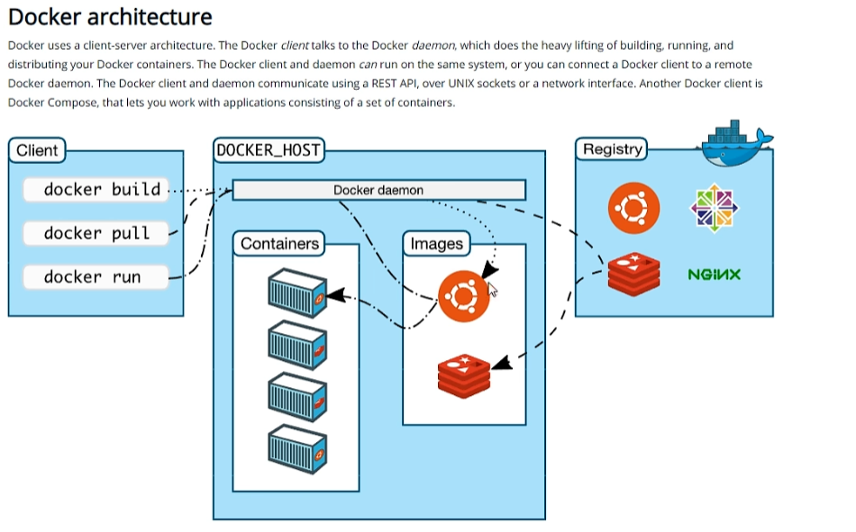

# Docker命令

## 帮助命令

```shell
docker version     #显示docker详细信息
docker info       #显示docker的系统信息，包括镜像和容器的数量
docker --help     #docker帮助命令手册
```

## 镜像命令

```shell
docker images  #查看所有本地主机的镜像
docker search 镜像名           #搜索镜像
docker pull 镜像名 [标签]      #下载镜像（如果不写tag，默认是latest）
docker rmi 镜像名 [标签]       #删除镜像    docker rmi -f $(docker images -aq)  删除全部镜像
docker tag  镜像名:版本   新镜像名:版本    #复制镜像并且修改名称
docker commit  -a "xxx"  -c "xxx" 镜像ID 名字：版本   #提交镜像 
-a :提交的镜像作者；
-c :使用Dockerfile指令来创建镜像；
-m :提交时的说明文字；
```

## 容器命令

```shell
docker run [可选参数] image 命令 #启动容器（无镜像会先下载镜像）
#参数说明
--name = "Name"   容器名字
-c   后面跟待完成的命令
-d   以后台方式运行并且返回ID，启动守护进程式容器
-i   使用交互方式运行容器，通常与t同时使用
-t   为容器重新分配一个伪输入终端。也即启动交互式容器
-p   指定容器端口    -p 容器端口:物理机端口  映射端口
-P   随机指定端口
-v   给容器挂载存储卷

docker build  #创建镜像        -f：指定dockerfile文件路径   -t：镜像名字以及标签
docker logs 容器实例的ID          #查看容器日志
docker rename 旧名字  新名字      # 给容器重新命名
docker top    容器实例的ID                  #查看容器内进程
docker ps -a                    #列出所有容器（不加-a就是在运行的）
docker rm      容器实例的ID                 #删除容器（正在运行容器不能删除，除非加-f选项）
docker kill  容器实例的ID        #杀掉容器
docker history   容器实例的ID    #查看docker镜像的变更历史
docker start 容器实例的ID        #启动容器
docker restart 容器实例的ID       #重启容器
docker stop 容器实例的ID         #停止正在运行的容器
docker attach /docker exec  容器实例的ID   #同为进入容器命令，不同的是attach连接终止会让容器退出后台运行，而exec不会。并且，docker attach是进入正在执行的终端，不会情动新的进程，而docker exec则会开启一个新的终端，可以在里面操作。
docker image inspect  容器名称：容器标签       #查看容器内源数据
docker cp  容器id：容器内路径   目的主机路径           #从容器内拷贝文件到主机（常用）或者从主机拷贝到容器（一般用挂载）
exit                           #直接退出容器 
crlt + P + Q                   #退出容器但是不终止运行
```


# Docker整体架构

整体架构如下：


分别包括：

-  Docker Client
- Docker daemon：
- Containers
- Images
- Runc
- Shim


# Docker引擎架构详解


# Docker镜像


# Docker容器


# Dockfile


# 数据持久化


# Docker网络


# 常用服务器安装


#  Docker Compose


# Docker管理平台


