# Spring

b站网课链接：https://www.bilibili.com/video/BV1Vf4y127N5?from=search&seid=4597070423034282547

- 课程介绍：
  1. Spring 概念
  2. IOC容器
  3. AOP
  4. JdbcTemplate
  5. 事务管理
  6. Spring5新特性

## Spring 概念

1. Spring是一个轻量级的开源的JavaEE框架
2. Spring可以解决企业运用开发的复杂性
3. 两个核心部分：IOC AOP
   1. IOC：控制反转，把创建对象的过程交给Spring
   2. AOP：面向切面，不修改源代码的情况下进行功能增强
4. Spring 框架的特点
   1. 方便解耦，简化开发
   2. AOP编程支持
   3. 方便程序测试
   4. 方便集成其他框架
   5. Java源码时经典学习规范
5. Spring 核心jar包如图， 外加一个 commons-logging-1.1.1.jar  包

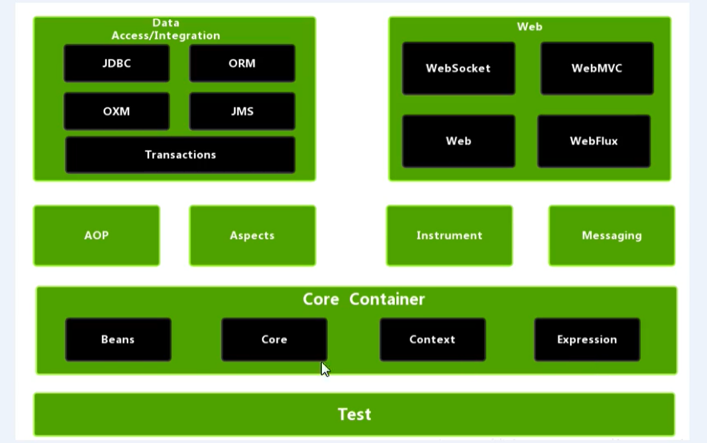

​    spring总共大约有20个模块，1300多个不同的文件组成。这些组件被分别整合在核心容器（Core Containers），Aop（Aspect Oriented Programming）和设备支持（Instruction）、数据访问（Data Access/Integeration）、Web、报文发送（Messaging）、测试六个模块中集成。

- 核心容器：Spring-beans 和 Spring-core模块是Spring的核心模块、包含控制反转（Inversion of Control，IoC）和依赖注入（Dependency Injection，DI）。核心模块提供Spring框架的基本功能。核心容器的主要组件是BeanFactory（工厂模式实现）。

  Spring 上下文 Spring-context：Spring上下文是一个配置文件，向Spring框架提供上下文信息。Spring上下文包括企业服务，例如JNDI、EJB、电子邮件、国际化、校验和调度功能

  Spring-Expression 模块是统一表达式（unified EL）的扩展模块，可以查询、管理运行中的对象，同时也方便的可以调用对象方法，操作数组，集合等。语法类似于传统的EL，也提供了额外的功能，最出色的要数函数调用和简单自妇产的函数模板。

- Spring-Aop：Spring的另一个核心模块，在Spring中以JVM的动态代理技术作为基础，然后设计出了一系列的Aop横切实现，比如前置通知，返回通知等等。

- Spring Data Access：由Spring-jdbc、Spring-tx、Spring-orm、Spring-jms和Spring-oxm 5个模块组成。
  Spring-jdbc 是 Spring 提供的 JDBC 抽象框架的主要实现模块
  Spring-tx 模块是 SpringJDBC 事务控制实现模块。
  Spring-orm 是ROM框架支持模块，主要基础 hibernate、jpa、Java Data Objects（JDO）用于资源管理、数据访问对象（DAO）的实现和事务策略
  Spring-jms （Java Message Service）发送和接受信息
  Spring-oxm 提一个抽象层以支持OXM（Object-to-XML-Mapping），将java对象与xml数据相互映射。

- Web 模块：Spring-web、Spring-webmvc、Spring-websocket 和 Spring-webmvc-portlet 4个模块组成，Web 上的上下文模块建立在应用程序上下文之上，为基于Web的应用程序提供了上下文。

- 报文发送：Spring-messaging 模块

## 第一个Spring


1. 导入相关包

   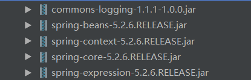

2. 建立一个Java工程

3. 添加包 as library

4. 写一个类 及其 一个方法

   ```java
   package com.uestc.spring5;
   public class User {
       public void add() {
           System.out.println("方法1");
       }
   }
   ```

   

5. 创建Spring配置文件，在配置文件中创建对象

   ```xml
   <?xml version="1.0" encoding="UTF-8"?>
   <beans xmlns="http://www.springframework.org/schema/beans"
          xmlns:xsi="http://www.w3.org/2001/XMLSchema-instance"
          xsi:schemaLocation="http://www.springframework.org/schema/beans http://www.springframework.org/schema/beans/spring-beans.xsd">
   
       <bean id="user" class="com.uestc.spring5.User"></bean>
   </beans>
   ```

   

6. 测试代码编写

   ```java
   package com.uestc.test;
   
   import com.uestc.spring5.User;
   import org.junit.jupiter.api.Test;
   import org.springframework.context.ApplicationContext;
   import org.springframework.context.support.ClassPathXmlApplicationContext;
   
   public class TestSpring5 {
   
       @Test
       public void testAdd() {
           // 加载spring配置文件
           ApplicationContext context = new ClassPathXmlApplicationContext("bean1.xml");
   
           // 获取配置创建的对象
           User user = context.getBean("user", User.class);
   
           System.out.println(user);
           user.add();
       }
   }
   ```

## IOC

### IOC底层原理

#### what is IOC

IoC/DI：控制反转、依赖注入

1. IOC：inversion of control，控制反转
2. 把对象的创建和对象之间的调用过程，都交给Spring管理
3. 目的：降低耦合度
4. 上面哪个案例就是一个IOC

#### 低层原理

1. <1> xml解析   <2> 工厂模式  <3> 反射    >>>>>> 把耦合度减低到最低

2. IOC过程

   1. xml配置文件，配置创建的对象

      ```xml
      <bean id="user" class="com.uestc.spring5.User"></bean>
      ```

   2. 由service类或者DAO类，创建工厂类

      ```java
      class UserFactory {
          public static UserDao getDao() {
              // 1.xml解析 
              String classValue = class属性;
              // 2.通过反射创建对象 { 1.先获得编码文件  2.创建对象 }
              Class clazz = Class.forName(classValue);
              return (UserDao)clazz.newInstance();
          }
      }
      ```

### IOC接口（BeanFactory）

1. IOC思想基于IOC容器完成，IOC容器底层就是对象工厂
2. Spring提供IOC容器实现的两种方式/两个接口：BeanFactory 和 ApplicationContext
3. 接口的实现类

#### BeanFactory

IOC 最基础的方式，Spring内部的使用接口，**一般不提供开发人员使用**

**缺点**：加载配置文件的时候不会创建对象，只有在获取/使用对象的时候才回去创建对象。

#### ApplicationContext

BeanFactory的子接口，功能更加强大。提供给开发人员使用

**特点：**加载配置文件的时候就会创建对象。

**接口实现类**：

1. ClassPathXmlApplicationContext(String filePath)
2. FileSystemXmlApplicationContext(String filePath)

### IOC操作Bean管理


**bean的实例化**：1.通过无参构造方法（默认）；2.通过静态工厂的实例化方法；3.通过实例化工厂的实例化方法


1. 什么是Bean管理 ?   即以下两个操作
   1. Spring 创建对象
   2. Spring 注入属性
2. Bean管理操作的两种实现方式
   1. 基于xml
   2. 基于注解

### 基于XML

1. 基于xml方式创建对象

   ```xml
   <bean id="user" class="com.uestc.spring5.User"></bean> 
   ```

   （1）在spring配置文件中，使用bean标签，标签里添加对于的属性，就可以实现创建对象

   （2）在bean标签有很多属性，常用的有：

   id：对象的唯一标识

   class：类全路径（包类路径）

   （3）**创建对象的时候，默认也是执行无参数的构造方法。**

2. 基于xml方式**注入**属性

   （1）DI：依赖注入，就是注入属性

   ​      <1> 第一种注入：利用setter方法注入  。 必须要有setter 方法。 必须不含有有参数的构造方法

   ```xml
   <bean id="user" class="com.uestc.spring5.User">
           <property name="username" value="Wade"></property>
           <property name="password" value="123"></property>
   </bean>
   ```

   ```java
   public class User {
       private String username;
       private String password;
       public String getUsername() {
           return username;
       }
       public void setUsername(String username) {
           this.username = username;
       }
       public void setPassword(String password) {
           this.password = password;
       }
       public void add() {
           System.out.println("方法1");
       }
   }
   ```

   ​      <2> 第二种：有参数构造函数(方法)注入

   ```java
   public class Admin {
       private String username;
       private String password;
   
       public Admin(String username, String password) {
           this.username = username;
           this.password = password;
       }
   }
   ```

   ```xml
   <bean id="admin" class="com.uestc.spring5.Admin">
           <constructor-arg name="username" value="admin"></constructor-arg>
           <constructor-arg name="password" value="456"></constructor-arg>
   </bean>
   ```

   <3> 第三种：利用名称空间注入。需要setter方法。  简化写法

   ```xml
   <beans xmlns="http://www.springframework.org/schema/beans"
          xmlns:xsi="http://www.w3.org/2001/XMLSchema-instance"
          xmlns:p="http://www.springframework.org/schema/p"
          xsi:schemaLocation="http://www.springframework.org/schema/beans http://www.springframework.org/schema/beans/spring-beans.xsd">
   
   <bean id="user" class="com.uestc.spring5.User" p:username="wade" p:password="123"></bean>
   ```

   （2）xml注入其他类型值

   ​     <1> 注入null

   ```xml
   <bean id="user" class="com.uestc.spring5.User">
       <property name="username" value="Wade">
           <null/>
       </property> 
   </bean>
   ```

   ​     <2>注入特殊符号。  1.利用转移字符  2.利用CDATA

   ```xml
   <property name="username">
       // 将 <<123456>> 设置为 username
      <value><![CDATA[<<123456>>]]><value/>   
   </property> 
   ```

3. 注入属性 ---  外部Bean（三层 web，service，dao。 通过service调用dao就是引入外部bean）

   a. 创建service 和 dao

   b. 在service里调用dao

   c. 在Spring配置文件中进行配置

   ```java
   public class UserDao {}
   ```

   ```java
   public class UserService {
       private UserDao userDao;
       public void setUserDao(UserDao userDao) {
           this.userDao = userDao;
       }
       public void add() { System.out.println("方法add");}
   }
   ```

   ```xml
   <bean id="userService" class="com.uestc.spring5.service.UserService">
           <!--name:getBean() 的函数参数-->
           <!--ref: bean-->
       <property name="userDao" ref="userDao"></property>
   </bean>
   <bean id="userDao" class="com.uestc.spring5.dao.UserDao"></bean>
   ```

4. 注入属性 --- 内部Bean 和 级联赋值

   <1> 一对多关系: 部门与员工   即对象的一个属性也是一个类/对象

   ```java
   public class Emp {
       private String name;
       private Dept dept;
   
       public void setName(String name) {
           this.name = name;
       }
   
       public void setDept(Dept dept) {
           this.dept = dept;
       }
   }
   ```

   ```java
   public class Dept {
       private String name;
   
       public void setName(String name) {
           this.name = name;
       }
   }
   ```

   ```xml
   <bean id="emp" class="com.uestc.spring5.bean.Emp">
           <property name="name" value="lucy"></property>
           <!--内部bean的写法-->
           <property name="dept">
               <bean id="dept" class="com.uestc.spring5.bean.Dept">
                   <property name="name" value="消费者BG"></property>
               </bean>
           </property>
       </bean>
   ```

   级联赋值 ===  注入外部bean，在外部bean注入   xml的写法

   ```xml
   <bean id="userService" class="com.uestc.spring5.service.UserService">
           <property name="userDao" ref="userDao"></property>
       </bean>
       <bean id="userDao" class="com.uestc.spring5.dao.UserDao">
           <property name="name" value="user"></property>
       </bean>
   ```

   级联赋值 === 注入外部bean，在内部注入。必须具备getter方法

   测试：在内部注入的优先级更高

   ```xml
   <bean id="userService" class="com.uestc.spring5.service.UserService">
           <!--name:getBean() 里面的参数-->
           <!--ref: bean-->
           <property name="userDao" ref="userDao"></property>
           <property name="userDao.name" value="sss"></property>
       </bean>
       <bean id="userDao" class="com.uestc.spring5.dao.UserDao">
           <property name="name" value="aaa"></property>
       </bean>
   ```

   

   **<u>通过xml方式注入集合类型的属性</u>**

   <2> 注入数组类型的属性

   <3> 注入List类型的属性

   <4> 注入Map类型的属性

   <4> 注入Set类型的属性

   ```java
   public class Stu {
       private String[] courses;
       private List<String> list;
       private Map<String, String> map;
       private Set<String> set;
   
       public void setCourses(String[] courses) {
           this.courses = courses;
       }
   
       public void setList(List<String> list) {
           this.list = list;
       }
   
       public void setMap(Map<String, String> map) {
           this.map = map;
       }
   
       public void setSet(Set<String> set) {
           this.set = set;
       }
   }
   ```

   ```xml
   	<bean id="stu" class="com.uestc.spring5.bean.Stu">
           <property name="courses">
               <array>
                   <value>矩阵原理</value>
                   <value>最优化理论</value>
               </array>
           </property>
           <property name="list">
               <list>
                   <value>随机过程</value>
                   <value>通信网络系统基础</value>
               </list>
           </property>
           <property name="map">
               <map>
                   <entry key="0504" value="韦德壕"></entry>
                   <entry key="0501" value="龙"></entry>
               </map>
           </property>
           <property name="set">
               <set>
                   <value>ssd</value>
                   <value>sdsd</value>
               </set>
           </property>
       </bean>
   ```

   **把集合注入部分提取出来**

   1. 在Spring配置文件中引入名称空间util

   2. 使用util标签完成list集合注入提取

      ```xml
      <?xml version="1.0" encoding="UTF-8"?>
      <beans xmlns="http://www.springframework.org/schema/beans"
             xmlns:xsi="http://www.w3.org/2001/XMLSchema-instance"
             xmlns:util="http://www.springframework.org/schema/util"
             xsi:schemaLocation="http://www.springframework.org/schema/beans http://www.springframework.org/schema/beans/spring-beans.xsd
                                  http://www.springframework.org/schema/util http://www.springframework.org/schema/util/spring-util.xsd">
          
          <!--1. 提取list集合属性注入-->
          <util:list id="bookList">
              <value>葵花宝典</value>
              <value>九阳神功</value>
              <value>乾坤大挪移</value>
          </util:list>
          <!--2. 提取list属性注入使用-->
          <bean id="book" class="com.uestc.spring5.bean.Book">
              <property name="list" ref="bookList"></property>
          </bean>
      </beans>
      ```

   ```java
   public class Book {
       private List<String> list;
       public void setList(List<String> list) {
           this.list = list;
       }
       public void showList() {
           System.out.println(this.list.toString());
       }
   }
   ```

   

#### IOC Bean管理（FactoryBean）

Spring有两种Bean, 普通Bean和工厂Bean。 

普通Bean:在配置文件中定义的类型和返回的类型一致

工厂Bean:在配置文件中定义的类型和返回的类型不一致

工厂Bean的步骤:

1. 创建类，让这个类作为工厂Bean,实现接口FactoryBean

2. 实现接口的方法，在实现的方法中定义返回的Bean类型

   ```java
   public class Dept {
       private String name;
   
       public void setName(String name) {
           this.name = name;
       }
   
       public String getName() {
           return name;
       }
   }
   ```

   ```xml
   <bean id="myBean" class="com.uestc.spring5.factorybean.MyBean"></bean>
   ```

   实现FactoryBean的方法

   ```java
   public class MyBean implements FactoryBean<Dept> {
       // 定义返回Bean
       @Override
       public Dept getObject() throws Exception {
           Dept dept = new Dept();
           dept.setName("sss");
           return dept;
       }
   
       @Override
       public Class<?> getObjectType() {
           return null;
       }
   
       @Override
       public boolean isSingleton() {
           return false;
       }
   }
   
   ```

   测试类

   ```java
   	@Test
       public void testMyBean() {
           ApplicationContext context =
                   new ClassPathXmlApplicationContext("bean4.xml");
           Dept myBean = context.getBean("myBean", Dept.class);
           System.out.println(myBean.getName());
       }
   ```

   

#### IOCBean管理（作用域）

1. Spring，默认情况下，创建Bean都是单实例
2. 如何设置多实例。 在spring里的bean标签的属性（scope）可以设置
   1. scope="singleton" 单实例；加载文件时，就会创建单实例对象（**Spring IoC默认**）
   2. scope="prototype" 多实例；不是在加载文件时候创建，而是在调用getBean方法时候才会创建多实例对象
   3. scope="request"  
   4. scope="session"

为什么使用单例： 一般来说无状态或状态不可变的对象适合使用单例模式（不存在会改变对象状态的成员变量），比如controller，dao，service层。 实际上对象的状态的变化往往是由于属性值的变化引起的，无状态对象没有实例变量的存在，保证了程序的线程安全性。


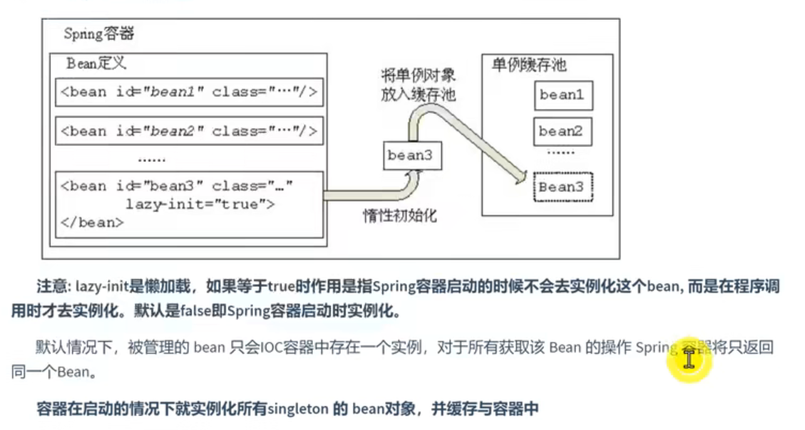

#### IOCBean管理 （生命周期）

生命周期：从创建到销毁的过程

**Bean的生命周期（5 steps）：**

1. 通过构造器创建Bean实例（无参数构造方法）

2. 为Bean的属性设置值和对其他bean引用（调用set方法）

3. 调用bean的初始化方法（需要进行配置初始化方法，**Spring Ioc默认启动时自动实例化bean对象**）

   3.1. 在配置文件中使用 **init-method** 属性来完成

   3.2. 实现 **InitializingBean** 接口

4. Bean可以使用了（对象获取到了 ，**通过getBean() 或者 自动注入 获取对象**）

5. 当容器关闭的时候，调用Bean的销毁方法（需要配置销毁的方法）

   ```java
   	// 测试代码
   	@Test
       public void testBeanLifePeriod() {
           ApplicationContext context =
                   new ClassPathXmlApplicationContext("bean4.xml");
           Order order = context.getBean("order", Order.class);
           System.out.println("第四步 对象获取到了");
           order.show();
           ((ClassPathXmlApplicationContext) context).close();
       }
   ```

   ```java
   public class Order {
       private String oname;
   
       public void setOname(String oname) {
           this.oname = oname;
           System.out.println("第二步 为Bean属性设置值和对其他Bean的引用");
       }
       public void show() {
           System.out.println();
       }
   
       public Order() {
           System.out.println("第一步 通过构造器创建Bean实例");
       }
   
       public void initMethod() {
           System.out.println("第三步 调用Bean的初始化方法");
       }
   
       public void destoryMethod() {
           System.out.println("第五步 调用Bean的销毁方法");
       }
   }
   
   ```

   ```xml
   	<bean id="order" class="com.uestc.spring5.bean.Order"
             init-method="initMethod" destroy-method="destoryMethod">
           <property name="oname" value="手机"/>
       </bean>
   ```

**Bean 后置处理器（7 steps）：**

1. 通过构造器创建Bean实例（无参数构造方法）

2. 为Bean的属性设置值和对其他bean引用（调用set方法）

3. 把Bean实例传递Bean后置处理器的方法

4. 调用bean的初始化方法（需要进行配置初始化方法）

5. 把Bean实例传递Bean后置处理器的方法

6. Bean可以使用了（对象获取到了）

7. 当容器关闭的时候，调用Bean的销毁方法（需要配置销毁的方法）

   演示：

   ```java
   // 在配置文件中配置BeanPostProcessor， 将会发现配置文件里的所有Bean都采用了后置处理器
   // <bean id="postOrder" class="com.uestc.spring5.bean.PostOrder"></bean>
   public class PostOrder implements BeanPostProcessor {
       @Override
       public Object postProcessBeforeInitialization(Object bean, String beanName) throws BeansException {
           System.out.println("初始化方法之前调用的方法");
           return bean;
       }
       @Override
       public Object postProcessAfterInitialization(Object bean, String beanName) throws BeansException {
           System.out.println("初始化方法之后调用的方法");
           return bean;
       }
   }
   ```


#### IOC Bean管理（xml自动装配）

1. 根据属性名称。注入bean 的 id 与 类属性名要匹配

   ```xml
   <bean id="emp" class="com.uestc.spring5.bean.Emp" autowire="byName"></bean>
   <bean id="dept" class="com.uestc.spring5.bean.Dept">
       <property name="name" value="消费者BG"/>
   </bean>
   ```

2. 根据属性类型。但是多个相同类型 就不可以

   autowire="byType"

#### IOC Bean管理（外部属性文件 xml yml）

把固定的值放在专门一个文件中。 尤其是数据库的相关信息

1. 直接


### Spring IoC 扫描器

解决繁琐的手动配置xml文件的问题，

作用：对bean对线进行统一的管理，简化开发配置。

使用指定的注解（声明在类级别） bean对象的id默认是 **类的首字母小写**

Dao：@Reposiroty

Service：@Service

Controller：@Controller

任意类：@Component

### 基于注解

1. 什么是注解

   （1）注解是代码的特殊标记，格式：**@注解名称（属性名称=属性值，属性名称=属性值，...）**

   （2）注解可以作用在方法，属性，类的上面

   （3）目的:简化 xml 配置

2. Spring 针对 Bean管理中创建对象提供的注解

   **（1）@Component**

   **（2）@Service**

   **（3）@Controller**

   **（4）@Repository**

   四个注解功能是一样的。

3. 基于注解方式实现对象的创建

   1. 引入依赖 aop 依赖

      20201005213809330.png)

   2. 开启组件扫描

      ```xml
      <?xml version="1.0" encoding="UTF-8"?>
      <beans xmlns="http://www.springframework.org/schema/beans"
             xmlns:xsi="http://www.w3.org/2001/XMLSchema-instance"
             xmlns:context="http://www.springframework.org/schema/context"
             xsi:schemaLocation="http://www.springframework.org/schema/beans http://www.springframework.org/schema/beans/spring-beans.xsd
                      http://www.springframework.org/schema/context http://www.springframework.org/schema/context/spring-context.xsd">
      
          <context:component-scan base-package="com.uestc.spring5"/>
      
      </beans>
      ```

   3. 使用注解创建对象

      ```java
      // 在注解里value的值可以不写，默认的就是首字母小写的类名称
      //@Component(value = "userService") // <bean id="userService" class=""/>
      @Service
      public class UserService {
      
          public void add() {
              System.out.println("Add .. ");
          }
      }
      ```

4. 扫描的配置

   扫描对应包中的Service类

   ```xml
   <context:component-scan base-package="com.uestc.spring5" use-default-filters="false">
       <context:include-filter type="annotation" expression="org.springframework.stereotype.Service"/>
   </context:component-scan>
   
   ```

   扫描除了Component的所有类

   ```xml
   <context:component-scan base-package="com.uestc.spring5">
   	<context:exclude-filter type="annotation" expression="org.springframework.stereotype.Component"/>
   </context:component-scan>
   ```

5. 基于注解方式进行属性的注入

   （1）**@Autowired : 根据属性类型自动装配** 

   

      1. 创教service 和 dao对象，在service 和dao创建对象注解

      2. 在service中注入dao对象，在service中添加dao类型属性，在属性上面使用注解

         ```java
         @Service
         public class UserService {
             // 不需要添加setter方法，只需要添加 注解Autowired,根据类型注入
             @Autowired
             private UserDao userDao;
         
             public void add() {
                 System.out.println("usrService Add .. ");
                 userDao.add();
             }
         }
         ```

         ```java
         @Repository
         public class UserDaoImpl implements UserDao {
             @Override
             public void add() {
                 System.out.println("user add ... ");
             }
         }
         ```

   （2）**@Qualifier ： 根据属性名称**

   **@Qualifier 的使用的时候要跟 @Autowired 一起使用**

   value属性与bean标签的id保持一致

   ```java
   @Repository(value = "userDaoImpl1")
   public class UserDaoImpl implements UserDao {
       @Override
       public void add() {
           System.out.println("user add ... ");
       }
   }
   ```

   ```java
   @Service
   public class UserService {
       // 不需要添加setter方法，只需要添加 注解Autowired,根据类型注入
       @Autowired
       @Qualifier(value = "userDaoImpl1")
       private UserDao userDao;
   
       public void add() {
           System.out.println("usrService Add .. ");
           userDao.add();
       }
   }
   ```

   （3）**@Resourse : 根据类型和名称都可以。**

   但是是javax包下的注解，不是Spring里面的。

   可以设置name属性，设置了后只会根据name属性值查找bean对象。当注入的是一个接口，如果接口存在多个实现类，则需要指定name属性才可以。name属性与bean标签的id属性保持一致

   （4）**@Value : 注入普通属性**

   ```java
   @Service
   public class UserService {
       // 不需要添加setter方法，只需要添加 注解Autowired,根据类型注入
   //    @Autowired
   //    @Qualifier(value = "userDaoImpl1")
   //    @Resource  // 根据类型注入
       @Resource(name = "userDaoImpl1")    // 根据名称注入
       private UserDao userDao;
   
       @Value(value = "123")  // 注入普通类型的值
       private String name;
   
       public void add() {
           System.out.println("usrService Add .. name = " + name);
           userDao.add();
       }
   }
   ```

6. **纯注解开发  >>>>>> SpringBoot**

   1. 创建配置类，替代xml配置文件

      ```java
      @Configuration
      @ComponentScan(basePackages = {"com.uestc"})
      public class SpringConfig {
      }
      ```

      

   2. 测试类修改

      ```java
      public class TestSpring {
          @Test
          public void testTotalConfig() {
              ApplicationContext context = new AnnotationConfigApplicationContext(SpringConfig.class);
              UserService userService = context.getBean("userService", UserService.class);
              System.out.println(userService);
              userService.add();
          }
      }
      ```


## AOP

AOP（Aspect Oriented Programming），面向切面，不修改源代码的情况下进行功能增强。 

### AOP底层原理

1. AOP底层使用动态代理

   （1）有两种情况

   第一种：有接口的情况，使用JDK代理。  创建接口实现类代理对象，增强类的方法

   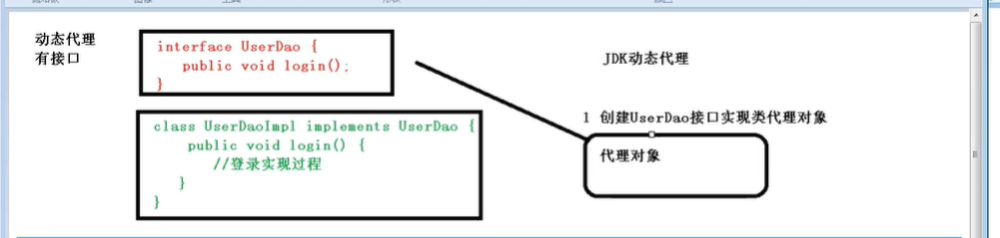

   第二种：没有接口的情况，使用CGLIB动态代理。   创建类的代理对象，增强类的方法。

   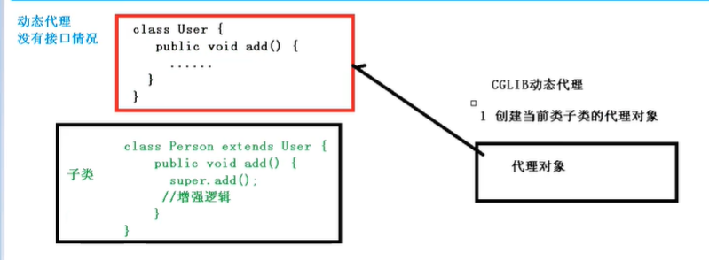


### AOP底层 JDK动态管理

1. 调用Proxy动态代理，使用Proxy类里面的方法创建对象

2. 调用newProxyInstance方法

   参数说明:

   

3. 代码实现：

   （1）创建接口，定义方法

   ```java
public interface UserDao {
       public int add(int a, int b);
       public String update(String id);
   }
   
   ```
   
   （2）创建接口实现类，实现方法
   
   ```java
   @Repository(value = "userDaoImpl1")
   public class UserDaoImpl implements UserDao {
   
       @Override
       public int add(int a, int b) {
           System.out.println("Add方法调用了");
           return a+b;
       }
   
       @Override
       public String update(String id) {
           System.out.println("update方法执行了");
           return id;
       }
   }
   
   ```
   
   （3）使用Proxy类创建代理对象
   
   ```java
   public class JDKProxy {
   
       public static void main(String[] args) {
   
           Class[] interfaces = {UserDao.class};
   
           UserDao o = (UserDao) Proxy.newProxyInstance(JDKProxy.class.getClassLoader(),
                   interfaces, new UserDaoProxy(new UserDaoImpl()));
           int result = o.add(1, 2);
           System.out.println(result);
       }
   }
   
   // 创建代理对象
   class UserDaoProxy implements InvocationHandler {
   
       // 需要创建需要代理的对象，实现其原本的功能，再实现新的功能
       private Object obj;
       public UserDaoProxy(Object obj) {
           this.obj = obj;
       }
   
       // 实现怎强逻辑
       @Override
       public Object invoke(Object proxy, Method method, Object[] args) throws Throwable {
           // 原本方法之前执行
           System.out.println("方法执行前.... " + method.getName() + ",传递的参数：" + Arrays.toString(args));
   
           // 被增强的方法执行
           Object res = method.invoke(obj,args);
   
           // 原本方法之后执行
           System.out.println("方法执行之后...." + obj);
           return res;
       }
   }
   
   ```
   
   

### AOP（术语）

1. 连接点

   在一个类中，哪些方法可以被增强，这些方法就成为连接点

2. 切入点

   实际被真正增强的方法就是切入点

3. 通知（增强）

   （1）实际增强的逻辑部分，就是通知（增强）

   （2）通知有5中类型

   - 前置通知
   - 后置通知
   - 环绕通知：方法之前后之后都执行
   - 异常通知
   - 最终通知

4. 切面

   把通知运用到切入点的过程

### AOP操作

Spring一般基于AspectJ实现AOP操作。AspectJ是独立于AOP的框架，不是Spring的组成部分。一般将AspectJ和Spring一起使用。

1. 基于AspectJ实现AOP： 基于XML配置文件 和  基于注解

2. 引入依赖

   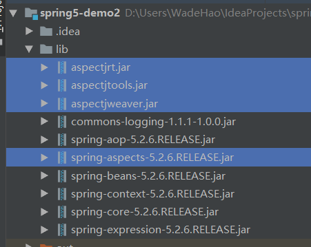

3. 切入点表达式

   [(13条消息) aop切入点表达式_archie2010的专栏-CSDN博客_aop切入点表达式](https://blog.csdn.net/archie2010/article/details/6254343)

   [(13条消息) 切入点表达式写法_Luis-CSDN博客_切入点表达式](https://blog.csdn.net/qq_39720594/article/details/105321664)

   （1）作用：知道对哪个类里面的哪个方法进行增强
   
   （2）语法结构：
   
   ```java
   execution([权限修饰符][返回类型][类全路径][方法名称][参数列表])
   
   例子：
   1. 对类 com.uestc.dao.UserDao的add方法进行增强
   execution(* com.uestc.dao.UserDao.add(..))
   
   2. 对类 com.uestc.dao.UserDao的所有方法进行增强
   execution(* com.uestc.dao.UserDao.*(..))
   
   3. 对类 com.uestc.dao的所有类的所有方法进行增强
   execution(* com.uestc.dao.*.*(..))
   ```

#### 基于注解

1. 创建类，在类里面定义方法

2. 创建一个增强类（编写增强的逻辑）

3. 进行通知的配置

   1. 在spring配置文件中，开启注解扫描

      ```xml
      <?xml version="1.0" encoding="UTF-8"?>
      <beans xmlns="http://www.springframework.org/schema/beans"
             xmlns:xsi="http://www.w3.org/2001/XMLSchema-instance"
             xmlns:context="http://www.springframework.org/schema/context"
             xmlns:aop="http://www.springframework.org/schema/aop"
             xsi:schemaLocation="http://www.springframework.org/schema/beans http://www.springframework.org/schema/beans/spring-beans.xsd
                      http://www.springframework.org/schema/context http://www.springframework.org/schema/context/spring-context.xsd
                      http://www.springframework.org/schema/aop http://www.springframework.org/schema/aop/spring-aop.xsd">
      
          <context:component-scan base-package="com.uestc.spring5.aopnno"/>
      
      </beans>
      ```

   2. 使用注解创建User和UserProxy对象

   3. 在增强类上面添加注解@Aspect

      ```java
      // 被增强类
      @Component
      public class User {
          public void add() {
              System.out.println("add ... ");
          }
      }
      ```

      ```java
      // 增强的类
      @Component
      @Aspect
      public class UserProxy {
          public void before() {
              System.out.println(" before ...");
          }
      }
      ```

      

   4. 在spring配置文件中开启生成代理对象

      ```xml
      <aop:aspectj-autoproxy/>
      ```

4. 配置不同类型的通知

   （1）在增强类的里面，在作为通知方法上面添加通知类型的注解，使用通知表达式

   ```java
   // @Before 为前置通知
       @Before(value = "execution(* com.uestc.spring5.aopnno.Usera.add(..))")
       public void before() {
           System.out.println(" before ...");
       }
   ```

   ```java
   // 增强的类
   @Component
   @Aspect
   public class UserProxy {
   
       // @Before 为前置通知
       @Before(value = "execution(* com.uestc.spring5.aopnno.User.add(..))")
       public void before() {
           System.out.println(" before ...");
       }
   
       // 最终通知（返回通知），不管有没有异常都执行，
       @After(value = "execution(* com.uestc.spring5.aopnno.User.add(..))")
       public void after() {
           System.out.println(" after ...");
       }
   
       // 后置通知，有异常就不会执行，返回结果后执行
       @AfterReturning(value = "execution(* com.uestc.spring5.aopnno.User.add(..))")
       public void afterReturning() {
           System.out.println(" AfterReturning ...");
       }
   
       // 异常通知
       @AfterThrowing(value = "execution(* com.uestc.spring5.aopnno.User.add(..))")
       public void afterThrowing() {
           System.out.println(" AfterThrowing ...");
       }
   
       // 环绕通知
       @Around(value = "execution(* com.uestc.spring5.aopnno.User.add(..))")
       public void around(ProceedingJoinPoint proceedingJoinPoint) throws Throwable {
           System.out.println("环绕之前");
           /* 环绕通知 = 前向通知 + 目标方法执行 + 环绕通知 ； ProceedingJoinPoint.proceed() 方法用于启动目标方法执行 */
           proceedingJoinPoint.proceed();
           System.out.println("环绕之后");
       }
   }
   ```

5. 对公共切入点抽取

   **@Pointcut（value=“”）**

   ```java
   // 增强的类
   @Component
   @Aspect
   public class UserProxy {
   
       @Pointcut(value = "execution(* com.uestc.spring5.aopnno.User.add(..))")
       public void pointcut() {}
   
       // @Before 为前置通知
       @Before(value = "pointcut()")
       public void before() {
           System.out.println(" before ...");
       }
   
       // 最终通知（返回通知），不管有没有异常都执行，
       @After(value = "pointcut()")
       public void after() {
           System.out.println(" after ...");
       }
   
       // 后置通知，有异常就不会执行，返回结果后执行
       @AfterReturning(value = "pointcut()")
       public void afterReturning() {
           System.out.println(" AfterReturning ...");
       }
   
       // 异常通知
       @AfterThrowing(value = "pointcut()")
       public void afterThrowing() {
           System.out.println(" AfterThrowing ...");
       }
   
       // 环绕通知
       @Around(value = "pointcut())")
       public void around(ProceedingJoinPoint proceedingJoinPoint) throws Throwable {
           System.out.println("环绕之前");
           proceedingJoinPoint.proceed();
           System.out.println("环绕之后");
       }
   }
   
   ```

6. 多个增强类对同一个方法增强，可以设置增强类的优先级

   在增强类上添加注解**@Order(数字类型的值)**，值越小优先级越高

   ```java
   @Component
   @Aspect
   @Order(0)
   public class PersonProxy {
   
       @Before(value = "execution(* com.uestc.spring5.aopnno.User.add(..))")
       public void before() {
           System.out.println("Person before ..");
       }
   
   }
   ```

   ```java
   @Component
   @Aspect
   @Order(1)
   public class UserProxy {
   
   }
   ```

7. 完全注解开发

   ```java
   @Configuration
   @ComponentScan(basePackages = {"com.uestc.spring5.aopnno"})
   @EnableAspectJAutoProxy(proxyTargetClass = true)
   public class AOPConfig {
   }
   ```

#### 基于配置文件


## Spring Task 定时任务

###  概述

常用的是三种：1.JDK自带的Timer；2.第三方组件Quartz；3.Spring Task

### 实现

#### xml 配置

```java
@Component
public class Task {

    public void task1() {
        System.out.println("定时任务1：" + new SimpleDateFormat("yyyy-MM-dd hh:mm:ss").format(new Date()));
    }

    public void task2 () {
        System.out.println("定时任务2：" + new SimpleDateFormat("yyyy-MM-dd hh:mm:ss").format(new Date()));
    }

}
```

```xml
<context:component-scan base-package="com.uestc"/>

<task:scheduled-tasks>
    <task:scheduled ref="task" method="task1" cron="0/2 * * * * ?"/>
    <task:scheduled ref="task" method="task2" cron="0/5 * * * * ?"/>
</task:scheduled-tasks>
```

#### 注解配置

```java
@Component
public class Task1 {

    @Scheduled(cron = "0/2 * * * * ?")
    public void task1() {
        System.out.println("定时任务1：" + new SimpleDateFormat("yyyy-MM-dd hh:mm:ss").format(new Date()));
    }

    @Scheduled(cron = "0/5 * * * * ?")
    public void task2 () {
        System.out.println("定时任务2：" + new SimpleDateFormat("yyyy-MM-dd hh:mm:ss").format(new Date()));
    }
}
```

```xml
<!--配置定时任务驱动，开启这个配置，Spring 才能识别 @Scheduled 注解-->
<task:annotation-driven/>
```

或者在 配置类中 开启定时任务

```java
@EnableScheduling
```


### cron 表达式

[定时任务的cron表达式 - 知乎 (zhihu.com)](https://zhuanlan.zhihu.com/p/163050320)

## JdbcTemplate

1. 什么是JdbcTemplate

   （1）Spring框架对JDBC进行封装，使用JdbcTemplate可以方便的实现对数据库的操作

2. 准备工作

   （1）引入jar包

   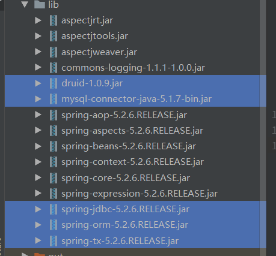

   （2）准备连接池

   ```xml
   <!--数据库连接池-->
       <bean id="dataSource" class="com.alibaba.druid.pool.DruidDataSource" destroy-method="close">
           <property name="url" value="jdbc:mysql:///user_db"/>
           <property name="username" value="root"/>
           <property name="password" value="root"/>
           <property name="driverClassName" value="com.mysql.jdbc.Driver"/>
       </bean>	
   ```

   （3）配置JdbcTemplate对象，注入DataSource

   ```xml
   	<!--jdbc对象的创建-->
       <bean id="jdbcTemplate" class="org.springframework.jdbc.core.JdbcTemplate">
           <!--注入dataSource-->
           <property name="dataSource" ref="dataSource"/>
       </bean>
   ```

   （4）创建service类和dao类，在dao中注入JdbcTemplate对象

   ```java
   public interface BookDao {
   
   }
   ```

   ```java
   @Repository
   public class BookDaoImpl implements BookDao {
   
       // 注入JdbcTemplate
       @Autowired
       private JdbcTemplate jdbcTemplate;
   }
   
   ```

   ```java
   @Service
   public class BookService {
   
       @Autowired
       private BookDao bookDao;
   }
   ```

### JdbcTemplate 增删改查

1. 增删改核心函数

   ```java
   jdbcTemplate.update(String sql, Object... args)；
   // sql 为sql语句
       args 为sql语句值，需要一一对应
   ```

   

```java
public interface BookDao {
    void add(Book book);
    void delete(String id);
    void update(Book book);
}
```

```java
@Repository
public class BookDaoImpl implements BookDao {

    // 注入JdbcTemplate
    @Autowired
    private JdbcTemplate jdbcTemplate;

    @Override
    public void add(Book book) {
        // 准备sql语句
        String sql = "insert into t_book values(?,?,?)";
        // 调用方法实现
        int count = jdbcTemplate.update(sql, book.getUserId(), book.getUserName(), book.getUstatus());
        System.out.println(count);

    }

    @Override
    public void delete(String id) {
        String sql = "delete from t_book where user_id=?";
        int count = jdbcTemplate.update(sql, id);
        System.out.println(count);
    }

    @Override
    public void update(Book book) {
        String sql = "update t_book set user_name=?,user_statues=? where user_id=?";
        Object[] args = { book.getUserName(), book.getUstatus(),book.getUserId()};
        int count = jdbcTemplate.update(sql, args);
        System.out.println(count);
    }
}
```

```java
@Service
public class BookService {
    @Autowired
    private BookDao bookDao;
    // 增
    public void addBook(Book book) {  bookDao.add(book); }
    // 删
    public void deleteBook(String id) {  bookDao.delete(id); }
    // 改
    public void updateBook(Book book) { bookDao.update(book); }
}
```

2. 查

   1. 简单查询

   2. 查询返回一个对象

      核心函数

      

      **sql：sql语句**

      **rowMapper：一个接口，针对返回不同的数据类型，使用这个接口里面的实现类完成数据封装。**

      **args：sql语句值**

      ```java
      	@Override
          public Book fondBookInfo(String id) {
              String sql = "select * from t_book where user_id=?";
              Book book = jdbcTemplate.queryForObject(sql, new BeanPropertyRowMapper<Book>(Book.class), id);
              return book;
          }
      ```

      

   3. 查询返回一个集合

      核心函数

      

      ```java
      	@Override
          public List<Book> findBookList() {
              String sql = "select * from t_book";
              jdbcTemplate.q
              List<Book> bookList = jdbcTemplate.query(sql, new BeanPropertyRowMapper<Book>(Book.class));
              return bookList;
          }
      ```

3. 批量操作

   1. 批量添加

      

      ```java
      	@Override
          public void batchAddBook(List<Object[]> batchArgs) {
              String sql = "insert into t_book values(?,?,?)";
              int[] batchUpdate = jdbcTemplate.batchUpdate(sql, batchArgs);
              System.out.println(Arrays.toString(batchUpdate));
          }
      ```

      ```java
      		// 批量操作
              ArrayList<Object[]> bookArrayList = new ArrayList<>();
              Object[] o1 = {"qwer", "java", "1"};
              Object[] o2 = {"asdf", "C", "2"};
              Object[] o3 = {"zxcv", "python", "3"};
              Object[] o4 = {"1234", "c++", "4"};
              bookArrayList.add(o1);
              bookArrayList.add(o2);
              bookArrayList.add(o3);
              bookArrayList.add(o4);
              bookService.batchAdd(bookArrayList);
      ```

      

   2. 批量删除

      

      ```java
      	@Override
          public void batchDeleteBook(List<Object[]> batchArgs) {
              String sql = "delete from t_book where user_id=?";
              int[] ints = jdbcTemplate.batchUpdate(sql, batchArgs);
              System.out.println(Arrays.toString(ints));
          }
      ```

      

   3. 批量修改

      

      ```java
      	@Override
          public void batchUpdateBook(List<Object[]> batchArgs) {
              String sql = "update t_book set user_name=?,user_statues=? where user_id=?";
              int[] ints = jdbcTemplate.batchUpdate(sql, batchArgs);
              System.out.println(Arrays.toString(ints));
          }
      ```


## Spring事务

1. 什么是事务

（1）事务是数据库操作的最基本单元，逻辑上的一组操作，要么都成功，如果一个失败所有操作都失败。

（2）典型场景：银行转账（A少100，B多100；两个必须都顺利成功）

2. 事务的特性（ACID特性）

（1）原子性：一个失败都失败

（2）一致性：操作前后总量不变，总量守恒

（3）隔离性：多事务之间不会产生影响

（4）持久性：事务提交后表中的数据发生了变化

### 搭建事务操做的基本环境

银行转账业务环境：

1. web层：
2. service层：业务操作（创建转账的方法：调用dao两个方法）
3. dao层：数据库操作（创建多钱和少钱的方法）

具体：

（1）创建数据库/表

（2）创建service/dao，完成对象创建和注入**（在service里注入dao，在dao中注入JdbcTemplate，在JdbcTemplate中注入dataSource）**

（3）在dao中创建两个方法（多钱，少钱），在service中创建转账的方法

```java
@Repository
public class AccountDaoImpl implements AccountDao {
    @Autowired
    private JdbcTemplate jdbcTemplate;
    @Override
    public void addMoney() {
        String sql = "update t_account set user_money=user_money-? where user_name=?";
        int update = jdbcTemplate.update(sql, 100, "lucy");
        System.out.println(update);
    }
    @Override
    public void reduceMoney() {
        String sql = "update t_account set user_money=user_money+? where user_name=?";
        int update = jdbcTemplate.update(sql, 100, "mary");
        System.out.println(update);
    }
}
```

```java
@Service
public class AccountService {
    @Autowired
    private AccountDao accountDao;
    public void exchangeMoney() {
        // lucy -100
        accountDao.reduceMoney();
        // marry +100
        accountDao.addMoney();
    }
}
```

### 事务操作的过程

1. 开启事务操作
2. 进行业务操作
3. 捕捉异常（try...catch）
4. 没有异常，事务提交。否则下一步
5. 出现异常，事务回滚（rollback）

### Spring中的事务管理

1. 事务一般添加到service层上。

2. spring进行事务管理

   （1）编程式事务管理

   （2）**声明式事务管理**（配置方式）

3. 声明式

   （1）**基于注解**

   （2）基于xml配置文件

4. spring事务管理的底层原理是AOP

5. spring事务管理API

   （1）事务管理器，针对不同的框架提供了不同的实现类

   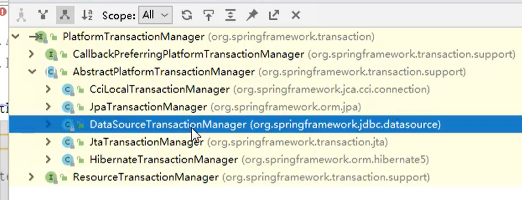

   （2）

#### 事务操作（基于注解）

1. 创建事务管理器

2. 在spring配置文件中，开启事务注解

   （1）引入名称空间 tx

   （2）开启事务注解

   ```xml
   <?xml version="1.0" encoding="UTF-8"?>
   <beans xmlns="http://www.springframework.org/schema/beans"
          xmlns:xsi="http://www.w3.org/2001/XMLSchema-instance"
          xmlns:context="http://www.springframework.org/schema/context"
          xmlns:tx="http://www.springframework.org/schema/tx"
          xsi:schemaLocation="http://www.springframework.org/schema/beans http://www.springframework.org/schema/beans/spring-beans.xsd
                   http://www.springframework.org/schema/context http://www.springframework.org/schema/aop/spring-aop.xsd
                   http://www.springframework.org/schema/tx http://www.springframework.org/schema/tx/spring-tx.xsd">
   
       <!--数据库连接池-->
       <bean id="dataSource" class="com.alibaba.druid.pool.DruidDataSource" destroy-method="close">
           <property name="url" value="jdbc:mysql:///learn?useSSL=false&amp;serverTimezone=UTC"/>
           <property name="username" value="root"/>
           <property name="password" value="123456"/>
           <property name="driverClassName" value="com.mysql.cj.jdbc.Driver"/>
       </bean>
   
       <!--jdbc对象的创建-->
       <bean id="jdbcTemplate" class="org.springframework.jdbc.core.JdbcTemplate">
           <!--注入dataSource-->
           <property name="dataSource" ref="dataSource"/>
       </bean>
   
       <context:component-scan base-package="com.uestc.spring5"/>
   
       <!--创建事务管理器-->
       <bean id="transactionManager" class="org.springframework.jdbc.datasource.DataSourceTransactionManager">
           <!--注入数据源-->
           <property name="dataSource" ref="dataSource"/>
       </bean>
   
       <tx:annotation-driven transaction-manager="transactionManager"></tx:annotation-driven>
   
   </beans>
   ```

3. 在service类上面（或者service类方法上面）开启事务注解 **@transactional**

   （1）**类上面**：类里面的所有方法都添加事务

   （2）方法上面：只是这个方法添加了事务

   ```java
   @Service
   @Transactional
   public class AccountService {
       @Autowired
       private AccountDao accountDao;
       public void exchangeMoney() {
           // lucy -100
           accountDao.reduceMoney();
           int a = 100/0;
           // marry +100
           accountDao.addMoney();
       }
   }
   ```

#### 声明式事务管理参数配置

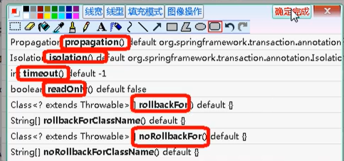

1. propagation：事务传播行为:

   （1）多事务方法直接调用，这个过程中事务时如何进行管理的。

   （2）事务方法：对数据库表数据进行变化的操作。  多事务方法可以理解为很多个类方法互相调用。

   **（3）传播行为：**

   1. **`PROPAGATION_REQUIRED`**：如果有事务正在运行，当前方法就在这个事务内运行，否则就启动一个新的事务，并在自己的事务内运行。

   2. **`PROPAGATION_REQUIRES_NEW`**：当前方法必须启动新事务，并在自己的事务中运行。如果有事务正在运行，应该将它挂起。

   3. **`PROPAGATION_NESTED`**：如果当前存在事务，就在嵌套事务内执行；如果当前没有事务，就执行与`TransactionDefinition.PROPAGATION_REQUIRED`类似的操作

   4. **`PROPAGATION_MANDATORY`**：如果当前存在事务，则加入该事务；如果当前没有事务，则抛出异常。（mandatory：强制性）

      以下三种传播行为不会发生事务的回滚：

   5. **`PROPAGATION_SUPPORTS`**：以非事务方式运行，如果当前存在事务，则把当前事务挂起。

   6. **`PROPAGATION_NOT_SUPPORTED`**：以非事务方式运行，如果当前存在事务，则把当前事务挂起。

   7. **`PROPAGATION_NEVER`**：以非事务方式运行，如果当前存在事务，则抛出异常

2. isolation：事务隔离级：

   （1）事务里边的特性——隔离性，避免多事务之间不会产生影响。不考虑隔离性会产生很多问题。

   （2）三个问题：脏读，不可重复读，虚（幻）读

   （3）脏读：一个未提交的事务读取到另一个未提交事务的数据

   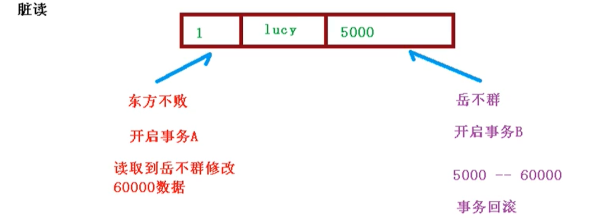

   （4）不可重复读：一个未提交的事务读取到另一提交事务修改的数据

   （5）虚读：一个未提交的事务读取到另一提交事务修改的数据。强调在⼀个事务的两次查询中数据笔数（数据的条数）不⼀致。

   （6）通过设置事务的隔离性可以解决这三个问题。mqsql默认使用的时repeatable read

   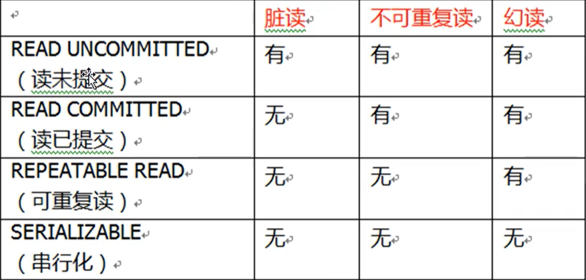

3. timeout：超时时间。 

   （1）事务需要在一定的时间内提交，如果不提交就会回滚。 

   （2）默认值为-1

4. readOnly：是否只读

   （1）默认值为false：可以查询，也可以增删改

   （2）true：只能查询

5. rollbackFor：回滚

   （1）设置哪些异常进行事务回滚

6. noRollbackFor:不回滚

   （1）设置哪些异常不进行事务回滚

#### 事务操作（基于XML）

1. 配置事务管理器
2. 配置通知
3. 配置切入点和切面

```xml
	<!--1. 创建事务管理器-->
    <bean id="transactionManager" class="org.springframework.jdbc.datasource.DataSourceTransactionManager">
        <!--注入数据源-->
        <property name="dataSource" ref="dataSource"/>
    </bean>

    <!--2. 配置通知-->
    <tx:advice id="txadvice">
        <tx:attributes>
            <!--指定哪种规则的方法上面添加事务-->
            <tx:method name="exchangeMoney" propagation="REQUIRED"/>
            <!--<tx:method name="account*"/>-->
        </tx:attributes>
    </tx:advice>

    <!--3. 配置切入点和切面-->
    <aop:config>
        <!--切入点-->
        <aop:pointcut id="pt" expression="execution(* com.uestc.spring5.service.AccountService.*(..))"/>
        <!--切面-->
        <aop:advisor advice-ref="txadvice" pointcut-ref="pt"/>
    </aop:config>
```

#### 完全注解开发

1. 创建配置类，替代XML配置文件

   ```java
   @Configuration // 配置类
   @ComponentScan(basePackages = {"com.uestc.spring5"}) // 组件扫描
   @EnableTransactionManagement  //开启事务
   public class TxConfig {
   
       // 创建数据库的连接池
       @Bean
       public DruidDataSource getDruidDataSource() {
           DruidDataSource dataSource = new DruidDataSource();
           dataSource.setDriverClassName("com.mysql.cj.jdbc.Driver");
           dataSource.setUrl("jdbc:mysql:///learn?useSSL=false&serverTimezone=UTC");
           dataSource.setUsername("root");
           dataSource.setPassword("123456");
           return dataSource;
       }
   
       // 创建JdbcTemplate对象
       @Bean
       public JdbcTemplate getJdbcTemplate(DataSource dataSource) {
           JdbcTemplate jdbcTemplate = new JdbcTemplate();
           jdbcTemplate.setDataSource(dataSource);
           return jdbcTemplate;
       }
   
       // 创建事务管理器
       @Bean
       public DataSourceTransactionManager getDataSourceTransactionManager(DataSource dataSource) {
           DataSourceTransactionManager dataSourceTransactionManager = new DataSourceTransactionManager();
           dataSourceTransactionManager.setDataSource(dataSource);
           return dataSourceTransactionManager;
       }
   }
   
   ```

## Spring新功能

1. 整个Spring5框架代码基于java8，运行的时候兼容jdk9。许多不建议使用的类和方法都删除了。

2. 自带了通用的日志封装

   1. spring5已经移除了Log4jConfigListener，官方建议使用Log4j2

   2. spring5框架整合了Log4j

      第一步：引你入jar包

      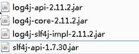

      第二步：创建log4j2.xml配置文件（名字固定的）

      https://www.bilibili.com/video/BV1Vf4y127N5?p=50

3. 核心容器支持@Nullable注解

   1. @Nullable 可以使用在方法，属性，参数上面，表示方法返回，属性值，参数值可以为空
   2. 示例

4. 函数式风格

   ```java
   @Test
       public void test1() {
           GenericApplicationContext context = new GenericApplicationContext();
           // 使用context方法进行进行对象注册
           context.refresh();
           context.registerBean("user", User.class, () -> new User());
           User user = (User)context.getBean("user");
           System.out.println(user.toString());
       }
   ```

   

5. 整合JUnit5到框架

   1. 整合JUnit4

      第一步：引入jar包

      

      第二步：创建测试类，使用注解方式完成

      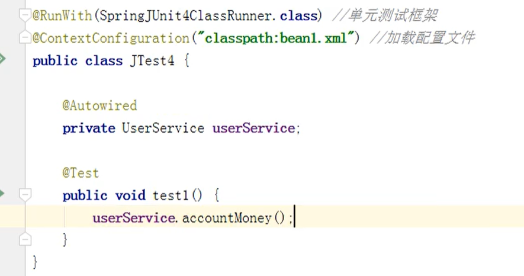

   2. 整合JUnit5

      第一步：引入jar包

      第二步：创建测试类，使用注解方式完成

      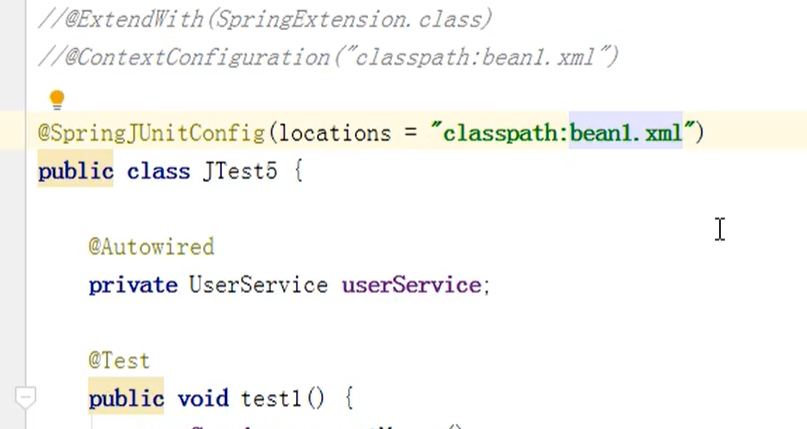

      tips:可以使用一个复合注解代替两个注解（如上图）

6. WebFlux

###  WebFlux

1. what is webflux

   （1）spring5添加的一个新的框架，用于web框架，功能和SpringMVC类似，WebFlux使用当前比较流行的一种响应式框架

   （2）WebFlux是一种异步非阻塞的框架，异步非阻塞的框架在Servlet3.1后才支持，核心是基于Reactor的相关API实现的。SpringMVC是基于Servlet容器

   （3）异步非阻塞：

   1. 异步和同步：针对调用者来说，调用者发送请求，如果等到对方回应之后才去做其他事情就是同步，如果发送请求之后不用等到对方回应就是异步。
   2. 阻塞和非阻塞：针对被调用者，被调用者接受请求，做完请求的任务后才给出反馈就是阻塞，收到请求之后马上给出反馈就是非阻塞。

   （4）优势或特点：

   1. 非阻塞：在有限的资源下，提高系统的吞吐量和伸缩性。基于Reactor
   2. 函数式编程：Spring5基于java8，使用java8的函数式编程方式实现路由请求
   3. SpringMVC与SpringWebFlux都可以用注解
   4. SpringMVC采用命令式编程，SringWebFlux采用响应式编程

2. 响应式编程

   （1）what 

   是一种面向数据流和变化传播的编程范式。（excel表格的函数就是响应式编程的例子）

   （2）java8及之前

   * 提供的观察者模式（设计模式的一种）两个类Observer/Observable

     ```java
     public class ObserverDemo extends Observable {
     
         public static void main(String[] args) {
     
             ObserverDemo observerDemo = new ObserverDemo();
             // 添加一个观察者
             observerDemo.addObserver(((o, arg) -> {
                 System.out.println("发生变化");
             }));
             observerDemo.addObserver(((o, arg) -> {
                 System.out.println("手动被观察者通知，准备改变");
             }));
     
             observerDemo.setChanged();  // 设置变化
             observerDemo.notifyObservers();   // 通知
         }
     }
     ```

     

   （3）响应式编程（Reactor实现）

   1. 响应式编程操作中，Reactor式满足Reactive规范框架
   2. Reactor有两个核心类，Mono和Flux。这两个类实现接口Publisher，提供丰富操作符。Flux有两个核心类，返回N个元素；Mono实现翻发布者，返回0或者1个元素。
   3. Flux和Mono都是数据流的发布者，他们都可以发出三种信号（**[元素值，错误信号，完成信号]**,错误信号与完成信号都代表终止信号，终止信号用于告诉订阅者数据流结束了，错误信号终止数据流的同时把错误信息发送给订阅者）
   4. 代码演示Flux和Mono

3. WebFlux执行流程和核心API

4. SpringWebFlux（基于注解编程模型）

5. SpringWebFlux（基于函数式编程模型）


