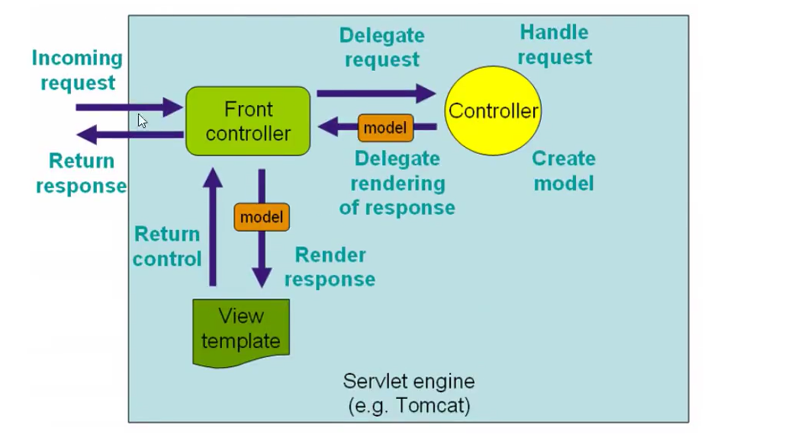

# SpringMVC

# Servlet 的开发

1. 创建一个maven模块，在上面添加WEB框架支持

2. 配置tomcat，部署

3. 在src/main/java/com/uestc/servlet 下建一个类 HelloServlet

   ```java
   public class HelloServlet extends HttpServlet {
       @Override
       protected void doGet(HttpServletRequest req, HttpServletResponse resp) throws ServletException, IOException {
           // 1. 调用前端参数
           String param = req.getParameter("method");
           if (param.equals("add")) {
               req.getSession().setAttribute("msg", "执行了add方法");
           }
           if (param.equals("delete")) {
               req.getSession().setAttribute("msg", "执行了delete方法");
           }
           // 2. 调用业务层代码
           // 3. 视图转发  或者 重定向
           req.getRequestDispatcher("WEB-INF/jsp/hello.jsp").forward(req, resp); //转发
   //        resp.sendRedirect("WEB-INF/jsp/hello.jsp"); // 重定向
   
       }
       @Override
       protected void doPost(HttpServletRequest req, HttpServletResponse resp) throws ServletException, IOException {
           doGet(req, resp);
       }
   }
   ```

4. web.xml 中

   ```xml
   	<servlet>
           <servlet-name>myservlet</servlet-name>
           <servlet-class>com.uestc.servlet.HelloServlet</servlet-class>
           <load-on-startup>1</load-on-startup>
       </servlet>
       <servlet-mapping>
           <servlet-name>myservlet</servlet-name>
           <url-pattern>/hello</url-pattern>
       </servlet-mapping>
   ```

5. 在 WEB-INF/jsp/ 下建立2个jsp文件

   ```jsp
   <%@ page contentType="text/html;charset=UTF-8" language="java" %>
   <html>
   <head>
       <title>form.jsp</title>
   </head>
   <body>
       <form method="post" action="hello.jsp">
           <input type="text" name="method">
           <input type="submit">
       </form>
   </body>
   </html>
   ```

   ```jsp
   <%@ page contentType="text/html;charset=UTF-8" language="java" %>
   <html>
   <head>
       <title>hello.jsp</title>
   </head>
   <body>
   ${msg}
   </body>
   </html>
   ```

   

#  springmvc 执行原理




## springmvc 的核心 DispatcherServlet 类


## 执行过程

## 第一个SpringMVC程序

1. 创建一个maven模块，在上面添加WEB框架支持

2. 配置tomcat，部署

3. 在src/main/java/com/uestc/controller 下建一个类 HelloController

   ```java
   public class HelloController implements Controller {
   
       public ModelAndView handleRequest(HttpServletRequest httpServletRequest, HttpServletResponse httpServletResponse) throws Exception {
           ModelAndView mv= new ModelAndView();
           mv.addObject("msg", "韦德壕最喜欢冯倩");
           mv.setViewName("hello");
           return mv;
       }
   }
   ```

4. web.xml

   ```xml
       <servlet>
           <servlet-name>springmvc</servlet-name>
           <servlet-class>org.springframework.web.servlet.DispatcherServlet</servlet-class>
           <init-param>
               <param-name>contextConfigLocation</param-name>
               <param-value>classpath:springmvc-servlet.xml</param-value>
           </init-param>
           <load-on-startup>1 </load-on-startup>
       </servlet>
       <servlet-mapping>
           <servlet-name>springmvc</servlet-name>
           <url-pattern>/</url-pattern>
       </servlet-mapping>
   ```

5. 在resources下建立 springmvc-servlet.xml

   ```xml
   <?xml version="1.0" encoding="UTF-8"?>
   <beans xmlns="http://www.springframework.org/schema/beans"
          xmlns:xsi="http://www.w3.org/2001/XMLSchema-instance"
          xmlns:p="http://www.springframework.org/schema/p"
          xmlns:context="http://www.springframework.org/schema/context"
          xmlns:mvc="http://www.springframework.org/schema/mvc"
          xmlns:task="http://www.springframework.org/schema/task"
          xsi:schemaLocation="
           http://www.springframework.org/schema/beans
           http://www.springframework.org/schema/beans/spring-beans-4.2.xsd
           http://www.springframework.org/schema/context
           http://www.springframework.org/schema/context/spring-context-4.2.xsd
           http://www.springframework.org/schema/mvc
           http://www.springframework.org/schema/mvc/spring-mvc-4.2.xsd
           http://www.springframework.org/schema/task
           http://www.springframework.org/schema/task/spring-task-4.2.xsd">
   
       <bean class="org.springframework.web.servlet.handler.BeanNameUrlHandlerMapping" />
       <bean class="org.springframework.web.servlet.mvc.SimpleControllerHandlerAdapter" />
   
       <bean class="org.springframework.web.servlet.view.InternalResourceViewResolver" id="internalResourceViewResolver">
           <property name="prefix" value="WEB-INF/pages/"/>
           <property name="suffix" value=".jsp"/>
       </bean>
   
       <bean id="/hello" class="com.uestc.controller.HelloController" />
   </beans>
   ```

6. 在WEB-INF下建立 pages/hello.jsp

7. 配置tomcat，部署。 并且启动

8. http://localhost:8080/hello

## 第一个SpringMVC程序（注解）

1. 创建一个maven模块，在上面添加WEB框架支持

2. 配置tomcat，部署

3. 在src/main/java/com/uestc/controller 下建一个类 HelloController

   ```java
   @Controller
   public class HelloController {
       // http://localhost:8080/hello
       @RequestMapping("/hello")
       public String hello(Model model) {
           model.addAttribute("msg", "Hello SpringMVC");
           // 会被视图解析器处理
           return "hello";
       }
   }
   ```

4. web.xml

   ```xml
       <servlet>
           <servlet-name>springmvc</servlet-name>
           <servlet-class>org.springframework.web.servlet.DispatcherServlet</servlet-class>
           <init-param>
               <param-name>contextConfigLocation</param-name>
               <param-value>classpath:springmvc-servlet.xml</param-value>
           </init-param>
           <load-on-startup>1</load-on-startup>
       </servlet>
       <servlet-mapping>
           <servlet-name>springmvc</servlet-name>
           <url-pattern>/</url-pattern>
       </servlet-mapping>
   ```

5. 在resources下建立 springmvc-servlet.xml

   ```xml
   <?xml version="1.0" encoding="UTF-8"?>
   <beans xmlns="http://www.springframework.org/schema/beans"
          xmlns:xsi="http://www.w3.org/2001/XMLSchema-instance"
          xmlns:p="http://www.springframework.org/schema/p"
          xmlns:context="http://www.springframework.org/schema/context"
          xmlns:mvc="http://www.springframework.org/schema/mvc"
          xmlns:task="http://www.springframework.org/schema/task"
          xsi:schemaLocation="
           http://www.springframework.org/schema/beans
           http://www.springframework.org/schema/beans/spring-beans-4.2.xsd
           http://www.springframework.org/schema/context
           http://www.springframework.org/schema/context/spring-context-4.2.xsd
           http://www.springframework.org/schema/mvc
           http://www.springframework.org/schema/mvc/spring-mvc-4.2.xsd
           http://www.springframework.org/schema/task
           http://www.springframework.org/schema/task/spring-task-4.2.xsd">
   
       <!-- 扫描路径 -->
       <context:component-scan base-package="com.uestc.controller" />
       <mvc:default-servlet-handler />
   
       <!-- 配置根视图 -->
   
   
       <!-- 激活基于注解的配置 @RequestMapping, @ExceptionHandler,数据绑定 ,@NumberFormat ,
       @DateTimeFormat ,@Controller ,@Valid ,@RequestBody ,@ResponseBody等  -->
       <mvc:annotation-driven />
   
       <!-- 静态资源配置 -->
   
   
       <!-- 视图层配置 -->
       <bean class="org.springframework.web.servlet.view.InternalResourceViewResolver">
           <property name="prefix" value="/WEB-INF/jsp/"/>
           <property name="suffix" value=".jsp"/>
       </bean>
   
   </beans>
   ```

6. 配置tomcat服务器，然后启动

7. 执行网址上输入http://localhost:8080/hello 然后跳转到对应的页面

**如果遇到问题**：

1. 打包的时候，在WEB-INF下建立lib目录，把依赖加进去
2. 重启tomcat


# Controller 接口

1. 函数式接口

   ```java
   
   package org.springframework.web.servlet.mvc;
   
   import javax.servlet.http.HttpServletRequest;
   import javax.servlet.http.HttpServletResponse;
   import org.springframework.lang.Nullable;
   import org.springframework.web.servlet.ModelAndView;
   
   @FunctionalInterface
   public interface Controller {
       @Nullable
       ModelAndView handleRequest(HttpServletRequest var1, HttpServletResponse var2) throws Exception;
   }
   ```

   

2. 只要implement 这个接口 Controller ，就是一个控制器。要去spring配置文件 注册请求的bean，name对应请求路径，class对应请求的类

   ```java
   public class TestController implements Controller {
       public ModelAndView handleRequest(HttpServletRequest httpServletRequest, HttpServletResponse httpServletResponse) throws Exception {
           ModelAndView mv = new ModelAndView();
           mv.addObject("msg", "TestController");
           mv.setViewName("test");
           return mv;
       }
   }
   ```

   ```xml
       <bean id="/test" class="com.uestc.controller.TestController" />
   ```

3. 缺点：一个Controller实现类只能有一个方法，大型项目这种方式行不通。

4. 推荐使用 注解 @Controller

   1. @Controller注解类型用于声明Spring类的实例是一个控制器（在讲IOC时还提到了另外3个注解）；

      ```java
      @Controller
      public class ControllerTest2{
         //映射访问路径
         @RequestMapping("/t2")
         public String index(Model model){
             //Spring MVC会自动实例化一个Model对象用于向视图中传值
             model.addAttribute("msg", "ControllerTest2");
             //返回视图位置
             return "test";
        }
      }
      ```

   2. 被 @Controller 注解后，这个类就会被Spring接管。勒种所有的方法如果返回的是String，并且有具体的可以跳转的页面，那么就会被试图解析器解析。

   3. Model 是 ModelAndView 的简化版，只存数据，没有视图

# RequestMapping接口

例子

```java
@Controller
@RequestMapping("c1")
public class Controller1 {

    @RequestMapping("t1")
    public String test(Model model) {
        model.addAttribute("msg", "我最喜欢..");
        return "hello";
    }
}
```

访问路径为 localghost:8080/c1/t1

# 设置请求域

1. `ModelAndView`：`addObject("name", "value");`
2. `HttpServletRequest`：`setAttribute("","");`
3. `Model`：`addAttribute("","");`
4. `ModelMap`：`addAttribute("","")`
5. `Map`：`put();`

# 设置重定向

**重定向**，以`redict:`开头，地址栏会发生变化

**转发**，以`forward`开头

# RestFul 风格

## 概念

Restful就是一个资源定位及资源操作的风格。不是标准也不是协议，只是一种风格。基于这个风格设计的软件可以更简洁，更有层次，更易于实现缓存机制。

## 功能

- 资环：互联网上的所有事物都可以被抽象为资源
- 资源操作：POST、DELETE、PUT、GET，使用不同的方法对资源进行操作
- 分别对应 添加、删除、修改、查询

具体操作

```java
@Controller
public class RestfulController {

    // http://localhost:8080/add/1/2         3
    @PostMapping("/add/{a}/{b}")
    // @RequestMapping(path = "/add/{a}/{b}", method = RequestMethod.POST)
    public String test(@PathVariable int a, @PathVariable int b, Model model) {
        int res = a + b;
        model.addAttribute("msg", "结果PostMapping是" + res);
        return "hello";
    }

    // http://localhost:8080/add/1/2        12
    @GetMapping("/add/{a}/{b}")
    public String test(@PathVariable int a, @PathVariable String b, Model model) {
        String res = a + b;
        model.addAttribute("msg", "结果GetMapping是" + res);
        return "hello";
    }

}
```

# 结果跳转方式

## ModelAndView

设置ModelAndView对象 , 根据view的名称 , 和视图解析器跳到指定的页面 .

页面 : {视图解析器前缀} + viewName +{视图解析器后缀}

```java
public class ControllerTest1 implements Controller {

   public ModelAndView handleRequest(HttpServletRequest httpServletRequest,HttpServletResponse httpServletResponse) throws Exception {
       //返回一个模型视图对象
       ModelAndView mv = new ModelAndView();
       mv.addObject("msg","ControllerTest1");
       mv.setViewName("test");
       return mv;
  }
}
```

1、 **通过SpringMVC来实现转发和重定向 - 有视图解析器；**

重定向 , 不需要视图解析器 , 本质就是重新请求一个新地方嘛 , 所以注意路径问题.

可以重定向到另外一个请求实现 .

```java
@Controller
public class ResultSpringMVC2 {
   @RequestMapping("/rsm2/t1")
   public String test1(){
       //转发
       return "test";
  }

   @RequestMapping("/rsm2/t2")
   public String test2(){
       //重定向
       return "redirect:/index.jsp";
       //return "redirect:hello.do"; //hello.do为另一个请求/
  }
}
```

2、 不配置视图解析器

**通过SpringMVC来实现转发和重定向 - 无需视图解析器**

```java
@Controller
public class ResultSpringMVC {
   @RequestMapping("/rsm/t1")
   public String test1(){
       //转发
       return "/index.jsp";
  }

   @RequestMapping("/rsm/t2")
   public String test2(){
       //转发二
       return "forward:/index.jsp";
  }

   @RequestMapping("/rsm/t3")
   public String test3(){
       //重定向
       return "redirect:/index.jsp";
  }
}
```

## ServletAPI

通过设置ServletAPI , 不需要视图解析器 .

1、通过HttpServletResponse进行输出

2、通过HttpServletResponse实现重定向

3、通过HttpServletResponse实现转发

```java
@Controller
public class ResultGo {

   @RequestMapping("/result/t1")
   public void test1(HttpServletRequest req, HttpServletResponse rsp) throwsIOException {
       rsp.getWriter().println("Hello,Spring BY servlet API");
  }

   @RequestMapping("/result/t2")
   public void test2(HttpServletRequest req, HttpServletResponse rsp) throwsIOException {
       rsp.sendRedirect("/index.jsp");
  }

   @RequestMapping("/result/t3")
   public void test3(HttpServletRequest req, HttpServletResponse rsp) throwsException {
       //转发
       req.setAttribute("msg","/result/t3");
       req.getRequestDispatcher("/WEB-INF/jsp/test.jsp").forward(req,rsp);
  }

}
```

# 数据处理

**1、提交的域名称和处理方法的参数名一致**

```java
@Controller
public class UserController {
    @RequestMapping("/test1")
    public String test1(String name, Model model) {
        System.out.println(username);
        model.addAttribute("msg", "名字是" + username);
        return "hello";
    }
}
```

前端传数据的时候必须使用的url：http://localhost:8080/test1?name=wade

**2、提交的域名称和处理方法的参数名不一致**

```
@Controller
public class UserController {
    @RequestMapping("/test1")
    public String test1(@RequestParam("username") String name, Model model) {
        System.out.println(name);
        model.addAttribute("msg", "名字是" + name);
        return "hello";
    }
}
```

可以使用 **@RequestParam("value")** 注解。value的值为前端传回来的key。前端必须使用的url为：http://localhost:8080/test1?username=wade

**3、提交的是一个对象**

要求提交的表单域和对象的属性名一致  , 参数使用对象即可。

```java
public class User {
    private String id;
    private String name;
    private int age;
    public User() {}
    
   // getter setter toString
}
```

提交数据的url：http://localhost:8080/test2?name=wade&id=1&age=15

```java
@Controller
public class UserController {
    @RequestMapping("/test2")
    public String test2(User user, Model model) {
        System.out.println(user);
        model.addAttribute("msg", user.toString());
        return "hello";
    }
}
```

url里的名字与类的属性名相同才可以匹配（装配），否则就是null 或者 0

# 数据传输到前端

## 1.  通过ModelAndView

```java
public class HelloController implements Controller {

    public ModelAndView handleRequest(HttpServletRequest httpServletRequest, HttpServletResponse httpServletResponse) throws Exception {
        ModelAndView mv= new ModelAndView();
        mv.addObject("msg", "韦德壕最喜欢..");
        mv.setViewName("hello");
        return mv;
    }
}
```

## 2. 通过**ModelMap**

```java
@RequestMapping("/hello")
public String hello(@RequestParam("username") String name, ModelMap model){
   //封装要显示到视图中的数据
   //相当于req.setAttribute("name",name);
   model.addAttribute("name",name);
   System.out.println(name);
   return "hello";
}
```

## 3. 通过**Model**

```java
@Controller
public class HelloController {

    // http://localhost:8080/hello
    @RequestMapping("/hello")
    public String hello(Model model) {
        model.addAttribute("msg", "韦德壕超级喜欢...");
        // 会被视图解析器处理
        return "hello";
    }
}
```

## 对比

```
Model 只有寥寥几个方法只适合用于储存数据，简化了新手对于Model对象的操作和理解；大多数情况下用的Model

ModelMap 继承了 LinkedMap ，除了实现了自身的一些方法，同样的继承 LinkedMap 的方法和特性；

ModelAndView 可以在储存数据的同时，可以进行设置返回的逻辑视图，进行控制展示层的跳转。
```

# 中文乱码问题


**过滤器解决乱码：**

1. 建立一个类 EncodingFilter

   ```java
   
   public class EncodingFilter implements Filter {
       public void init(FilterConfig filterConfig) throws ServletException {
   
       }
   
       public void doFilter(ServletRequest servletRequest, ServletResponse servletResponse, FilterChain filterChain) throws IOException, ServletException {
           servletRequest.setCharacterEncoding("utf-8");
           servletResponse.setCharacterEncoding("utf-8");
           filterChain.doFilter(servletRequest, servletResponse);
       }
   
       public void destroy() {
   
       }
   }
   ```

2. 在web.xml中添加配置

   ```xml
       <filter>
           <filter-name>encoding</filter-name>
           <filter-class>com.uestc.filter.EncodingFilter</filter-class>
       </filter>
       <filter-mapping>
           <filter-name>encoding</filter-name>
           <url-pattern>/</url-pattern>
       </filter-mapping>
   ```

   自己配置的过滤器不怎么好，有时候没什么用。则需要更加强大的过滤器。

**配置SpringMVC 的中文乱码过滤器**

1.  在web.xml中添加

   ```xml
       <filter>
           <filter-name>springmvc-encoding</filter-name>
           <filter-class>org.springframework.web.filter.CharacterEncodingFilter</filter-class>
           <init-param>
               <param-name>encoding</param-name>
               <param-value>utf-8</param-value>
           </init-param>
       </filter>
       <filter-mapping>
           <filter-name>springmvc-encoding</filter-name>
           <url-pattern>/</url-pattern>
       </filter-mapping>
   ```

**修改tmocat的配置文件**

**比SpringMVC还强的过滤器**

```java
package com.uestc.filter;

import javax.servlet.*;
import javax.servlet.http.HttpServletRequest;
import javax.servlet.http.HttpServletRequestWrapper;
import javax.servlet.http.HttpServletResponse;
import java.io.IOException;
import java.io.UnsupportedEncodingException;
import java.util.Map;

public class GenericEncodingFilter implements Filter {


    public void destroy() {
    }

    public void doFilter(ServletRequest servletRequest, ServletResponse servletResponse, FilterChain filterChain) throws IOException, ServletException {
        //处理response的字符编码
        HttpServletResponse myResponse = (HttpServletResponse) servletResponse;
        myResponse.setContentType("text/html;charset=UTF-8");

        // 转型为与协议相关对象
        HttpServletRequest httpServletRequest = (HttpServletRequest) servletRequest;
        // 对request包装增强
        HttpServletRequest myrequest = new MyRequest(httpServletRequest);
        filterChain.doFilter(myrequest, servletResponse);
    }
    
    public void init(FilterConfig filterConfig) throws ServletException {
    }

}

//自定义request对象，HttpServletRequest的包装类
class MyRequest extends HttpServletRequestWrapper {

    private HttpServletRequest request;
    //是否编码的标记
    private boolean hasEncode;

    //定义一个可以传入HttpServletRequest对象的构造函数，以便对其进行装饰
    public MyRequest(HttpServletRequest request) {
        super(request);// super必须写
        this.request = request;
    }

    // 对需要增强方法 进行覆盖
    @Override
    public Map getParameterMap() {
        // 先获得请求方式
        String method = request.getMethod();
        if (method.equalsIgnoreCase("post")) {
            // post请求
            try {
                // 处理post乱码
                request.setCharacterEncoding("utf-8");
                return request.getParameterMap();
            } catch (UnsupportedEncodingException e) {
                e.printStackTrace();
            }
        } else if (method.equalsIgnoreCase("get")) {
            // get请求
            Map<String, String[]> parameterMap = request.getParameterMap();
            if (!hasEncode) { // 确保get手动编码逻辑只运行一次
                for (String parameterName : parameterMap.keySet()) {
                    String[] values = parameterMap.get(parameterName);
                    if (values != null) {
                        for (int i = 0; i < values.length; i++) {
                            try {
                                // 处理get乱码
                                values[i] = new String(values[i]
                                        .getBytes("ISO-8859-1"), "utf-8");
                            } catch (UnsupportedEncodingException e) {
                                e.printStackTrace();
                            }
                        }
                    }
                }
                hasEncode = true;
            }
            return parameterMap;
        }
        return super.getParameterMap();
    }

    //取一个值
    @Override
    public String getParameter(String name) {
        Map<String, String[]> parameterMap = getParameterMap();
        String[] values = parameterMap.get(name);
        if (values == null) {
            return null;
        }
        return values[0]; // 取回参数的第一个值
    }

    //取所有值
    @Override
    public String[] getParameterValues(String name) {
        Map<String, String[]> parameterMap = getParameterMap();
        String[] values = parameterMap.get(name);
        return values;
    }

}
```

# JSON

## 什么是json

- json（JavaScript Object Notation， js对象标记）


## Jackson的使用

### 将Java对象转换成Json，并传给前端

例一：

```java
//@Controller
@RestController //  添加了这个注解，将不会启动视图解析器,这个类里面的所有方法都返回字符串
public class JsonController {

    @RequestMapping("/j1")
    @ResponseBody // 添加了这个注解，将不会启动视图解析器,这个方法直接返回这个字符串
    public String json1() throws JsonProcessingException {
        Student student = new Student("1q23", "wade");
        ObjectMapper mapper = new ObjectMapper();
        String str = mapper.writeValueAsString(student);
        return str;
    }
}
```

例二：

```java
@Controller
public class UserController {
//    roduces = "application/json;charset=utf-8" 是为了解决中文乱码问题
    @RequestMapping(value = "/j1", produces = "application/json;charset=utf-8")
    @ResponseBody
    public String json1() throws JsonProcessingException {
        User user1 = new User("1231", "韦德壕1号", 22);
        User user2 = new User("1232", "韦德壕2号", 22);
        User user3 = new User("1233", "韦德壕3号", 22);
        User user4 = new User("1234", "韦德壕4号", 22);
        List<User> users = new ArrayList<User>();
        users.add(user1);
        users.add(user2);
        users.add(user3);
        users.add(user4);
        ObjectMapper mapper = new ObjectMapper();
        String str = mapper.writeValueAsString(users);
        return str;
    }
}
```

### 一次性解决Json中文乱码的问题

上一种方法比较麻烦，如果项目中有许多请求则每一个都要添加，可以通过Spring配置统一指定，这样就不用每次都去处理了！

我们可以在springmvc的配置文件上添加一段消息StringHttpMessageConverter转换配置

```xml
<!-- 一次性解决json乱码的问题 -->
    <mvc:annotation-driven>
        <mvc:message-converters register-defaults="true">
            <bean class="org.springframework.http.converter.StringHttpMessageConverter">
                <constructor-arg value="UTF-8"/>
            </bean>
            <bean class="org.springframework.http.converter.json.MappingJackson2HttpMessageConverter">
                <property name="objectMapper">
                    <bean class="org.springframework.http.converter.json.Jackson2ObjectMapperFactoryBean">
                        <property name="failOnEmptyBeans" value="false"/>
                    </bean>
                </property>
            </bean>
        </mvc:message-converters>
    </mvc:annotation-driven>
```


## FastJson的使用


# SpringMvc-Json数据开发

## `@ResponseBody`

在方法上或方法返回类型前 标注`@ResponseBody`注解，要求该方法就会返回json数据。用于前台是ajax时返回数据。

## `@RequestBody`

在方法参数上标注`@RequestBody`，要求该方法接受的参数是json数据

用于读取http请求中的body部分数据，使用系统配置的 `HttpMessageConverter` 进行解析，然后把相应的数据绑定到返回的对象上，再把  `HttpMessageConverter` 返回的对象数据绑定到 `controller` 中的方法的参数上。


# 整合SSM框架

## 环境要求

- IDEA 2018
- Maven 3.5.4 
- tomcat 8.5
- mysql 8.0.16
- jdk 1.8.0_144
- win10

## 数据库环境

创建数据库 以及 表

```sql
CREATE DATABASE `ssmbuild`;

USE `ssmbuild`;

DROP TABLE IF EXISTS `books`;

CREATE TABLE `books` (
`bookID` INT(10) NOT NULL AUTO_INCREMENT COMMENT '书id',
`bookName` VARCHAR(100) NOT NULL COMMENT '书名',
`bookCounts` INT(11) NOT NULL COMMENT '数量',
`detail` VARCHAR(200) NOT NULL COMMENT '描述',
KEY `bookID` (`bookID`)
) ENGINE=INNODB DEFAULT CHARSET=utf8

INSERT  INTO `books`(`bookID`,`bookName`,`bookCounts`,`detail`)VALUES 
(1,'Java',1,'从入门到放弃'),
(2,'MySQL',10,'从删库到跑路'),
(3,'Linux',5,'从进门到进牢');
```

## 需要引入的依赖

```xml
 	<dependencies>
        <!--Junit-->
        <dependency>
            <groupId>junit</groupId>
            <artifactId>junit</artifactId>
            <version>4.12</version>
        </dependency>
        <!--数据库驱动-->
        <dependency>
            <groupId>mysql</groupId>
            <artifactId>mysql-connector-java</artifactId>
            <version>5.1.47</version>
        </dependency>
        <!-- 数据库连接池 -->
        <dependency>
            <groupId>com.mchange</groupId>
            <artifactId>c3p0</artifactId>
            <version>0.9.5.2</version>
        </dependency>

        <!--Servlet - JSP -->
        <dependency>
            <groupId>javax.servlet</groupId>
            <artifactId>servlet-api</artifactId>
            <version>2.5</version>
        </dependency>
        <dependency>
            <groupId>javax.servlet.jsp</groupId>
            <artifactId>jsp-api</artifactId>
            <version>2.0</version>
        </dependency>
        <dependency>
            <groupId>javax.servlet</groupId>
            <artifactId>jstl</artifactId>
            <version>1.2</version>
        </dependency>

        <!--Mybatis-->
        <dependency>
            <groupId>org.mybatis</groupId>
            <artifactId>mybatis</artifactId>
            <version>3.5.2</version>
        </dependency>
        <dependency>
            <groupId>org.mybatis</groupId>
            <artifactId>mybatis-spring</artifactId>
            <version>2.0.2</version>
        </dependency>

        <!--Spring-->
        <dependency>
            <groupId>org.springframework</groupId>
            <artifactId>spring-webmvc</artifactId>
            <version>5.1.9.RELEASE</version>
        </dependency>

        <dependency>
            <groupId>org.springframework</groupId>
            <artifactId>spring-jdbc</artifactId>
            <version>5.1.9.RELEASE</version>
        </dependency>

        <dependency>
            <groupId>com.alibaba</groupId>
            <artifactId>druid</artifactId>
            <version>1.0.9</version>
        </dependency>

        <!--lombok-->
        <dependency>
            <groupId>org.projectlombok</groupId>
            <artifactId>lombok</artifactId>
            <version>1.18.18</version>
            <scope>provided</scope>
        </dependency>
        <dependency>
            <groupId>org.aspectj</groupId>
            <artifactId>aspectjrt</artifactId>
            <version>1.7.4</version>
        </dependency>
        <dependency>
            <groupId>org.aspectj</groupId>
            <artifactId>aspectjweaver</artifactId>
            <version>1.9.6</version>
        </dependency>
    </dependencies>

    <!--静态资源导出问题-->
    <build>
        <resources>
            <resource>
                <directory>src/main/java</directory>
                <includes>
                    <include>**/*.properties</include>
                    <include>**/*.xml</include>
                </includes>
                <filtering>false</filtering>
            </resource>
            <resource>
                <directory>src/main/resources</directory>
                <includes>
                    <include>**/*.properties</include>
                    <include>**/*.xml</include>
                </includes>
                <filtering>false</filtering>
            </resource>
        </resources>
        <plugins>
            <plugin>
                <groupId>org.apache.maven.plugins</groupId>
                <artifactId>maven-compiler-plugin</artifactId>
                <configuration>
                    <source>8</source>
                    <target>8</target>
                </configuration>
            </plugin>
        </plugins>
    </build>
```

## 创建项目需要的包

com.uestc.controller

com.uestc.dao

com.uestc.pojo

com.uestc.service

## 给项目添加WEB框架的支持


## 在resources下创建配置文件

### mybatis 的配置文件

#### mybatis-config.xml

```xml
<?xml version="1.0" encoding="UTF-8" ?>
<!DOCTYPE configuration
        PUBLIC "-//mybatis.org//DTD Config 3.0//EN"
        "http://mybatis.org/dtd/mybatis-3-config.dtd">
<configuration>

    <!-- 配置数据源  交给Spring 去做-->
    <typeAliases>
        <package name="com.uestc.pojo" />
    </typeAliases>
    
</configuration>
```

### Spring 整合 DAO层

需要做的事情：

- 创建数据配置文件 database.properties，写上数据库的信息
- 创建spring-dao.xml文件；这个文件需要做的工作有：
  - 关联数据配置文件database.properties
  - 在Spring里注册一个数据库连接池（本次使用的是c3p0连接池）
  - 在Spring里注册一个SqlSessionFactoryBean对象，在整个对象中注入属性**dataSource** 和 **configLocation**    **（这个就实现了Spring 和 Mybatis的整合）**
  - 在Spring中注册一个MapperScannerConfigurer对象，在对象中注入属性值**sqlSessionFactory**和**basePackage**（开启扫描dao这个包）

#### database.properties

```properties
jdbc.driver=com.mysql.jdbc.Driver
# 如果使用的是mybats 8.0 则还需要设置时区
jdbc.url=jdbc:mysql://localhost:3306/ssmbuild?useSSL=false&useUnicode=true&characterEncoding=utf8&serverTimezone=CST
jdbc.username=root
jdbc.password=123456
```

#### spring-dao.xml

```xml
<?xml version="1.0" encoding="UTF-8"?>
<beans xmlns="http://www.springframework.org/schema/beans"
       xmlns:xsi="http://www.w3.org/2001/XMLSchema-instance"
       xmlns:context="http://www.springframework.org/schema/context"
       xsi:schemaLocation="http://www.springframework.org/schema/beans
       http://www.springframework.org/schema/beans/spring-beans.xsd
        http://www.springframework.org/schema/context
        http://www.springframework.org/schema/context/spring-context.xsd">

    <!--1. 关联数据配置文件-->
    <context:property-placeholder location="classpath:database.properties" />

	<!--2. 数据库连接池-->
    <bean id="dataSource" class="com.mchange.v2.c3p0.ComboPooledDataSource">
        <property name="driverClass" value="${jdbc.driver}"/>
        <property name="jdbcUrl" value="${jdbc.url}"/>
        <property name="user" value="${jdbc.username}"/>
        <property name="password" value="${jdbc.password}"/>

        <!--c3p0的私有属性-->
        <property name="maxPoolSize" value="30" />
        <property name="minPoolSize" value="10" />
        <!--关不连接后不自动 连接-->
        <property name="autoCommitOnClose" value="false" />
        <!--获取连接超时时间-->
        <property name="checkoutTimeout" value="10000" />
        <!-- 获取连接失败重试次数-->
        <property name="acquireIncrement" value="2" />
    </bean>

    <!-- 3. sqlSessionFactory-->
    <bean id="sqlSessionFactory" class="org.mybatis.spring.SqlSessionFactoryBean">
        <property name="dataSource" ref="dataSource"/>
        <!--绑定mybatis配置文件 Spring 和 MyBatis 整合-->
        <property name="configLocation" value="classpath:mybatis-config.xml" />
    </bean>

    <!--4. 配置dao接口扫描，动态的实现 DAO 接口注入到Spring容器中-->
    <bean class="org.mybatis.spring.mapper.MapperScannerConfigurer">
        <!-- 注入sqlSessionFactory -->
        <property name="sqlSessionFactoryBeanName" value="sqlSessionFactory"/>
        <!-- 扫描 DAO 接口-->
        <property name="basePackage" value="com.uestc.dao"/>
    </bean>

</beans>
```

### Spring 整合 service 层

需要做的事情有：

- Spring 开启组件扫描 service 包
- 将所有的业务类注入到Spring（配置文件 和 注解的方式）
- 声明事务
- 开启aop事务支持

#### spring-service.xml

```xml
<?xml version="1.0" encoding="UTF-8"?>
<beans xmlns="http://www.springframework.org/schema/beans"
       xmlns:xsi="http://www.w3.org/2001/XMLSchema-instance"
       xmlns:context="http://www.springframework.org/schema/context"
       xsi:schemaLocation="http://www.springframework.org/schema/beans
       http://www.springframework.org/schema/beans/spring-beans.xsd
        http://www.springframework.org/schema/context
        http://www.springframework.org/schema/context/spring-context.xsd">

    <!--1. 扫描service下的包-->
    <context:component-scan base-package="com.uestc.service" />

    <!--2. 将所有的业务类，注入到Spring，可以通过配置， 也可以通过注解-->
    
    <!--3. 声明事务-->
    <bean id="transactionManager" class="org.springframework.jdbc.datasource.DataSourceTransactionManager">
       <property name="dataSource" ref="dataSource"/>
    </bean>

    <!--4. aop事务支持-->
    
</beans>
```

### Spring 整合 SpringMVC 

需要做的事情有：

- 配置web.xml文件，声明DispatcherServlet 和支持乱码过滤
- 新键spring-mvc.xml文件，在里面需要做的事情有：
  - Spring 开启组件扫描controller包
  - 开启静态资源处理器
  - 激活注解
  - 配置视图如解析器

#### web.xml

**注意 <param-value>标签的值是 classpath:applicationContext.xml**

```xml
    <!--DispatcherServlet-->
    <servlet>
        <servlet-name>springmvc</servlet-name>
        <servlet-class>org.springframework.web.servlet.DispatcherServlet</servlet-class>
        <init-param>
            <param-name>contextConfigLocation</param-name>
            <!--<param-value>classpath:spring-mvc.xml</param-value>-->
            <param-value>classpath:applicationContext.xml</param-value>
        </init-param>
        <load-on-startup>1</load-on-startup>
    </servlet>
    <servlet-mapping>
        <servlet-name>springmvc</servlet-name>
        <url-pattern>/</url-pattern>
    </servlet-mapping>

    <!--乱码过滤-->
    <filter>
        <filter-name>encodingFilter</filter-name>
        <filter-class>org.springframework.web.filter.CharacterEncodingFilter</filter-class>
        <init-param>
            <param-name>encoding</param-name>
            <param-value>utf-8</param-value>
        </init-param>
    </filter>
    <filter-mapping>
        <filter-name>encodingFilter</filter-name>
        <url-pattern>/*</url-pattern>
    </filter-mapping>

    <!--Session-->
    <session-config>
        <session-timeout>15</session-timeout>
    </session-config>
```

#### spring-mvc.xml

```xml
<?xml version="1.0" encoding="UTF-8"?>
<beans xmlns="http://www.springframework.org/schema/beans"
       xmlns:xsi="http://www.w3.org/2001/XMLSchema-instance"
       xmlns:context="http://www.springframework.org/schema/context"
       xmlns:mvc="http://www.springframework.org/schema/mvc"
       xsi:schemaLocation="
        http://www.springframework.org/schema/beans
        http://www.springframework.org/schema/beans/spring-beans-4.2.xsd
        http://www.springframework.org/schema/context
        http://www.springframework.org/schema/context/spring-context-4.2.xsd
        http://www.springframework.org/schema/mvc
        http://www.springframework.org/schema/mvc/spring-mvc-4.2.xsd">

    <!-- 扫描路径 -->
    <context:component-scan base-package="com.uestc.controller"/>
    <!--静态资源路径-->
    <mvc:default-servlet-handler/>

    <!-- 激活基于注解的配置 @RequestMapping, @ExceptionHandler,数据绑定 ,@NumberFormat ,
    @DateTimeFormat ,@Controller ,@Valid ,@RequestBody ,@ResponseBody等  -->
    <mvc:annotation-driven/>

    <!-- 视图层配置 -->
    <bean class="org.springframework.web.servlet.view.InternalResourceViewResolver">
        <!--前缀-->
        <property name="prefix" value="/WEB-INF/jsp/"/>
        <!--后缀-->
        <property name="suffix" value=".jsp"/>
    </bean>
    
</beans>
```

### 将spring-*.xml文件关联起来

创建一个applicationContext.xml文件，用 import 标签导入spring-*.xml文件

#### applicationContext.xml

```xml
<?xml version="1.0" encoding="UTF-8"?>
<beans xmlns="http://www.springframework.org/schema/beans"
       xmlns:xsi="http://www.w3.org/2001/XMLSchema-instance"
       xsi:schemaLocation="http://www.springframework.org/schema/beans
        http://www.springframework.org/schema/beans/spring-beans-4.2.xsd">

    <import resource="spring-mvc.xml"/>
    <import resource="spring-service.xml"/>
    <import resource="spring-dao.xml"/>

</beans>
```

##  编写 pojo 代码

pojo（Plain Ordinary Java Object）

```java
public class Books {
    private int bookId;
    private String bookName;
    private int bookCounts;
    private String detail;

    public Books(int bookId, String bookName, int bookCounts, String detail) {
        this.bookId = bookId;
        this.bookName = bookName;
        this.bookCounts = bookCounts;
        this.detail = detail;
    }

    public Books() {}

    public int getBookId() {
        return bookId;
    }

    public void setBookId(int bookId) {
        this.bookId = bookId;
    }

    public String getBookName() {
        return bookName;
    }

    public void setBookName(String bookName) {
        this.bookName = bookName;
    }

    public int getBookCounts() {
        return bookCounts;
    }

    public void setBookCounts(int bookCounts) {
        this.bookCounts = bookCounts;
    }

    public String getDetail() {
        return detail;
    }

    public void setDetail(String detail) {
        this.detail = detail;
    }

    @Override
    public String toString() {
        return "Books{" +
                "bookId=" + bookId +
                ", bookName='" + bookName + '\'' +
                ", bookCounts=" + bookCounts +
                ", detail='" + detail + '\'' +
                '}';
    }
}
```

## 编写 dao 层代码

### dao接口

```java
public interface BookMapper {
    // 增加一本书
    int addBook(Books books);
    // 减少一本书
    int deleteBookBtId(@Param("id") int id );
    // 更新一本书
    int updateBook(Books books);
    // 查询一本书
    Books queryBookById(@Param("id") int id);
    // 查询一全部书
    List<Books> queryAllBook();
}
```

### mapper文件

```xml
<?xml version="1.0" encoding="UTF-8" ?>
<!DOCTYPE mapper
        PUBLIC "-//mybatis.org//DTD Mapper 3.0//EN"
        "http://mybatis.org/dtd/mybatis-3-mapper.dtd">
<mapper namespace="com.uestc.dao.BookMapper">
    <!--用 select insert delete update 标签写sql语句-->

    <insert id="addBook" parameterType="Books">
        insert into ssmbuild.books (bookID, bookName, bookCounts, detail) values (#{bookID}, #{bookName}, #{bookCounts}, #{detail});
    </insert>
    
    <delete id="deleteBookBtId" parameterType="int">
        delete from ssmbuild.books where bookID=#{id};
    </delete>
    
    <update id="updateBook" parameterType="Books">
        update ssmbuild.books set bookName=#{bookName}, set bookCounts=#{bookCounts}, set detail=#{detail} where boolId=#{bookId};
    </update>
    
    <select id="queryBookById" resultType="Books">
        select * from ssmbuild.books where bookId=#{id};
    </select>

    <select id="queryAllBook" resultType="Books">
        select * from ssmbuild.books;
    </select>

</mapper>
```

### 在 mybatis-config.xml 文件中添加以下代码

```xml
<mappers>
    <mapper resource="com/uestc/dao/BookMapper.xml" />
</mappers>
```

## 编写 service 层代码

### service接口

```java
public interface BookService {
    // 增加一本书
    int addBook(Books books);
    // 减少一本书
    int deleteBookBtId(int id );
    // 更新一本书
    int updateBook(Books books);
    // 查询一本书
    Books queryBookById(int id);
    // 查询一全部书
    List<Books> queryAllBook();
}
```

### service接口实现类

```java
@Service
public class BookServiceImpl implements BookService {
    // 业务层 调用 dao层
    @Autowired
    private BookMapper bookMapper;

    public void setBookMapper(BookMapper bookMapper) {
        this.bookMapper = bookMapper;
    }

    public int addBook(Books books) {
        return bookMapper.addBook(books);
    }

    public int deleteBookBtId(int id) {
        return bookMapper.deleteBookBtId(id);
    }

    public int updateBook(Books books) {
        return bookMapper.updateBook(books);
    }

    public Books queryBookById(int id) {
        return bookMapper.queryBookById(id);
    }

    public List<Books> queryAllBook() {
        return bookMapper.queryAllBook();
    }
}
```

## 编写control 层代码 （springmvc部分）

### controller

```java
@Controller
@RequestMapping("/book")
public class BookController {
    // controller调用 service 层

    @Autowired
    @Qualifier(value = "bookServiceImpl")
    private BookService bookService;

    /**
     * 查询全部书籍，并且返回到一个书籍展示页面
     * @return
     */
    @RequestMapping("/allBook")
    public String list(Model model) {
        List<Books> books = bookService.queryAllBook();
        model.addAttribute("msg", books.toString());
        return "allBook";
    }
}
```

### 编写对应的web页面 以及 继续编写controller ......


## 编写单元测试代码

用 ClassPathXmlApplicationContext 类去加载applicationContext.xml 文件，就可以获得 BookService ，然后执行对应操作。

```java
public class TestDAO {

    @Test
    public void testSpring() {
        ApplicationContext context = new ClassPathXmlApplicationContext("applicationContext.xml");
        BookService bookServiceImpl = (BookService) context.getBean("bookServiceImpl");
        List<Books> books = bookServiceImpl.queryAllBook();
        for (Books book : books) {
            System.out.println(book);
        }
    }
    /*
    Books{bookId=1, bookName='Java', bookCounts=1, detail='从入门到放弃'}
	Books{bookId=2, bookName='MySQL', bookCounts=10, detail='从删库到跑路'}
	Books{bookId=3, bookName='Linux', bookCounts=5, detail='从进门到进牢'}
    */


    @Test
    public void testSpringMybatis() {
        ApplicationContext context = new ClassPathXmlApplicationContext("applicationContext.xml");
        BookService bookServiceImpl = (BookService) context.getBean("bookServiceImpl");
        Books books = bookServiceImpl.queryBookById(1);
        System.out.println(books);
    }

    @Test
    public void addBook() {
        ApplicationContext context = new ClassPathXmlApplicationContext("applicationContext.xml");
        BookService bookService = (BookServiceImpl) context.getBean("bookServiceImpl");
        Books b = new Books(1, "C++", 12, "C++ Primer Plus");
        int a = bookService.addBook(b);
        System.out.println(a);
    }
}
```

## 用IDEA自带的工具DataBase连接ssmbuild数据库

## 配置 和 启动Tomcat服务器

# Ajax 技术


# 拦截器

## 概念

SpringMVC的处理器， 拦截器类似于Servlet开发中的过滤器Filter，用于对处理器进行预处理和后处理，开发者可以自己定义一些拦截器来实现特定的功能。

**过滤器和拦截器的区别：**

- 过滤器是Servlet规范中的一部分，任何JavaWeb工程都可以使用；拦截器是SpringMVC框架自己的。
- 过滤器中在url-pattren中配置了/*后，可以对所有访问的资源进行拦截；拦截器只会拦截访问的控制器方法，如果访问的是jsp,html,css,js,image，则不会被拦截。

## 自定义拦截器

两种方式：

### 实现 `HandlerInterceptor `接口的类才能成为拦截器。

`preHandle` ：拦截之前。true则继续执行

`postHandle`：目标方法执行之后，视图返回之前 

`afterCompletion`：目标方法返回后，视图返回后

### 继承 ` HandlerInterceptorAdapter` 


## 多个拦截器

先配置的先执行


# 文件的上传和下载

```java
@Controller
public class UploadController
{

    @ResponseBody
    @PostMapping("/uploadFile")
    public void uploadFile(HttpServletRequest request, @RequestParam("myfile") MultipartFile multipartFile)
    {
        saveFile(multipartFile, request);
    }

    @ResponseBody
    @PostMapping("/uploadFiles")
    public void uploadFiles(HttpServletRequest request, @PathVariable("myfiles") List<MultipartFile> files)
    {
        if (files != null && files.size() > 0)
        {
            files.forEach(file -> {
                saveFile(file, request);
            });
        }

    }


    public void saveFile(MultipartFile file, HttpServletRequest request)
    {
        if (!file.isEmpty())
        {
            // 得到项目的真实路径
            String path = request.getServletPath();
            File uploadFile = new File(path + "/upload");
            if (!uploadFile.exists())
            {
                uploadFile.mkdir();
            }

            String oname = file.getOriginalFilename();
            String filename = System.currentTimeMillis() + oname.substring(oname.lastIndexOf("."));

            multipartFile.transferTo(new File(uploadFile, filename));

            return "上传成功";

        }

        return "上传s=失败";
    }

}
```

前端页面

```jsp
<form action="${pageContext.request.contextPath}/uploadFile" method="post" enctype="multipart/form-data">
    文件：<input type="file" name="myfile">
    <button>上传</button>
</form>
```


# 全局异常统一处理

方式一：`SimpleMappingExceptionResolver`

方式二：`HandlerExceptionResolver`

方式三：`@ExceptionHandler`


## 方式一

`SimpleMappingExceptionResolver`

自定义异常，然后配置 `出现什么异常跳转到什么错误页面`

```xml
    <bean id="exceptionResolver" class="org.springframework.web.servlet.handler.SimpleMappingExceptionResolver">
        <!--配置默认视图页面-->
        <property name="defaultErrorView" value="error"/>
        <!--配置异常信息-->
        <property name="exceptionAttribute" value="ex"/>
    </bean>
```

出现异常后，跳转到`WEB-INF/jsp/error.jsp`页面

**自定义全局异常处理**

```xml
<bean id="exceptionResolver" class="org.springframework.web.servlet.handler.SimpleMappingExceptionResolver">
    <!--配置默认视图页面-->
    <property name="defaultErrorView" value="error"/>
    <!--配置异常信息-->
    <property name="exceptionAttribute" value="ex"/>
    <!--设置自定义异常与页面的关系-->
    <property name="exceptionMappings">
        <props>
            <!--key代表的是异常对象的类路径-->
            <prop key="xxx.XxxException">xxx_error</prop>
        </props>
    </property>
</bean>
```

## 方拾贰（推荐）

实现`HandlerExceptionResolver`接口

```java
@Component
public class GlobalExceptionResolver implements HandlerExceptionResolver {
    /**
     *
     * @param httpServletRequest 请求对象
     * @param httpServletResponse 响应对象
     * @param handler 抛出异常的方法
     * @param e 异常对象
     * @return
     */
    @Override
    public ModelAndView resolveException(HttpServletRequest httpServletRequest,
                                         HttpServletResponse httpServletResponse, Object handler, Exception e) {

        ModelAndView mv = new ModelAndView();
        // 设置出现异常的转发页面
        mv.setViewName("error");
        // 设置异常时需要显示的信息
        mv.addObject("msg", "请求报错了");

        /**
         * 自定义异常处理
         */
        if (e instanceof BusinessException) {
            BusinessException be = (BusinessException) e;
            mv.addObject("code", be.getCode());
            mv.addObject("message", be.getMessage());
        } else if (e instanceof ParamException) {
            ParamException pe = (ParamException) e;
            mv.addObject("code", pe.getCode());
            mv.addObject("message", pe.getMessage());
        } else {
            mv.addObject("code", 100);
            mv.addObject("message", e.getMessage());
        }

        return mv;
    }
}
```

```java
public class BusinessException extends Exception {

    private int code;
    private String message;

    public BusinessException(int code, String message) {
        this.code = code;
        this.message = message;
    }

    public int getCode() {
        return code;
    }

    public void setCode(int code) {
        this.code = code;
    }

    public String getMessage() {
        return message;
    }

    public void setMessage(String message) {
        this.message = message;
    }
}
```

```java
public class ParamException extends Exception {
    private int code;
    private String message;

    public ParamException(int code, String message) {
        this.code = code;
        this.message = message;
    }

    public int getCode() {
        return code;
    }

    public void setCode(int code) {
        this.code = code;
    }

    public String getMessage() {
        return message;
    }

    public void setMessage(String message) {
        this.message = message;
    }
}
```

## 方式三

在类的一个方法上适应注解 `@ExceptionHandler`，这个类的这个方法就可以处理全局异常。但是抛出异常的类必须继承 `BaseController`这个类（使用过这个注解的类，这是缺点）


## 未捕获异常

可以在 web.xml 中配置 （例如 404 异常）