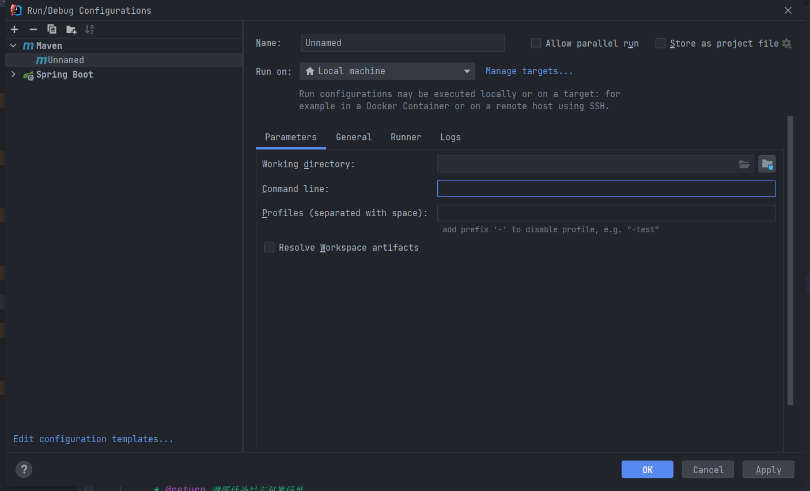
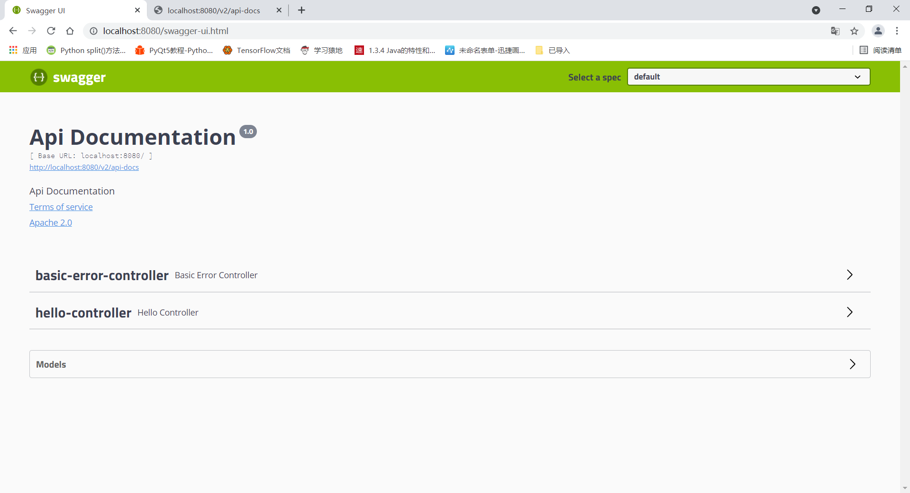
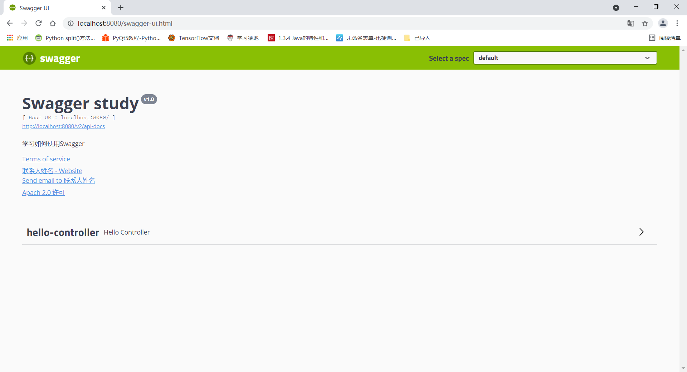
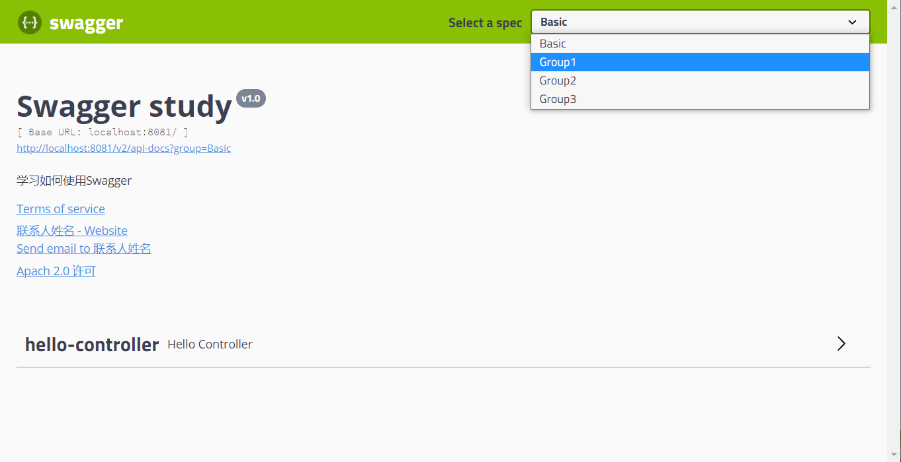
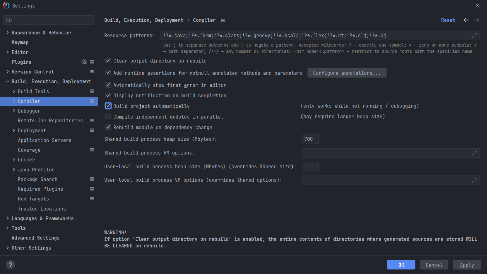

# SpringBoot

###  创建一个SpringBoot项目：

使用 IDEA 直接创建项目

1、创建一个新项目
2、选择spring initalizr ， 可以看到默认就是去官网的快速构建工具那里实现
3、填写项目信息
4、选择初始化的组件（初学勾选 Web 即可）
5、填写项目路径
6、等待项目构建成功


#### springboot 的依赖

在其父依赖中，而且其父依赖中很多jar。不需要人为的去配置。【才怪】

```xml
<?xml version="1.0" encoding="UTF-8"?>
<project xmlns="http://maven.apache.org/POM/4.0.0" xmlns:xsi="http://www.w3.org/2001/XMLSchema-instance"
         xsi:schemaLocation="http://maven.apache.org/POM/4.0.0 https://maven.apache.org/xsd/maven-4.0.0.xsd">
    <modelVersion>4.0.0</modelVersion>
    <parent>
        <groupId>org.springframework.boot</groupId>
        <artifactId>spring-boot-starter-parent</artifactId>
        <version>2.5.2-SNAPSHOT</version>
        <relativePath/> <!-- lookup parent from repository -->
    </parent>
    <groupId>com.uestc</groupId>
    <artifactId>springboot-learn</artifactId>
    <version>0.0.1-SNAPSHOT</version>
    <name>springboot-learn</name>
    <description>Demo project for Spring Boot</description>
    <properties>
        <java.version>1.8</java.version>
    </properties>
    <dependencies>
        <dependency>
            <groupId>org.springframework.boot</groupId>
            <artifactId>spring-boot-starter</artifactId>
        </dependency>

        <!--web 启动器-->
        <dependency>
            <groupId>org.springframework.boot</groupId>
            <artifactId>spring-boot-starter-web</artifactId>
        </dependency>

        <dependency>
            <groupId>org.springframework.boot</groupId>
            <artifactId>spring-boot-starter-test</artifactId>
        </dependency>

        <!--lombok-->
        <dependency>
            <groupId>org.projectlombok</groupId>
            <artifactId>lombok</artifactId>
            <version>1.16.18</version>
            <scope>provided</scope>
        </dependency>

        <!--导入配置文件处理器，配置文件进行绑定就会有提示，需要重启-->
        <dependency>
            <groupId>org.springframework.boot</groupId>
            <artifactId>spring-boot-configuration-processor</artifactId>
            <optional>true</optional>
        </dependency>
    </dependencies>

    <build>
        <plugins>
            <plugin>
                <groupId>org.springframework.boot</groupId>
                <artifactId>spring-boot-maven-plugin</artifactId>
            </plugin>

            <!--添加maven的补丁-->
            <plugin>
                <groupId>org.apache.maven.plugins</groupId>
                <artifactId>maven-compiler-plugin</artifactId>
                <version>3.8.1</version>
                <configuration>
                    <source>1.8</source>
                    <target>1.8</target>
                </configuration>
            </plugin>
        </plugins>
    </build>
    <repositories>
        <repository>
            <id>spring-milestones</id>
            <name>Spring Milestones</name>
            <url>https://repo.spring.io/milestone</url>
            <snapshots>
                <enabled>false</enabled>
            </snapshots>
        </repository>
        <repository>
            <id>spring-snapshots</id>
            <name>Spring Snapshots</name>
            <url>https://repo.spring.io/snapshot</url>
            <releases>
                <enabled>false</enabled>
            </releases>
        </repository>
    </repositories>
    <pluginRepositories>
        <pluginRepository>
            <id>spring-milestones</id>
            <name>Spring Milestones</name>
            <url>https://repo.spring.io/milestone</url>
            <snapshots>
                <enabled>false</enabled>
            </snapshots>
        </pluginRepository>
        <pluginRepository>
            <id>spring-snapshots</id>
            <name>Spring Snapshots</name>
            <url>https://repo.spring.io/snapshot</url>
            <releases>
                <enabled>false</enabled>
            </releases>
        </pluginRepository>
    </pluginRepositories>

</project>

```


#### yaml 配置文件

特点：语法严格

1、空格不能省略

2、以缩进来控制层级关系，只要是左边对齐的一列数据都是同一个层级的。

3、属性和值的大小写都是十分敏感的。

##### yaml 语法

###### **字面量：普通的值  [ 数字，布尔值，字符串  ]**

```yaml
k: v
```

注意：

- “ ” 双引号，不会转义字符串里面的特殊字符 ， 特殊字符会作为本身想表示的意思；

  比如 ：name: "kuang \n shen"  输出 ：kuang  换行  shen

- '' 单引号，会转义特殊字符 ， 特殊字符最终会变成和普通字符一样输出

  比如 ：name: ‘kuang \n shen’  输出 ：kuang  \n  shen

###### **对象、Map（键值对)**

```yaml
#对象、Map格式
k: 
    v1:
    v2:
```

```yaml
student:
	name: qijiang
	age: 23
```

```yaml
student: {name: qijiang,age: 3}
```

###### **数组（ List、set ）**

用 - 值表示数组中的一个元素,比如：

```yaml
pets:
- cat
- dog
- pig
```

```yaml
pets: {cat,dog,pig}
```

##### yaml 注入配置文件

1、在springboot项目中的resources目录下新建一个文件 application.yml

2、编写一个实体类 Dog；

3、思考，我们原来是如何给bean注入属性值的！@Value，给狗狗类测试一下：

```java
@Component
@AllArgsConstructor
@NoArgsConstructor
@Setter
@Getter
@ToString
public class Dog {
    @Value("阿黄")
    private String name;
    @Value("8")
    private Integer age;
}
```

```java
@Component
@ConfigurationProperties(prefix = "people")  // 指定在 yaml 文件中找到名为 people 的内容，然后自动装配
@AllArgsConstructor
@NoArgsConstructor
@Setter
@Getter
@ToString
public class Person {
    private String name;
    private Integer age;
    private Boolean happy;
    private Date birth;
    private Map<String,Object> maps;
    private List<Object> lists;
    private Dog dog;

}
```

```java
@SpringBootTest
class SpringbootLearnApplicationTests {

    @Autowired
    Dog dog;

    @Autowired
    Person person;

    @Test
    void contextLoads() {
        System.out.println(dog);
        System.out.println(person);
    }

}

```

```yaml
person:
  name: qinjiang
  age: 3
  happy: false
  birth: 2000/01/01
  maps: {k1: v1,k2: v2}
  lists:
  - code
  - girl
  - music
  dog:
    name: 旺财
    age: 1

people:
  name: Lebron James
  age: 36
  happy: true
  birth: 2020/01/01
  maps: {k1: v5,k2: v6}
  lists:
  - basketball
  - slam dunk
  - fishing
  - music
  dog:
    name: Aka
    age: 3
```

##### 加载指定配置文件

**@PropertySource ：**加载指定的配置文件；

**@configurationProperties**：默认从全局配置文件中获取值；

1、我们去在resources目录下新建一个**person.properties**文件

```properties
name=kuangshen
```

2、然后在我们的代码中指定加载person.properties文件

```java
@PropertySource(value = "classpath:person.properties")
@Component //注册bean
public class Person {
    @Value("${name}")
    private String name;
    ......  
}
```

##### 配置文件中使用占位符

```yaml
human:
  name: qinjiang${random.uuid}
  age: ${random.int}  # 随机int
  happy: false
  birth: 2000/01/01
  maps: {k1: v1,k2: v2}
  lists:
  - code
  - girl
  - music
  dog:
    name: ${human.hello:other}_旺财
    age: 1
```

## JSR3030 校验

```java
@NotNull(message="名字不能为空")
private String userName;
@Max(value=120,message="年龄最大不能查过120")
private int age;
@Email(message="邮箱格式错误")
private String email;

空检查
@Null       验证对象是否为null
@NotNull    验证对象是否不为null, 无法查检长度为0的字符串
@NotBlank   检查约束字符串是不是Null还有被Trim的长度是否大于0,只对字符串,且会去掉前后空格.
@NotEmpty   检查约束元素是否为NULL或者是EMPTY.
    
Booelan检查
@AssertTrue     验证 Boolean 对象是否为 true  
@AssertFalse    验证 Boolean 对象是否为 false  
    
长度检查
@Size(min=, max=) 验证对象（Array,Collection,Map,String）长度是否在给定的范围之内  
@Length(min=, max=) string is between min and max included.

日期检查
@Past       验证 Date 和 Calendar 对象是否在当前时间之前  
@Future     验证 Date 和 Calendar 对象是否在当前时间之后  
@Pattern    验证 String 对象是否符合正则表达式的规则

.......等等
除此以外，我们还可以自定义一些数据校验规则
```


## springboot 多环境配置 与 切换


## Web 开发

jar：webapp

自动装配

springboot 到底帮我们配置了什么？ 能不能进行修改？

- XXXAutoConfiguration：向容器中自动配置组件
- XXXProperties：自动配置类，装配配置文件中自定义的一些内容


要解决的问题：

- 导入静态资源
- 首页
- jsp， 魔板引擎，Thymeleaf
- 装配扩展SpringMVC
- 增删改查
- 拦截器
- 国际化

### 静态资源

总结：

1. 在springboot，我们可以使用一下方式处理静态资源
   - webjars ：localhost:8080/webjars/
   - public， static, /**, resources [这几个目录都在resources目录下]  全部映射到 localhost:8080
2. 优先级 ： resources > static(默认) > public

### 首页定制 和 配置

首页为index.html  放在  resources  static  public中的 任何一个目录面

1. 首页配置：注意点，所有页面的静态资源都需要使用Thymeleaf接管； @{}

### 魔板引擎 —— Thymeleaf

只要需要使用Thymaleaf，只需要导入对应的依赖。将html页面放到 templates目录下

1. **在html文件中加入** ```<html lang="en" xmlns:th="http://www.thymeleaf.org">```

2. 在 application.yml 中设置

   ```yml
   spring:
     # 魔板引擎
     thymeleaf:
       cache: false
       prefix: classpath:/templates/
       suffix: .html
       mode: LEGACYHTML5
   ```

3. 参考 Thymeleaf 文档  ， 用这个引擎接管 html ，传递数据

## 整合Mybatis框架

### 添加依赖

```xml
<!--mybatis-->
<dependency>
    <groupId>org.mybatis.spring.boot</groupId>
    <artifactId>mybatis-spring-boot-starter</artifactId>
    <version>2.1.1</version>
</dependency>
```

### application.yml 设置

```yml
# 整合 mybatis
mybatis:
  type-aliases-package: com.uestc.demo.pojo
  mapper-locations: classpath:mybatis/mapper/*.xml
```

### mapper 文件

1. mapper文件一般放在 resources/mybatis/mapper 目录下

2. 在Mapper接口上需要添加注解 @Mapper  @Repository

   ```java
   @Mapper  // 表明这是一个mapper
   @Repository
   public interface BookMapper {
       // Method
   }
   ```

3. 


## SpringBoot运用打包与部署


插件

```xml
<build>
    <plugins>
        <plugin>
            <groupId>org.apache.maven.plugins</groupId>
            <artifactId>maven-compiler-plugin</artifactId>
            <version>3.1</version>
            <configuration>
                <source>${java.version}</source>
                <target>${java.version}</target>
                <encoding>${project.build.sourceEncoding}</encoding>
            </configuration>
        </plugin>
    </plugins>
</build>
```



打包命令：配置打包命令 `clean compile package -Dmaven.test.ski=true`执行打包命令，target目录得到待部署的项目文件。


### Jar包部署（推荐）

然后使用 `java -jar xxx.jar`命令启动运行jar包。


### War包 部署

1. 启动类需要继承父类`SpringBootServletInitializer`,重写`configure`方法

   ```java
   public class XXXApplication extends SpringBootServletInitializer {
   
      public static void main(String[] args)
      {
         SpringApplication.run(XXXApplication.class, args);
      }
   
      @Override
      protected SpringApplicationBuilder configure(SpringApplicationBuilder builder)
      {
         return builder.sources(ForumJavaApplication.class);
      }
   }
   ```

2. `pom.xml`文件添加`<packaging>war</packaging>`

3. war包不需要内置tomcat，`pom.xml`文件需要添加

   ```xml
   <dependency>
       <groupId>org.springframework.boot</groupId>
       <artifactId>spring-boot-starter-tomcat</artifactId>
       <scope>provided</scope>
   </dependency>
   
   <build>
    	<!-- 打war 包时的默认名字 -->   
       <fileName>SpringBoot xx</fileName>
       <plugins>
           <plugin>
               <groupId>org.apache.maven.plugins</groupId>
               <artifactId>maven-compiler-plugin</artifactId>
               <version>3.1</version>
               <configuration>
                   <source>${java.version}</source>
                   <target>${java.version}</target>
                   <encoding>${project.build.sourceEncoding}</encoding>
               </configuration>
           </plugin>
       </plugins>
   </build>
   ```

4. 需要把war包 拷贝到 tomcat下的webapp目录下。浏览器访问路径`localhost://8080/文件夹名字/端口号`


## Swagger

学习目标：

- 了解Swagger
- 了解前后端分离
- 在SpringBoot中集成Swagger

### Swagger 简介

**前后端分离：**Vue+SpringBoot

后端时代：前端只管理静态页面；后端，模板引擎，后端是助力。

swagger 生成了一个文档，让前后端更好的沟通？？？？

### 快速开始

1. 引入依赖

   这里使用的是 2.X 版本

   ```xml
   <!--集成swagger2-->
   <!-- https://mvnrepository.com/artifact/io.springfox/springfox-swagger2 -->
   <dependency>
       <groupId>io.springfox</groupId>
       <artifactId>springfox-swagger2</artifactId>
       <version>2.9.2</version>
   </dependency>
   
   <!-- https://mvnrepository.com/artifact/io.springfox/springfox-swagger-ui -->
   <dependency>
       <groupId>io.springfox</groupId>
       <artifactId>springfox-swagger-ui</artifactId>
       <version>2.9.2</version>
   </dependency>
   ```

2. hello工程

   ```java
   @RestController
   public class HelloController {
   
       @RequestMapping("/hello")
       public String hello() {
           return "hello";
       }
   }
   ```

3. swagger 配置

   ```java
   @Configuration
   @EnableSwagger2 // 开启swagger功能
   public class SwaggerConfig {
   
   }
   ```

4. 启动项目，浏览器输入 http://localhost:8080/swagger-ui.html 查看效果

   

### 配置Swagger

#### 简单配置

1. Swagger的实例是Docket，所以通过 Docket 实例配置Swagger

   ```java
   @Configuration
   @EnableSwagger2
   public class SwaggerConfig {
       @Bean
       public Docket docket() {
           return new Docket(DocumentationType.SWAGGER_2);
       }
   
   }
   ```

2. 启动

   

3. 通过apiInfo() 属性配置文档信息

4. Docket实例关联上apiInfo()

   ```java
   @Configuration
   @EnableSwagger2
   public class SwaggerConfig {
   
       /**
        * Swagger实例Bean是Docket，所以通过配置Docket实例来配置Swaggger
        * @return
        */
       @Bean
       public Docket docket() {
           return new Docket(DocumentationType.SWAGGER_2)
                   .apiInfo(apiInfo());
       }
   
       /**
        * 配置文档信息
        * @return
        */
       private ApiInfo apiInfo() {
           Contact contact = new Contact("联系人姓名", "http://XXX.XXX.com/联系人访问连接","联系人邮箱");
           return new ApiInfo("Swagger study" // 标题
                   , "学习如何使用Swagger" // details
                   , "v1.0"
                   , "http://terms.service.url"//组织连接
                   , contact  // 联系人信息
                   ,"Apach 2.0 许可"
                   , "许可连接"
                   , new ArrayList<>());
       }
   
   }
   ```

#### 配置扫描接口

常见的扫描方式如下：

```java
RequestHandlerSelectors.
any() // 扫描所有，项目中的所有接口都会被扫描到
none() // 不扫描接口
withMethodAnnotation(final Class<? extends Annotation> annotation) // 通过方法上的注解扫描，如withMethodAnnotation(GetMapping.class)只扫描get请求
withClassAnnotation(final Class<? extends Annotation> annotation) // 通过类上的注解扫描，如.withClassAnnotation(Controller.class)只扫描有controller注解的类中的接口
basePackage(final String basePackage) // 根据包路径扫描接口
```

1. 在构建 Docket 的时候，通过 select() 方法配置怎样扫描接口

   ```java
   @Configuration
   @EnableSwagger2
   public class SwaggerConfig {
   
       /**
        * Swagger实例Bean是Docket，所以通过配置Docket实例来配置Swaggger
        * @return
        */
       @Bean
       public Docket docket() {
           return new Docket(DocumentationType.SWAGGER_2)
                   .apiInfo(apiInfo())
                   .select().apis(RequestHandlerSelectors.basePackage("com.uestc.swagger.controller")).build();
       }
   
       /**
        * 配置文档信息
        * @return
        */
       private ApiInfo apiInfo() {
           Contact contact = new Contact("联系人姓名", "http://XXX.XXX.com/联系人访问连接","联系人邮箱");
           return new ApiInfo("Swagger study" // 标题
                   , "学习如何使用Swagger" // details
                   , "v1.0"
                   , "http://terms.service.url"//组织连接
                   , contact  // 联系人信息
                   ,"Apach 2.0 许可"
                   , "许可连接"
                   , new ArrayList<>());
       }
   
   }
   ```

2. 启动项目

   

   其他方式略。

#### 可以对接口进行扫描过滤

```java
@Bean
public Docket docket() {
   return new Docket(DocumentationType.SWAGGER_2)
      .apiInfo(apiInfo())
      .select()// 通过.select()方法，去配置扫描接口,RequestHandlerSelectors配置如何扫描接口
      .apis(RequestHandlerSelectors.basePackage("com.kuang.swagger.controller"))
       // 配置如何通过path过滤,即这里只扫描请求以/kuang开头的接口
      .paths(PathSelectors.ant("/kuang/**"))
      .build();
}
```

PathSelectors.XXX() 可以选的值还有：

```java
any() // 任何请求都扫描
none() // 任何请求都不扫描
regex(final String pathRegex) // 通过正则表达式控制
ant(final String antPattern) // 通过ant()控制
```

### 配置 Swagger 开关

#### 通过 enable() 方法配置是否启用了 Swagger 

```java
@Bean
public Docket docket() {
    return new Docket(DocumentationType.SWAGGER_2)
            .apiInfo(apiInfo())
            .enable(false) // 设置为false，浏览器就无法访问了
         .select().apis(RequestHandlerSelectors.basePackage("com.uestc.swagger.controller")).build();
}
```

#### 多环境下配置

**在prod下不显示，在test 和 dev下显示**

当设置为```Profiles.of("prod");```时，输入网址无法查看

```java
@Bean
public Docket docket(Environment environment) {
    // 设置要显示的 环境
    Profiles op = Profiles.of("test","dev");
    // 判断是否处于该环境
    // 通过enable() 方法接受参数，是否要显示
    boolean flag = environment.acceptsProfiles(op);

    return new Docket(DocumentationType.SWAGGER_2)
            .apiInfo(apiInfo())
            .enable(flag)
            .select().apis(RequestHandlerSelectors.basePackage("com.uestc.swagger.controller")).build();
}
```

#### 配置API分组

加入代码，效果如下

```java
@Bean
public Docket docket(Environment environment) {
    // 设置要显示的 环境
    Profiles op = Profiles.of("dev");
    // 判断是否处于该环境
    // 通过enable() 方法接受参数，是否要显示
    boolean flag = environment.acceptsProfiles(op);

    return new Docket(DocumentationType.SWAGGER_2)
            .apiInfo(apiInfo())
            .enable(flag)
            .select().apis(RequestHandlerSelectors.basePackage("com.uestc.swagger.controller")).build().groupName("Basic");
}

@Bean
public Docket docket2() {
    return new Docket(DocumentationType.SPRING_WEB).apiInfo(apiInfo()).groupName("Group1");
}

@Bean
public Docket docket3() {
    return new Docket(DocumentationType.SPRING_WEB).apiInfo(apiInfo()).groupName("Group2");
}

@Bean
public Docket docke4() {
    return new Docket(DocumentationType.SPRING_WEB).apiInfo(apiInfo()).groupName("Group3");
}
```



#### 实体类配置(暂时有问题)

1. 实体类 User

   ```java
   @ApiModel("用户实体")
   public class User {
      @ApiModelProperty("用户名")
      public String username;
      @ApiModelProperty("密码")
      public String password;
   }
   ```

2. 只要这个实体在**请求接口**的返回值上（即使是泛型），都能映射到实体项中：

   ```java
   @RequestMapping("/getUser")
   public User getUser(){
      return new User();
   }
   ```

注：并不是因为@ApiModel这个注解让实体显示在这里了，而是只要出现在接口方法的返回值上的实体都会显示在这里，而**@ApiModel和@ApiModelProperty这两个注解只是为实体添加注释的**。

@ApiModel为类添加注释

@ApiModelProperty为类属性添加注释

#### 常用注解

| **Swagger注解**                                        | 简单说明                                                     |
| ------------------------------------------------------ | ------------------------------------------------------------ |
| @Api(tags = "xxx模块说明")                             | 作用在模块类上                                               |
| @ApiOperation("xxx接口说明")                           | 作用在接口方法上                                             |
| @ApiModel("xxxPOJO说明")                               | 作用在模型类上：如VO、BO                                     |
| @ApiModelProperty(value = "xxx属性说明",hidden = true) | 作用在类方法和属性上，hidden设置为true可以隐藏该属性         |
| @ApiParam("xxx参数说明")                               | 作用在参数、方法和字段上，类似@ApiModelProperty              |
| @ApiImplicitParams()                                   | 用在请求方法上，包含一组参数说明                             |
| @ApiImplicitParam()                                    | 用在@ApiImplicitParams()的注解，指定一个请求参数的配置信息：<br />name：<br />value：<br />required：<br />paramType：<br />dataType：<br />defaultValue: |


## SpringBoot 运用热部署

热部署：就是在运用正在运行的时候升级软件，却不需要重新启动运用

在原理上使用了两个 `ClassLoader`，一个`ClassLoader`加载那些不会改变的类（第三方jar包），另一个`ClassLoader`加载会更改的类，称为`restart ClassLoader`.有代码更改的时候，原来的`restart ClassLoader`会被斗丢弃，重新创建一个`restart ClassLoader`，由于需要加载的类比较少，故时间较短。


devtools 会实现页面热部署。页面修改后立即生效（在配置文件中 spring.thymeleaf.cache=false来实现)

1. pom文件配置

   ```xml
   <dependency>
       <groupId>org.springframework.boot</groupId>
       <artifactId>spring-boot-devtools</artifactId>
       <scope>runtime</scope>
       <optional>true</optional>
   </dependency>
   
   
       <build>
           <plugins>
               <plugin>
                   <groupId>org.springframework.boot</groupId>
                   <artifactId>spring-boot-maven-plugin</artifactId>
                   <configuration>
                       <fork>true</fork> <!-- 没有配置这个  则 devtools 不会生效-->
                   </configuration>
               </plugin>
           </plugins>
   </build>
   
   ```

2. yml配置文件

   ```yml
   spring:
     # 热部署
     devtools:
       restart:
         enabled: true
         # 设置重启的目录，添加目录的文件需要restart
         additional-paths: src/main/java
         # 解决项目自动冲新区启动后接口报404问题
         poll-interval: 3000
         quiet-period: 1000
   ```

3. idea 开启自动编译

   

4. registry 属性修改

   


5. 热部署快捷键： ctrl+F9


## 异步任务

在我们的工作中，常常会用到异步处理任务，比如我们在网站上发送邮件，后台会去发送邮件，此时前台会造成响应不动，直到邮件发送完毕，响应才会成功，所以我们一般会采用多线程的方式去处理这些任务。

### 没有使用异步功能

1. 创建 service.AsyncService

   ```java
   @Service
   public class AsyncService {
   
       public void hello() {
           try {
               // 模拟后台任务
               Thread.sleep(5000);
           }  catch (InterruptedException e) {
               e.printStackTrace();
           }
           System.out.println("业务进行中....");
       }
   }
   ```

2. controller.AsyncController

   ```java
   @Controller
   public class AsyncController {
       @Autowired
       private AsyncService asyncService;
   
       @ResponseBody
       @RequestMapping("/async")
       private String async() {
           asyncService.hello();
           return "success";
       }
   
   }
   ```

前台页面必须要等到后台处理完了，才能刷新

### 开启异步功能

1. 注释

   @Async ：在方法或类上声明这是一个异步任务或者类

   @EnableAsync：在启动类上申明开启异步（注解）功能

2. 更改代码

   ```java
   @Service
   public class AsyncService {
   
       @Async
       public void hello() {
           try {
               Thread.sleep(5000);
           }  catch (InterruptedException e) {
               e.printStackTrace();
           }
           System.out.println("业务进行中....");
       }
   }
   ```

   ```java
   @SpringBootApplication
   @EnableAsync // 开启异步功能
   public class Swagger2Application {
   
       public static void main(String[] args) {
           SpringApplication.run(Swagger2Application.class, args);
     
       }
   
   }
   ```

3. 重启项目，网页瞬间刷新，代码在后天依然执行

## 定时任务

项目开发中经常需要执行一些定时任务，比如需要在每天凌晨的时候，分析一次前一天的日志信息，Spring为我们提供了异步执行任务调度的方式，提供了两个接口：

- TaskExecutor
- TaskScheduler

两个注解：

- @EnableScheduling
- @Scheduled

**cron表达式** :http://www.bejson.com/othertools/cron/

常用表达式：

```txt
（1）0/2 * * * * ?   表示每2秒 执行任务
（1）0 0/2 * * * ?   表示每2分钟 执行任务
（1）0 0 2 1 * ?   表示在每月的1日的凌晨2点调整任务
（2）0 15 10 ? * MON-FRI   表示周一到周五每天上午10:15执行作业
（3）0 15 10 ? 6L 2002-2006   表示2002-2006年的每个月的最后一个星期五上午10:15执行作
（4）0 0 10,14,16 * * ?   每天上午10点，下午2点，4点
（5）0 0/30 9-17 * * ?   朝九晚五工作时间内每半小时
（6）0 0 12 ? * WED   表示每个星期三中午12点
（7）0 0 12 * * ?   每天中午12点触发
（8）0 15 10 ? * *   每天上午10:15触发
（9）0 15 10 * * ?     每天上午10:15触发
（10）0 15 10 * * ?   每天上午10:15触发
（11）0 15 10 * * ? 2005   2005年的每天上午10:15触发
（12）0 * 14 * * ?     在每天下午2点到下午2:59期间的每1分钟触发
（13）0 0/5 14 * * ?   在每天下午2点到下午2:55期间的每5分钟触发
（14）0 0/5 14,18 * * ?     在每天下午2点到2:55期间和下午6点到6:55期间的每5分钟触发
（15）0 0-5 14 * * ?   在每天下午2点到下午2:05期间的每1分钟触发
（16）0 10,44 14 ? 3 WED   每年三月的星期三的下午2:10和2:44触发
（17）0 15 10 ? * MON-FRI   周一至周五的上午10:15触发
（18）0 15 10 15 * ?   每月15日上午10:15触发
（19）0 15 10 L * ?   每月最后一日的上午10:15触发
（20）0 15 10 ? * 6L   每月的最后一个星期五上午10:15触发
（21）0 15 10 ? * 6L 2002-2005   2002年至2005年的每月的最后一个星期五上午10:15触发
（22）0 15 10 ? * 6#3   每月的第三个星期五上午10:15触发
```

1. 编写 service.ScheduledService

   ```java
   @Service
   public class ScheduleService {
   
       @Scheduled(cron = "0/2 * * * * ?") // 每两秒执行任务
       public void hello() {
           System.out.println("hello.....");
       }
   }
   
   ```

2. 在启动类中开启定时功能

   ```java
   @EnableScheduling  // 开启定时功能
   @EnableAsync // 开启异步功能
   @SpringBootApplication
   public class Swagger2Application {
   
       public static void main(String[] args) {
           SpringApplication.run(Swagger2Application.class, args);
       }
   
   }
   ```

## 邮件任务

- 邮件发送需要引入spring-boot-start-mail
- SpringBoot 自动配置MailSenderAutoConfiguration
- 定义MailProperties内容，配置在application.yml中
- 自动装配JavaMailSender
- 测试邮件发送

https://mp.weixin.qq.com/s/HyVpI0pJZCcqzxewPK_K3Q

## 富文本编辑器

使用的是 **Editor.md** 官网：[pandao.github.io](https://pandao.github.io/editor.md/)


