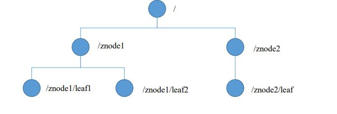
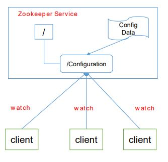
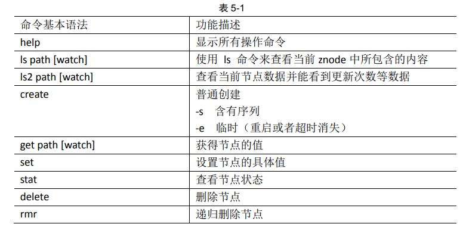
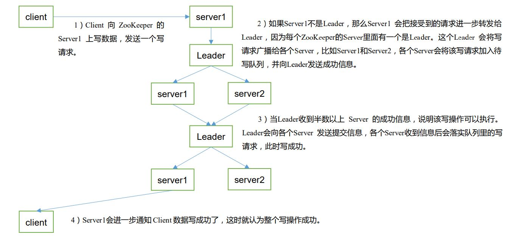

# 1、zookeeper 入门

## 1.1、概述

Zookeeper 是一个开源的分布式的，为分布式应用提供协调服务的 Apache 项目。

## 1.2、特点

（1）zookeeper：一个领导者（leader），多个跟随者（follower）组成的集群

（2）集群中只要有半数以上的节点存活，zookeeper集群就能够正常服务

（3）全局数据一致：每个Server保存一份相同的数据副本，Client无论连接到哪个Server，数据都是一致的。

（4）更新请求顺讯进行，来自同一个Client的更新请求按照其发送顺序依次执行。

（5）数据更新原子性，依次数据更新要么都成功，要么都不成功

（6）实时性，在一定时间范围内，Client能读到最新数据

## 1.3、数据结构

zookeeper数据模型与unix文件系统类似，整体上可以看做是一棵树，每个节点称为一个znode。每一个**znode默认能够存储1MB**的数据，**每个znode都可以通过路径唯一标识**。



## 1.4、运用场景

提供的服务包括：统一命名服务、同一配置管理、同一集群管理、服务器节点动态上下线，软负载均衡。

### 1.4.1、统一命名服务

在分布式环境下，需要对服务/运用进行同一命名，方便识别。

### 1.4.2、统一配置管理

在分布式环境下，所有节点的配置信息是一致的，比如kafka集群。对于配置文件修改后，希望能够快速同步到各个节点上。

配置管理可以用zookeeper来实现：

（1）将配置信息写入zookeeper的一个znode

（2）各个客户端/服务器监听这个zookeeper

（3）一旦znode数据被修改，zookeeper将通知各个客户端/服务器



#### 1.4.3、统一集群管理

可将节点信息写入zookeeper上的一个znode；监听这个znode就可以获取节点的实时状态变化。

#### 1.4.4、服务器节点动态上下线


#### 1.4.5、软负载均衡

在zookeeper用znode记录对应的服务器的访问数目，让访问最少的服务器去处理客户端请求。

## 1.5、下载地址

http://zookeeper.apache.org/

# 2、本地安装

## 2.1、本地模式安装

## 2.2、配置参数解读

配置文件`zoo.cfg`中的参数如下：

- `tickTime=2000`：**通信心跳数**，Zookeeper 服务器与客户端心跳时间，单位毫秒。
- `initLimit=10`：**LF初试通信时限**。集群中的Follower跟随者服务器与Leader领导者服务器之间初始连接时能容忍的最多心 跳数（tickTime的数量），用它来限定集群中的Zookeeper服务器连接到Leader的时限
- `syncLimit =5`：**LF 同步通信时限**。集群中Leader与Follower之间的最大响应时间单位，假如响应超过syncLimit *  tickTime，Leader认为Follwer死掉，从服务器列表中删除Follwer。
- `dataDir`：数据文件目录+数据持久化**路径**。主要用于保存 Zookeeper 中的数据。
- `clientPort =2181`：客户端连接**端口**

# 3、实战

## 3.1、分布式安装


## 3.2、客户端命令



## 3.3.Java API

### 3.3.1、zk客户端 Zookeeper

不怎么好用。

maven依赖

```xml
		<dependencies>
            <dependency>
                <groupId>junit</groupId>
                <artifactId>junit</artifactId>
                <version>RELEASE</version>
            </dependency>
            <dependency>
                <groupId>org.apache.logging.log4j</groupId>
                <artifactId>log4j-core</artifactId>
                <version>2.8.2</version>
            </dependency>
            <!--
            https://mvnrepository.com/artifact/org.apache.zookeeper/zook
            eeper -->
            <dependency>
                <groupId>org.apache.zookeeper</groupId>
                <artifactId>zookeeper</artifactId>
                <version>3.4.10</version>
            </dependency>
        </dependencies>
```

### 3.3.2、zk客户端-CuratorFramework

引入依赖

```xml
        <!--zookeeper-->
        <dependency>
            <groupId>org.apache.curator</groupId>
            <artifactId>curator-framework</artifactId>
            <version>${curator-version}</version>
        </dependency>
        <dependency>
            <groupId>org.apache.curator</groupId>
            <artifactId>curator-recipes</artifactId>
            <version>${curator-version}</version>
        </dependency>
```

封装客户端工具类：

```java
public class CuratorClient {
    private final CuratorFramework client;

    public CuratorClient(String connectString, String namespace, int sessionTimeout, int connectionTimeout) {
        client = CuratorFrameworkFactory.builder().namespace(namespace).connectString(connectString)
                .sessionTimeoutMs(sessionTimeout).connectionTimeoutMs(connectionTimeout)
                .retryPolicy(new ExponentialBackoffRetry(1000, 10))
                .build();
        client.start();
    }

    public CuratorClient(String connectString, int timeout) {
        this(connectString, Constant.ZK_NAMESPACE, timeout, timeout);
    }

    public CuratorClient(String connectString) {
        this(connectString, Constant.ZK_NAMESPACE, Constant.ZK_SESSION_TIMEOUT, Constant.ZK_CONNECTION_TIMEOUT);
    }

    public CuratorFramework getClient() {
        return client;
    }

    public void addConnectionStateListener(ConnectionStateListener connectionStateListener) {
        client.getConnectionStateListenable().addListener(connectionStateListener);
    }

    public String createPathData(String path, byte[] data) throws Exception {
        return client.create().creatingParentsIfNeeded()
                .withMode(CreateMode.EPHEMERAL_SEQUENTIAL)
                .forPath(path, data);
    }

    public void updatePathData(String path, byte[] data) throws Exception {
        client.setData().forPath(path, data);
    }

    public void deletePath(String path) throws Exception {
        client.delete().forPath(path);
    }

    public void watchNode(String path, Watcher watcher) throws Exception {
        client.getData().usingWatcher(watcher).forPath(path);
    }

    public byte[] getData(String path) throws Exception {
        return client.getData().forPath(path);
    }

    public List<String> getChildren(String path) throws Exception {
        return client.getChildren().forPath(path);
    }

    public void watchTreeNode(String path, TreeCacheListener listener) {
        TreeCache treeCache = new TreeCache(client, path);
        treeCache.getListenable().addListener(listener);
    }

    public void watchPathChildrenNode(String path, PathChildrenCacheListener listener) throws Exception {
        PathChildrenCache pathChildrenCache = new PathChildrenCache(client, path, true);
        //BUILD_INITIAL_CACHE 代表使用同步的方式进行缓存初始化。
        pathChildrenCache.start(PathChildrenCache.StartMode.BUILD_INITIAL_CACHE);
        pathChildrenCache.getListenable().addListener(listener);
    }

    public void close() {
        client.close();
    }
}
```


# 4、zookeeper内部原理

## 4.1、节点类型

持久（Persistence）：客户端与服务端断开连接后，创建的节点不会删除

短暂（Ephemeral）：客户端与服务端断开连接后，创建的节点自己会删除

创建一个znode时设置顺序标识，znode名称后面会增加一个值，顺序号是一个单增的计数器，由父节点维持。**在分布式系统中，顺序号可以被用于为所有的事件进行全局排序，这样客户端可以通过顺序号推断事件的顺序。**

（1）持久化目录节点 客户端与Zookeeper断开连接后，该节点依旧存在 

（2）持久化顺序编号目录节点 客户端与Zookeeper断开连接后，该节点依旧存 在，只是Zookeeper给该节点名称进行顺序编号 

（3）临时目录节点 客户端与Zookeeper断开连接后，该节点被删除 

（4）临时顺序编号目录节点 客户端与Zookeeper断开连接后 ， 该节点被 删除 ，只是Zookeeper给该节点名称进行顺序编号

## 4.2、Stat结构体

## 4.3、监听器原理（面试常客）

**监听器原理：**

（1）首先要有一个`main`线程

（2）在main线程中创建zkClient，这时就会创建两个线程，一个负责网络连接通信（`connect`），一负责监听（`listener`）

（3）通过connect线程将注册的监听事件发送给zk

（4）在zk的监听器列表中将注册的监听事件添加到列表中

（5）在zk监听到有数据或者路径变化，就会将这个消息发送给`listener`线程

（6）listener线程内部调用`process`方法


**常见的监听**：

（1）监听节点数据的变化：`get path [watch]`

（2）监听子节点增减的变化：`ls path [watch]`

## 4.4、选举机制（面试常客）

（1）**半数机制**：集群中半数以上机器存活，集群可用。所以 Zookeeper 适合安装奇数台 服务器。

（2）Zookeeper 虽然在配置文件中并没有指定 Master 和 Slave。但是，Zookeeper 工作时， 是有一个节点为 Leader，其他则为 Follower，Leader 是通过内部的选举机制临时产生的。


## 4.5、写数据流程

（1）Client 向 ZooKeeper 的 Server1 上写数据，发送一个写 请求。

（2）如果Server1不是Leader，那么Server1 会把接受到的请求进一步转发给 Leader，因为每个ZooKeeper的Server里面有一个是Leader。这个Leader 会将写 请求广播给各个Server，比如Server1和Server2，各个Server会将该写请求加入待 写队列，并向Leader发送成功信息。

（3）当Leader收到半数以上 Server 的成功信息，说明该写操作可以执行。 Leader会向各个Server 发送提交信息，各个Server收到信息后会落实队列里的写 请求，此时写成功。

（4）Server1会进一步通知 Client 数据写成功了，这时就认为整个写操作成功。

