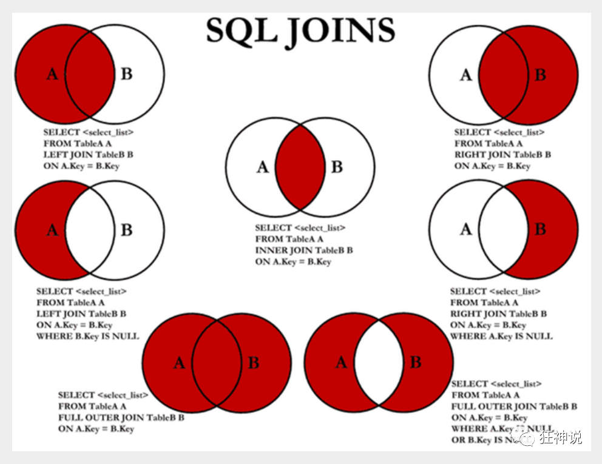

# Mysql 

## JavaEE

前端：页面，展示数据

后台：连接点，JDBC连接数据库，连接前端（控，控制视图跳转以及给前端传递数据）

数据库：存数据

## 为什么学习数据库

1、岗位要求

2、大数据时代

3、被迫需求：存数据

**4、数据库是所有软件体系中最核心的存在**

## 什么是数据库（DataBase，DB）

数据仓库，软件，安装在操作系统之上（win、linux、mac）；

sql，可以存储大量的数据（500万以下）

## DBMS（DataBase Management System）

### 关系型数据库

- mysql，sql sever，Oracle，DB2，SQLite
- 通过表与表之间，行和列之间的关系进行数据的存储
- SQL

### 非关系型数据库

- Redis，MongoDB
- 对象存储，通过对象自身的属性来决定（地图信息，微博热搜）
- NoSQL ，not only sql

### DBMS

- 数据库管理软件，进行科学有效的管理，维护

## MySQL

- 前世：瑞典MySQL AB公司

- 今生：Oracle旗下产品

- MySQL是最好的关系型数据库管理软件之一。

- 体积小、速度快、总体拥有成本低

- 中小型网站 或者大型网站（集群）

- www.mysql.com
- 安装简易：
  - 不要使用 exe 安装
  - 使用压缩包安装

## 安装Mysql

## 安装SQLyog

## 连接数据库

```sql
show databases
show tables
desc
```

数据库XXX语言  CRUD增删改查！

DDL 定义

DML 操作

DQL 查询

DCL 控制

# 操作数据库

操作数据库>>>操作数据库里的表>>>操作数据库里表里的数据

## 操作数据库（了解）

1、创建数据库

```sql
create database if not exists database_name
```

2、删除数据库

```sql
drop database if exists database_name
```

3、使用数据库

```sql
use `database_name`
```

注意：

- `` 是tab上面的键
- sql 的注释为        --

4、查看数据库

```sql
show database
```

学习思路：

- 对照sqlyog
- 记住关键字

## 数据库的列类型

### 数值

| mysql数据类型 |                       描述                        | 大小（单位：字节） |
| :-----------: | :-----------------------------------------------: | :----------------: |
|    tinyint    |                   非常小的数据                    |         1          |
|   smallint    |                    较小的数据                     |         2          |
|   mediumint   |                  中等大小的数据                   |         3          |
|      int      |            **标准的数据，Java中的int**            |         4          |
|    bigint     |                    较大的数据                     |         8          |
|    double     |                      浮点数                       |         8          |
|     float     |                      浮点数                       |         4          |
|  **decimal**  | 字符串形式的浮点数，金融计算的时候，一般用decimal |                    |

### 字符串

| mysql数据类型 |                描述                 | 大小（长度） |
| :-----------: | :---------------------------------: | :----------: |
|     char      |           字符串 固定大小           |    0-255     |
|  **varchar**  | **可变字符串 等价于Java中的String** |   0-65535    |
|   tinytext    |              微型文本               |    2^8-1     |
|   **text**    |       **文本串， 保存大文本**       |    2^16-1    |

### 时间日期

- date:   YYYY-MM-DD   日期格式
- time:   HH：mm：ss  时间格式
- **datetime：  YYYY-MM-DD  HH：mm：ss**
- **timestape ：时间戳  1970.1.1 到现在的毫秒数！较为常用**
- year: 年份

### null

- 没有值，位置
- 不要用null进行计算，结果一定为null

## 数据库的字段属性（重点）

### unsigned

- 无符号整数
- 不能声明为负数

### zerofill

- 0填充
- 不足的位数，使用0填充； int(3) -->5 -- 005

### auto_incresment自增

- 通常理解为自增，自动在上一条记录的基础上+1（默认）
- 通常用来设计唯一的主键--index， 必须是整数类型
- 也可以设计自增的初始值 和 步长

### not null 非空

- 假设设置为 not null，不填写值，就会报错
- null，如果不填写值，默认就是null

### default 默认值

- 设置默认的值！
- sex，默认值为男，如果不指定该列的值，值就是默认值

### 拓展====Alibaba的字段属性规范

以下5个字段，表示一个项目存在的意义，

- id    主键
- `version`：乐观锁
- is_delete  伪删除
- gmt_create  创建时间
- gmt_update 修改时间

## 创建数据库表（重点）

```sql
-- 创建学生表，使用sql创建
-- 学号int 登录密码varchar(20) 姓名、性别varchar(2)、出生日期(datetime)，家庭住址、email

-- 注意点 使用英文(),表的名字 和 字段 都要用``包含起来
-- auto_increment 自增
-- 字符串使用的时候 用 单引号括起来
-- 所有的语句后面加英文逗号，最后一个不用加
-- primary key 设置主键，一般一个表只有一个唯一的主键


create table if not exists `sys_student` (
  `id` int(4) not null auto_increment commit '学号',
  `name` varchar(30) not null default '匿名' commit '姓名',
  `pwd` varchar(20) not null default '123456' commit '密码',
  `sex` varchar(2) not null default '女' commit '姓名',
  `birthday` datetime default null commit '出生日期',
  `address` varchar(100) default null commit '家庭住址',
  `email` varchar(50) default null commit '邮箱',
  primary key (`id`)
) engine=innodb default charset=utf8;
```

### 格式

```sql
create table [if not exists] '表名' (
	`字段名` 列属性 [属性][索引][注释],
    `字段名` 列属性 [属性][索引][注释],
    ....
    `字段名` 列属性 [属性][索引][注释]
)[表类型][字符集设置][注释];
```

### 常用命令

```sql
show create database 数据库名; -- 查看创建数据库的语句
show create table 表名;		-- 查看数据表的定义语句
desc 表名;					-- 显示表的结构
```

## 数据表的类型

### 数据库引擎

innodb VS myisam

|              | MyIsam |          Innodb           |
| :----------: | :----: | :-----------------------: |
|   事务支持   | 不支持 |           支持            |
| 数据行锁定航 | 不支持 |           支持            |
|   外键约束   | 不支持 |           支持            |
|   全文索引   |  支持  |          不支持           |
|  表空间大小  |  较小  | 较大，约等于 MyIsam的两倍 |

常规的操作：

- MyIsam：节约空间，速度较快
- Innodb：安全性高，事务的处理，多表多用户操作

在物理空间存在的位置：所有的数据库文件都放在data目录下，本质还是文件的存储。

mysql引擎在屋里文件上的区别：

- InnoDB：
- MyISAM：

### 数据表的字符集编码

```sql
charset=utf8
```

不设置的话，mysql使用默认的字符集编码，不支持中文。

可以在my.ini中配置默认的编码

```sql
character-set-server=utf8
```

## 修改表

### 修改表名

格式：

```sql
alter table [表名] rename as [新表名] 
```

### 增加表的字段

格式

```
alter table [表名] add [字段名] [列属性...]
```

### 修改表的字段

#### 修改约束

```sql
alter table [表名] modify [字段名] [列属性...]
```

#### 重命名

```sql
alter table [表名] change [字段名] [新字段名] [列属性...]
```

### 删除表的字段

```sql
alter table [表名] drop [字段名]
```

## 删除表

所有的创建和删除操作要加上判断，避免报错

```sql
drop table if exists [表名]
```

# Mysql数据管理

## 外键（了解）

一个表的某些属性绑定在另一个表的某些属性的上面，就需要用外键。

#### 方式一

在创建表的时候就指明外键

```sql
create table if not exists `sys_grade` (
  `grade_id` int(10) not null auto_increment commit '年级id',
  `grade_name` varchar(50) not null commit '年级名称',
  primary key (`grade_id`)
)engine=innodb charset=utf8;

create table if not exists `sys_student` (
  `id` int(4) not null auto_increment commit '学号',
  `grade_id` int(10) not null auto_increment commit '年级id',
  `name` varchar(30) not null default '匿名' commit '姓名',
  `pwd` varchar(20) not null default '123456' commit '密码',
  `sex` varchar(2) not null default '女' commit '姓名',
  `birthday` datetime default null commit '出生日期',
  `address` varchar(100) default null commit '家庭住址',
  `email` varchar(50) default null commit '邮箱',
  primary key (`id`),
-- 创建表的时候就创建外键
  key `fk_grade_id` (`grade_id`),
  constraint `fk_grade_id` foreign key (`grade_id`) references `sys_grade`(`grade_id`)
) engine=innodb default charset=utf8;
```

#### 方式二

表创建后，再指明外键

```sql
create table if not exists `sys_grade` (
  `grade_id` int(10) not null auto_increment commit '年级id',
  `grade_name` varchar(50) not null commit '年级名称',
  primary key (`grade_id`)
)engine=innodb charset=utf8;

create table if not exists `sys_student` (
  `id` int(4) not null auto_increment commit '学号',
  `grade_id` int(10) not null auto_increment commit '年级id',
  `name` varchar(30) not null default '匿名' commit '姓名',
  `pwd` varchar(20) not null default '123456' commit '密码',
  `sex` varchar(2) not null default '女' commit '姓名',
  `birthday` datetime default null commit '出生日期',
  `address` varchar(100) default null commit '家庭住址',
  `email` varchar(50) default null commit '邮箱',
  primary key (`id`),
) engine=innodb default charset=utf8;

-- 创建表之后再创建外键
alter `sys_student` add constraint `fk_grade_id` foreign key (`grade_id`) references `sys_grade`(`grade_id`);                 
```

**以上操作都是物理外键，数据库界别的外键，不建议使用。（避免数据库过多造成困扰）**

**不得使用外键与级联，一切外键概念必须在应用层解决。**

#### 最佳实践

- 数据库都是单纯的表，只用来存数据，只有行数据和列数据
- 我们想使用外键的话，推荐用Java程序去实现

## DML语句

`insert，update，delete`

#### 添加 insert

**语法**

```sql
insert into [表名]([字段名1], [字段名2], [字段名3], ...) values([值1]),([值2]),([值3])),(..),(..)...
```

**注意事项：**

- 字段与字段之间使用英文逗号
- 字段是可以省略的，但是后面的值必须要与表的字段一一对应
- 可以同时插入多条数据，values 后面的值需要使用逗号隔开，values([值1])，([值2]),([值3]),...

#### 修改 update

**语法**

```sql
update [表名] set [列名1]=[value1],[列名2]=[value2],... where [条件]
```

**同时更改多个表**：

```sql
update t1,t2,...,tn set t1.feild=expr1,t2.feild=expr2,...,tn.feild=exprn
```

**注意事项：**

- 数据库的列最好带上
- 如果筛选条件没有指定，那么将会修改所有的列
- value 可以是一个具体的值，也可以是一个变量（date datetime）
- 多个设置的属性之间，使用英文逗号隔开

where [条件]：

操作符 返回的是 布尔值。

|       操作符        |     含义     | 范围 | 结果 |
| :-----------------: | :----------: | :--: | :--: |
|          =          |              |      |      |
|      <> 或 !=       |    不等于    |      |      |
|          >          |              |      |      |
|          <          |              |      |      |
|         <=          |              |      |      |
|         >=          |              |      |      |
| between ... and ... | 在某个范围内 |      |      |
|         and         |      交      |      |      |
|         or          |      或      |      |      |

#### 删除 

- delete

  **语法**：
  
  ```sql
  delete from [表名] where [条件]
  ```

- truncate

  **语法：**

  ```sql
  truncate from [表名] where [条件]
  ```

- delete vs truncate
  - truncate 会重新设置自增列计数器归零
  - truncate 不会影响事务

- delete删除的问题，重启数据库的现象：
  - 使用InnoDB：自增列从1开始（存储在内存中，断电及失）
  - MyISAM：继续从上一个自增列开始（存储在文件中）

## DQL语句

- data query language

- select
- 简单的查询、复杂的查询都可以做
- 数据 库中最核心的语句

### select 语法

```sql
SELECT [ALL | DISTINCT]
{* | table.* | [table.field1[as alias1] [,table.field2[as alias2]] [,...]] }
FROM table_name [as table_alias]    -- as可以省略
  [left | right | inner join table_name2]  -- 联合查询
  [WHERE ...]  -- 指定结果需满足的条件
  [GROUP BY ...]  -- 指定结果按照哪几个字段来分组
  [HAVING]  -- 过滤分组的记录必须满足的次要条件
  [ORDER BY ...]  -- 指定查询记录按一个或多个条件排序
  [LIMIT {[offset,]row_count | row_countOFFSET offset}]; -- 指定查询的记录从哪条至哪条
```

**注意 : [ ] 括号代表可选的 , { }括号代表必选得**

### 指定查询字段

1. 查询表中所有的数据列

```sql
SELECT \* FROM [表名];
```

2. 查询表中所有的信息

```sql
SELECT * FROM [表名];
```

3. 查询指定列的信息

```sql
SELECT [列名1],[列名2] FROM [表名];
SELECT [表名.列名1],[表名.列名2] FROM [表名];
```

### AS 起别名

作用：

- 可给数据列取一个新别名
- 可给表取一个新别名
- 可把经计算或总结的结果用另一个新名称来代替

```sql
-- 这里是为列取别名(当然as关键词可以省略)
SELECT [列名1] AS [别名1],[列名2] AS [别名2] FROM [表名];

-- 使用as也可以为表取别名
SELECT [列名1] AS [别名1],[列名2] AS [别名2] FROM [表名] AS [新表名];

-- 使用as,为查询结果取一个新名字
-- CONCAT()函数拼接字符串
SELECT CONCAT('姓名:',[列名]) AS [新名] FROM [表名];
```

### DISTINCT 去重

```sql
-- 了解:DISTINCT 去除重复项 , (默认是ALL)
SELECT DISTINCT [列名] FROM [表名];
```

### 使用表达式中的列

**数据库中的表达式 : 一般由文本值 , 列值 , NULL , 函数和操作符等组成**

使用场景：

- SELECT语句返回结果列中使用

- SELECT语句中的ORDER BY , HAVING等子句中使用

- DML语句中的 where 条件语句中使用表达式

  ```sql
  -- selcet查询中可以使用表达式
  SELECT @@auto_increment_increment; -- 查询自增步长
  SELECT VERSION(); -- 查询版本号
  SELECT 100*3-1 AS 计算结果; -- 表达式
  
  -- 学员考试成绩集体提分一分查看
  SELECT studentno,StudentResult+1 AS '提分后' FROM result;
  ```

- 避免SQL返回结果中包含 ' . ' , ' * ' 和括号等干扰开发语言程序.

### where 条件过滤

条件运算：与或非

```sql
-- 与
AND &&
-- 或
OR ||
-- 非
NOT !
```

### 模糊查询

|      操作符      |         语法          |                     描述                     |
| :--------------: | :-------------------: | :------------------------------------------: |
|     IS NULL      |       a IS NULL       |             操作符为真，结果为真             |
|   IS NOT NULL    |     a IS NOT NULL     |           操作符不为真，结果不为真           |
| BETWEEN...AND... |   a BETWEEN b AND c   |       如果a在b与c的范围之间，结果为真        |
|       LIKE       |       a LIKE b        |     sql模式匹配，如果a匹配b，则结果为真      |
|        IN        | a IN （a1,a2,a3,...） | 若a等于a1，a2，a3，...中的任意一个，结果为真 |

```sql
-- 模糊查询 between and \ like \ in \ null

-- =============================================
-- LIKE
-- =============================================
-- 查询姓刘的同学的学号及姓名
-- like结合使用的通配符 : % (代表0到任意个字符) _ (一个字符)
SELECT studentno,studentname FROM student
WHERE studentname LIKE '刘%';

-- 查询姓刘的同学,后面只有一个字的
SELECT studentno,studentname FROM student
WHERE studentname LIKE '刘_';

-- 查询姓刘的同学,后面只有两个字的
SELECT studentno,studentname FROM student
WHERE studentname LIKE '刘__';

-- 查询姓名中含有 嘉 字的
SELECT studentno,studentname FROM student
WHERE studentname LIKE '%嘉%';

-- 查询姓名中含有特殊字符的需要使用转义符号 '\'
-- 自定义转义符关键字: ESCAPE ':'

-- =============================================
-- IN
-- =============================================
-- 查询学号为1000,1001,1002的学生姓名
SELECT studentno,studentname FROM student
WHERE studentno IN (1000,1001,1002);

-- 查询地址在北京,南京,河南洛阳的学生
SELECT studentno,studentname,address FROM student
WHERE address IN ('北京','南京','河南洛阳');

-- =============================================
-- NULL 空
-- =============================================
-- 查询出生日期没有填写的同学
-- 不能直接写=NULL , 这是代表错误的 , 用 is null
SELECT studentname FROM student
WHERE BornDate IS NULL;

-- 查询出生日期填写的同学
SELECT studentname FROM student
WHERE BornDate IS NOT NULL;

-- 查询没有写家庭住址的同学(空字符串不等于null)
SELECT studentname FROM student
WHERE Address='' OR Address IS NULL;
```

### join 连接查询

| 操作符                  | 描述                                           |
| ----------------------- | ---------------------------------------------- |
| INNER JOIN （内连接）   | 返回两张表中相同的行（如果有相同的）           |
| LEFT JOIN （外左连接）  | 即使右表中没有匹配的行，也从左表中返回所有的行 |
| RIGHT JOIN （外右连接） | 即使左表中没有匹配的行，也从右表中返回所有的行 |

**七种JOIN：**



使用了 join  必须后面接 on

```sql
/*
连接查询
   如需要多张数据表的数据进行查询,则可通过连接运算符实现多个查询
内连接 inner join
   查询两个表中的结果集中的交集
外连接 outer join
   左外连接 left join
       (以左表作为基准,右边表来一一匹配,匹配不上的,返回左表的记录,右表以NULL填充)
   右外连接 right join
       (以右表作为基准,左边表来一一匹配,匹配不上的,返回右表的记录,左表以NULL填充)
       
等值连接和非等值连接

自连接
*/

-- 查询参加了考试的同学信息(学号,学生姓名,科目编号,分数)
SELECT * FROM student;
SELECT * FROM result;

/*思路:
(1):分析需求,确定查询的列来源于两个类,student result,连接查询
(2):确定使用哪种连接查询?(内连接)
*/
SELECT s.studentno,studentname,subjectno,StudentResult
FROM student s
INNER JOIN result r
ON r.studentno = s.studentno

-- 右连接(也可实现)
SELECT s.studentno,studentname,subjectno,StudentResult
FROM student s
RIGHT JOIN result r
ON r.studentno = s.studentno

-- 等值连接
SELECT s.studentno,studentname,subjectno,StudentResult
FROM student s , result r
WHERE r.studentno = s.studentno

-- 左连接 (查询了所有同学,不考试的也会查出来)
SELECT s.studentno,studentname,subjectno,StudentResult
FROM student s
LEFT JOIN result r
ON r.studentno = s.studentno
```

### 自连接

```sql
/*
自连接
   数据表与自身进行连接

需求:从一个包含栏目ID , 栏目名称和父栏目ID的表中
    查询父栏目名称和其他子栏目名称
*/

-- 创建一个表
CREATE TABLE `category` (
`categoryid` INT(10) UNSIGNED NOT NULL AUTO_INCREMENT COMMENT '主题id',
`pid` INT(10) NOT NULL COMMENT '父id',
`categoryName` VARCHAR(50) NOT NULL COMMENT '主题名字',
PRIMARY KEY (`categoryid`)
) ENGINE=INNODB AUTO_INCREMENT=9 DEFAULT CHARSET=utf8

-- 插入数据
INSERT INTO `category` (`categoryid`, `pid`, `categoryName`)
VALUES('2','1','信息技术'),
('3','1','软件开发'),
('4','3','数据库'),
('5','1','美术设计'),
('6','3','web开发'),
('7','5','ps技术'),
('8','2','办公信息');

-- 编写SQL语句,将栏目的父子关系呈现出来 (父栏目名称,子栏目名称)
-- 核心思想:把一张表看成两张一模一样的表,然后将这两张表连接查询(自连接)
SELECT a.categoryName AS '父栏目',b.categoryName AS '子栏目'
FROM category AS a,category AS b
WHERE a.`categoryid`=b.`pid`

-- 思考题:查询参加了考试的同学信息(学号,学生姓名,科目名,分数)
SELECT s.studentno,studentname,subjectname,StudentResult
FROM student s
INNER JOIN result r
ON r.studentno = s.studentno
INNER JOIN `subject` sub
ON sub.subjectno = r.subjectno

-- 查询学员及所属的年级(学号,学生姓名,年级名)
SELECT studentno AS 学号,studentname AS 学生姓名,gradename AS 年级名称
FROM student s
INNER JOIN grade g
ON s.`GradeId` = g.`GradeID`

-- 查询科目及所属的年级(科目名称,年级名称)
SELECT subjectname AS 科目名称,gradename AS 年级名称
FROM SUBJECT sub
INNER JOIN grade g
ON sub.gradeid = g.gradeid

-- 查询 数据库结构-1 的所有考试结果(学号 学生姓名 科目名称 成绩)
SELECT s.studentno,studentname,subjectname,StudentResult
FROM student s
INNER JOIN result r
ON r.studentno = s.studentno
INNER JOIN `subject` sub
ON r.subjectno = sub.subjectno
WHERE subjectname='数据库结构-1'
```

### Order by  排序

- **ORDER BY** 语句用于根据指定的列对结果集进行排序。
- **ORDER BY** 语句默认按照**ASC**升序对记录进行排序。
- 如果您希望按照降序对记录进行排序，可以使用 **DESC** 关键字。

```sql
-- 查询 数据库结构-1 的所有考试结果(学号 学生姓名 科目名称 成绩)
-- 按成绩降序排序
SELECT s.studentno,studentname,subjectname,StudentResult
FROM student s
INNER JOIN result r
ON r.studentno = s.studentno
INNER JOIN `subject` sub
ON r.subjectno = sub.subjectno
WHERE subjectname='数据库结构-1'
ORDER BY StudentResult DESC
```

### Group by 分类

- 表示要进行分类聚合的字段

### Having 条件过滤

- 表示对分类后的结果再进行条件过滤

**where vs having**：

- where在聚合之前就对记录进行过滤
- having对聚合后的记录进行过滤

### Limit 分页

好处 : (用户体验,网络传输,查询压力)

**语法：**

```sql
SELECT * FROM table LIMIT [offset,] rows | rows OFFSET offset 
```

**第N页 : limit (pageNo-1)*pageSzie, pageSzie（  [pageNo:页码,pageSize:单页面显示条数]）**

#### limit i,n

- `i`为查询结果的索引值（默认从0）开始，也偏移量
- `n`为查询结果返回的数量

#### Offset n

- 表示去掉n个值
- 例子：`limit 1 offser 2`：取第三个值，去掉前两个值

### 子查询

1、什么是子查询?

- 在查询语句中的WHERE条件子句中,又嵌套了另一个查询语句
- 嵌套查询可由多个子查询组成,求解的方式是由里及外;
- 子查询返回的结果一般都是集合,故而建议使用**IN**关键字;
- 使用的关键字包括：`in`,`not int`,`=`,`!=`,`exists`,`not exists`

2、子查询的执行顺序：由外及里

3、几个例子

```sql
-- 查询 数据库结构-1 的所有考试结果(学号,科目编号,成绩),并且成绩降序排列
-- 方法一:使用连接查询
SELECT studentno,r.subjectno,StudentResult
FROM result r
INNER JOIN `subject` sub
ON r.`SubjectNo`=sub.`SubjectNo`
WHERE subjectname = '数据库结构-1'
ORDER BY studentresult DESC;

-- 方法二:使用子查询(执行顺序:由里及外)
SELECT studentno,subjectno,StudentResult
FROM result
WHERE subjectno=(
   SELECT subjectno FROM `subject`
   WHERE subjectname = '数据库结构-1'
)
ORDER BY studentresult DESC;

-- 查询课程为 高等数学-2 且分数不小于80分的学生的学号和姓名
-- 方法一:使用连接查询
SELECT s.studentno,studentname
FROM student s
INNER JOIN result r
ON s.`StudentNo` = r.`StudentNo`
INNER JOIN `subject` sub
ON sub.`SubjectNo` = r.`SubjectNo`
WHERE subjectname = '高等数学-2' AND StudentResult>=80

-- 方法二:使用连接查询+子查询
-- 分数不小于80分的学生的学号和姓名
SELECT r.studentno,studentname FROM student s
INNER JOIN result r ON s.`StudentNo`=r.`StudentNo`
WHERE StudentResult>=80

-- 在上面SQL基础上,添加需求:课程为 高等数学-2
SELECT r.studentno,studentname FROM student s
INNER JOIN result r ON s.`StudentNo`=r.`StudentNo`
WHERE StudentResult>=80 AND subjectno=(
   SELECT subjectno FROM `subject`
   WHERE subjectname = '高等数学-2'
)

-- 方法三:使用子查询
-- 分步写简单sql语句,然后将其嵌套起来
SELECT studentno,studentname FROM student WHERE studentno IN(
   SELECT studentno FROM result WHERE StudentResult>=80 AND subjectno=(
       SELECT subjectno FROM `subject` WHERE subjectname = '高等数学-2'
  )
)
```

### 记录联合

```sql
select * from t1
union | union all
select * from t2
...
union | union all
select * from tn
```

`union` vs `union all`：

- `union all` 是把结果集直接合并在一起
- `union`是将`union all`的结果再进行一次去重后返回的记录

### Mysql函数

#### 内置函数

```sql
 -- ================ 内置函数 ================
 -- 数值函数
 abs(x)            -- 绝对值 abs(-10.9) = 10
 format(x, d)    -- 格式化千分位数值 format(1234567.456, 2) = 1,234,567.46
 ceil(x)            -- 向上取整 ceil(10.1) = 11
 floor(x)        -- 向下取整 floor (10.1) = 10
 round(x)        -- 四舍五入去整
 mod(m, n)        -- m%n m mod n 求余 10%3=1
 pi()            -- 获得圆周率
 pow(m, n)        -- m^n
 sqrt(x)            -- 算术平方根
 rand()            -- 随机数
 truncate(x, d)    -- 截取d位小数
 
 -- 时间日期函数
 now(), current_timestamp();     -- 当前日期时间
 current_date();                    -- 当前日期
 current_time();                    -- 当前时间
 date('yyyy-mm-dd hh:ii:ss');    -- 获取日期部分
 time('yyyy-mm-dd hh:ii:ss');    -- 获取时间部分
 date_format('yyyy-mm-dd hh:ii:ss', '%d %y %a %d %m %b %j');    -- 格式化时间
 unix_timestamp();                -- 获得unix时间戳
 from_unixtime();                -- 从时间戳获得时间
 
 -- 字符串函数
 length(string)            -- string长度，字节
 char_length(string)        -- string的字符个数
 substring(str, position [,length])        -- 从str的position开始,取length个字符
 replace(str ,search_str ,replace_str)    -- 在str中用replace_str替换search_str
 instr(string ,substring)    -- 返回substring首次在string中出现的位置
 concat(string [,...])    -- 连接字串
 charset(str)            -- 返回字串字符集
 lcase(string)            -- 转换成小写
 left(string, length)    -- 从string2中的左边起取length个字符
 load_file(file_name)    -- 从文件读取内容
 locate(substring, string [,start_position])    -- 同instr,但可指定开始位置
 lpad(string, length, pad)    -- 重复用pad加在string开头,直到字串长度为length
 ltrim(string)            -- 去除前端空格
 repeat(string, count)    -- 重复count次
 rpad(string, length, pad)    --在str后用pad补充,直到长度为length
 rtrim(string)            -- 去除后端空格
 strcmp(string1 ,string2)    -- 逐字符比较两字串大小
 
 -- 聚合函数
 count()
 sum();
 max();
 min();
 avg();
 group_concat()
 
 -- 流程函数
 if(value, t f) --如果value为真，则返回t，后者返回f
 ifnull(value1, value2) --如果value1为null，则返回value2
 
 
 -- 其他常用函数
 md5();
 default();
```

## DCL语句

DBA用于管理系统中对象的权限。

- grant
- revoke

# 事务

## 什么是事务

- 事务就是将一组SQL语句放在同一批次内去执行
- 如果一个SQL语句出错,则该批次内的所有SQL都将被取消执行
- MySQL事务处理只支持InnoDB和BDB数据表类型

## ACID原则

### 原子性

整个事务中的所有操作，要么全部完成，要么全部不完成，不可能停滞在中间某个环节。事务在执行过程中发生错误，会被回滚（ROLLBACK）到事务开始前的状态，就像这个事务从来没有执行过一样。

### 一致性

一个事务可以封装状态改变（除非它是一个只读的）。事务必须始终保持系统处于一致的状态，不管在任何给定的时间并发事务有多少。也就是说：如果事务是并发多个，系统也必须如同串行事务一样操作。其主要特征是保护性和不变性(Preserving an Invariant)，以转账案例为例，假设有五个账户，每个账户余额是100元，那么五个账户总额是500元，如果在这个5个账户之间同时发生多个转账，无论并发多少个，比如在A与B账户之间转账5元，在C与D账户之间转账10元，在B与E之间转账15元，五个账户总额也应该还是500元，这就是保护性和不变性。

### 隔离性

隔离状态执行事务，使它们好像是系统在给定时间内执行的唯一操作。如果有两个事务，运行在相同的时间内，执行相同的功能，事务的隔离性将确保每一事务在系统中认为只有该事务在使用系统。这种属性有时称为串行化，为了防止事务操作间的混淆，必须串行化或序列化请求，使得在同一时间仅有一个请求用于同一数据。

### 持久性

在事务完成以后，该事务对数据库所作的更改便持久的保存在数据库之中，并不会被回滚。

## 基本语法

```sql
-- 使用set语句来改变自动提交模式
SET autocommit = 0;   /*关闭*/
SET autocommit = 1;   /*开启*/

-- 注意:
--- 1.MySQL中默认是自动提交
--- 2.使用事务时应先关闭自动提交

-- 开始一个事务,标记事务的起始点
START TRANSACTION  

-- 提交一个事务给数据库
COMMIT

-- 将事务回滚,数据回到本次事务的初始状态
ROLLBACK

-- 还原MySQL数据库的自动提交
SET autocommit =1;

-- 保存点
SAVEPOINT 保存点名称 -- 设置一个事务保存点
ROLLBACK TO SAVEPOINT 保存点名称 -- 回滚到保存点
RELEASE SAVEPOINT 保存点名称 -- 删除保存点
```

**测试**

```sql
/*
课堂测试题目

A在线买一款价格为500元商品,网上银行转账.
A的银行卡余额为2000,然后给商家B支付500.
商家B一开始的银行卡余额为10000

创建数据库shop和创建表account并插入2条数据
*/

CREATE DATABASE `shop`CHARACTER SET utf8 COLLATE utf8_general_ci;
USE `shop`;

CREATE TABLE `account` (
`id` INT(11) NOT NULL AUTO_INCREMENT,
`name` VARCHAR(32) NOT NULL,
`cash` DECIMAL(9,2) NOT NULL,
PRIMARY KEY (`id`)
) ENGINE=INNODB DEFAULT CHARSET=utf8

INSERT INTO account (`name`,`cash`)
VALUES('A',2000.00),('B',10000.00)

-- 转账实现
SET autocommit = 0; -- 关闭自动提交
START TRANSACTION;  -- 开始一个事务,标记事务的起始点
UPDATE account SET cash=cash-500 WHERE `name`='A';
UPDATE account SET cash=cash+500 WHERE `name`='B';
COMMIT; -- 提交事务
# rollback;
SET autocommit = 1; -- 恢复自动提交
```

# 索引

## 创建索引

```sql
CREATE [UNIQUE|FULLTEXT|SPATIAL] INDEX index_name
[index_type]
ON tb1_name(index_col_name,...)
[algorithm_option|lock_option]...
```

## 查看select是否走索引

```sql
EXPLAIN SELECT * FROM tb_name where {condition};
```

## 删除索引

```sql
DROP INDEX index_name ON tb1_name;
```

- 提高查询速度
- 确保数据的唯一性
- 可以加速表和表之间的连接 , 实现表与表之间的参照完整性
- 使用分组和排序子句进行数据检索时 , 可以显著减少分组和排序的时间
- 全文检索字段进行搜索优化.

## 分类

- 主键索引 (Primary Key)
- 唯一索引 (Unique)
- 常规索引 (Index)
- 全文索引 (FullText)

## 主键索引

主键 : 某一个属性组能唯一标识一条记录

特点 :

- 最常见的索引类型
- 确保数据记录的唯一性
- 确定特定数据记录在数据库中的位置

## 唯一索引

作用 : 避免同一个表中某数据列中的值重复

与主键索引的区别

- 主键索引只能有一个
- 唯一索引可能有多个

```sql
CREATE TABLE `Grade`(
  `GradeID` INT(11) AUTO_INCREMENT PRIMARYKEY,
  `GradeName` VARCHAR(32) NOT NULL UNIQUE
   -- 或 UNIQUE KEY `GradeID` (`GradeID`)
)
```

## 常规索引

作用 : 快速定位特定数据

注意 :

- index 和 key 关键字都可以设置常规索引
- 应加在查询找条件的字段
- 不宜添加太多常规索引,影响数据的插入,删除和修改操作

```sql
CREATE TABLE `result`(
   -- 省略一些代码
  INDEX/KEY `ind` (`studentNo`,`subjectNo`) -- 创建表时添加
)
```

## 全文索引

百度搜索：全文索引

作用 : 快速定位特定数据

注意 :

- 只能用于MyISAM类型的数据表
- 只能用于CHAR , VARCHAR , TEXT数据列类型
- 适合大型数据集

```sql
/*
#方法一：创建表时
  　　CREATE TABLE 表名 (
               字段名1 数据类型 [完整性约束条件…],
               字段名2 数据类型 [完整性约束条件…],
               [UNIQUE | FULLTEXT | SPATIAL ]   INDEX | KEY
               [索引名] (字段名[(长度)] [ASC |DESC])
               );


#方法二：CREATE在已存在的表上创建索引
       CREATE [UNIQUE | FULLTEXT | SPATIAL ] INDEX 索引名
                    ON 表名 (字段名[(长度)] [ASC |DESC]) ;


#方法三：ALTER TABLE在已存在的表上创建索引
       ALTER TABLE 表名 ADD [UNIQUE | FULLTEXT | SPATIAL ] INDEX
                            索引名 (字段名[(长度)] [ASC |DESC]) ;
                           
                           
#删除索引：DROP INDEX 索引名 ON 表名字;
#删除主键索引: ALTER TABLE 表名 DROP PRIMARY KEY;


#显示索引信息: SHOW INDEX FROM student;
*/

/*增加全文索引*/
ALTER TABLE `school`.`student` ADD FULLTEXT INDEX `studentname` (`StudentName`);

/*EXPLAIN : 分析SQL语句执行性能*/
EXPLAIN SELECT * FROM student WHERE studentno='1000';

/*使用全文索引*/
-- 全文搜索通过 MATCH() 函数完成。
-- 搜索字符串作为 against() 的参数被给定。搜索以忽略字母大小写的方式执行。对于表中的每个记录行，MATCH() 返回一个相关性值。即，在搜索字符串与记录行在 MATCH() 列表中指定的列的文本之间的相似性尺度。
EXPLAIN SELECT *FROM student WHERE MATCH(studentname) AGAINST('love');

/*
开始之前，先说一下全文索引的版本、存储引擎、数据类型的支持情况

MySQL 5.6 以前的版本，只有 MyISAM 存储引擎支持全文索引；
MySQL 5.6 及以后的版本，MyISAM 和 InnoDB 存储引擎均支持全文索引;
只有字段的数据类型为 char、varchar、text 及其系列才可以建全文索引。
测试或使用全文索引时，要先看一下自己的 MySQL 版本、存储引擎和数据类型是否支持全文索引。
*/
```

## 测试

1、建表**app_user**

```sql
CREATE TABLE `app_user` (
`id` bigint(20) unsigned NOT NULL AUTO_INCREMENT,
`name` varchar(50) DEFAULT '' COMMENT '用户昵称',
`email` varchar(50) NOT NULL COMMENT '用户邮箱',
`phone` varchar(20) DEFAULT '' COMMENT '手机号',
`gender` tinyint(4) unsigned DEFAULT '0' COMMENT '性别（0:男；1：女）',
`password` varchar(100) NOT NULL COMMENT '密码',
`age` tinyint(4) DEFAULT '0' COMMENT '年龄',
`create_time` datetime DEFAULT CURRENT_TIMESTAMP,
`update_time` timestamp NULL DEFAULT CURRENT_TIMESTAMP ON UPDATECURRENT_TIMESTAMP,
PRIMARY KEY (`id`)
) ENGINE=InnoDB DEFAULT CHARSET=utf8mb4 COMMENT='app用户表'
```

2、插入100w条数据

```sql
DROP FUNCTION IF EXISTS mock_data;
DELIMITER $$
CREATE FUNCTION mock_data()
RETURNS INT
BEGIN
DECLARE num INT DEFAULT 1000000;
DECLARE i INT DEFAULT 0;
WHILE i < num DO
  INSERT INTO app_user(`name`, `email`, `phone`, `gender`, `password`, `age`)
   VALUES(CONCAT('用户', i), '24736743@qq.com', CONCAT('18', FLOOR(RAND()*(999999999-100000000)+100000000)),FLOOR(RAND()*2),UUID(), FLOOR(RAND()*100));
  SET i = i + 1;
END WHILE;
RETURN i;
END;
SELECT mock_data();
```

3、无索引测试效率

```sql
SELECT * FROM app_user WHERE name = '用户9999'; -- 查看耗时
SELECT * FROM app_user WHERE name = '用户9999';
SELECT * FROM app_user WHERE name = '用户9999';

mysql> EXPLAIN SELECT * FROM app_user WHERE name = '用户9999'\G
*************************** 1. row ***************************
          id: 1
select_type: SIMPLE
       table: app_user
  partitions: NULL
        type: ALL
possible_keys: NULL
        key: NULL
    key_len: NULL
        ref: NULL
        rows: 992759
    filtered: 10.00
      Extra: Using where
1 row in set, 1 warning (0.00 sec)
```

4、有索引测试效率

```sql
CREATE INDEX idx_app_user_name ON app_user(name);
```

```sql
mysql> EXPLAIN SELECT * FROM app_user WHERE name = '用户9999'\G
*************************** 1. row ***************************
          id: 1
select_type: SIMPLE
       table: app_user
  partitions: NULL
        type: ref
possible_keys: idx_app_user_name
        key: idx_app_user_name
    key_len: 203
        ref: const
        rows: 1
    filtered: 100.00
      Extra: NULL
1 row in set, 1 warning (0.00 sec)

mysql> SELECT * FROM app_user WHERE name = '用户9999';
1 row in set (0.00 sec)

mysql> SELECT * FROM app_user WHERE name = '用户9999';
1 row in set (0.00 sec)

mysql> SELECT * FROM app_user WHERE name = '用户9999';
1 row in set (0.00 sec)
```


## 索引准则

- 索引不是越多越好
- 不要对经常变动的数据加索引
- 小数据量的表建议不要加索引
- 索引一般应加在查找条件的字段
- 尽量使用唯一索引
- 使用短索引：如果对字符串列进行索引，应该指定一个前缀长度，只有有可能就应该这样做。
- 利用最左前缀：在创建一个n列的索引时，可利用索引中最左边的列集进行匹配，这样的列成为最左前缀。比如有三列a,b,c,创建这三列的组合索引后，可以利用`a=? `or `a=? and b=? `or` a=? and b=? and c=?`三种条件查询，都可以使用这个索引。可以有效的降低索引的数量，提高使用效率。
- InnoDB表手工指定主键

## 索引的数据结构

- 我们可以在创建上述索引的时候，为其指定索引类型，分两类
  - hash类型的索引：查询单条快，范围查询慢
  - btree类型的索引：b+树，层数越多，数据量指数级增长（我们就用它，因为innodb默认支持它）

- 不同的存储引擎支持的索引类型也不一样
  - InnoDB 支持事务，支持行级别锁定，支持 B-tree、Full-text 等索引，不支持 Hash 索引；
  - MyISAM 不支持事务，支持表级别锁定，支持 B-tree、Full-text 等索引，不支持 Hash 索引；
  - Memory 不支持事务，支持表级别锁定，支持 B-tree、Hash 等索引，不支持 Full-text 索引；
  - NDB 支持事务，支持行级别锁定，支持 Hash 索引，不支持 B-tree、Full-text 等索引；
  - Archive 不支持事务，支持表级别锁定，不支持 B-tree、Hash、Full-text 等索引；

# 数据库权限

## 使用可视化工具创建

## 基本命令

```sql
/* 用户和权限管理 */ ------------------
用户信息表：mysql.user

-- 刷新权限
FLUSH PRIVILEGES

-- 增加用户 CREATE USER kuangshen IDENTIFIED BY '123456'
CREATE USER 用户名 IDENTIFIED BY [PASSWORD] 密码(字符串)
  - 必须拥有mysql数据库的全局CREATE USER权限，或拥有INSERT权限。
  - 只能创建用户，不能赋予权限。
  - 用户名，注意引号：如 'user_name'@'192.168.1.1'
  - 密码也需引号，纯数字密码也要加引号
  - 要在纯文本中指定密码，需忽略PASSWORD关键词。要把密码指定为由PASSWORD()函数返回的混编值，需包含关键字PASSWORD

-- 重命名用户 RENAME USER kuangshen TO kuangshen2
RENAME USER old_user TO new_user

-- 设置密码
SET PASSWORD = PASSWORD('密码')    -- 为当前用户设置密码
SET PASSWORD FOR 用户名 = PASSWORD('密码')    -- 为指定用户设置密码

-- 删除用户 DROP USER kuangshen2
DROP USER 用户名

-- 分配权限/添加用户
GRANT 权限列表 ON 表名 TO 用户名 [IDENTIFIED BY [PASSWORD] 'password']
  - all privileges 表示所有权限
  - *.* 表示所有库的所有表
  - 库名.表名 表示某库下面的某表

-- 查看权限   SHOW GRANTS FOR root@localhost;
SHOW GRANTS FOR 用户名
   -- 查看当前用户权限
  SHOW GRANTS; 或 SHOW GRANTS FOR CURRENT_USER; 或 SHOW GRANTS FOR CURRENT_USER();

-- 撤消权限
REVOKE 权限列表 ON 表名 FROM 用户名
REVOKE ALL PRIVILEGES, GRANT OPTION FROM 用户名    -- 撤销所有权限
```

## 权限解释

```sql
-- 权限列表
ALL [PRIVILEGES]    -- 设置除GRANT OPTION之外的所有简单权限
ALTER    -- 允许使用ALTER TABLE
ALTER ROUTINE    -- 更改或取消已存储的子程序
CREATE    -- 允许使用CREATE TABLE
CREATE ROUTINE    -- 创建已存储的子程序
CREATE TEMPORARY TABLES        -- 允许使用CREATE TEMPORARY TABLE
CREATE USER        -- 允许使用CREATE USER, DROP USER, RENAME USER和REVOKE ALL PRIVILEGES。
CREATE VIEW        -- 允许使用CREATE VIEW
DELETE    -- 允许使用DELETE
DROP    -- 允许使用DROP TABLE
EXECUTE        -- 允许用户运行已存储的子程序
FILE    -- 允许使用SELECT...INTO OUTFILE和LOAD DATA INFILE
INDEX     -- 允许使用CREATE INDEX和DROP INDEX
INSERT    -- 允许使用INSERT
LOCK TABLES        -- 允许对您拥有SELECT权限的表使用LOCK TABLES
PROCESS     -- 允许使用SHOW FULL PROCESSLIST
REFERENCES    -- 未被实施
RELOAD    -- 允许使用FLUSH
REPLICATION CLIENT    -- 允许用户询问从属服务器或主服务器的地址
REPLICATION SLAVE    -- 用于复制型从属服务器（从主服务器中读取二进制日志事件）
SELECT    -- 允许使用SELECT
SHOW DATABASES    -- 显示所有数据库
SHOW VIEW    -- 允许使用SHOW CREATE VIEW
SHUTDOWN    -- 允许使用mysqladmin shutdown
SUPER    -- 允许使用CHANGE MASTER, KILL, PURGE MASTER LOGS和SET GLOBAL语句，mysqladmin debug命令；允许您连接（一次），即使已达到max_connections。
UPDATE    -- 允许使用UPDATE
USAGE    -- “无权限”的同义词
GRANT OPTION    -- 允许授予权限


/* 表维护 */

-- 分析和存储表的关键字分布
ANALYZE [LOCAL | NO_WRITE_TO_BINLOG] TABLE 表名 ...
-- 检查一个或多个表是否有错误
CHECK TABLE tbl_name [, tbl_name] ... [option] ...
option = {QUICK | FAST | MEDIUM | EXTENDED | CHANGED}
-- 整理数据文件的碎片
OPTIMIZE [LOCAL | NO_WRITE_TO_BINLOG] TABLE tbl_name [, tbl_name] ...
```

# Mysql备份

数据库备份必要性

- 保证重要数据不丢失
- 数据转移

MySQL数据库备份方法

- mysqldump备份工具
- 数据库管理工具,如SQLyog
- 直接拷贝数据库文件和相关配置文件

**mysqldump客户端**

作用 :

- 转储数据库
- 搜集数据库进行备份
- 将数据转移到另一个SQL服务器,不一定是MySQL服务器

```sql
-- 导出
1. 导出一张表 -- mysqldump -uroot -p123456 school student >D:/a.sql
　　mysqldump -u用户名 -p密码 库名 表名 > 文件名(D:/a.sql)
2. 导出多张表 -- mysqldump -uroot -p123456 school student result >D:/a.sql
　　mysqldump -u用户名 -p密码 库名 表1 表2 表3 > 文件名(D:/a.sql)
3. 导出所有表 -- mysqldump -uroot -p123456 school >D:/a.sql
　　mysqldump -u用户名 -p密码 库名 > 文件名(D:/a.sql)
4. 导出一个库 -- mysqldump -uroot -p123456 -B school >D:/a.sql
　　mysqldump -u用户名 -p密码 -B 库名 > 文件名(D:/a.sql)

可以-w携带备份条件

-- 导入
1. 在登录mysql的情况下：-- source D:/a.sql
　　source 备份文件
2. 在不登录的情况下
　　mysql -u用户名 -p密码 库名 < 备份文件
```

# 规范化设计数据库

**良好的数据库设计 :** 

- 节省数据的存储空间
- 能够保证数据的完整性
- 方便进行数据库应用系统的开发

 **软件项目开发周期中数据库设计 :**

- 需求分析阶段: 分析客户的业务和数据处理需求
- 概要设计阶段:设计数据库的E-R模型图 , 确认需求信息的正确和完整.

**设计数据库步骤**

- 收集信息

- - 与该系统有关人员进行交流 , 座谈 , 充分了解用户需求 , 理解数据库需要完成的任务.

- 标识实体[Entity]

- 

- - 标识数据库要管理的关键对象或实体,实体一般是名词

- 标识每个实体需要存储的详细信息[Attribute]

- 标识实体之间的关系[Relationship]

## 三大范式

不合规范的表设计会导致的问题：

- 信息重复

- 更新异常

- 插入异常

- - 无法正确表示信息

- 删除异常

- - 丢失有效信息

### 第一范式（1st NF）

**第一范式的目标是确保每列的原子性**,如果每列都是不可再分的最小数据单元,则满足第一范式

### 第二范式（2nd NF）

第二范式（2NF）是在第一范式（1NF）的基础上建立起来的，即满足第二范式（2NF）必须先满足第一范式（1NF）。

**第二范式要求每个表只描述一件事情：非主属性之间不能有直接相关**

### 第三范式（3rd NF）

如果一个关系满足第二范式,并且除了主键以外的其他列都不传递依赖于主键列,则满足第三范式.

**第三范式需要确保数据表中的每一列数据都和主键直接相关，而不能间接相关：非主属性之间不能有间接相关**

# JDBC（重点）

## 数据库驱动

运用程序与不同的数据库之间有不同的数据库驱动，mysql驱动，Oracle驱动。JDBC就是把这些不同的数据库驱动整合起来，方便运用程序调用。

## 步骤

1、加载驱动

2、连接数据库

3、获取执行sql 的对象Statement（有sql注入的风险），使用PreparedStatement

4、获得返回的结果集

5、释放连接