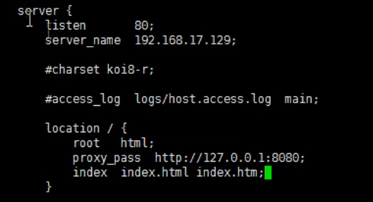
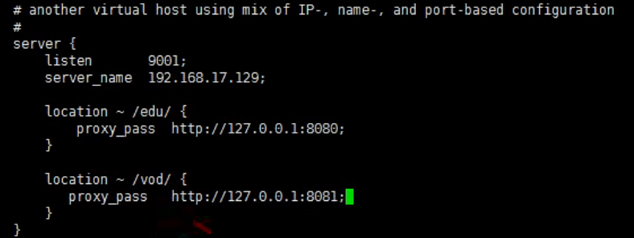
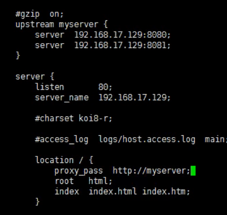
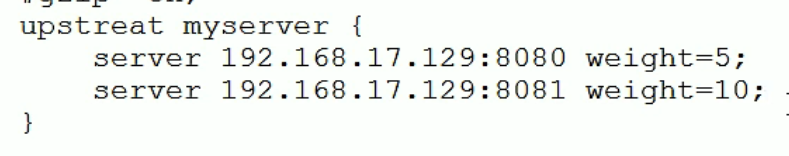
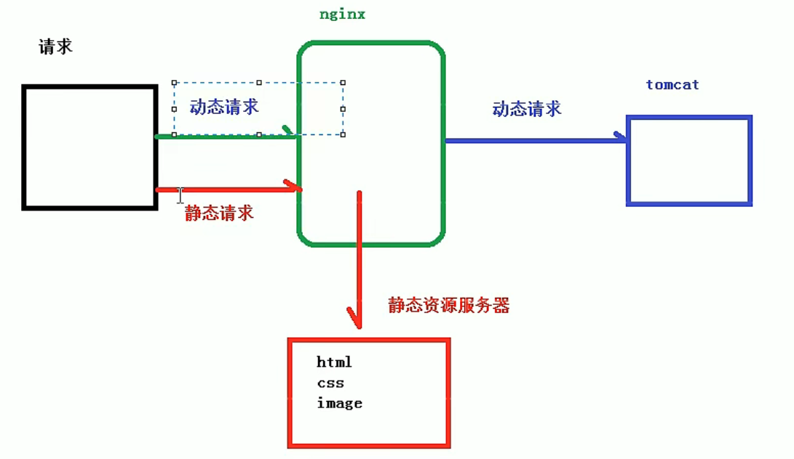
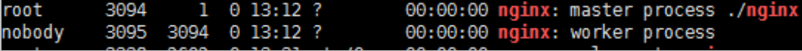
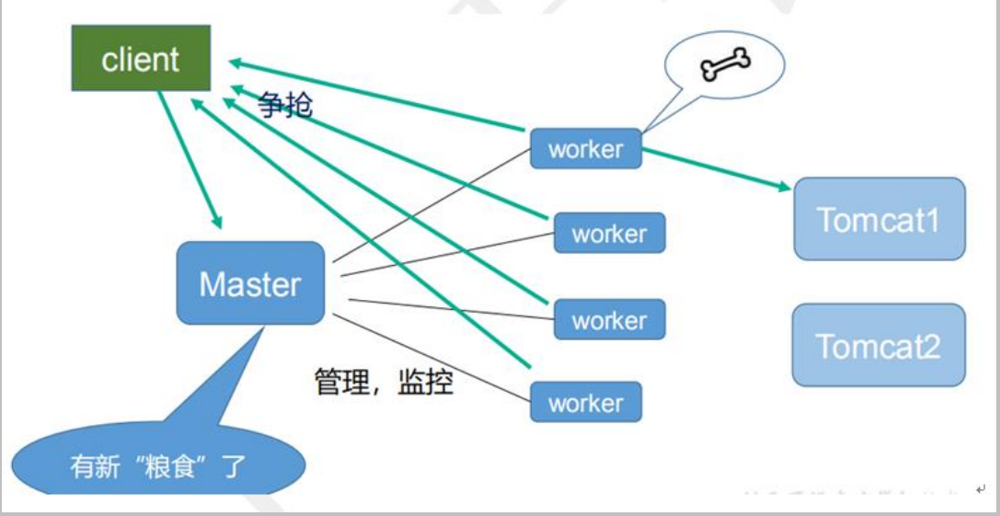
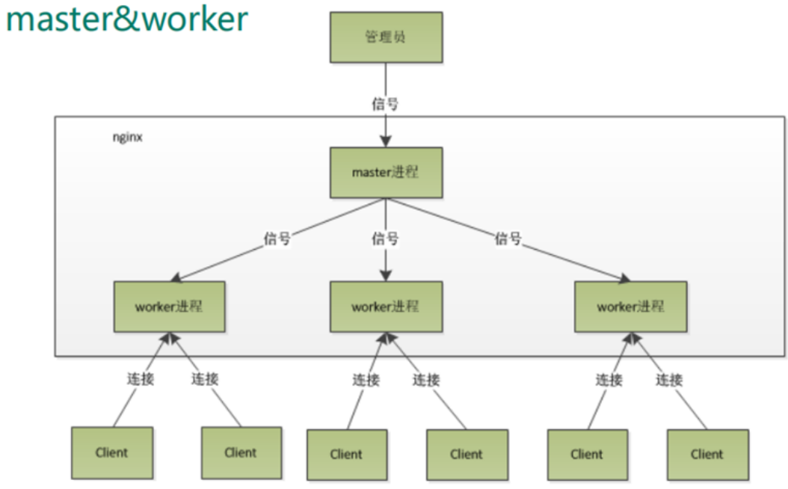

# 1、nginx基本概念

## 1.1、是什么 做什么事情

Nginx是一款[轻量级](https://baike.baidu.com/item/轻量级/10002835)的[Web](https://baike.baidu.com/item/Web/150564) 服务器/[反向代理](https://baike.baidu.com/item/反向代理/7793488)服务器及[电子邮件](https://baike.baidu.com/item/电子邮件/111106)（IMAP/POP3）代理服务器，在BSD-like 协议下发行。其特点是占有内存少，[并发](https://baike.baidu.com/item/并发/11024806)能力强，事实上nginx的并发能力在同类型的网页服务器中表现较好，中国大陆使用nginx网站用户有：百度、[京东](https://baike.baidu.com/item/京东/210931)、[新浪](https://baike.baidu.com/item/新浪/125692)、[网易](https://baike.baidu.com/item/网易/185754)、[腾讯](https://baike.baidu.com/item/腾讯/112204)、[淘宝](https://baike.baidu.com/item/淘宝/145661)等。

在连接高并发的情况下，Nginx是[Apache](https://baike.baidu.com/item/Apache/6265)服务不错的替代品：Nginx在美国是做虚拟主机生意的老板们经常选择的软件平台之一。能够支持高达 50,000 个并发连接数的响应，

## 1.2、反向代理

正向代理：访问不了谷歌，那就访问代理服务器，代理服务器访问谷歌，然后返回结果。

反向代理：请求放松给nginx服务器，nginx选择一个真正的目标服务器进行处理，返回处理结果。隐藏了真实服务器的ip

## 1.3、负载均衡

增加服务器的数量，然后将请求分发给多个服务器上，将原有的请求集中在单个服务器上的情况改为将请求分发给多个服务器上，将负载分发到不同的服务器——负载均衡。

## 1.4、动静分离

为了加快网站的解析速度，可以把动态页面和静态页面由不同的服务器来解析。降低单个服务器的压力。

# 2、nginx安装、常用命令和配置文件

## 2.1、安装

windows

linux：

（1）`sudo apt-get install nginx`

（2）使用命令在`user/sbin`下

（3）安装后的文件结构

a. 配置文件在`/etc/nginx/`

b. 程序文件在`/user/sbin/nginx`

c. 日志文件在`/var/log/nginx`

d. 启动脚本`/etc/init.d`

## 2.2、命令

（1）使用nginx命令必须在nginx目录下。`/nginx/sbin`（linux系统下）

（2）查看版本`./nginx -v`

（3）启动`./nginx`

（4）关闭`./nginx -s stop`

（5）重新加载`./nginx -s reload`,加载`nginx/conf/nginx.conf`文件

## 2.3、配置文件

nginx配置文件的组成部分：a.全局块 b.events块 c.http块

### 2.3.1、全局块

从配置文件到events块之间的内容，主要会设置一些影响nginx服务器整体运行的配置指令。

`worker_processes  1;`值越大，表示并发的数量越多

### 2.3.2、events块

涉及主要影响nginx服务器与用户的网络链接。常用的设置包括是否开启对多``worker_processes  `下的网络连接进行序列化，是否运行同时接受多个网络连接，选取哪种事件驱动模型处理连接请求，每个worker_processes可以同时支持的最大连接数。

```conf
events {
    worker_connections  1024;
}
```

### 2.3.3、http块

nginx服务器中配置最频繁的部分。

http分为 http块和server快

#### 2.3.3.1、http块

包括文件引入、MIME-TYPE定义、日志自定义、连接超时时间、单链接请求数上限等。

#### 2.3.3.2、server块

和虚拟主机有密切关系

**（1）全局server**

```conf
    server {
        listen       80; #监听端口
        server_name  localhost; # 主机名称
        }
```

**（2）location块**

```conf
server{
        location / { #对请求进行处理
            root   html;
            index  index.html index.htm;
        }
}
```


# 3、nginx配置实例

## 3.1、反向代理

### 3.1.1、实现效果

浏览器输入地址，跳转到linux系统tomcat主页面

### 3.1.2、准备工作

在linux中安装启动tomcat，开放访问端口，浏览器测试端口能否访问

### 3.1.3、访问过程：

### 3.1.4、具体配置：

（1）在windows中配置域名与ip的映射

（2）在nginx进行请求转发的配置



`server_name`：对外暴露的ip

`location.proxy_pass`:转发到目的server的`ip:port`



上述配置，根据不同的url访问不同的`ip:port`

### 3.1.5、location指令说明：

（1）`=`;用于不含正则表达式的uri前，要求请求字符串与uri匹配，如果匹配成功，就停止向下搜索并立即处理请求。

（2）`~`：用于表示uri表达式，并且区分大小写

（3）`~*`：用于表示uri表达式，并且不区分大小写

（4）`~~`：

## 3.2、负载均衡

### 3.2.1、实现效果

浏览器输入地址，通过地址访问某个页面，把请求平均分配到8080和8081端口中

### 3.2.2、准备工作

两台tomcat，8080和8081

在两台tomcat中配置页面

### 3.2.3、配置文件



`upstream server_name`：定义服务器列表

`proxy_pass:http://server_name`：转发目的服务器

`listen`：监听的端口

`server_name`：监听的ip

### 3.2.4、分配策略

（1）轮训：每个请求按照时间顺序分配到服务器中，如果服务器挂了，自动剔除。

（2）权重：默认是1，权重越高，分配的请求越多。



（3）ip_hash：每个请求根据访问的ip 的hash结果进行分配，每个访客固定访问一个后端服务器，解决分布式session问题。在upstream中写一个`ip_hash`就可以

（4）fair（第三方）：按照后端服务器响应时间分配请求，响应时间越短的优先分配。在upstream中写一个`fair`就可以

## 3.3、动静分离

方式一：纯粹将静态文件独立炒年糕单独的域名，妨碍独立的服务器上。

方式二：动态跟静态混合在一起发布，通过nginx来分开。



# 4、nginx配置高可用集群

# 5、nginx原理

## 5.1、master和worker





## 5.2、worker是如何工作的



## 5.3、一个 master 和多个 woker 有好处

（1）可以使用 nginx –s reload 热部署，利用 nginx 进行热部署操作 

（2）每个 woker 是独立的进程，如果有其中的一个 woker 出现问题，其他 woker 独立的， 继续进行争抢，实现请求过程，不会造成服务中断

## 5.4、设置多少个 woker 合适

worker 数和服务器的 cpu 数相等是最为适宜的

## 5.5、连接数 worker_connection

第一个：发送请求，占用了 woker 的几个连接数？ 答案：2 或者 4 个 

第二个：nginx 有一个 master，有四个 woker，每个 woker 支持最大的连接数 1024，支持的 最大并发数是多少？  普通的静态访问最大并发数是： worker_connections * worker_processes /2，  而如果是 HTTP 作 为反向代理来说，最大并发数量应该是 worker_connections *  worker_processes/4