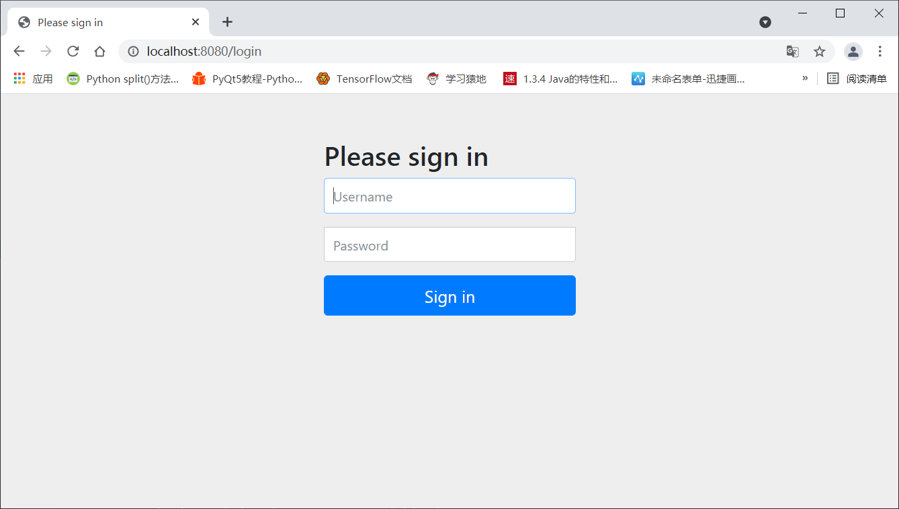
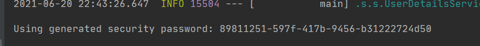

## SpringSecurity

安全框架

1. 核心功能：

   1. 认证（你是谁，用户/设备/系统）
   2. 验证（你能干什么，权限控制、授权）

2. 原理

   基于Filter Servlet AOP 实现

## 快速开始

1. 建立一个springboot项目

2.  依赖

   ```xml
   <?xml version="1.0" encoding="UTF-8"?>
   <project xmlns="http://maven.apache.org/POM/4.0.0" xmlns:xsi="http://www.w3.org/2001/XMLSchema-instance"
            xsi:schemaLocation="http://maven.apache.org/POM/4.0.0 https://maven.apache.org/xsd/maven-4.0.0.xsd">
       <modelVersion>4.0.0</modelVersion>
       <parent>
           <groupId>org.springframework.boot</groupId>
           <artifactId>spring-boot-starter-parent</artifactId>
           <version>2.5.1</version>
           <relativePath/> <!-- lookup parent from repository -->
       </parent>
       <groupId>com.uestc</groupId>
       <artifactId>demo</artifactId>
       <version>0.0.1-SNAPSHOT</version>
       <name>demo</name>
       <description>Demo project for Spring Boot</description>
       <properties>
           <java.version>1.8</java.version>
       </properties>
       <dependencies>
           <dependency>
               <groupId>org.springframework.boot</groupId>
               <artifactId>spring-boot-starter-security</artifactId>
           </dependency>
           <dependency>
               <groupId>org.springframework.boot</groupId>
               <artifactId>spring-boot-starter-web</artifactId>
           </dependency>
   
           <dependency>
               <groupId>org.springframework.boot</groupId>
               <artifactId>spring-boot-starter-test</artifactId>
               <scope>test</scope>
           </dependency>
           <dependency>
               <groupId>org.springframework.security</groupId>
               <artifactId>spring-security-test</artifactId>
               <scope>test</scope>
           </dependency>
       </dependencies>
   
       <build>
           <plugins>
               <plugin>
                   <groupId>org.springframework.boot</groupId>
                   <artifactId>spring-boot-maven-plugin</artifactId>
               </plugin>
           </plugins>
       </build>
   
   </project>
   ```

3. 建立两个html ， 建立controller 

4. 启动

   1. 启动的效果

      

      这是SpringSecurity自带的页面。

      账号：user

      密码：每次都不一样

      

   2. 登录后才是index.html

## UserDetailService

```java
public interface UserDetailsService {

    // username 前端返回的 username
   UserDetails loadUserByUsername(String username) throws UsernameNotFoundException;

}
```

## UserDetails

```java
public interface UserDetails extends Serializable {

    // 获取所有的权限 但不能返回空
   Collection<? extends GrantedAuthority> getAuthorities();

   String getPassword();

   String getUsername();

    // 判断用户是否过期
   boolean isAccountNonExpired();

    // 判断永华是否被锁定
   boolean isAccountNonLocked();

    // 判断密码是否过期
   boolean isCredentialsNonExpired();

    // 判断用户是否可用
   boolean isEnabled();

}
```

实现类：User，注意其构造方法

## PasswordEncoder

```java
public interface PasswordEncoder {
	// 加密
   String encode(CharSequence rawPassword);
	// 匹配 原来的密码 与 加密的密码是否匹配
   boolean matches(CharSequence rawPassword, String encodedPassword);

   default boolean upgradeEncoding(String encodedPassword) {
      return false;
   }

}
```

推荐实现类：BCryptPasswordEncoder 只能加密不能解密

**在项目里，Spring容器里面必须要有一个PasswordEncoder实例**

```java
@Configuration
public class SecurityConfig {

    /**
     * Spring容器中必须要有一个  PasswordEncoder 实例
     * @return
     */
    @Bean
    public PasswordEncoder passwordEncoder() {
        return new BCryptPasswordEncoder();
    }
}
```

## security-demo1

题目：对于不同的用户，有着不同的权限。

```java
/**
 * mayikt_admin 所有接口都可以访问；
 * mayikt_add  只能访问/addMember接口；
 * mayikt_show  只能访问/showMember接口；
 * mayikt_del  只能访问/delMember接口；
 */
```

1. controller 接口

   ```java
   @RestController
   public class MayiktController {
   
       @RequestMapping("/addMember")
       public String add(){
           return "addMember";
       }
   
       @RequestMapping("/updateMember")
       public String update(){
           return "updateMember";
       }
   
       @RequestMapping("/deleteMember")
       public String delete(){
           return "deleteMember";
       }
       @RequestMapping("/showMember")
       public String show(){
           return "showMember";
       }
   }
   ```

2. SecurityConfig 配置

   ```java
   @Configuration
   @EnableWebSecurity
   public class SecurityConfig extends WebSecurityConfigurerAdapter {
   
       /**
        * Spring容器中必须要有一个  PasswordEncoder 实例
        * @return
        */
       @Bean
       public PasswordEncoder passwordEncoder() {
           return new BCryptPasswordEncoder();
       }
   
       @Autowired
       private PasswordEncoder pw;
   
       @Override
       protected void configure(HttpSecurity http) throws Exception {
   
   
           http.authorizeRequests()
                   // 对请求进行认证（分类授权用户） 请求名 权限名
                   .antMatchers("/addMember").hasAnyAuthority("addMember")
                   .antMatchers("/showMember").hasAnyAuthority("showMember")
                   .antMatchers("/deleteMember").hasAnyAuthority("deleteMember")
                   .antMatchers("/updateMember").hasAnyAuthority("updateMember")
                   // 所有请求都需要认证
                   .antMatchers("/**").fullyAuthenticated()
                   // 需要登录
                   .and().formLogin();
       }
   
       /**
        * mayikt_admin 所有接口都可以访问；
        * mayikt_add 账户 只能访问/addMember接口；
        * mayikt_show 账户 只能访问/showMember接口；
        * mayikt_del 账户 只能访问/delMember接口；
        */
   
       @Override
       protected void configure(AuthenticationManagerBuilder auth) throws Exception {
           // 授权用户权限
           auth.inMemoryAuthentication().withUser("mayikt_admin")
                   .password(pw.encode("mayikt_admin")).
                   authorities("addMember", "updateMember", "deleteMember", "showMember");
   
           auth.inMemoryAuthentication()
                   .withUser("mayikt_add").password(pw.encode("mayikt_add")).authorities("addMember")
                   // 链式编程 不同的用户用and()方法连接
                   .and()
                   .withUser("mayikt_show").password(pw.encode("mayikt_show")).authorities("showMember")
                   .and()
                   .withUser("mayikt_del").password(pw.encode("mayikt_del")).authorities("deleteMember");
   
       }
   }
   ```

   ## 权限管理平台——错误页面设置

1. 新键一个配置类，指定报错类型指定的 path

   ```java
   @Configuration
   public class WebServiceAutoConfig {
   
       @Bean
       public ConfigurableServletWebServerFactory webServerFactory() {
           TomcatServletWebServerFactory factory = new TomcatServletWebServerFactory();
           ErrorPage errorPage400 =  new ErrorPage(HttpStatus.BAD_REQUEST, "/error/400");
           ErrorPage errorPage401 =  new ErrorPage(HttpStatus.UNAUTHORIZED, "/error/401");
           ErrorPage errorPage403 =  new ErrorPage(HttpStatus.FORBIDDEN, "/error/403");
           ErrorPage errorPage404 =  new ErrorPage(HttpStatus.NOT_FOUND, "/error/404");
           ErrorPage errorPage415 =  new ErrorPage(HttpStatus.UNSUPPORTED_MEDIA_TYPE, "/error/415");
           ErrorPage errorPage500 =  new ErrorPage(HttpStatus.INTERNAL_SERVER_ERROR, "/error/500");
           factory.addErrorPages(errorPage400, errorPage401, errorPage403, errorPage404, errorPage415, errorPage500);
           return factory;
       }
   }
   ```

2. 编写 controller 控制这个 path

   ```java
   @RestController
   public class ErrorController {
   
       @RequestMapping("/error/403")
       public String error403() {
           return "您访问当前页面权限不足！";
       }
   }
   ```


## 修改默认登录页面

1. 写一个自定义的login表单

   ```html
   <!DOCTYPE html>
   <html lang="en">
   <head>
       <meta charset="UTF-8">
       <title>Title</title>
   </head>
   <body>
   <form action="/login" method="post">
       用户名：<input type="text" name="username" /> <br>
       密码：<input type="password" name="password" /> <br>
       <input type="submit" value="登录">
   </form>
   
   </body>
   </html>
   ```

2. 写一个 controller 类

   ```java
   @Controller
   public class LoginController {
   
       @RequestMapping("/login")
       public String login() {
           return "login";
       }
   
   }
   ```

3. 在配置类的congfigure 方法里添加如下（这里并没有设置<u>欢迎页面</u>）

   ```java
   @Override
   protected void configure(HttpSecurity http) throws Exception {
   
       http.authorizeRequests()
               // 对请求进行认证（分类授权用户） 请求名 权限名
               .antMatchers("/addMember").hasAnyAuthority("addMember")
               .antMatchers("/showMember").hasAnyAuthority("showMember")
               .antMatchers("/deleteMember").hasAnyAuthority("deleteMember")
               .antMatchers("/updateMember").hasAnyAuthority("updateMember")
               // 放行 一些请求，包括登录 访问静态资源
               .antMatchers("/login","/toLogin", "/static/**", "/index").permitAll()
               // 所有请求都需要认证
               .antMatchers("/**").fullyAuthenticated()
               // 需要登录  表单登录
               .and().formLogin().loginPage("/login")
                // 关闭csrf保护
               .and().csrf().disable();
   }
   ```


## 自定义登录成功失败页面

- 不同的人登录之后看到的是不同的页面
- 前后端分离的运用，希望响应的结果是 json 数据，而不是html页面


## RBAC权限模型

RBAC（基于角色的权限控制）模型的核心是在用户和权限之间引入角色的概念。取消了用户和权限的之间关系，改为用户他通过关联角色、角色关联权限的方法简洁的赋予用户权限，从而达到用户和权限解耦的问题。


### 简单理解

**用户  角色 权限** 三个对象，通过两个链接表 **用户角色关系表**  **角色权限关系表** 连接起来

这样做应该会节省数据库大小

### 第一个 RBAC 权限管理系统

**SpringSecurity + Mybatis** 

1. 先准备数据库 

   ```sql
   /*
   SQLyog Ultimate v12.08 (64 bit)
   MySQL - 8.0.16 : Database - weblog
   *********************************************************************
   */
   
   
   /*!40101 SET NAMES utf8 */;
   
   /*!40101 SET SQL_MODE=''*/;
   
   /*!40014 SET @OLD_UNIQUE_CHECKS=@@UNIQUE_CHECKS, UNIQUE_CHECKS=0 */;
   /*!40014 SET @OLD_FOREIGN_KEY_CHECKS=@@FOREIGN_KEY_CHECKS, FOREIGN_KEY_CHECKS=0 */;
   /*!40101 SET @OLD_SQL_MODE=@@SQL_MODE, SQL_MODE='NO_AUTO_VALUE_ON_ZERO' */;
   /*!40111 SET @OLD_SQL_NOTES=@@SQL_NOTES, SQL_NOTES=0 */;
   CREATE DATABASE /*!32312 IF NOT EXISTS*/`weblog` /*!40100 DEFAULT CHARACTER SET utf8 */ /*!80016 DEFAULT ENCRYPTION='N' */;
   
   USE `weblog`;
   
   /*Table structure for table `article` */
   
   DROP TABLE IF EXISTS `article`;
   
   CREATE TABLE `article` (
     `id` int(10) NOT NULL AUTO_INCREMENT COMMENT 'int文章的唯一ID',
     `author` varchar(50) NOT NULL COMMENT '作者',
     `title` varchar(100) NOT NULL COMMENT '标题',
     `content` longtext NOT NULL COMMENT '文章的内容',
     PRIMARY KEY (`id`)
   ) ENGINE=InnoDB AUTO_INCREMENT=2 DEFAULT CHARSET=utf8;
   
   /*Data for the table `article` */
   
   insert  into `article`(`id`,`author`,`title`,`content`) values (1,'韦德壕','韦德壕最喜欢倩倩公主','你爱我 我爱你 我们两个甜蜜蜜');
   
   /*Table structure for table `bloger` */
   
   DROP TABLE IF EXISTS `bloger`;
   
   CREATE TABLE `bloger` (
     `id` int(10) NOT NULL AUTO_INCREMENT COMMENT '主键-用户ID',
     `name` varchar(100) NOT NULL COMMENT '登录名',
     `password` varchar(100) NOT NULL COMMENT '登录密码',
     `blog_ids` varchar(200) DEFAULT NULL COMMENT '发表的博客的id',
     PRIMARY KEY (`id`)
   ) ENGINE=InnoDB AUTO_INCREMENT=2 DEFAULT CHARSET=utf8;
   
   /*Data for the table `bloger` */
   
   insert  into `bloger`(`id`,`name`,`password`,`blog_ids`) values (1,'wade','123456','1,2,3');
   
   /*Table structure for table `sys_permission` */
   
   DROP TABLE IF EXISTS `sys_permission`;
   
   CREATE TABLE `sys_permission` (
     `id` int(10) NOT NULL AUTO_INCREMENT COMMENT '权限的唯一ID',
     `url` varchar(50) NOT NULL COMMENT '请求的URL',
     `permissionName` varchar(50) NOT NULL COMMENT '权限名',
     `permissionIdentifier` varchar(50) NOT NULL COMMENT '权限标识符',
     PRIMARY KEY (`id`)
   ) ENGINE=InnoDB AUTO_INCREMENT=5 DEFAULT CHARSET=utf8;
   
   /*Data for the table `sys_permission` */
   
   insert  into `sys_permission`(`id`,`url`,`permissionName`,`permissionIdentifier`) values (1,'/showMember','查询用户','showMember'),(2,'/addMember','添加用户','addMember'),(3,'/updateMember','更新用户','updateMember'),(4,'/delMember','删除用户','deleteMember');
   
   /*Table structure for table `sys_role` */
   
   DROP TABLE IF EXISTS `sys_role`;
   
   CREATE TABLE `sys_role` (
     `id` int(10) NOT NULL AUTO_INCREMENT COMMENT '角色的唯一ID',
     `rolename` varchar(100) NOT NULL COMMENT '用户名',
     `detail` varchar(200) NOT NULL COMMENT '权限说明',
     PRIMARY KEY (`id`)
   ) ENGINE=InnoDB AUTO_INCREMENT=6 DEFAULT CHARSET=utf8;
   
   /*Data for the table `sys_role` */
   
   insert  into `sys_role`(`id`,`rolename`,`detail`) values (1,'admin','管理员'),(2,'add_user','添加用户'),(3,'delete_user','删除用户'),(4,'update_user','更改用户'),(5,'show_user','查看用户');
   
   /*Table structure for table `sys_role_permission` */
   
   DROP TABLE IF EXISTS `sys_role_permission`;
   
   CREATE TABLE `sys_role_permission` (
     `roleId` int(10) NOT NULL COMMENT '角色唯一ID',
     `permissionId` int(10) NOT NULL COMMENT '权限唯一ID'
   ) ENGINE=InnoDB DEFAULT CHARSET=utf8;
   
   /*Data for the table `sys_role_permission` */
   
   insert  into `sys_role_permission`(`roleId`,`permissionId`) values (1,1),(1,2),(1,3),(1,4),(2,1),(3,2),(4,3);
   
   /*Table structure for table `sys_user` */
   
   DROP TABLE IF EXISTS `sys_user`;
   
   CREATE TABLE `sys_user` (
     `id` int(10) NOT NULL AUTO_INCREMENT COMMENT '用户的唯一ID',
     `username` varchar(100) NOT NULL COMMENT '用户名',
     `password` varchar(100) NOT NULL COMMENT '密码',
     `createTime` date NOT NULL COMMENT '创建时间',
     `lastLoginTime` date NOT NULL COMMENT '最后登录时间',
     PRIMARY KEY (`id`)
   ) ENGINE=InnoDB AUTO_INCREMENT=5 DEFAULT CHARSET=utf8;
   
   /*Data for the table `sys_user` */
   
   insert  into `sys_user`(`id`,`username`,`password`,`createTime`,`lastLoginTime`) values (1,'mayikt_admin','99743025dc21f56c63d0cb2dd34f06f5','2021-06-23','2021-06-23'),(2,'mayikt_show','dd4a5551349c202e5bb9cd095ed13a5a','2021-06-23','2021-06-23'),(3,'mayikt_update','686d9ff20bd20fca4f9fcc980b8ab89b','2021-06-23','2021-06-23'),(4,'mayikt_delete','8dc9eab85abc02a492a6ac2862663da1','2021-06-23','2021-06-23');
   
   /*Table structure for table `sys_user_role` */
   
   DROP TABLE IF EXISTS `sys_user_role`;
   
   CREATE TABLE `sys_user_role` (
     `userId` int(10) NOT NULL COMMENT '用户唯一ID',
     `roleId` int(10) NOT NULL COMMENT '角色唯一ID'
   ) ENGINE=InnoDB DEFAULT CHARSET=utf8;
   
   /*Data for the table `sys_user_role` */
   
   insert  into `sys_user_role`(`userId`,`roleId`) values (1,1),(2,2),(3,3),(4,4);
   
   /*!40101 SET SQL_MODE=@OLD_SQL_MODE */;
   /*!40014 SET FOREIGN_KEY_CHECKS=@OLD_FOREIGN_KEY_CHECKS */;
   /*!40014 SET UNIQUE_CHECKS=@OLD_UNIQUE_CHECKS */;
   /*!40111 SET SQL_NOTES=@OLD_SQL_NOTES */;
   
   ```

2. 实体类

   UserDetails 提供了用户登录相关的所有信息。想要用SpringSecurity，则实体类就得实现这个接口和里面的方法。并且整个类的Setter方法程序调用，而Getter方法被SpringSecurity调用。里面的

   ```java
   @NoArgsConstructor
   @AllArgsConstructor
   @Getter
   @Setter
   @Data
   public class User implements UserDetails {
       private int id;
       private String username;
       private String password;
       private Date createTime;
       private Date lastLoginTime;
   
       private ArrayList<GrantedAuthority> authorities = new ArrayList<>();
   
       @Override
       public Collection<? extends GrantedAuthority> getAuthorities() {
           return authorities;
       }
   
       /**
        * 这几个方法我们没有别用到，但是SpringSecurity 必须要用到这个，
        * 就必须让其返回 true  或者  将对应的属性默认为true
        * @return
        */
       @Override
       public boolean isAccountNonExpired() {
           return true;
       }
   
       @Override
       public boolean isAccountNonLocked() {
           return true;
       }
   
       @Override
       public boolean isCredentialsNonExpired() {
           return true;
       }
   
      	// 这个字段必须返回True， 用户才会被认证。实际中是从数据库里面查的
       @Override
       public boolean isEnabled() {
           return true;
       }
   }
   ```

   ```java
   @AllArgsConstructor
   @NoArgsConstructor
   @Getter
   @Setter
   @Data
   public class Role {
   
       private int id;
       private String roleName;
       private String detail;
   
   }
   ```

   ```java
   @AllArgsConstructor
   @NoArgsConstructor
   @Getter
   @Setter
   @Data
   public class Permission {
   
       private int id;
       // 权限请求的URL
       private String url;
       // 权限名称
       private String permissionName;
       // 权限标识符
       private String permissionIdentifier;
   
   }
   ```

3. dao层

   ```xml
   <?xml version="1.0" encoding="UTF-8"?>
   <!DOCTYPE mapper
           PUBLIC "-//mybatis.org//DTD Mapper 3.0//EN"
           "http://mybatis.org/dtd/mybatis-3-mapper.dtd">
   <mapper namespace="com.uestc.demo.mapper.PermissionMapper">
   
   
       <select id="findAllPermission" resultType="com.uestc.demo.pojo.Permission">
           select * from sys_permission;
       </select>
   </mapper>
   ```

   ```xml
   <?xml version="1.0" encoding="UTF-8"?>
   <!DOCTYPE mapper
           PUBLIC "-//mybatis.org//DTD Mapper 3.0//EN"
           "http://mybatis.org/dtd/mybatis-3-mapper.dtd">
   <mapper namespace="com.uestc.demo.mapper.UserMapper">
   
   
       <select id="findUserByName" resultType="com.uestc.demo.pojo.User">
           select * from sys_user where username = #{username};
       </select>
   
       <select id="findAllPermissionByUsername" resultType="com.uestc.demo.pojo.Permission">
           select sys_permission.*
           from sys_user
           inner join sys_user_role on sys_user.id = sys_user_role.userId
           inner join sys_role_permission on sys_user_role.roleId = sys_role_permission.roleId
           inner join sys_permission on sys_role_permission.permissionId = sys_permission.id
           where username = #{username};
       </select>
   
   
   </mapper>
   ```

   ```java
   @Mapper
   @Repository
   public interface UserMapper {
   
       User findUserByName(String username);
   
       List<Permission> findAllPermissionByUsername(String username);
   }
   ```

   ```java
   @Mapper
   @Repository
   public interface PermissionMapper {
       List<Permission> findAllPermission();
   }
   ```

4. 必须编写一个**UserDetailsService接口的实现类**，实现 loadUserByUsername(String username) 方法，这个方法Spring会自动加载。

   ```java
   @Slf4j
   @Component
   public class UserDetailsServiceImpl implements UserDetailsService {
   
       @Autowired
       private UserMapper userMapper;
   
       @Override
       public UserDetails loadUserByUsername(String username) throws UsernameNotFoundException {
   
           // 1, 查询数据库是否存在，不存在就报错   获取user的全部信息
           User user = userMapper.findUserByName(username);
           if (user == null) {
               return null;
           }
           // 2. 找到user的权限 动态添加
           List<Permission> permissionList = userMapper.findAllPermissionByUsername(username);
   
           // 以下代码是固定的  下去再理解
           ArrayList<GrantedAuthority> grantedAuthorities = new ArrayList<>();
           permissionList.forEach(p -> {
               grantedAuthorities.add(new SimpleGrantedAuthority(p.getPermissionIdentifier()));
           });
           user.setAuthorities(grantedAuthorities);
           log.info(user.toString());
           return user;
       }
   }
   ```

5. 配置Spring，必须动态的配置

   ```java
   @Slf4j
   @Configuration
   @EnableWebSecurity
   public class SecurityConfig extends WebSecurityConfigurerAdapter {
   
       @Bean
       public PasswordEncoder passwordEncoder() {
           return new BCryptPasswordEncoder();
       }
   
       @Autowired
       private PermissionMapper permissionMapper;
   
       @Autowired
       private UserDetailsServiceImpl userDetailsService;
       
       @Override
       protected void configure(HttpSecurity http) throws Exception {
   
           // 先获取所有的用户权限信息，然后加载到SpringSecurity里面去
           List<Permission> allPermission = permissionMapper.findAllPermission();
           ExpressionUrlAuthorizationConfigurer<HttpSecurity>.ExpressionInterceptUrlRegistry registry = http.authorizeRequests();
           allPermission.forEach(ap -> {
               String url = ap.getUrl();
               String permissionIdentifier = ap.getPermissionIdentifier();
               try {
                   registry.antMatchers(url).hasAnyAuthority(permissionIdentifier);
               } catch (Exception e) {
                   e.printStackTrace();
               }
           });
           // 开启功能： 登录 身份验证  关闭csrf防护等
           registry.antMatchers("/login", "/login-sub", "/static/**", "/index").permitAll()
                   .antMatchers("/**").fullyAuthenticated()
                   .and()
                   .formLogin().loginPage("/login")
                   .loginProcessingUrl("/login-sub")
                   .successForwardUrl("/")
                   .defaultSuccessUrl("/index")
                   .failureForwardUrl("/fail")
                   .and().csrf().disable();
       }
   
       @Override
       protected void configure(AuthenticationManagerBuilder auth) throws Exception {
   
           if (userDetailsService == null) {
               return;
           }
   
           // 授权用户权限  还需要设置密码
           auth.userDetailsService(userDetailsService).passwordEncoder(new PasswordEncoder() {
   
               @Override
               public String encode(CharSequence rawPassword) {
                   return MD5Utils.encode((String) rawPassword);
               }
   
               @Override
               public boolean matches(CharSequence rawPassword, String encodedPassword) {
                   String encode = MD5Utils.encode((String) rawPassword);
                   return encode.equals(encodedPassword);
               }
           });
       }
   }
   ```

## SpEL：Spring Expression Language


## oauth2 协议

oauth2 是一个授权协议，