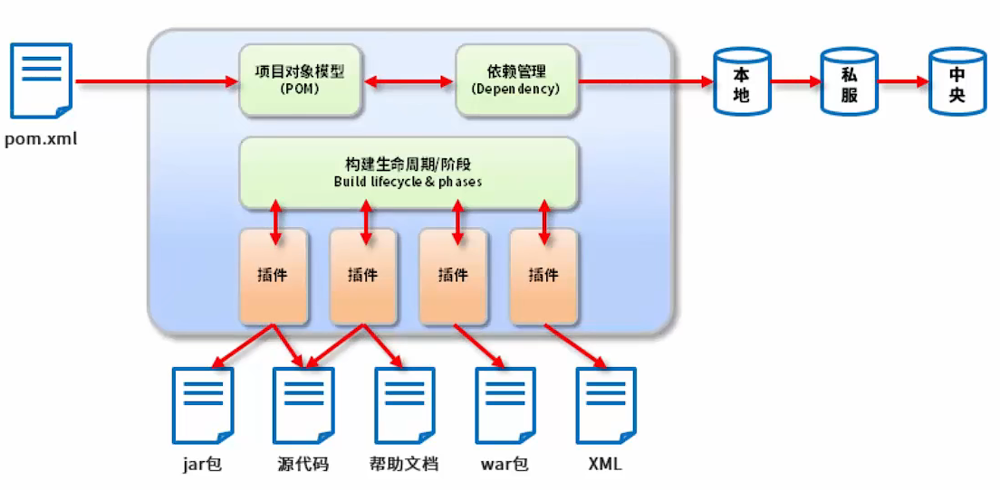
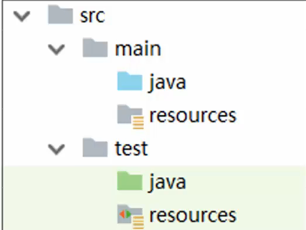
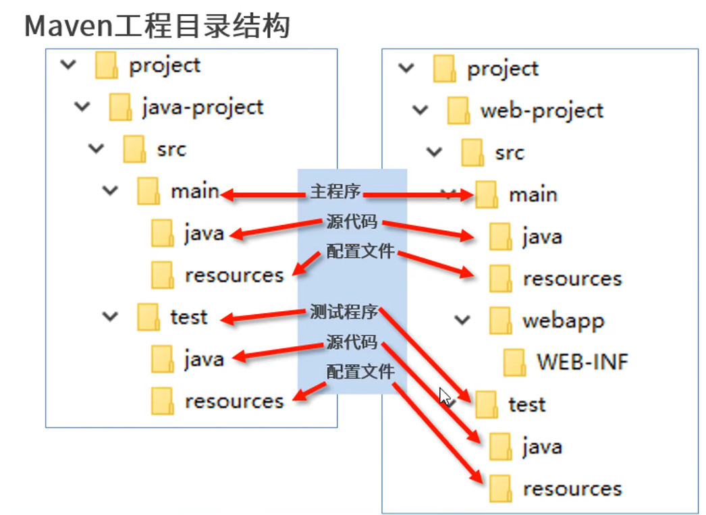
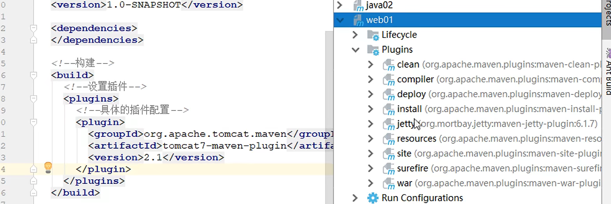

## maven 简介

### maven什么

maven 的本质是一个项目管理工具，将项目开发和管理过程抽象成一个项目对象模型POM

POM：project Object model

pom.xml => 项目对象模型 <=> 依赖管理 => 本地 => 私服 => 中央仓库 



### maven的作用

- 项目构建：提供标准的跨平台的自动化项目构建方式

- 依赖管理：方便快捷的管理项目依赖的资源（jar包），避免资源简的版本冲突问题

- 同一开发结构：

  


## maven 下载与安装

## maven 基本概念

### 仓库：

中央仓库：

私服：

本地仓库：

### 坐标

三部分：

`groupId`：定义当前Maven 项目隶属组织名称

`artifactId`：定义当前Maven项目名称（通常是模块名称）

`version`：版本号

`packaging`：打包方式

## 配置

本地仓库配置：

镜像配置（私服配置）：

## 第一个maven项目（手工制作）

### maven工程目录结构

### 构建命令

`mvn compile`：下载jar包，下载相关插件，编译java文件到 `targert/classes...`里面去

`mvn clean`：清楚掉`/target/classes...`里的文件

`mvn test`：测试`test`目录下面的单元测试，会在`target`下面生成 `surface-reports `测试报告

`mvn package`：编译源程序，编译测试程序，测试，打包

`mvn install`：把写的程序打包成jar，存到本地仓库

### 插件创建过程

- 创建工程

  ```dos
   mvn archetype:generate
   	-DgroupId={project-packaging}
   	-DartifactId={project-name}
   	-DarchetypeArtifactId=maven-archetype-quickstrat
   	-DinteractiveMode=false
  ```

  


## 第一个maven 项目（IDEA）

配置

手工创建java项目

原型创建java项目

原型创建web项目

插件

## 第一个maven程序——tomcat插件安装



## 依赖管理

### 依赖配置与依赖传递

`1.jar => 2.jar => 3.jar`，当引入了1.jar时，2.jar和3.jar也可以使用。模块也是一样。即直接依赖与间接依赖。

依赖中，层级越深，优先级越低。当出现冲突的时候，优先级高的会覆盖优先级低的

### 可选依赖

对外隐藏当前所依赖的资源——不透明。**控制这个资源能否被外界看到。**

```xml
<optional>true</optional>
```

### 排除依赖

将依赖传递中的某个层级依赖排除掉/删除掉。在<dependency>中写标签<exinclusions> <exinclusion>来排除。**主动删除某个资源**

### 依赖范围

作用范围有三种：

- main：主程序文件范围内
- test：测试程序文件范围内
- package：是否参与打包，package指令范围

`<scope></scope>`的值有四种：

- compile：more，main，test，package
- test：test。例子：junit
- provided：main，test。例子servlet-api
- runtime：package。例子 jdbc