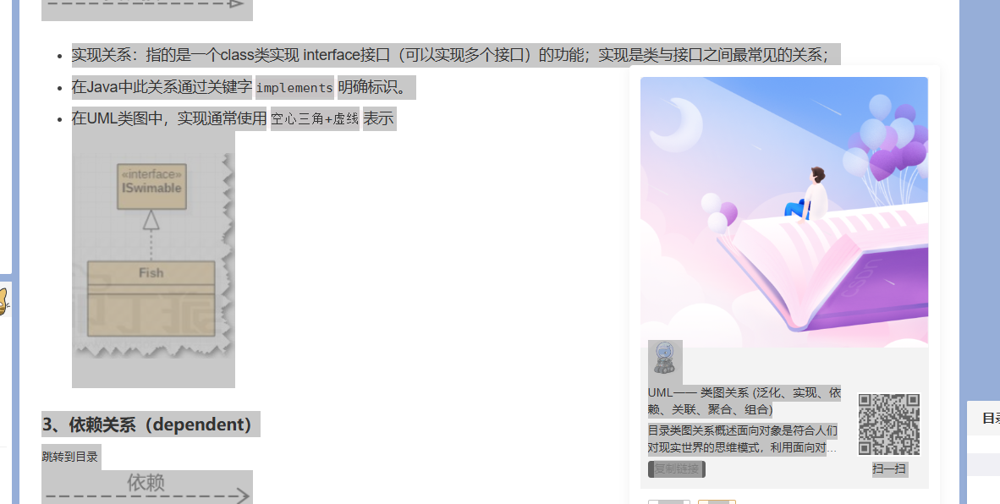

# 设计模式

[23种设计模式UML类图图解_设计模式uml图-CSDN博客](https://blog.csdn.net/qq_40274514/article/details/124047443)

[UML一一 类图关系 (泛化、实现、依赖、关联、聚合、组合)_uml类图关系-CSDN博客](https://blog.csdn.net/m0_37989980/article/details/104470064)

## 建造型

### 单例

### 简单工厂

### 抽象工厂

### 工厂方法

### 原型

### 建造者

## 结构型

### 代理模式

### 适配器模式

### 装饰者模式

### 桥接模式

### 外观模式

### 组合模式

### 享元模式

## 行为型

### 模板方法模式

### 策略模式

### 命令模式

### 责任链模式

### 状态模式

### 观察者模式

### 中介者模式

### 迭代器模式

### 访问者模式

### 备忘录模式

### 解释器模式

### 

## 备注

### UML类 6大关系

#### 泛化 generalization（继承）

#### 实现 realization

#### 依赖 dependent

- 指的是类与类之间的联接。依赖关系表示`一个类依赖于另一个类的定义`。一般而言，依赖关系在Java语言中体现为**成员变量、局域变量、方法的形参、方法返回值**，或者对**静态方法的调用**
- 在UML类图中，依赖通常使用**虚线箭头**表示

#### 关联 association

- 指的是**类与类之间的联接**，**它使一个类知道另一个类的属性和方法（实例变量体现）**。A类依赖于B对象,并且把B作为A的一个成员变量, 则A和B存在关联关系.

- 两个类之前是一个层次的，不存在部分跟整体之间的关系。

#### 聚合关系（aggregtion）

- 聚合关系是`关联关系的一种特例`，他体现的是`整体与部分`，是一种`“弱拥有”`的关系，即`has-a`的关系。聚合是`整体`和`个体`之间的关系。
- 与关联关系一样，**`聚合关系`** 也是通过`实例变量`实现的。**`但是关联关系所涉及的两个类是处在同一层次上的，而在聚合关系中，两个类是处在不平等层次上的，一个代表整体，另一个代表部分。`**

#### 组合关系

- 组合关系是`关联关系的一种特例`，他体现的是一种`contains-a`(包含)的关系，这种关系比聚合更强，也称为`强聚合`。
- **`整体和个体不能独立存在，一定是在一个模块中同时管理整体和个体，生命周期必须相同(级联)。`**
- 在UML类图中，组合通常使用`实心菱形+实线箭头`表示

