# 数据结构

# 1. 概述

## 1.1 什么是数据结构

- 官方：数据结构是一门研究非数值计算的程序设计问题中的操作对象，以及他们之间的关系和操作等相关问题的学科；

- 数据结构就是把数据元素按照一定的关系组织起来的集合，用来组织和存储数据

## 1.2 数据结构分类

- 逻辑结构
  - 集合机构
  - 线性结构
  - 树形结构
  - 图形结构
- 物理结构：逻辑结构在计算机中真正的表示方式
  - 顺序存储结构
  - 链式存储结构

## 1.3 什么是算法

- 算法是指解题方案的准确而完整的描述，是一系列解决问题的清晰指令，算法代表着用系统的方法解决问题的策略 机制。也就是说，能够对一定规范的输入，在有限时间内获得所要求的输出。
- 根据一定的条件，对一些数据进行计算（操作，处理），得到需要的结果。

## 1.4 算法的时间复杂度

### 1.4.1 **大O记法**

**定义：**在进行算法分析时，语句总的执行次数T(n)是关于问题规模n的函数，进而分析T(n)随着n的变化情况并确定T(n)的 量级。算法的时间复杂度，就是算法的时间量度，记作:**T(n)=O(f(n))**。它表示随着问题规模n的增大，算法执行时间 的增长率和f(n)的增长率相同，称作算法的渐近时间复杂度，简称时间复杂度，其中f(n)是问题规模n的某个函数。 在这里，我们需要明确一个事情：执行次数=执行时间

### 1.4.2 常见的大O阶

- 线性阶：N：循环
- 平方阶：N^2：二层循环
- 立方阶：N^3：三层循环
- 对数阶：logN：二分策略
- 常数阶：1：普通语句
- 线性对数阶：NlogN：分治思想
- 指数阶：2^2，穷举查找

O(1)<O(logN)<O(N)<O(NlogN)<O(n^2)<O(n^3)

所以算法追求的是logN,N,NlogN这集几种复杂度

## 1.5 算法的空间复杂度分析

### 1.5.1 java中常见内存占用

| 数据类型 | 内存占用字节数 |
| :------: | :------------: |
|   byte   |       1        |
|  short   |       2        |
|   int    |       4        |
|   long   |       8        |
|  float   |       4        |
|  double  |       8        |
| boolean  |       1        |
|   char   |       2        |

- 一个引用需要8个字节来表示
- 创建一个对象，除了对象内部存储的数据（比如时间信息）占用内存，该对象本身也有内存开销。每个对象自身开销是16字节。
- 内存在使用过程中，如果不够8个字节，会自动填充8个字节
- java中数组被被限定为对象，他们一般都会因为记录长度而需要额外的内存，一个原始数据类型的数组一般需要 24字节的头信息(16个自己的对象开销，4字节用于保存长度以及4个填充字节)再加上保存值所需的内存。

### 1.5.2 空间复杂度

了解了java的内存最基本的机制，就能够有效帮助我们估计大量程序的内存使用情况。 算法的空间复杂度计算公式记作：S(n)=O(f(n)),其中n为输入规模，f(n)为语句关于n所占存储空间的函数。


由于java中有内存垃圾回收机制，并且jvm对程序的内存占用也有优化（例如即时编译），我们无法精确的评估一 个java程序的内存占用情况，但是了解了java的基本内存占用，使我们可以对java程序的内存占用情况进行估算。 

由于现在的计算机设备内存一般都比较大，基本上个人计算机都是4G起步，大的可以达到32G，所以内存占用一般 情况下并不是我们算法的瓶颈，普通情况下直接说复杂度，默认为算法的时间复杂度。 但是，如果你做的程序是嵌入式开发，尤其是一些传感器设备上的内置程序，由于这些设备的内存很小，一般为几 kb，这个时候对算法的空间复杂度就有要求了，但是一般做java开发的，基本上都是服务器开发，一般不存在这样 的问题

# 2. 排序


## 2.1 简单排序

### 2.1.1 Comparable 接口

- Java提供了一个Comparable接口来定义排序规则。

- 只要一个类实现了Comparable接口里的compareTo方法来定义比较规则
- 方法传参数的时候，不知道传入什么类型，都可以向里面传Comparable的参数

### 2.2.2 冒泡排序

**比较规则**： 每一比较相邻的连个元素，每次选出一个最大\最小的放在合适的位置（称为冒泡）

复杂度：O(N^2)

```java
public class BubbleSort {


    public static void sort(Comparable[] c) {
        // 每一次只能确定最后一个位置
        for (int i = c.length-1; i > 0; i--) {
            for (int j = 0; j < i; j++) {
                if (greater(c[j], c[j+1])) {
                    exchange(c, j, j+1);
                }
            }
        }
    }

    /*
    比较规则
     */
    private static boolean greater(Comparable c1, Comparable c2) {
        return c1.compareTo(c2) > 0;
    }

    /*
    交换两个位置的元素
     */
    private static void exchange(Comparable[] c, int i, int j) {
        Comparable temp = c[i];
        c[i] = c[j];
        c[j] = temp;
    }
}
```

### 2.2.3 选择排序

**原理：**

- 每一次遍历的过程中，都假定第一个索引处的元素是最小值，和其他索引处的值依次进行比较，如果当前索引处 的值大于其他某个索引处的值，则假定其他某个索引出的值为最小值，最后可以找到最小值所在的索引
- 交换第一个索引处和最小值所在的索引处的值

```java
public class SelectSort {

    public static void sort(Comparable[] c) {
        for (int i = 0; i < c.length-1; i++) {
            // 记录最小ele的下标
            int minEleIndex = i;
            for (int j = i+1; j < c.length; j++) {
                if (smaller(c[j], c[minEleIndex]))
                    minEleIndex = j;
            }
            exch(c, i, minEleIndex);
        }
    }

    /*
    比较小
     */
    public static boolean smaller(Comparable c1, Comparable c2) {
        return c1.compareTo(c2) < 0;
    }
    /*
    交换位置
     */
    public static void exch(Comparable[] c, int i, int j) {
        Comparable temp = c[i];
        c[i] = c[j];
        c[j] = temp;
    }
}

```

### 2.2.4 插入排序

**原理：**

- 把所有的元素分为两组，已经排序的和未排序的； 
- 找到未排序的组中的第一个元素，向已经排序的组中进行插入； 
- 倒叙遍历已经排序的元素，依次和待插入的元素进行比较，直到找到一个元素小于等于待插入元素，那么就把待 插入元素放到这个位置，其他的元素向后移动一位；

```java
/**
 * 生活场景：打牌 抓扑克牌的时候 对牌进行排序
 * 原理：将数组分为两组，一组排好了（组1）， 一组没排好（组2）。将组2的第一个元素 与 组1 元素作比较小（大），满足比较条件就插入，否则就停止
 * 具体：从第i个元素开始，与第（i-1）比较小（大），小（大）就交换，否则就停止。 i=i-1  i>0
 * 时间复杂度：O(n^2)
 */
public class InsertSort {

    public static void sort(Comparable[] c) {
        // i 为要插入的元素
        for (int i = 1; i < c.length; i++) {
            // j 为要比较的元素（是否要交换的元素）
            for (int j = i; j >= 1; j--) {
                if (greater(c[j-1], c[j]))
                    exch(c, j-1, j);
                else break;
            }
        }
    }
    /*
    c1 > c2 = true
     */
    public static boolean greater(Comparable c1, Comparable c2) {
        return c1.compareTo(c2) > 0;
    }

    /*
    交换两个位置的元素
     */
    public static void exch(Comparable[] c, int i, int j) {
        Comparable temp = c[i];
        c[i] = c[j];
        c[j] = temp;
    }
}
```

## 2.2 高级排序

### 2.2.1 希尔排序

希尔排序是插入排序的一种，又称“缩小增量排序”，是插入排序算法的一种更高效的改进版本。

**原理：**

- 选定一个增长量h，按照增长量h作为数据分组的依据，对数据进行分组； 
- 对分好组的每一组数据完成插入排序；
- 减小增长量，最小减为1，重复第二步操作。

```java
/**
 * 实质：将原数组分成多个（n个）分组，对每一分组进行插入排序，下一次就分成m个分组（m<n），进行插入排序。
 * 原理：
 *      1. 设置一个增长量 h
 *      2. 以h为步长，将原数组分成h个分组
 *      3. 对每个分组进行插入排序
 *      4. 减小h 直到h=1
 *
 * 增长量h满足的规则：
 *      1. 初始h的确定
 *          int h = 1;
 *          while(h<arr.length) { h=2*h+1; }
 *      2. h减少的规则
 *          h=h/2
 *
 *  tips:当h=1时，Shell排序就是插入排序
 */
public class ShellSort {

    public static void sort(Comparable[] c) {
        // 1.确定增长量h的初始值
        int h = 1;
        while (h < c.length/2)  h = 2*h + 1;
        // 2.排序
        while (h >= 1) {
            // 2.1 找到要插入的值
            for (int i = h; i < c.length; i++) {
                // 2.2 找到要比较值的位置
                for (int j = i; j >= h; j -= h) {
                    if (greater(c[j-h], c[j]))
                        exch(c,j-h, j);
                    else
                        break;
                }
            }
            h /= 2;
        }
    }

    /*
    c1 > c2 = true
    */
    public static boolean greater(Comparable c1, Comparable c2) {
        return c1.compareTo(c2) > 0;
    }

    /*
    交换两个位置的元素
     */
    public static void exch(Comparable[] c, int i, int j) {
        Comparable temp = c[i];
        c[i] = c[j];
        c[j] = temp;
    }
}
```

### 2.2.2 归并排序

归并排序是建立在归并操作上的一种有效的排序算法，该算法是采用分治法的一个非常典型的应用。将已有序的子 序列合并，得到完全有序的序列；即先使每个子序列有序，再使子序列段间有序。若将两个有序表合并成一个有序 表，称为二路归并。

**原理：**

- 尽可能的一组数据拆分成两个元素相等的子组，并对每一个子组继续拆分，直到拆分后的每个子组的元素个数是 1为止。
- 将相邻的两个子组进行合并成一个有序的大组；
- 不断的重复步骤2，直到最终只有一个组为止。

**时间复杂度：O(NlogN)**

缺点：空间复杂度大

```java
/**
 * 归并排序：将数组不断的二拆分，一直拆到每个子数组中只有一个元素位置。 归并时进行排序
 * 时间复杂度：O(nlogn)
 */
public class MergeSort {

    // 归并操作中的辅助数组
    private static Comparable[] assist;

    /**
     * 对数组中所有元素进行排序
     * @param c 数组
     */
    public static void sort(Comparable[] c) {
        assist = new Comparable[c.length];
        int low = 0, high = c.length-1;
        sort(c, low, high);
    }

    /**
     * 对数组中部分元素进行排序
     * @param c 数组
     * @param low 起始index
     * @param high 终止index
     */
    public static void sort(Comparable[] c, int low, int high) {
        if (low >= high) {
            return;
        }
        // 不断的对数组进行拆分，直到每个数组只有一个元素为止
        int mid = (high + low) / 2;
        sort(c, low, mid);
        sort(c, mid+1, high);
        // 拆分到只有一个元素，就归并数组，此时（归并）才进行排序
        merge(c, low, mid, high);
    }

    /**
     * 将两个数组合并成一个数组
     * @param c 数组
     * @param low 第一个数组的起始index
     * @param middle 第一个数组的结束index， 第二个数组起始的index为 middle+1
     * @param high 第二个数组的结束index
     */
    public static void merge(Comparable[] c, int low, int middle, int high) {
        // 1. 定义第三个指针*p1 *p2 *p3, 分别指向左数组 右数组 辅助数组
        int p1 = low, p2 = middle+1, p3 = low;
        // 2. （遍历）移动 p1 p2 ,比较*p1 *p2,将小的元素拷贝到辅助数组assist中
        // 一定是两个指针都合法 &&
        while (p1 <= middle && p2 <= high) {
            if (less(c[p1], c[p2])) {
                assist[p3++] = c[p1++];
            } else {
                assist[p3++] = c[p2++];
            }
        }
        // 3. 如果存在一个指针没有遍历到尾巴元素，就将剩下的元素拷贝到assist数组中
        while (p1 <= middle) {
            assist[p3++] = c[p1++];
        }
        while (p2 <= high) {
            assist[p3++] = c[p2++];
        }
        // 4. 拷贝assist中的元素到c
        for (int i = low; i <= high; i++)
            c[i] = assist[i];
    }

    /**
     * 判断c1 是否小于 c2
     * @param c1
     * @param c2
     * @return
     */
    public static boolean less(Comparable c1, Comparable c2) {
        return c1.compareTo(c2) < 0;
    }

    /**
     * 交换数组中两个元素的位置
     * @param c 数组
     * @param i index i
     * @param j index j
     */
    public static void exch(Comparable[] c, int i, int j) {
        Comparable temp = c[i];
        c[i] = c[j];
        c[j] = temp;
    }
}
```

### 2.2.3 快速排序

**基本思想**：通过一趟排序将要排序的数据分割成独立的两部分，其中一 部分的所有数据都比另外一部分的所有数据都要小，然后再按此方法对这两部分数据分别进行快速排序，整个排序 过程可以递归进行，以此达到整个数据变成有序序列

**原理：**

- 首先设定一个分界值，通过该分界值将数组分成左右两部分； 
- 将大于或等于分界值的数据放到到数组右边，小于分界值的数据放到数组的左边。此时左边部分中各元素都小于 或等于分界值，而右边部分中各元素都大于或等于分界值；
- 然后，左边和右边的数据可以独立排序。对于左侧的数组数据，又可以取一个分界值，将该部分数据分成左右两 部分，同样在左边放置较小值，右边放置较大值。右侧的数组数据也可以做类似处理
- 重复上述过程，可以看出，这是一个递归定义。通过递归将左侧部分排好序后，再递归排好右侧部分的顺序。当 左侧和右侧两个部分的数据排完序后，整个数组的排序也就完成了。

**时间复杂度：**O(NlogN)，最坏情况下为O(N^2) 【数组为逆序】

**切分原理**： 把一个数组切分成两个子数组的基本思想： 

- 1.找一个基准值，用两个指针分别指向数组的头部和尾部； 
- 2.先从尾部向头部开始搜索一个比基准值小的元素，搜索到即停止，并记录指针的位置； 
- 3.再从头部向尾部开始搜索一个比基准值大的元素，搜索到即停止，并记录指针的位置； 
- 4.交换当前左边指针位置和右边指针位置的元素； 
- 5.重复2,3,4步骤，直到左边指针的值大于右边指针的值停止。

```java
/**
 * 设置一个分解值，将小于分解值的元素放在其右边，大于的放在其左边。 切分左右边，重复上次过程，使左边和右边的数组有序，整个数组就有序
 * 最好情况 平均情况的时间复杂度：O(nlogn)
 * 最坏情况的时间复杂度：O(n^2)
 */
public class QuickSort {

    /**
     * 对数组全部区域进行排序
     * @param c
     */
    public static void sort(Comparable[] c) {
        int low = 0, high = c.length-1;
        sort(c, low, high);
    }

    /**
     * 对数组部分区域进行排序
     * @param c
     * @param low
     * @param high
     */
    public static void sort(Comparable[] c, int low, int high) {
        if (low >= high) return;
        int mid = partition(c, low, high);
        // 对左子组进行排序
        sort(c, low, mid-1);
        // 对右子组进行排序
        sort(c, mid+1, high);
    }

    /**
     * 对数组中 low~high 区间的元素进行分组  切分
     * @param c 数组
     * @param low  起始index
     * @param high 终止index
     * @return 返回分解值的index
     */
    public static int partition(Comparable[] c, int low, int high) {
        // 1. 确定分解值
        int left = low, right = high + 1;
        Comparable key = c[low];
        // 2. 切分
        while (true) {
            // left找>=key的值,right找一个<=key的值
            // left指针扫描数组左端
            while (less(c[++left], key)) {
                if (left == high) {
                    break;
                }
            }
            // right指针扫描数组右端
            while (less(key, c[--right])) {
                if (right == low) {
                    break;
                }
            }
            //
            if (left >= right) {
                break;
            } else {
                exch(c, left, right);
            }
        }
        // 3. 交换分解值
        exch(c, low, right);
        return right;
    }
    /**
     * 判断c1 是否小于 c2
     * @param c1
     * @param c2
     * @return
     */
    public static boolean less(Comparable c1, Comparable c2) {
        return c1.compareTo(c2) < 0;
    }

    /**
     * 交换数组中两个元素的位置
     * @param c 数组
     * @param i index i
     * @param j index j
     */
    public static void exch(Comparable[] c, int i, int j) {
        Comparable temp = c[i];
        c[i] = c[j];
        c[j] = temp;
    }
}
```

**快速排序和归并排序的区别：**快速排序是另外一种分治的排序算法，它将一个数组分成两个子数组，将两部分独立的排序。快速排序和归并排序 是互补的：归并排序将数组分成两个子数组分别排序，并将有序的子数组归并从而将整个数组排序，而快速排序的 方式则是当两个数组都有序时，整个数组自然就有序了。在归并排序中，一个数组被等分为两半，归并调用发生在 处理整个数组之前，在快速排序中，切分数组的位置取决于数组的内容，递归调用发生在处理整个数组之后。

### 2.2.4 堆排序

### 2.2.5 排序的稳定性

**稳定性的定义：**数组arr中有若干元素，其中A元素和B元素相等，并且A元素在B元素前面，如果使用某种排序算法排序后，能够保 证A元素依然在B元素的前面，可以说这个该算法是稳定的

**稳定性的意义：**如果一组数据只需要一次排序，则稳定性一般是没有意义的，如果一组数据需要多次排序，稳定性是有意义的。例 如要排序的内容是一组商品对象，第一次排序按照价格由低到高排序，第二次排序按照销量由高到低排序，如果第 二次排序使用稳定性算法，就可以使得相同销量的对象依旧保持着价格高低的顺序展现，只有销量不同的对象才需 要重新排序。

# 3. 线性表

**线性表是n个具有相同特性的数据元素的有限序列。**

**线性表的特征**：数据元素之间具有一种“一对一”的逻辑关系。 

1. 第一个数据元素没有前驱，这个数据元素被称为头结点； 
2. 最后一个数据元素没有后继，这个数据元素被称为尾结点； 
3. 除了第一个和最后一个数据元素外，其他数据元素有且仅有一个前驱和一个后继

根据存储方式的不同，线性表分为**顺序表**和**链表**。

## 3.1 顺序表

**顺序表**是在计算机内存中以数组的形式保存的线性表，线性表的顺序存储是指用一组地址连续的存储单元，依次存 储线性表中的各个元素、使得线性表中再逻辑结构上响铃的数据元素存储在相邻的物理存储单元中，即通过数据元 素物理存储的相邻关系来反映数据元素之间逻辑上的相邻关系

### 3.1.1 API设计：

|   类名   | SequenceList                                                 |
| :------: | :----------------------------------------------------------- |
| 构造方法 | SequenceList(int capacity)：创建容量为capacity的SequenceList对象 |
| 成员方法 | 1.public void clear()：空置线性表 <br />2.publicboolean isEmpty()：判断线性表是否为空，是返回true，否返回false <br />3.public int length():获取线性表中元素的个数 <br />4.public T get(int i):读取并返回线性表中的第i个元素的值 <br />5.public void insert(int i,T t)：在线性表的第i个元素之前插入一个值为t的数据元素。 <br />6.public void insert(T t):向线性表中添加一个元素t <br />7.public T remove(int i):删除并返回线性表中第i个数据元素。 <br />8.public int indexOf(T t):返回线性表中首次出现的指定的数据元素的位序号，若不存在，则返 回-1。 |
| 成员变量 | 1.private T[] eles：存储元素的数组 <br />2.private int length:当前线性表的长度 |

### 3.1.2 遍历顺序表

一般作为容器存储数据，都需要向外部提供遍历的方式，因此我们需要给顺序表提供遍历方式。

在java中，遍历集合的方式一般都是用的是foreach循环，如果想让我们的SequenceList也能支持foreach循环，则 需要做如下操作： 

- 1.让SequenceList实现Iterable接口，重写iterator方法； 
- 2.在SequenceList内部提供一个内部类SIterator,实现Iterator接口，重写hasNext方法和next方法；

### 3.1.3 代码实现

```java
public class SquenceList<T> implements Iterable<T> {

    private T[] eles;
    private int length;

    public SquenceList() {
        length = 0;
        eles = (T[]) new Object[0];
    }

    public SquenceList(int capacity) {
        eles = (T[]) new Object[capacity];
        length = capacity;
    }

    @Override
    public Iterator<T> iterator() {
        return new SIterator<T>();
    }

    private class SIterator<T> implements Iterator {

        private int p;

        public SIterator() {
            p = 0;
        }

        @Override
        public boolean hasNext() {
            return p < length;
        }

        @Override
        public Object next() {
            return eles[p++];
        }
    }

    /**
     * 返回线性表中首次出现t的index
     * @param t
     * @return 如果存在则返回index，否则返回-1
     */
    public int indexOf(T t) {
        for (int i = 0; i < length; i++) {
            if (eles[i].equals(t)) {
                return i;
            }
        }
        return -1;
    }

    /**
     * 删除线性表中第index个元素 并返回这个元素
     * @param index
     * @return
     */
    public T remove(int index) {
        T t = eles[index];
        T[] newEles = (T[]) new Object[length-1];

        for (int i = 0; i < index; i++) {
            newEles[i] = eles[i];
        }
        for (int i = index; i < length-1; i++) {
            newEles[i] = eles[i+1];
        }
        eles = newEles;
        return t;
    }

    /**
     * 向线性表的指定位置插入一个值
     * @param ele
     * @param index
     */
    public void insert(T ele, int index) {
        T[] newEles = (T[]) new Object[length+1];
        newEles[index] = ele;
        for (int i = length; i > index; i++) {
            newEles[i] = eles[i-1];
        }
        for (int i = 0; i < index; i++) {
            newEles[i] = eles[i];
        }
        eles = newEles;
    }

    /**
     * 向线性表的末尾插入一个值
     * @param ele
     */
    public void insert(T ele) {
        T[] newEles = (T[]) new Object[length+1];
        for (int i = 0; i < length; i++) {
            newEles[i] = eles[i];
        }
        newEles[length++] = ele;
        eles = newEles;
    }

    /**
     * 改变数组中第i个元素为t
     * @param i
     * @param t
     */
    public void set(int i, T t) {
        eles[i] = t;
    }

    /**
     * 读取线性表对应下标的值
     * @param i
     * @return
     */
    public T get(int i) {
        return eles[i];
    }

    /**
     * 返回线性表的长度
     * @return
     */
    public int length() {
        return length;
    }

    /**
     * 判断线性表是否为空
     * @return true false
     */
    public boolean isEmpty() {
        return length == 0;
    }

    /**
     * 清空eles
     */
    public void clean() {
        length = 0;
    }

    @Override
    public String toString() {
        return "SquenceList{" +
                "eles=" + Arrays.toString(eles) +
                ", length=" + length +
                '}';
    }
}
```

### 3.1.4 容量可变

考虑容器的容量伸缩性，其实就是改变存储数据元素的数组的大小：

什么时候应该改变数组的大小？

- 添加元素：，应该检查当前数组的大小是否能容纳新的元素，如果不能容纳，则需要创建新的容量更大的数组
- 删除元素：，应该检查当前数组的大小是否太大，比如正在用100个容量的数组存储10个元素，这样就会造成内存 空间的浪费，应该创建一个容量更小的数组存储元素。如果我们发现数据元素的数量不足数组容量的1/4，则创建 一个是原数组容量的1/2的新数组存储元素。

增加几个关键方法：

```java
   /**
     * 插入的时候容量可变
     * 当容不下的时候，扩容两倍
     */
    private void checkInsert() {
        if (!check()) {
            length *= 2;
            resize(length);
        }
    }
    /**
     * 删除元素的时候容量可变。
     * 防止浪费空间
     */
    private void checkRemove() {
        if (eles.length <= length / 4) {
            length /= 2;
            resize(length);
        }
    }

/**
 * 改变顺序表的capacity
 * @param newCapacity  newCapacity
 */
private void resize(int newCapacity) {
    // 记录旧数组
    T[] old = eles;
    // 创建新数组
    eles = (T[]) new Object[newCapacity];
    // copy
    for (int i = 0; i < newCapacity; i++) {
        eles[i] = old[i];
    }
}

/**
 * 检查下标
 * @return boolean
 */
private boolean check() {
    if (eles.length <= length) {
        return true;
    }
    return false;
}
```

### 3.1.4 复杂度分析

时间复杂度：

insert(int index, T t)：O(N)

remove(int index)：O(N)

## 3.2 链表

**链表**是一种物理存储单元上非连续、非顺序的存储结构，其物理结构不能只管的表示数据元素的逻辑顺序，数据元 素的逻辑顺序是通过链表中的指针链接次序实现的。链表由一系列的结点（链表中的每一个元素称为结点）组成， 结点可以在运行时动态生成。

### 3.2.1 单向链表

**单向链表**是链表的一种，它由多个结点组成，每个**结点都由一个数据域和一个指针域组成，数据域用来存储数据， 指针域用来指向其后继结点。**链表的头结点的数据域不存储数据，指针域指向第一个真正存储数据的结点。

注意：单向链表有一个头结点，头结点指向第一个数据节点，头结点不存储任何数据，只起到指向链表的作用。

#### 3.2.1.1 节点API设计

|   类名   | Node                                                  |
| :------: | ----------------------------------------------------- |
| 构造方法 | Node(T t,Node next)：创建Node对象                     |
| 成员变量 | 1. T item:存储数据 <br />2. Node next：指向下一个结点 |

#### 3.2.1.2 API设计

|    类名    | LinkList                                                     |
| :--------: | ------------------------------------------------------------ |
|  构造方法  | LinkList()：创建LinkList对象                                 |
|  成员方法  | 1.public void clear()：空置线性表 <br />2.publicboolean isEmpty()：判断线性表是否为空，是返回true，否返回false \|<br />3.public int length():获取线性表中元素的个数 <br />4.public T get(int i):读取并返回线性表中的第i个元素的值 <br />5.public void insert(T t)：往线性表中添加一个元素；<br />6.public void insert(int i,T t)：在线性表的第i个元素之前插入一个值为t的数据元素。<br />7.public T remove(int i):删除并返回线性表中第i个数据元素。 <br />8.public int indexOf(T t):返回线性表中首次出现的指定的数据元素的位序号，若不存在，则 返回-1。 |
| 成员内部类 | private class Node:结点类                                    |
|  成员变量  | 1.private Node head:记录首结点 <br />2.private int N:记录链表的长度 |

#### 2.2.1.3 遍历单向链表

#### 2.2.1.4 代码实现

```java
public class LinkList<T> implements Iterable<T> {

    private Node head;  // 头结点，指向链表的第一个节点
    private int length;

    public LinkList() {
        head = new Node(null, null);
        length = 0;
    }

    @Override
    public Iterator iterator() {
        return new LIterator();
    }

    private class LIterator implements Iterator {

        private Node pNode;

        public LIterator() {
            pNode = head;
        }

        @Override
        public boolean hasNext() {
            return pNode.next != null;
        }

        @Override
        public Object next() {
            pNode = pNode.next;
            return pNode.item;
        }
    }

    /**
     * 节点类
     */
    protected class Node {
        public T item;
        public Node next;

        public Node(T t, Node next) {
            this.item = t;
            this.next = next;
        }
    }

    /**
     * 清空单链表
     */
    public void clear() {
        head.next = null;
        length = 0;
    }

    /**
     * 判断是否为空
     * @return
     */
    public boolean isEmpty() {
        return length == 0 || head.next == null;
    }

    /**
     *获取链表的长度
     * @return
     */
    public int length() {
        return length;
    }

    /**
     * 获取指定index的Node的值
     * @param index
     * @return
     */
    public T get(int index) {
        if (index < 0 || index >= length) {
            throw new IndexOutOfBoundsException("传入的index不合法");
        }
        Node pNode = head.next;
        for (int i = 0; i < index; i++) {
            pNode = pNode.next;
        }
        return (T) pNode.item;
    }

    /**
     * 在单向链表中创建一个环路circle
     * @param index 环路的入口 entrance
     */
    public void createCircle(int index) {
        if (index < 0 || index >= length) {
            throw new IndexOutOfBoundsException("传入的index不合法");
        }
        Node pNode = head.next, entrance = head.next;
        while (pNode.next != null) {
            pNode = pNode.next;
        }
        for (int i = 0; i < index; i++) {
            entrance = entrance.next;
        }
        if (entrance != null) {
            pNode.next = entrance;
        } else {
            throw new NullPointerException("没有这个Node");
        }
    }

    /**
     * 在链表的末尾插入节点
     * @param t 节点值
     */
    public void insert(T t) {
        if (isEmpty()) {
            head.next = new Node(t, null);
        } else {
            Node pNode = head.next;
            while (pNode.next != null) {
                pNode = pNode.next;
            }
            pNode.next = new Node(t, null);
        }
        length++;
    }

    /**
     * 在链表的index位置插入节点t
     * @param t
     * @param index
     */
    public void insert(int index, T t) {
        if (index < 0 || index >= length)
            throw new IndexOutOfBoundsException("输入的index不合法");
        if (length == 0) {
            insert(t);
        } else {
            Node inNode = new Node(t, null);
            Node pNode = head.next;
            // for循环头部的++i 与 i++的效果是一样的
            for (int i = 1; i < index; i++) {
                pNode = pNode.next;
            }
            // 记录原来的Node.next
            Node bNode = pNode.next;
            pNode.next = inNode;
            inNode.next = bNode;
        }
        length++;
    }

    /**
     * 删除链表中指定index的Node的值
     * @return
     */
    public T remove(int index) {
        if (index < 0 || index >= length)
            throw new IndexOutOfBoundsException("输入的index不合法");
        else {
            int i = 0;
            Node pNode = head.next;
            while (i < index-1) {
                pNode = pNode.next;
                i++;
            }
            T result = (T) pNode.next.item;
            pNode.next = pNode.next.next;
            length--;
            return result;
        }
    }

    /**
     * 获取聊表中首次出现t元素的index
     * @param t
     * @return 有这个元素返回index，否则返回-1
     */
    public int indexOf(T t) {
        int index = 0;
        Node pNode = head.next;
        while (index < length) {
            if (pNode.item.equals(t))
                return index;
            else {
                index++;
                pNode = pNode.next;
            }
        }
        return -1;
    }

    /**
     * 反转单链表
     */
    public void reverse() {
        if (isEmpty()) {
            return;
        }
        reverse(head.next);
    }

    /**
     * 递归的方式
     * 单链表反转节点node  并且返回这个节点
     * @param node
     * @return
     */
    public Node reverse(Node node) {
        if (node.next == null) {
            head.next = node;
            return node;
        }
        Node pre = reverse(node.next);
        pre.next = node;
        node.next = null;
        return node;
    }

    /**
     * 用快慢指针获取链表的中间值
     * 快指针是慢指针的两倍速度，最后返回慢指针的值
     * @return 慢指针的item
     */
    public T getMid() {
        if (isCircle()) {

        }
        Node fast = head.next, slow = head.next;
        while (fast.next != null && slow != null) {
            fast = fast.next.next;
            slow = slow.next;
        }
        return slow.item;
    }

    /**
     * 用快慢指针判断链表是否存在环路
     * @return
     */
    public boolean isCircle() {
        Node fast = head.next, slow = head.next;
        while (fast != null && fast.next != null) {
            fast = fast.next.next;
            slow = slow.next;
            if (fast == slow) {
                return true;
            }
        }
        return false;
    }

    /**
     * 当快慢指针相遇的时候，定义一个新指针tmp，其速度与慢指针一样，
     * 继续遍历，tmp与慢指针相遇的地方就是环的入口（Entrance）
     */
    public Node getEntrance() {
        if (!isCircle()) {
            System.out.println("没有环路");
            return null;
        }
        Node fast = head.next, slow = head.next, tmp = head.next;
        while (fast != null && fast.next != null) {
            fast = fast.next.next;
            slow = slow.next;
            if (fast == slow) {
                break;
            }
        }
        while (tmp != slow) {
            tmp = tmp.next;
            slow = slow.next;
        }
        return tmp;
    }

    /**
     * 获取 circle 的 entrance
     * @return T
     */
    public T getEntranceItem() {
        Node en = getEntrance();
        if (en == null) {
            return null;
        }
        return en.item;
    }

    /**
     * 处理掉链表中的Circle
     */
    public void destoryCircle() {
        Node entrance = getEntrance();
        Node pNode = head.next;
        while (pNode.next == entrance) {
            pNode = pNode.next;
        }
        pNode.next = null;
    }

}
```


### 3.2.2 双向链表

#### 3.2.2.1 节点API设计

|   类名   | Node                                                         |
| :------: | ------------------------------------------------------------ |
| 构造方法 | Node(T t,Node next)：创建Node对象                            |
| 成员变量 | 1. T item:存储数据 <br />2. Node pre ：指向上一个节点<br />3. Node next：指向下一个结点 |

#### 3.2.2.2 API设计

|    类名    | DoubleLinkList                                               |
| :--------: | ------------------------------------------------------------ |
|  构造方法  | DoubleLinkList()：创建LinkList对象                           |
|  成员方法  | 1.public void clear()：空置线性表 <br />2.publicboolean isEmpty()：判断线性表是否为空，是返回true，否返回false \|<br />3.public int length():获取线性表中元素的个数 <br />4.public T get(int i):读取并返回线性表中的第i个元素的值 <br />5.public void insert(T t)：往线性表中添加一个元素；<br />6.public void insert(int i,T t)：在线性表的第i个元素之前插入一个值为t的数据元素。<br />7.public T remove(int i):删除并返回线性表中第i个数据元素。 <br />8.public int indexOf(T t):返回线性表中首次出现的指定的数据元素的位序号，若不存在，则 返回-1。<br />9.public T getFirst():获取第一个元素<br />10.public T getLast():获取最后一个元素 |
| 成员内部类 | private class Node:结点类                                    |
|  成员变量  | 1.private Node head:记录首结点 <br />3.private Node tail；记录尾结点<br />2.private int N:记录链表的长度 |

#### 3.2.2.3 遍历

#### 3.2.2.4 代码实现

```java
package com.main.LinearList.LinkedList;

import java.util.Iterator;

public class DoubleLinkList<T> implements Iterable<T> {

    private Node head;
    private int length;


    public DoubleLinkList() {
        head = new Node(null, null, null);
        length = 0;
    }

    /**
     * 清空单链表
     */
    public void clear() {
        head.next = null;
        length = 0;
    }

    /**
     * 判断是否为空
     *
     * @return
     */
    public boolean isEmpty() {
        return length == 0 || head.next == null;
    }

    /**
     * 获取链表的长度
     *
     * @return
     */
    public int length() {
        return length;
    }

    /**
     * 获取指定index的Node的值
     *
     * @param index
     * @return
     */
    public T get(int index) {
        checkIndex(index);
        Node pNode = head.next;
        for (int i = 0; i < index; i++) {
            pNode = pNode.next;
        }
        return (T) pNode.item;
    }

    /**
     * 在单向链表中创建一个环路circle
     *
     * @param index 环路的入口 entrance
     */
    public void createCircle(int index) {
        checkIndex(index);
        Node pNode = head.next, entrance = head.next;
        while (pNode.next != null) {
            pNode = pNode.next;
        }
        for (int i = 0; i < index; i++) {
            entrance = entrance.next;
        }
        if (entrance != null) {
            pNode.next = entrance;
            entrance.pre = pNode;
        } else {
            throw new NullPointerException("没有这个Node");
        }
    }

    /**
     * 在链表的末尾插入节点
     *
     * @param t 节点值
     */
    public void insert(T t) {
        if (isEmpty()) {
            head.next = new Node(t, null, null);
        } else {
            Node pNode = head.next;
            while (pNode.next != null) {
                pNode = pNode.next;
            }
            pNode.next = new Node(t, null, null);
        }
        length++;
    }

    /**
     * 在链表的index位置插入节点t
     *
     * @param t
     * @param index
     */
    public void insert(int index, T t) {
        checkIndex(index);
        if (length == 0) {
            insert(t);
        } else {
            Node inNode = new Node(t, null, null);
            Node pNode = head.next;
            // for循环头部的++i 与 i++的效果是一样的
            for (int i = 1; i < index; i++) {
                pNode = pNode.next;
            }
            // 记录原来的Node.next
            Node bNode = pNode.next;
            pNode.next = inNode;
            inNode.next = bNode;
        }
        length++;
    }

    /**
     * 删除链表中指定index的Node的值
     *
     * @return
     */
    public T remove(int index) {
        checkIndex(index);
        Node pNode = head.next;
        for (int i = 1; i < index; i++) {
            pNode = pNode.next;
        }
        T result = (T) pNode.next.item;
        Node nextNode = pNode.next.next;
        nextNode.pre = pNode;
        pNode.next = nextNode;
        length--;
        return result;
    }

    /**
     * 获取聊表中首次出现t元素的index
     *
     * @param t
     * @return 有这个元素返回index，否则返回-1
     */
    public int indexOf(T t) {
        Node pNode = head.next;
        for (int i = 0; i < length; i++) {
            if (pNode.equals(t)) {
                return i;
            } else {
                pNode = pNode.next;
            }
        }
        return -1;
    }

    /**
     * 反转双向链表
     */
    public void reverse() {
        if (isEmpty()) {
            return;
        }
        reverse(head.next);
    }

    /**
     * 递归的方式
     * 双链表反转节点node  并且返回这个节点
     *
     * @param node
     * @return
     */
    public Node reverse(Node node) {
        if (node.next == null) {
            head.next = node;
            return node;
        }
        Node pre = reverse(node.next);
        pre.next = node;
        node.pre = pre;
        node.next = null;
        return node;
    }

    /**
     * 用快慢指针获取链表的中间值
     * 快指针是慢指针的两倍速度，最后返回慢指针的值
     *
     * @return 慢指针的item
     */
    public T getMid() {
        if (isCircle()) {

        }
        Node fast = head.next, slow = head.next;
        while (fast.next != null && slow != null) {
            fast = fast.next.next;
            slow = slow.next;
        }
        return slow.item;
    }

    /**
     * 用快慢指针判断链表是否存在环路
     *
     * @return
     */
    public boolean isCircle() {
        Node fast = head.next, slow = head.next;
        while (fast != null && fast.next != null) {
            fast = fast.next.next;
            slow = slow.next;
            if (fast == slow) {
                return true;
            }
        }
        return false;
    }

    /**
     * 当快慢指针相遇的时候，定义一个新指针tmp，其速度与慢指针一样，
     * 继续遍历，tmp与慢指针相遇的地方就是环的入口（Entrance）
     */
    public Node getEntrance() {
        if (!isCircle()) {
            System.out.println("没有环路");
            return null;
        }
        Node fast = head.next, slow = head.next, tmp = head.next;
        while (fast != null && fast.next != null) {
            fast = fast.next.next;
            slow = slow.next;
            if (fast == slow) {
                break;
            }
        }
        while (tmp != slow) {
            tmp = tmp.next;
            slow = slow.next;
        }
        return tmp;
    }

    /**
     * 获取 circle 的 entrance
     *
     * @return T
     */
    public T getEntranceItem() {
        Node en = getEntrance();
        if (en == null) {
            return null;
        }
        return en.item;
    }

    /**
     * 处理掉链表中的Circle
     */
    public void destoryCircle() {
        Node entrance = getEntrance();
        Node pNode = head.next;
        while (pNode.next == entrance) {
            pNode = pNode.next;
        }
        pNode.next = null;
    }

    public void checkIndex(int index) {
        if (index < 0 || index >= length) {
            throw new IndexOutOfBoundsException("输入的index不合法");
        }
    }

    @Override
    public Iterator<T> iterator() {
        return new DllIterator();
    }

    private class DllIterator implements Iterator {

        public Node pNode;

        public DllIterator() {
            pNode = head;
        }

        @Override
        public boolean hasNext() {
            return pNode.next != null;
        }

        @Override
        public Object next() {
            pNode = pNode.next;
            return pNode.item;
        }
    }


    private class Node {
        public T item;
        public Node pre;
        public Node next;

        public Node(T t, Node pre, Node next) {
            this.item = t;
            this.pre = pre;
            this.next = next;
        }
    }
}
```

### 3.3.3 复杂度分析

remove(int i): O(N)
insert(int i, T t): O(N)
get(int i ): O(N)

### 3.3.4 链表反转

链表的头节点成为链表的尾结点........

直观理解：使用递归可以完成反转，递归反转其实就是从原链表的第一个存数据的结点开始，依次递归调用反转每一个结点， 直到把最后一个结点反转完毕，整个链表就反转完毕。

**代码实现**：

```java
/**
 * 反转双向链表
 */
public void reverse() {
    if (isEmpty()) {
        return;
    }
    reverse(head.next);
}

/**
 * 递归的方式
 * 双链表反转节点node  并且返回这个节点
 *
 * @param node
 * @return
 */
public Node reverse(Node node) {
    // 到最后一个节点的时候
    if (node.next == null) {
        head.next = node;
        return node;
    }
    Node pre = reverse(node.next);
    pre.next = node;
    node.pre = pre;
    node.next = null;
    return node;
}
```

### 3.3.5 快慢指针

快慢指针指的是定义两个指针，这两个指针的移动速度一块一慢，以此来制造出自己想要的差值，这个差值可以然 我们找到链表上相应的结点。一般情况下，快指针的移动步长为慢指针的两倍

#### 3.3.5.1 中间值问题

查询链表中间值：

```java
    /**
     * 用快慢指针获取链表的中间值
     * 快指针是慢指针的两倍速度，最后返回慢指针的值
     *
     * @return 慢指针的item
     */
    public T getMid() {
        if (isCircle()) {

        }
        Node fast = head.next, slow = head.next;
        while (fast.next != null && slow != null) {
            fast = fast.next.next;
            slow = slow.next;
        }
        return slow.item;
    }
```


#### 3.3.5.2 链表环路

如果链表有环路，那快慢指针一定会相遇

```java
/**
 * 用快慢指针判断链表是否存在环路
 *
 * @return
 */
public boolean isCircle() {
    Node fast = head.next, slow = head.next;
    while (fast != null && fast.next != null) {
        fast = fast.next.next;
        slow = slow.next;
        if (fast == slow) {
            return true;
        }
    }
    return false;
}
```

#### 3.3.5.3 链表环路入口

```java
/**
 * 当快慢指针相遇的时候，定义一个新指针tmp，其速度与慢指针一样，
 * 继续遍历，tmp与慢指针相遇的地方就是环的入口（Entrance）
 */
public Node getEntrance() {
    if (!isCircle()) {
        System.out.println("没有环路");
        return null;
    }
    Node fast = head.next, slow = head.next, tmp = head.next;
    while (fast != null && fast.next != null) {
        fast = fast.next.next;
        slow = slow.next;
        if (fast == slow) {
            break;
        }
    }
    while (tmp != slow) {
        tmp = tmp.next;
        slow = slow.next;
    }
    return tmp;
}
```

### 3.3.6 循环链表

在单向链表中，最后一个节点的指针为null，不指向任何结 点，因为没有下一个元素了。要实现循环链表，我们只需要让单向链表的最后一个节点的指针指向头结点即可。

#### 3.3.6.1 节点API

#### 3.3.6.2 API设计

#### 3.3.6.3 代码实现

```java
package com.main.LinearList.LinkedList;

import java.util.Iterator;

public class CircleLinkList<T> implements Iterable<T> {

    private Node head;
    private Node tail;
    private int length;

    public CircleLinkList() {
        head = new Node(null, null);
        tail = new Node(null, null);
        length = 0;
    }

    public int length() {
        return length;
    }

    /**
     * 判断是否是空链表
     * @return
     */
    public boolean isEmpty() {
        return length == 0 || head.next == null || tail.next == null;
    }

    /**
     * 清空链表
     */
    public void clear() {
        head.next = null;
        tail.next = null;
        length = 0;
    }

    /**
     * 获取第index个元素
     * @param index
     * @return
     */
    public T get(int index) {
        checkIndex(index);
        Node pNode = head.next;
        for (int i = 0; i < index; i++) {
            pNode = pNode.next;
        }
        return pNode.item;
    }

    /**
     * 在双向链表的末尾插入t
     * @param t
     */
    public void insert(T t) {
        Node node = new Node(t, null);
        if (isEmpty()) {
            head.next = node;
            tail.next = node;
            node.next = node;
        } else {
            tail.next.next = node;
            tail.next = node;
            node.next = head.next;
        }
        length++;
    }

    /**
     * 在指定index处插入t
     * @param index
     * @param t
     */
    public void insert(int index, T t) {
        checkIndex(index);
        Node pNode = head.next;
        for (int i = 1; i < index; i++) {
            pNode = pNode.next;
        }
        Node node = new Node(t, pNode.next);
        length++;
        pNode.next = node;
    }

    /**
     * 删除指定index 的t
     * @param index
     * @return
     */
    public T remove(int index) {
        checkIndex(index);
        Node pNode = head.next;
        for (int i = 1; i < index; i++) {
            pNode = pNode.next;
        }
        T t = pNode.next.item;
        pNode.next = pNode.next.next;
        length--;
        return t;
    }

    /**
     * 找到出现第一个元素t的index
     * @param t
     * @return
     */
    public int indexOf(T t) {
        Node pNode = head.next;
        int index = 0;
        while (pNode.next != null) {
            if (pNode.item.equals(t)) {
                return index;
            }
            pNode = pNode.next;
            index++;
        }
        return -1;
    }

    /**
     * 检查传入的index合法
     * @param index
     */
    public void checkIndex(int index) {
        if (index < 0 || index >= length)
            throw new IndexOutOfBoundsException("输入的index不合法");
    }

    @Override
    public Iterator iterator() {
        return new CLIterator();
    }

    private class CLIterator implements Iterator {

        private Node pNode;

        public CLIterator() {
            pNode = head;
        }

        @Override
        public boolean hasNext() {
            return pNode != tail.next;
        }

        @Override
        public Object next() {
            pNode = pNode.next;
            return pNode.item;
        }
    }
    /**
     * 节点类
     */
    private class Node {
        public T item;
        public Node next;

        public Node(T t, Node next) {
            this.item = t;
            this.next = next;
        }
    }
}
```

### 3.3.7 约瑟夫问题


**问题描述：** 传说有这样一个故事，在罗马人占领乔塔帕特后，39 个犹太人与约瑟夫及他的朋友躲到一个洞中，39个犹太人决 定宁愿死也不要被敌人抓到，于是决定了一个自杀方式，41个人排成一个圆圈，第一个人从1开始报数，依次往 后，如果有人报数到3，那么这个人就必须自杀，然后再由他的下一个人重新从1开始报数，直到所有人都自杀身亡 为止。然而约瑟夫和他的朋友并不想遵从。于是，约瑟夫要他的朋友先假装遵从，他将朋友与自己安排在第16个与 第31个位置，从而逃过了这场死亡游戏 。 

**问题转换：** 41个人坐一圈，第一个人编号为1，第二个人编号为2，第n个人编号为n。 1.编号为1的人开始从1报数，依次向后，报数为3的那个人退出圈； 2.自退出那个人开始的下一个人再次从1开始报数，以此类推； 3.求出最后退出的那个人的编号。

## 3.3 栈

特点：FILO 先进后出

### 3.3.1 API设计

|   类名   | Stack                                                        |
| :------: | ------------------------------------------------------------ |
| 构造方法 | Stack()：创建Stack对象                                       |
| 成员方法 | 1.public boolean isEmpty()：判断栈是否为空，是返回true，否返回false <br />2.public int size():获取栈中元素的个数 <br />3.public T pop():弹出栈顶元素 <br />4.public void push(T t)：向栈中压入元素t |
| 成员变量 | 1.private Node head:记录首结点 <br />2.private int size:当前栈的元素个数 |

### 3.3.2 代码实现

```java
package com.main.stack;

import java.util.Iterator;

/**
 * 用链表实现栈
 */
public class Stack<T> implements Iterable<T> {

    private int size;   // 栈的大小
    private Node head;  // 头结点

    public Stack() {
        size = 0;
        head = new Node(null,null);
    }

    public boolean isEmpty() { return size == 0; }

    public int size() { return size; }

    public void clear() {
        head = new Node(null,null);
        size = 0;
    }

    /**
     * t入栈
     * @param t
     */
    public void push(T t) {
        Node pNode;
        if (!isEmpty()) {
            pNode = head.next;
            head.next = new Node(t, pNode);
        } else {
            head.next = new Node(t, null);
        }
        size++;
    }

    /**
     * 出栈
     * @return 栈顶元素
     */
    public T pop() {
        if (isEmpty())
            throw new NullPointerException("栈为空");
        T t = head.next.item;
        head.next = head.next.next;
        size--;
        return t;
    }

    @Override
    public Iterator iterator() {
        return new StackIterator();
    }

    private class StackIterator implements Iterator {

        public Node pNode;

        public StackIterator() {
            pNode = head;
        }

        @Override
        public boolean hasNext() {
            return pNode.next != null;
        }

        @Override
        public Object next() {
            pNode = pNode.next;
            return pNode.item;
        }
    }

    private class Node {
        public T item;
        public Node next;

        public Node(T t, Node n) {
            item = t;
            next = n;
        }
    }
}
```

## 3.4 队列

队列是一种基于先进先出(FIFO)的数据结构，是一种只能在一端进行插入,在另一端进行删除操作的特殊线性表

### 3.4.1 API设计

|   类名   | Queue                                                        |
| :------: | ------------------------------------------------------------ |
| 构造方法 | Queue()：创建Queue对象                                       |
| 成员方法 | 1.public boolean isEmpty()：判断队列是否为空，是返回true，否返回false<br />2.public int size():获取队列中元素的个数 <br />3.public T dequeue():从队列中拿出一个元素 <br />4.public void enqueue(T t)：往队列中插入一个元素 |
| 成员变量 | 1.private Node head:记录首结点 <br />2.private int N:当前栈的元素个数 <br />3.private Node last:记录最后一个结点 |

### 3.4.2 代码实现

```java
package com.main.queue;

import java.util.Iterator;

public class Queue<T> implements Iterable<T> {

    private int length;
    private Node head;
    private Node tail;


    public Queue() {
        length = 0;
        head = null;
        tail = null;
    }

    public boolean isEmpty() {
        return length == 0 || head == null || tail == null;
    }

    public int size() {
        return size();
    }

    /**
     * 入队
     * @param t
     */
    public void enqueue(T t) {
        Node node = new Node(t, null);
        if (isEmpty()) {
            head = new Node(null, node);
            tail = new Node(null, node);
        } else {
            tail.next.next = node;
            tail.next = node;
        }
        length++;
    }

    public T dequeue() {
        if (isEmpty())
            throw new NullPointerException("队列中没有元素");
        T t = head.next.item;
        head.next = head.next.next;
        length--;
        return t;
    }

    private class Node {
        public T item;
        public Node next;

        public Node(T t, Node ne) {
            item = t;
            next = ne;
        }
    }

    @Override
    public Iterator<T> iterator() {
        return new QIterator();
    }

    private class QIterator implements Iterator {

        private Node pNode;

        public QIterator() {
            pNode = head;
        }
        @Override
        public boolean hasNext() {
            if (isEmpty()) {
                return false;
            }
            return pNode != tail.next;
        }

        @Override
        public Object next() {
            pNode = pNode.next;
            return pNode.item;
        }
    }

}
```

# 4. 符号表

符号表最主要的目的就是将一个键和一个值联系起来，符号表能够将存储的数据元素是一个键和一个值共同组成的 键值对数据，我们可以根据键来查找对应的值

## 4.1 API设计

**节点类：**

|   类名   | Node<Key, Value>                                             |
| :------: | ------------------------------------------------------------ |
| 构造方法 | Node(Key key,Value value,Node next)：创建Node对象            |
| 成员变量 | 1.public Key key:存储键 <br />2.public Value value:存储值 <br />3.public Node next:存储下一个结点 |

**符号表**

|   类名   | SymbolTable<Key, Value>                                      |
| :------: | ------------------------------------------------------------ |
| 构造方法 | SymbolTable()：创建SymbolTable对象                           |
| 成员方法 | 1.public Value get(Key key)：根据键key，找对应的值 <br />2.public void put(Key key,Value val):向符号表中插入一个键值对 <br />3.public void delete(Key key):删除键为key的键值对 <br />4.public int size()：获取符号表的大小 |
| 成员变量 | 1.private Node head:记录首结点 <br />2.private int length:记录符号表中键值对的个数 |

## 4.2 代码实现

```java
package com.main.SymbolTable;

import java.util.Iterator;

public class SymbolTable<K, V> {

    private int length;
    private Node head;

    public SymbolTable() {
        length = 0;
        head = new Node<K, V>(null, null, null);
    }

    public boolean isEmpty() {
        return length == 0;
    }

    public void clear() {
        length = 0;
        head = new Node<K, V>(null, null, null);
    }

    public int length() {
        return length;
    }

    /**
     * 获取key对应的value
     * @param k
     * @return
     */
    public V getValue(K k) {
        if (isEmpty())
            return null;
        Node pNode = head.next;
        while (!pNode.key.equals(k)) {
            pNode = pNode.next;
        }
        return (V) pNode.value;
    }

    /**
     * 增加键值对 <k,v>
     * @param k
     * @param v
     */
    public void put(K k, V v) {
        Node<K, V> node = new Node<>(k, v, null);
        if (isEmpty()) {
            head.next = node;
        } else {
            Node pNode = head.next;
            while (pNode.next != null) {
                // 如果 k 已经存在，则修改 v
                if (pNode.key.equals(k)) {
                    pNode.value = v;
                    return;
                }
                pNode = pNode.next;
            }
            pNode.next = node;
        }
        length++;
    }

    /**
     * 删除键值对 <k,v>
     * @param k
     * @return
     */
    public V remove(K k) {
        if (isEmpty())
            throw new NullPointerException("容器为空");
        Node pNode = head;
        while (!pNode.next.key.equals(k) && pNode.next != null) {
            pNode = pNode.next;
        }
        V v = (V) pNode.next.value;
        pNode.next = pNode.next.next;
        length--;
        return v;
    }

    private class Node<K, V> {
        public K key;
        public V value;
        public Node next;

        public Node(K k, V v, Node n) {
            key = k;
            value = v;
            next = n;
        }
    }

}
```

## 4.3 有序符号表

刚才实现的符号表，我们可以称之为无序符号表，因为在插入的时候，并没有考虑键值对的顺序，而在实际生活 中，有时候我们需要根据键的大小进行排序，插入数据时要考虑顺序，那么接下来我们就实现一下有序符号表。

### 4.3.1 插入代码

```java
public void put(Key key, Value value) {
    Node node = new Node(key, value, null);
    if (isEmpty()) {
        head.next = node;
    } else {
        Node pNode = head.next;
        while (true) {
            // 替换value
            if (key.equals(pNode.key)) {
                pNode.value = value;
                return;
            }
            // 首部插值
            if (greater(head.next, node)) {
                node.next = head.next;
                head.next = node;
                break;
            }
            // 末尾插值
            if (pNode.next == null) {
                pNode.next = node;
                break;
            }
            // 中间插值
            if (greater(node, pNode) && greater(pNode.next, node)) {
                node.next = pNode.next;
                pNode.next = node;
                break;
            }

            // 进入下一个节点
            pNode = pNode.next;
        }
    }
    length++;
}
```

### 4.3.2 有序表实现

```java
package com.main.SymbolTable;


import java.util.Iterator;

public class OrderSymbolTable<Key extends Comparable<Key>, Value> implements Iterable<Key> {

    private int length;
    private Node head;

    public OrderSymbolTable() {
        length = 0;
        head = new Node(null, null, null);
    }

    /**
     * 向符号表中插入元素
     * @param key
     * @param value
     */
    public void put(Key key, Value value) {
        Node node = new Node(key, value, null);
        if (isEmpty()) {
            head.next = node;
        } else {
            Node pNode = head.next;
            while (true) {
                // 替换value
                if (key.equals(pNode.key)) {
                    pNode.value = value;
                    return;
                }
                // 首部插值
                if (greater(head.next, node)) {
                    node.next = head.next;
                    head.next = node;
                    break;
                }
                // 末尾插值
                if (pNode.next == null) {
                    pNode.next = node;
                    break;
                }
                // 中间插值
                if (greater(node, pNode) && greater(pNode.next, node)) {
                    node.next = pNode.next;
                    pNode.next = node;
                    break;
                }

                // 进入下一个节点
                pNode = pNode.next;
            }
        }
        length++;
    }

    private boolean greater(Node one, Node another) {
        return one.key.compareTo(another.key) > 0;
    }

    /**
     * 获取key对应的value
     * @param k
     * @return
     */
    public Value getValue(Key k) {
        if (isEmpty())
            return null;
        Node pNode = head.next;
        while (!pNode.key.equals(k)) {
            pNode = pNode.next;
        }
        return (Value) pNode.value;
    }


    public boolean isEmpty() {
        return length == 0;
    }

    public void clear() {
        length = 0;
        head = new Node(null, null, null);
    }

    public int length() {
        return length;
    }

    @Override
    public Iterator<Key> iterator() {
        return new OSTIterator<Key>();
    }


    private class OSTIterator<Key> implements Iterator {

        private Node pNode;

        public OSTIterator() {
            pNode = head;
        }

        @Override
        public boolean hasNext() {
            if (isEmpty()) {
                return false;
            }
            return pNode.next != null;
        }

        @Override
        public Key next() {
            pNode = pNode.next;
            return (Key) pNode.key;
        }


    }

    private class Node {
        public Key key;
        public Value value;
        public Node next;

        public Node(Key key, Value value, Node n) {
            this.key = key;
            this.value = value;
            next = n;
        }
    }

}
```

#  5. 树

之前我们实现的符号表中，不难看出，符号表的增删查操作，随着元素个数N的增多，其耗时也是线性增多的，时 间复杂度都是O(n),为了提高运算效率，人们发现了树这种数据结构。

## 5.1 概念

### 5.1.1 基本定义

树是由n（n>=1）个有限结点组成一个具有层次关系的集合。把它叫做“树”是因为它看起来像一棵倒挂的树，也就 是说它是根朝上，而叶朝下的。

### 5.1.2 特点

1. 每个节点有0或多个子节点
2. 没有父节点的节点为根节点
3. 每一个非根节点只有一个父节点
4. 每个节点及后代节点从整体上可以看做成一棵树，为其父节点的子树

### 5.1.3 术语

1. **节点的度**：节点含有子树的个数称为该节点的度
2. **叶子节点**：度为0的节点（终端节点）
3. **分支节点**：处理叶子节点之外的节点
4. 节点的层次：从根节点开始，根节点为1，后续子节点分别+1
5. 节点的层序编号：将书中的节点，按照从上层到下层，同层从左到右按照自然数编号
6. 树的度：树种所有节点度的最大值
7. 树的深度（高度）：树种节点最大层次
8. 森林： 多个不相交的树的集合。 将一科非空的树的根节点去掉，就变成一个森林
9. 孩子节点：节点的直接后继节点（儿子们）
10. 双亲节点（父节点）：节点的直接前驱节点
11. 兄弟节点：

## 5.2 二叉树

定义：度不超过2的树

### 5.2.1 满二叉树

一个二叉树的每一个层的节点数都达到最大值 （节点数 2^(k-1) ）

### 5.2.2 完全二叉树

叶子节点只能出现在最下层或者次下层；并且最下面一层的节点都集中在该层最左边的若干位置;
最后一层节点不要求是满的，其他的每一层节点都要求是满的

## 5.3 二叉查找树

### 5.3.1 规则

1. 数组和链表 有优势也有劣势，而二叉树结构综合了这两种数据结构的优势。
2. 首先是二叉树 T，对于任意的node （node为T中任意一个节点），
   如果左右子节点都存在，则一定满足 node.left < node < node.right

### 5.3.2 二叉树节点API设计

|   类名    | Node<Key, Value>                                             |
| :-------: | ------------------------------------------------------------ |
| 构造方 法 | Node(Key key, Value value, Node left, Node right)：创建Node对象 |
| 成员变量  | 1. public Key key; <br />2. public Value value; <br />3. public Node left; <br />4. public Node right; |

### 5.3.3 二叉查找树API设计

|   类名    | BinaryTree<Key extends Comparable<Key>, Value>               |
| :-------: | ------------------------------------------------------------ |
| 构造方 法 | BinaryTree()：创建BinaryTree对象                             |
| 成员变量  | 1.private Node root:记录根结点 <br />2.private int size:记录树中元素的个数 |
| 成员方法  | 1. public void put(Key key,Value value):向树中插入一个键值对 <br />2.private Node put(Node x, Key key, Value val)：给指定树x上，添加键一个键值对，并返回添 加后的新树 <br />3.public Value get(Key key):根据key，从树中找出对应的值 <br />4.private Value get(Node x, Key key):从指定的树x中，找出key对应的值 <br />5.public void delete(Key key):根据key，删除树中对应的键值对 <br />6.private Node delete(Node x, Key key):删除指定树x上的键为key的键值对，并返回删除后的新树 7.public int size():获取树中元素的个数 |

### 5.3.4 代码实现

```java
package com.main.BinaryTree;


import com.main.queue.Queue;

/**
 * 二叉查找树
 * 对于key：小于父节点的节点是左子节点，反之为右子节点
 * @param <Key>  泛型使用CompareTo方法的写法 ：  <Key extends Comparable<Key>, Value>
 * @param <Value>
 */
public class BinaryTree<Key extends Comparable<Key>, Value> {

    private Node root; // 指向树的根节点
    private int size; // 树种节点的个数

    public BinaryTree() {
//        root = new Node(null, null, null, null);
        root = null;
        size = 0;
    }

    /**
     * 在树中查找最小的key
     * @return
     */
    public Key min() {
        return min(root).key;
    }

    /**
     * 在子树node中查找最小的key的节点
     * @param node
     * @return
     */
    public Node min(Node node) {
        Node p = root;
        while (p.left != null) {
            p = p.left;
        }
        return p;
    }

    /**
     * 在树中查找最小的key
     * @return
     */
    public Key max() {
        return max(root).key;
    }

    /**
     * 在子树node中查找最小的key的节点
     * @param node
     * @return
     */
    public Node max(Node node) {
        Node p = root;
        while (p.right != null) {
            p = p.right;
        }
        return p;
    }


    /**
     * 在树中插入一个键值对
     * 如果树为空，则把新节点作为根节点
     * 如果树不为空，从根节点开始：
     * 1. 新节点的key小于当前节点的key，则继续寻找当前节点的左子节点
     * 2.           大于                            右子节点
     * 3.           等于           ，则树中存在该节点，替换该节点的value
     * @param key
     * @param value
     */
    public void put(Key key, Value value) {
        if (isEmptyTree()) {
            //  当树为空的 时候
            root = new Node(key, value, null, null);
            size++;
            return;
        }
        put(root, key, value);
    }

    /**
     * 在子树node中插入一个键值对
     * @param node
     * @param key
     * @param value
     */
    public Node put(Node node, Key key, Value value) {
        if (node == null) {
            size++;
            return new Node(key, value, null, null);
        }
        int p = key.compareTo(node.key);
        if (p < 0) {
            node.left = put(node.left, key, value);
        } else if (p > 0) {
            node.right = put(node.right, key, value);
        } else {
            node.value = value;
            size++;
        }
        return node;
    }

    /**
     * 根据key的值，在树中找出对应的value
     * @param key
     * @return
     */
    public Value get(Key key) {
        return get(root, key);
    }

    /**
     * 从节点node出发，比较当前节点的key 与 key的值
     * < 0: 则 从左子节点继续找
     * > 0:    从右子节点继续找
     * = 0: 返回
     * @param node
     * @param key
     * @return
     */
    public Value get(Node node, Key key) {
        if (node == null) {
            return null;
        }
        int p = key.compareTo(node.key);
        if (p < 0) {
            return get(node.left, key);
        } else if (p > 0) {
            return get(node.right, key);
        } else {
            return node.value;
        }
    }

    /**
     * 根据key 删除对应的节点
     * @param key
     */
    public void delete(Key key) {
        delete(root, key);
    }

    /**
     * 先找到要删除的节点node，然后以node节点为子树，找到子树的右子树中key最小的节点
     * @param node
     * @param key
     * @return
     */
    public Node delete(Node node, Key key) {
        if (node == null) {
            return null;
        }
        int p = key.compareTo(node.key);
        if (p < 0) {
            node.left = delete(node.left, key);
        } else if (p > 0) {
            node.right = delete(node.right, key);
        } else {
            // 找到要删除的节点node后
            size--;
            // 特殊情况
            if (node.left == null) {
                return node.right;
            }
            if (node.right == null) {
                return node.left;
            }
            // 一般情况 先找到右子树的最小key节点 minRightChildTreeNode，
            // 删除这个节点,
            Node pNode = node.right;
            while (pNode.left.left != null) {
                pNode = pNode.left;
            }
            Node minRightChildTreeNode = pNode.left;
            pNode.left = null;
            // 用 minRightChildTreeNode 代替 node
            minRightChildTreeNode.left = node.left;
            minRightChildTreeNode.right = node.right;
            node = minRightChildTreeNode;
        }
        // 最后返回这个节点 minRightChildTreeNode
        return node;
    }

    /**
     * 获取整个树中所有的key  前序遍历
     * @return
     */
    public Queue<Key> preErgodic() {
        Queue<Key> keys = new Queue<>();
        preErgodic(root, keys);
        return keys;
    }

    /**
     * 将指定子树的所有key，放在队列keys中
     * 1. 先将根节点的key存放在队列中
     * 2. 将左子树所有的key放在队列中
     * 3. 将右子树所有的key放在队列中
     * @param node
     * @param keys
     */
    public void preErgodic(Node node, Queue<Key> keys) {
        if (node == null) {
            return;
        }
        // 存入当前node的key
        keys.enqueue(node.key);
        // 存入当前node.left的key
        if (node.left != null) {
            preErgodic(node.left, keys);
        }
        // 存入当前node.right的key
        if (node.right != null) {
            preErgodic(node.right, keys);
        }
    }

    /**
     * 中序遍历整棵树
     * @return
     */
    public Queue<Key> midErgodic() {
        Queue<Key> keys = new Queue<>();
        midErgodic(root, keys);
        return keys;
    }

    /**
     * 中序遍历node子树
     * 将node子树的key存放在队列keys中
     * 1. 先将左子树的所有key放在队列中
     * 2. 将根节点的key放在队列中
     * 3. 将右子树的所有key放在队列中
     * @param node
     * @param keys
     */
    public void midErgodic(Node node, Queue<Key> keys) {
        if (node == null) {
            return;
        }
        // left child tree
        if (node.left != null) {
            midErgodic(node.left, keys);
        }
        // root tree of node of child tree
        keys.enqueue(node.key);
        // right child tree
        if (node.right != null) {
            midErgodic(node.right, keys);
        }
    }

    /**
     * 后序遍历整个树
     * @return
     */
    public Queue<Key> afterErgodic() {
        Queue<Key> keys = new Queue<>();
        afterErgodic(root, keys);
        return keys;
    }

    /**
     * 后序遍历node子树
     * 1. 先将左子树的所有key值放入keys中
     * 2. 再将右子树的所有key值放入keys中
     * 3. 将node的key值放入keys中
     * @param node node子树
     * @param keys
     */
    public void afterErgodic(Node node, Queue<Key> keys) {
        if (node == null) {
            return;
        }
        if (node.left != null) {
            afterErgodic(node.left, keys);
        }
        if (node.right != null) {
            afterErgodic(node.right, keys);
        }
        keys.enqueue(node.key);
    }

    /**
     * 层序遍历：从上往下、从左往右
     * 1. 创建队列 nodes，存储每一层节点
     * 2. 使用循环队列，每一次出队一个节点node，node.key入队到keys：
     *  2.1. 当node有左子节点，则入队左子节点到nodes
     *  2.2. 当node有右子节点，则入队右子节点到nodes
     * @return 树的节点的队列
     */
    public Queue<Key> layerErgodic() {
        Queue<Key> keys = new Queue<>();
        Queue<Node> nodes = new Queue<>();
        nodes.enqueue(root);
        while (!nodes.isEmpty()) {
            // 从nodes中出队node，node的key入队到keys中，对node进行左右子节点处理
            Node node = nodes.dequeue();
            keys.enqueue(node.key);
            // 将左右子节点 入队到nodes
            if (node.left != null) {
                nodes.enqueue(node.left);
            }
            if (node.right != null) {
                nodes.enqueue(node.right);
            }
        }
        return keys;
    }

    /**
     * 获取整个树的最大深度
     * @return int
     */
    public int maxDepth() {
        return maxDepth(root);
    }

    /**
     * 获取node子树的最大深度
     * 1. 计算左子树的最大深度maxl
     * 2. 计算右子树的最大深度maxr
     * 3. max{maxl, maxr}
     * @param node 子树的根节点
     * @return node子树的最大深度
     */
    public int maxDepth(Node node) {
        if (node == null) {
            return 0;
        }
        int maxL = 0, maxR = 0;
        if (node.left != null) {
            maxL = maxDepth(node.left);
        }
        if (node.right != null) {
            maxR = maxDepth(node.right);
        }
        return maxL > maxR ? maxL + 1 : maxR + 1;
    }

    public int size() {
        return size;
    }

    public boolean isEmptyTree() {
        return size == 0;
    }

    private class Node {
        public Key key;
        public Value value;
        public Node left;
        public Node right;

        public Node(Key key, Value value, Node left, Node right) {
            this.key = key;
            this.value = value;
            this.left = left;
            this.right = right;
        }
    }
}
```

## 5.4 树的遍历规则（访问顺序）

1. 前序遍历: 根节点、左子树、右子树
2. 中序遍历: 左子树、根节点、右子树 （会生成一个有序的数据）
3. 后序遍历: 左子树、右子树、根节点
4. 层序遍历（高级遍历）: 直观的看，从上往下，从左往右遍历 

## 5.5 树的最大深度

实现步骤：

1. 如果根结点为空，则最大深度为0； 
2. 计算左子树的最大深度； 
3. 计算右子树的最大深度； 
4. 当前树的最大深度=左子树的最大深度和右子树的最大深度中的较大者+1

```java
public int maxDepth()
```

```java
public int maxDepth(Node node)
```

## 5.6 平衡树

用一种方法，使得树能够不受插入数据的影响，让生成的树都像完全二叉树那样（生成一颗类似于完全二叉树的树）

### 5.6.1 2-3查找树

为了保证查找树的平衡性，我们需要一些灵活性，因此在这里我们允许树中的一个结点保存多个键。确切的说，我 们将一棵标准的二叉查找树中的结点称为2-结点(含有一个键和两条链)，而现在我们引入3-结点，它含有两个键和 三条链。2-结点和3-结点中的每条链都对应着其中保存的键所分割产生的一个区间。

#### 5.6.1.1 定义

一棵2-3查找树要么为空，要么满足满足下面两个要求：

- **2-节点**：含有一个键(及其对应的值)和两条链，左链接指向2-3树中的键都小于该结点，右链接指向的2-3树中的键都大 于该结点。
- **3-节点**：含有两个键(及其对应的值)和三条链，左链接指向的2-3树中的键都小于该结点，中链接指向的2-3树中的键都 位于该结点的两个键之间，右链接指向的2-3树中的键都大于该结点。

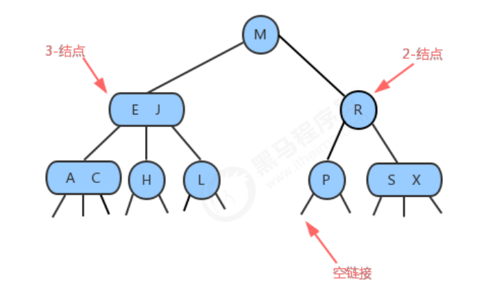

#### 5.6.1.2 查找

- 要判断一个键是否在树中，我们先将它和 根结点中的键比较。
- 如果它和其中任意一个相等，查找命中；
- 否则我们就根据比较的结果找到指向相应区间的连 接，并在其指向的子树中递归地继续查找。
- 如果这个是空链接，查找未命中。 

#### 5.6.1.3 插入

往2-3树中插入元素和往二叉查找树中插入元素一样，首先要进行查找，然后将节点挂到未找到的节点上。

##### 5.6.1.3.1 向2-节点插入新节点

如果查找后未找到的节点是一 个2-结点，那么很容易，我们只需要将新的元素放到这个2-结点里面使其变成一个3-结点即可。

##### 5.6.1.3.2 向3-节点插入新节点

假设2-3树只包含一个3-结点，这个结点有两个键，没有空间来插入第三个键了，最自然的方式是我们假设这个结 点能存放三个元素，暂时使其变成一个4-结点，同时他包含四条链接。然后，我们将这个4-结点的中间元素提升， 左边的键作为其左子结点，右边的键作为其右子结点。插入完成，变为平衡2-3查找树，树的高度从0变为1。

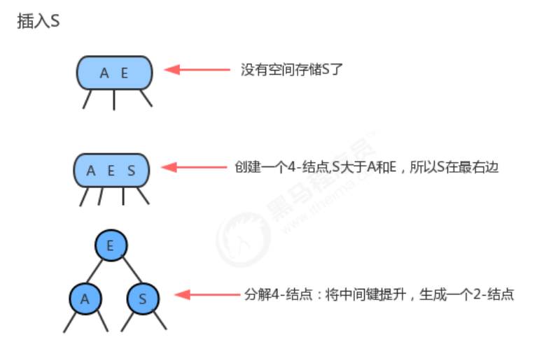

##### 5.6.1.3.3 向一个父节点为2-节点的3-节点插入新节点

和上面的情况一样一样，我们也可以将新的元素插入到3-结点中，使其成为一个临时的4-结点，然后，将该结点中 的中间元素提升到父结点即2-结点中，使其父结点成为一个3-结点，然后将左右结点分别挂在这个3-结点的恰当位 置。


##### 5.6.1.3.4 向一个父节点为3-节点的3-节点插入新节点

当我们插入的结点是3-结点的时候，我们将该结点拆分，中间元素提升至父结点，但是此时父结点是一个3-结点， 插入之后，父结点变成了4-结点，然后继续将中间元素提升至其父结点，直至遇到一个父结点是2-结点，然后将其 变为3-结点，不需要继续进行拆分

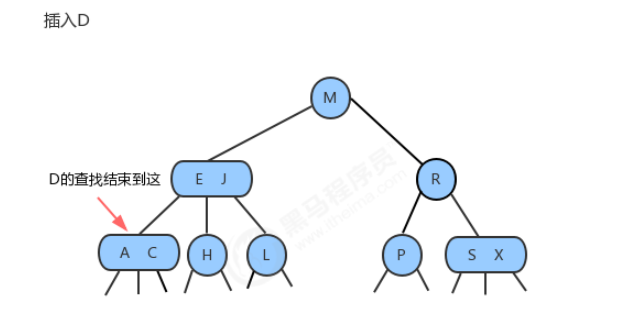

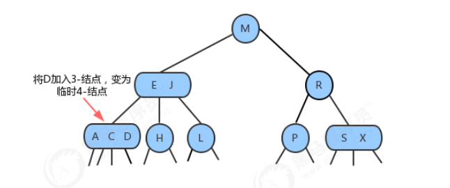


##### 5.6.1.3.5 分解根节点

当插入结点到根结点的路径上全部是3-结点的时候，最终我们的根结点会变成一个临时的4-结点，此时，就需要将 根结点拆分为两个2-结点，树的高度加1。

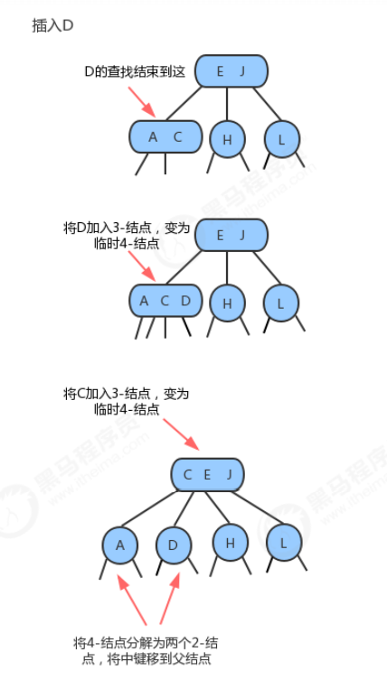

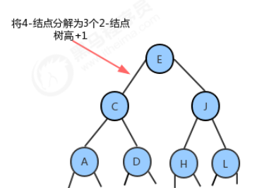

#### 5.6.1.4 性质

1. 任意空链接到根节点的路径长度是一样的
2. 节点是3-节点的时候，树的高度不会变化，只要到根节点是4-节点的时候，树的高度才会+1
3. 2-3查找树 与 普通的树的最大区别:普通树是自顶向下生长，而2-3查找树相反

#### 5.4.1.5 实现

由一种特殊的2-3查找树——红黑树实现。

2-3查找树实现起来比较复杂，在某些情况插入后的平衡操作可能会使得效率降低。但是2-3查找树作为一种比较重 要的概念和思路对于我们后面要讲到的红黑树、B树和B+树非常重要。

### 5.6.2 红黑树

**红黑树**主要是对2-3树进行编码，红黑树背后的基本思想是用标准的二叉查找树(完全由2-结点构成)和一些额外的信 息(替换3-结点)来表示2-3树。我们将树中的链接分为两种类型：

- 红链接：将两个2-结点连接起来构成一个3-结点
- 黑链接：则是2-3树中的普通链接。

确切的说，我们将3-结点表示为由由一条左斜的红色链接(两个2-结点其中之一是另一个的左子结点)相连的两个2- 结点。这种表示法的一个优点是，我们无需修改就可以直接使用标准的二叉查找树的get方法。

#### 5.6.2.1 红黑树的定义

红黑树是含有红黑链接并满足下列条件的二叉查找树：

- 红链接均为左链接
- 没有任何一个节点同时和两条红链接相连
- 该树是完美**黑色平衡的**，**即任意空链接到根结点的路径上的黑链接数量相同**

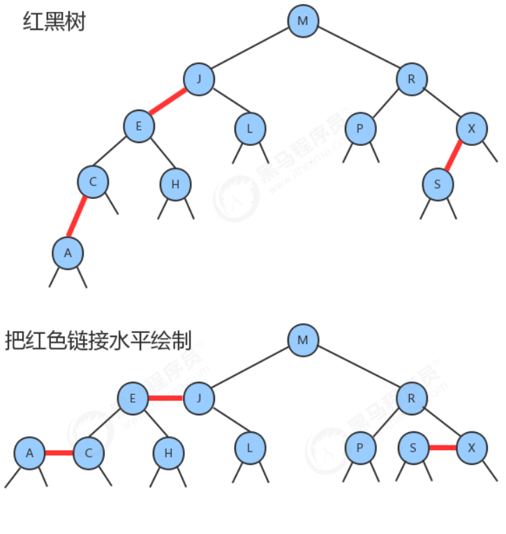

#### 5.6.2.2 红黑树节点API

|   类名   | Node<Key, Value>                                             |
| :------: | ------------------------------------------------------------ |
| 构造方法 | Node(Key key, Value value, Node left, Node right，boolean color)：创建Node对象 |
| 成员变量 | 1.public Node left:记录左子结点 <br />2.public Node right:记录右子结点 <br />3.public Key key:存储键 <br />4.public Value value:存储值 <br />5.public boolean color:由其父结点指向它的链接的颜色 |


#### 5.6.2.3 红黑树平衡化

在对红黑树进行一些增删改查的操作后，很有可能会出现红色的右链接或者两条连续红色的链接，而这些都不满足 红黑树的定义，所以我们需要对这些情况通过旋转进行修复，让红黑树保持平衡。

##### 5.6.2.3.1 左旋

1. **when：**当某个节点的左子节点为黑色（黑链接），右子节点为红色（红链接），此时就需要进行左旋。

2. **前提：**当前节点为h，右子节点为x；

3. **左旋过程：**

   1. 让x的左子结点变为h的右子结点：h.right=x.left;
   2. 让h成为x的左子结点：x.left=h;
   3. 让h的color属性变为x的color属性值：x.color=h.color;
   4. 让h的color属性变为RED：h.color=true;

   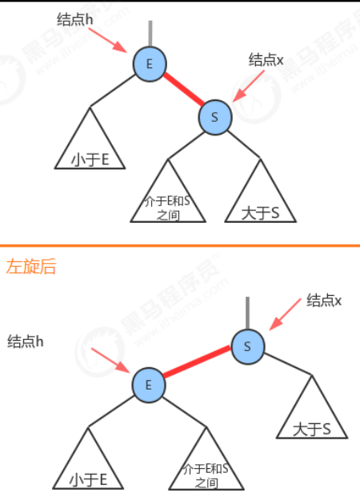

##### 5.6.2.3.2 右旋

1. **when：**当某个结点的左子结点是红色，且左子结点的左子结点也是红色，需要右旋。

2. **前提**：当前结点为h，它的左子结点为x；

3. **右旋过程：**

   1. 让x的右子结点成为h的左子结点：h.left = x.right;
   2. 让h成为x的右子结点：x.right=h;
   3. . 让x的color变为h的color属性值：x.color = h.color;、
   4.  让h的color为RED；

   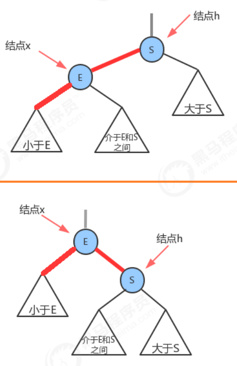

#### 5.6.2.4 向单个2-节点插入新节点

一棵只含有一个键的红黑树只含有一个2-结点。插入另一个键后，我们马上就需要将他们旋转。

- 如果新键小于当前结点的键，我们只需要新增一个红色结点即可，新的红黑树和单个3-结点完全等价。

  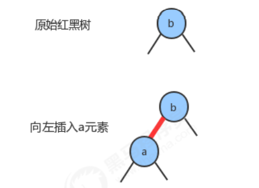

- 如果新键大于当前结点的键，那么新增的红色结点将会产生一条红色的右链接，此时我们需要通过左旋，把 红色右链接变成左链接，插入操作才算完成。形成的新的红黑树依然和3-结点等价，其中含有两个键，一条红 色链接。

  


#### 5.6.2.5 向底部的2-节点插入新节点

用和二叉查找树相同的方式向一棵红黑树中插入一个新键，会在树的底部新增一个结点（可以保证有序性），唯一 区别的地方是我们会用红链接将新结点和它的父结点相连。如果它的父结点是一个2-结点，那么刚才讨论的两种方 式仍然适用。

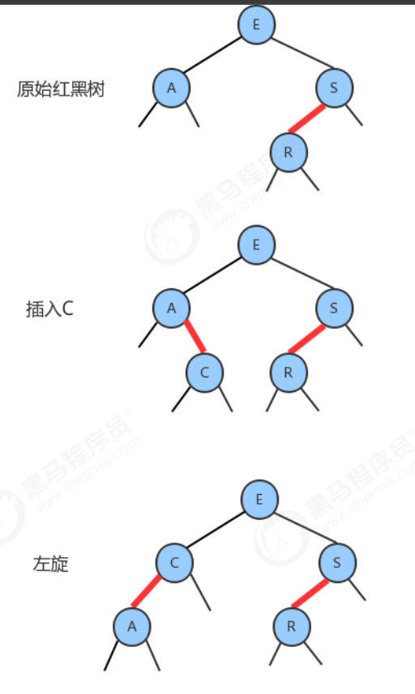

#### 5.6.2.6 颜色反转

当一个结点的左子结点和右子结点的color都为RED时，也就是出现了**临时的4-结点**，此时只需要把左子结点和右子 结点的颜色变为BLACK，同时让当前结点的颜色变为RED即可。


#### 5.6.2.7  向一棵双键树(即一个3-结点)中插入新键

分为三种情况：

1. **新键大于原树中的两个键**

   插入就进行颜色反转

2. **新键小于原树中的两个键**

   插入后，先右旋，再颜色反转

3. **新键介于原数中两个键之间**

   插入后，先左旋，再右旋，最后颜色反转

#### 5.6.2.8 根节点总是黑色

在结点Node对象中**color**属性表示的是**父结点指向当前结点的连接的颜色**，由于根 结点不存在父结点，所以每次插入操作后，我们都需要把根结点的颜色设置为黑色。

#### 5.6.2.9 向底部的3-节点插入新键

假设在树的底部的一个3-结点下加入一个新的结点。前面我们所讲的3种情况都会出现。指向新结点的链接可能是 3-结点的右链接（此时我们只需要转换颜色即可），或是左链接(此时我们需要进行右旋转然后再转换)，或是中链 接(此时需要先左旋转然后再右旋转，最后转换颜色)。颜色转换会使中间结点的颜色变红，相当于将它送入了父结 点。这意味着父结点中继续插入一个新键，我们只需要使用相同的方法解决即可，**直到遇到一个2-结点或者根结点为止。**

#### 5.6.2.10 红黑树API设计

|   类名    | RedBlackTree<Key extends Comparable<Key>, Value>             |
| :-------: | ------------------------------------------------------------ |
| 构造方法  | RedBlackTree()：创建RedBlackTree对象                         |
| 成员方法  | 1.private boolean isRed(Node x)：判断当前结点的父指向链接是否为红色 <br />2.private Node rotateLeft(Node h):左旋调整 <br />3.private Node rotateRight(Node h):右旋调整 <br />4.private void flipColors(Node h)：颜色反转,相当于完成拆分4-结点 <br />5.public void put(Key key, Value val):在整个树上完成插入操作 <br />6.private Node put(Node h, Key key, Value val):在指定树中，完成插入操作,并返回添加元素后新的树 <br />7.public Value get(Key key):根据key，从树中找出对应的值 <br />8.private Value get(Node x, Key key):从指定的树x中，找出key对应的值 <br />9.public int size():获取树中元素的个数 |
| 成员变 量 | 1.private Node root : 记录根结点 <br />2.private int N:记录树中元素的个数 <br />3.private static final boolean RED：红色链接标识 <br />4.private static final boolean BLACK:黑色链接标识 |

#### 5.6.2.11 红黑树代码实现

```java
package com.main.BinaryTree;


import com.main.queue.Queue;

/**
 * 二叉查找树
 * 对于key：小于父节点的节点是左子节点，反之为右子节点
 * @param <Key>  泛型使用CompareTo方法的写法 ：  <Key extends Comparable<Key>, Value>
 * @param <Value>
 */
public class BinaryTree<Key extends Comparable<Key>, Value> {

    private Node root; // 指向树的根节点
    private int size; // 树种节点的个数

    public BinaryTree() {
//        root = new Node(null, null, null, null);
        root = null;
        size = 0;
    }

    /**
     * 在树中查找最小的key
     * @return
     */
    public Key min() {
        return min(root).key;
    }

    /**
     * 在子树node中查找最小的key的节点
     * @param node
     * @return
     */
    public Node min(Node node) {
        Node p = root;
        while (p.left != null) {
            p = p.left;
        }
        return p;
    }

    /**
     * 在树中查找最小的key
     * @return
     */
    public Key max() {
        return max(root).key;
    }

    /**
     * 在子树node中查找最小的key的节点
     * @param node
     * @return
     */
    public Node max(Node node) {
        Node p = root;
        while (p.right != null) {
            p = p.right;
        }
        return p;
    }


    /**
     * 在树中插入一个键值对
     * 如果树为空，则把新节点作为根节点
     * 如果树不为空，从根节点开始：
     * 1. 新节点的key小于当前节点的key，则继续寻找当前节点的左子节点
     * 2.           大于                            右子节点
     * 3.           等于           ，则树中存在该节点，替换该节点的value
     * @param key
     * @param value
     */
    public void put(Key key, Value value) {
        if (isEmptyTree()) {
            //  当树为空的 时候
            root = new Node(key, value, null, null);
            size++;
            return;
        }
        put(root, key, value);
    }

    /**
     * 在子树node中插入一个键值对
     * @param node
     * @param key
     * @param value
     */
    public Node put(Node node, Key key, Value value) {
        if (node == null) {
            size++;
            return new Node(key, value, null, null);
        }
        int p = key.compareTo(node.key);
        if (p < 0) {
            node.left = put(node.left, key, value);
        } else if (p > 0) {
            node.right = put(node.right, key, value);
        } else {
            node.value = value;
            size++;
        }
        return node;
    }

    /**
     * 根据key的值，在树中找出对应的value
     * @param key
     * @return
     */
    public Value get(Key key) {
        return get(root, key);
    }

    /**
     * 从节点node出发，比较当前节点的key 与 key的值
     * < 0: 则 从左子节点继续找
     * > 0:    从右子节点继续找
     * = 0: 返回
     * @param node
     * @param key
     * @return
     */
    public Value get(Node node, Key key) {
        if (node == null) {
            return null;
        }
        int p = key.compareTo(node.key);
        if (p < 0) {
            return get(node.left, key);
        } else if (p > 0) {
            return get(node.right, key);
        } else {
            return node.value;
        }
    }

    /**
     * 根据key 删除对应的节点
     * @param key
     */
    public void delete(Key key) {
        delete(root, key);
    }

    /**
     * 先找到要删除的节点node，然后以node节点为子树，找到子树的右子树中key最小的节点
     * @param node
     * @param key
     * @return
     */
    public Node delete(Node node, Key key) {
        if (node == null) {
            return null;
        }
        int p = key.compareTo(node.key);
        if (p < 0) {
            node.left = delete(node.left, key);
        } else if (p > 0) {
            node.right = delete(node.right, key);
        } else {
            // 找到要删除的节点node后
            size--;
            // 特殊情况
            if (node.left == null) {
                return node.right;
            }
            if (node.right == null) {
                return node.left;
            }
            // 一般情况 先找到右子树的最小key节点 minRightChildTreeNode，
            // 删除这个节点,
            Node pNode = node.right;
            while (pNode.left.left != null) {
                pNode = pNode.left;
            }
            Node minRightChildTreeNode = pNode.left;
            pNode.left = null;
            // 用 minRightChildTreeNode 代替 node
            minRightChildTreeNode.left = node.left;
            minRightChildTreeNode.right = node.right;
            node = minRightChildTreeNode;
        }
        // 最后返回这个节点 minRightChildTreeNode
        return node;
    }

    /**
     * 获取整个树中所有的key  前序遍历
     * @return
     */
    public Queue<Key> preErgodic() {
        Queue<Key> keys = new Queue<>();
        preErgodic(root, keys);
        return keys;
    }

    /**
     * 将指定子树的所有key，放在队列keys中
     * 1. 先将根节点的key存放在队列中
     * 2. 将左子树所有的key放在队列中
     * 3. 将右子树所有的key放在队列中
     * @param node
     * @param keys
     */
    public void preErgodic(Node node, Queue<Key> keys) {
        if (node == null) {
            return;
        }
        // 存入当前node的key
        keys.enqueue(node.key);
        // 存入当前node.left的key
        if (node.left != null) {
            preErgodic(node.left, keys);
        }
        // 存入当前node.right的key
        if (node.right != null) {
            preErgodic(node.right, keys);
        }
    }

    /**
     * 中序遍历整棵树
     * @return
     */
    public Queue<Key> midErgodic() {
        Queue<Key> keys = new Queue<>();
        midErgodic(root, keys);
        return keys;
    }

    /**
     * 中序遍历node子树
     * 将node子树的key存放在队列keys中
     * 1. 先将左子树的所有key放在队列中
     * 2. 将根节点的key放在队列中
     * 3. 将右子树的所有key放在队列中
     * @param node
     * @param keys
     */
    public void midErgodic(Node node, Queue<Key> keys) {
        if (node == null) {
            return;
        }
        // left child tree
        if (node.left != null) {
            midErgodic(node.left, keys);
        }
        // root tree of node of child tree
        keys.enqueue(node.key);
        // right child tree
        if (node.right != null) {
            midErgodic(node.right, keys);
        }
    }

    /**
     * 后序遍历整个树
     * @return
     */
    public Queue<Key> afterErgodic() {
        Queue<Key> keys = new Queue<>();
        afterErgodic(root, keys);
        return keys;
    }

    /**
     * 后序遍历node子树
     * 1. 先将左子树的所有key值放入keys中
     * 2. 再将右子树的所有key值放入keys中
     * 3. 将node的key值放入keys中
     * @param node node子树
     * @param keys
     */
    public void afterErgodic(Node node, Queue<Key> keys) {
        if (node == null) {
            return;
        }
        if (node.left != null) {
            afterErgodic(node.left, keys);
        }
        if (node.right != null) {
            afterErgodic(node.right, keys);
        }
        keys.enqueue(node.key);
    }

    /**
     * 层序遍历：从上往下、从左往右
     * 1. 创建队列 nodes，存储每一层节点
     * 2. 使用循环队列，每一次出队一个节点node，node.key入队到keys：
     *  2.1. 当node有左子节点，则入队左子节点到nodes
     *  2.2. 当node有右子节点，则入队右子节点到nodes
     * @return 树的节点的队列
     */
    public Queue<Key> layerErgodic() {
        Queue<Key> keys = new Queue<>();
        Queue<Node> nodes = new Queue<>();
        nodes.enqueue(root);
        while (!nodes.isEmpty()) {
            // 从nodes中出队node，node的key入队到keys中，对node进行左右子节点处理
            Node node = nodes.dequeue();
            keys.enqueue(node.key);
            // 将左右子节点 入队到nodes
            if (node.left != null) {
                nodes.enqueue(node.left);
            }
            if (node.right != null) {
                nodes.enqueue(node.right);
            }
        }
        return keys;
    }

    /**
     * 获取整个树的最大深度
     * @return int
     */
    public int maxDepth() {
        return maxDepth(root);
    }

    /**
     * 获取node子树的最大深度
     * 1. 计算左子树的最大深度maxl
     * 2. 计算右子树的最大深度maxr
     * 3. max{maxl, maxr}
     * @param node 子树的根节点
     * @return node子树的最大深度
     */
    public int maxDepth(Node node) {
        if (node == null) {
            return 0;
        }
        int maxL = 0, maxR = 0;
        if (node.left != null) {
            maxL = maxDepth(node.left);
        }
        if (node.right != null) {
            maxR = maxDepth(node.right);
        }
        return maxL > maxR ? maxL + 1 : maxR + 1;
    }

    public int size() {
        return size;
    }

    public boolean isEmptyTree() {
        return size == 0;
    }

    private class Node {
        public Key key;
        public Value value;
        public Node left;
        public Node right;

        public Node(Key key, Value value, Node left, Node right) {
            this.key = key;
            this.value = value;
            this.left = left;
            this.right = right;
        }
    }
}
```

## 5.7 B-树

前面的树结构含有的键比较少（最多3个），现在的树结构含有的键可能更多个（多于3个）

### 5.7.1 B树的特性

B树中允许一个结点中包含多个key，可以是3个、4个、5个甚至更多，并不确定，需要看具体的实现。现在我们选 择一个参数M，来构造一个B树，我们可以把它称作是M阶的B树，那么该树会具有如下特点：

1. 每个结点最多有M-1个key，并且以升序排列； 
2. 每个结点最多能有M个子结点； 
3. 根结点至少有两个子结点

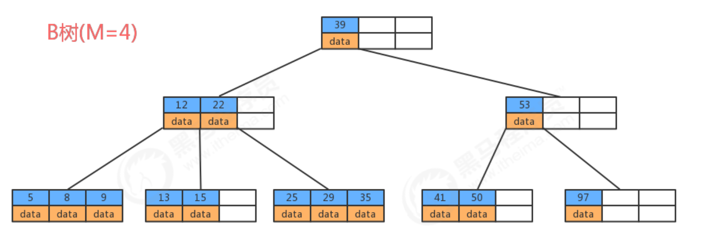

###  5.7.2 B树存储数据

若参数M选择为5，那么每个结点最多包含4个键值对，我们以5阶B树为例，看看B树的数据存储。

在插入的过程中，如果一个节点装满了，那么就会向上生成一个父节点（提取中间节点）。

### 5.7.3 B树在磁盘中的运用


## 5.8 B+树

B+树是对B树的一种变形树，它与B树的差异在于：

- 非叶结点仅具有索引作用，也就是说，非叶子结点只存储key，不存储value；
-  树的所有叶结点构成一个有序链表，可以按照key排序的次序遍历全部数据


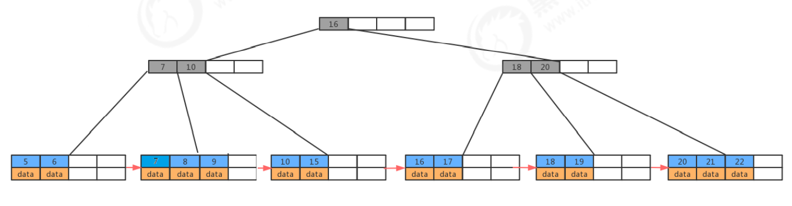

### 5.8.1 B+树存储数据


### 5.8.2 B+树与B树的对比

**B+ 树的优点在于：**

1. 由于B+树在非叶子结点上不包含真正的数据，只当做索引使用，因此在内存相同的情况下，能够存放更多的 key
2. B+树的叶子结点都是相连的，因此对整棵树的遍历只需要一次线性遍历叶子结点即可。而且由于数据顺序 排列并且相连，所以**便于区间查找和搜索**。而B树则需要进行每一层的递归遍历。

**B树的优点在于：**由于B树的每一个节点都包含key和value，因此我们根据key查找value时，只需要找到key所在的位置，就能找到 value，但B+树只有叶子结点存储数据，索引每一次查找，都必须一次一次，一直找到树的最大深度处，也就是叶 子结点的深度，才能找到value。

### 5.8.3 B+树在数据库中的运用


# 6. 堆

## 6.1 堆的定义

堆是计算机科学中一类特殊的数据结构的统称，堆通常可以被看做是一棵完全二叉树的数组对象。

**堆的特性**：

1. 它是完全二叉树，除了树的最后一层结点不需要是满的，其它的每一层从左到右都是满的，如果最后一层结点不 是满的，那么要求左满右不满。

2. 它通常用数组来实现：具体方法就是将二叉树的结点按照层级顺序放入数组中，**根结点在位置1（第0位置不存吃值）**，它的子结点在位置2和3，而子结点的子 结点则分别在位置4,5,6和7，以此类推。

   **如果一个结点的位置为k，则它的父结点的位置为[k/2],而它的两个子结点的位置则分别为2k和2k+1。这样，在不 使用指针的情况下，我们也可以通过计算数组的索引在树中上下移动：从a[k]向上一层，就令k等于k/2,向下一层就 令k等于2k或2k+1。**

3. **每个结点都大于等于它的两个子结点**。这里要注意堆中仅仅规定了每个结点大于等于它的两个子结点，但这两个 子结点的顺序并没有做规定，跟我们之前学习的二叉查找树是有区别的。


## 6.2 堆的API设计

|   类名   | Heap                                                         |
| :------: | ------------------------------------------------------------ |
| 构造方法 | Heap(int capacity)：创建容量为capacity的Heap对象             |
| 成员方法 | 1.private boolean less(int i,int j)：判断堆中索引i处的元素是否小于索引j处的元素 <br />2.private void exch(int i,int j):交换堆中i索引和j索引处的值 <br />3.public T delMax():删除堆中最大的元素,并返回这个最大元素 <br />4.public void insert(T t)：往堆中插入一个元素 <br />5.private void swim(int k):使用上浮算法，使索引k处的元素能在堆中处于一个正确的位置 <br />6.private void sink(int k):使用下沉算法，使索引k处的元素能在堆中处于一个正确的位置 |
| 成员变量 | 1.private T[] imtes : 用来存储元素的数组 <br />2.private int length：记录堆中元素的个数 |

## 6.3 代码实现

### 6.3.1 insert方法实现

堆是用数组完成数据元素的存储的，由于数组的底层是一串连续的内存地址，所以我们要往堆中插入数据，我们只 能往数组中从索引0处开始，依次往后存放数据，但是堆中对元素的顺序是有要求的，每一个结点的数据要大于等 于它的两个子结点的数据，**所以每次插入一个元素，都会使得堆中的数据顺序变乱，这个时候我们就需要通过一些 方法让刚才插入的这个数据放入到合适的位置。**

**上浮算法**：swim

```java
/**
 * 使用上浮算法，使得索引k处的元素能处于一个正确的位置
 * 不断的比较当前节点与父节点的值，如果当前节点的值大于父节点的值，则交换位置
 * @param k
 */
public void swim(int k) {
    while (k > 1) {
        if (less(k >> 1, k)) {
            exch(k, k >> 1);
        }
        k = k >> 1;
    }
}
```

insert：

```java
/**
 * 往堆中插入一个元素
 * @param t
 */
public void insert(T t) {
    items[++length] = t;
    swim(length);
}
```

### 6.3.2 delMax方法实现

**下沉算法：**sink：

```java
    /**
     * 使用下沉算法，使得索引k处的元素能处于一个正确的位置
     * 不断的比较当前节点与其最大子节点(左子节点2k 右子节点2k+1)的大小，如果当前节点小，则交换位置
     * @param k
     */
    public void sink(int k) {
        while (2 * k <= length) {
            int max;
            // 找到较大子节点的索引max
            if (2 * k + 1 <= length) {
                max = less(2*k, 2*k+1) ? 2*k+1 : 2*k;
            } else {
                max = 2*k;
            }
            // 如果 item[max] < item[k] , 退出循环
            if (less(max, k)) {
                break;
            }
            // 否则交换 k max
            exch(k, max);
            k = max;
        }
    }
}
```

deleteMAx：

```java
/**
 * 删除堆中最大的元素， 并返回这个元素
 * 1. 交换第1位置和第length位置的元素
 * 2. 删除第length位置的元素
 * 3. 通过下沉算法调整，使得堆有序
 * @return
 */
public T deleteMax() {
    T max = items[1];
    exch(1, length);
    items[length] = null;
    length--;
    sink(1);
    return max;
}
```

###  6.3.3 实现代码

```java
package com.main.Heap;

public class Heap<T extends Comparable<T>> {

    private T[] items;      // 用来存储元素的数组
    private int length;     // 记录堆中元素的个数

    public Heap(int capacity) {
        items = (T[]) new Comparable[capacity+1];
        length = 0;
    }

    /**
     * 比较索引 i j 的值
     * @param i
     * @param j
     * @return i<j = true
     */
    private boolean less(int i, int j) {
        return items[i].compareTo(items[j]) < 0;
    }

    /**
     * 交换索引i j的值
     * @param i
     * @param j
     */
    private void exch(int i, int j) {
        T t = items[i];
        items[i] = items[j];
        items[j] = t;
    }

    /**
     * 删除堆中最大的元素， 并返回这个元素
     * 1. 交换第1位置和第length位置的元素
     * 2. 删除第length位置的元素
     * 3. 通过下沉算法调整，使得堆有序
     * @return
     */
    public T deleteMax() {
        T max = items[1];
        exch(1, length);
        items[length] = null;
        length--;
        sink(1);
        return max;
    }

    /**
     * 往堆中插入一个元素
     * @param t
     */
    public void insert(T t) {
        items[++length] = t;
        swim(length);
    }

    /**
     * 使用上浮算法，使得索引k处的元素能处于一个正确的位置
     * 不断的比较当前节点与父节点的值，如果当前节点的值大于父节点的值，则交换位置
     * @param k
     */
    public void swim(int k) {
        while (k > 1) {
            if (less(k >> 1, k)) {
                exch(k, k >> 1);
            }
            k = k >> 1;
        }
    }

    /**
     * 使用下沉算法，使得索引k处的元素能处于一个正确的位置
     * 不断的比较当前节点与其最大子节点(左子节点2k 右子节点2k+1)的大小，如果当前节点小，则交换位置
     * @param k
     */
    public void sink(int k) {
        while (2 * k <= length) {
            int max;
            // 找到较大子节点的索引max
            if (2 * k + 1 <= length) {
                max = less(2*k, 2*k+1) ? 2*k+1 : 2*k;
            } else {
                max = 2*k;
            }
            // 如果 item[max] < item[k] , 退出循环
            if (less(max, k)) {
                break;
            }
            // 否则交换 k max
            exch(k, max);
            k = max;
        }
    }
}
```

## 6.4 堆排序

### 6.4.1 实现步骤

1. 构造堆
2. 得到堆顶元素，这个值就是最大值；
3. 交换堆顶元素和数组中的最后一个元素，此时所有元素中的最大元素已经放到合适的位置；
4. 对堆进行调整，重新让除了最后一个元素的剩余元素中的最大值放到堆顶；
5. 重复2~4这个步骤，直到堆中剩一个元素为止。

### 6.4.2 API设计

|   类名   | HeapSort<T extends Comparable<T>>                            |
| :------: | ------------------------------------------------------------ |
| 成员方法 | 1.public static void sort(Comparable[] source)：对source数组中的数据从小到大排序 <br />2.private static void createHeap(Comparable[] source, Comparable[] heap):根据原数组 source，构造出堆heap <br />3.private static boolean less(Comparable[] heap, int i, int j)：判断heap堆中索引i处的元素是否 小于索引j处的元素 <br />4.private static void exch(Comparable[] heap, int i, int j):交换heap堆中i索引和j索引处的值 <br />5.private static void sink(Comparable[] heap, int target, int range):在heap堆中，对target处的 元素做下沉，范围是0~range。 |

### 6.4.3 代码实现

```java
package com.main.Heap;

public class HeapSort<T extends Comparable<T>> {

    /**
     * 对source数组中的元素从小到大排序
     * 1. 构建堆数组 heap
     * 2. 对堆进行排序：
     *  2.1. 将第1个元素与最后一个元素（第length个）进行交换
     *  2.2. 对新的堆进行范围为 {1~length-1} 的下沉操作（sink）
     *  2.3. 重复上面这个过程
     * 3. 将heap的元素复制到source中
     * @param source
     */
    public static void sort(Comparable[] source) {
        // 创建堆
        Comparable[] heap = new Comparable[source.length+1];
        createHeap(source, heap);
        // 记录最大ele的索引
        int maxEleIndex = heap.length - 1;
        while (maxEleIndex != 1) {
            exch(heap, 1, maxEleIndex);
            maxEleIndex--;
            sink(heap, 1, maxEleIndex);
        }
        // 复制数组到source
        System.arraycopy(heap, 1, source, 0, source.length);
    }

    /**
     * 根据source数组，构造出堆heap
     * 1. 创建一个新数组（长度为length+1），将原数组的0~length-1的数据拷贝到新数组的1~length处
     * 2. 再从新数组长度的一半处开始往索引1处扫描（从右往左）
     *  2.1. 注释：按照堆的特性，长度的一半处后的元素为叶子结点，一半处以前都不是叶子结点
     * 3. 对每一个扫描的元素做下沉操作（sink）
     * @param source
     * @param heap
     */
    public static void createHeap(Comparable[] source, Comparable[] heap) {
        System.arraycopy(source, 0, heap, 1, source.length);
        for (int i = (heap.length)/2; i > 0; i--) {
            sink(heap, i, heap.length-1);
        }
    }

    /**
     * 交换数组中位置 i j 的位置
     * @param heap
     * @param i
     * @param j
     * @return
     */
    private static void exch(Comparable[] heap, int i, int j) {
        Comparable p = heap[i];
        heap[i] = heap[j];
        heap[j] = p;
    }

    /**
     * 比较i j位置处的值
     * @param heap
     * @param i
     * @param j
     * @return i<j = true
     */
    private static boolean less(Comparable[] heap, int i, int j) {
        return heap[i].compareTo(heap[j]) < 0;
    }

    /**
     * 在堆heap中，在0~range范围内，对target处元素进行下沉算法操作
     * 1. 找出当前节点node较大的子节点moreChildNode
     * 2. 比较 node 与 moreChildNode
     *  2.1. node < moreChildNode break；
     *  2.2.      >               exch();    target = maxChildIndex
     * @param heap   堆数组
     * @param target 当前节点node对应数组的下标index
     * @param range  下沉操作的范围
     */
    private static void sink(Comparable[] heap, int target, int range) {
        while (2*target <= range) {
            int maxChildIndex;
            if (2*target + 1 <= range) {
                maxChildIndex = less(heap, 2*target, 2*target+1) ? 2*target+1 : 2*target;
            } else {
                maxChildIndex = 2*target;
            }
            if (less(heap, maxChildIndex, target)) {
                break;
            }
            exch(heap, target, maxChildIndex);
            target = maxChildIndex;
        }
    }
}
```

# 7. 优先队列

## 7.1 最大优先队列

### 7.2.1 API设计

|   类名   | MaxPriorityQueue<T extends Comparable<T>>                    |
| :------: | ------------------------------------------------------------ |
| 构造方法 | public MaxPriorityQueue(int capacity)；：创建容量为capacity的MaxPriorityQueue对象 |
| 成员方法 | 1.private boolean less(int i,int j)：判断堆中索引i处的元素是否小于索引j处的元素 <br />2.private void exch(int i,int j):交换堆中i索引和j索引处的值 <br />3.public T delMax():删除队列中最大的元素,并返回这个最大元素 <br />4.public void insert(T t)：往队列中插入一个元素 <br />5.private void swim(int k):使用上浮算法，使索引k处的元素能在堆中处于一个正确的位置 <br />6.private void sink(int k):使用下沉算法，使索引k处的元素能在堆中处于一个正确的位置 <br />7.public int size():获取队列中元素的个数 <br />8.public boolean isEmpty():判断队列是否为空 |
| 成员变量 | 1.private T[] imtes : 用来存储元素的数组 <br />2.private int N：记录堆中元素的个数 |

### 7.1.2 代码实现

```java
package com.main.queue;

/**
 * 最大优先队列， 底层是用堆(Heap,最大堆)实现的
 * 1. 优点：能够快速访问队列中的最大元素
 * 2. 缺点：没有通过索引访问已经存在的对象，并且更新他们
 *  2.1. 解决方法，增加一个数组存放优先队列中元素的index; 而且不调整原数组 二是 调整原数组 来使得堆有序
 * @param <T>
 */
public class MaxPriorityQueue<T extends Comparable<T>> {

    private T[] items;
    private int length;

    public MaxPriorityQueue(int capacity) {
        items = (T[]) new Comparable[capacity+1];
        length = 0;
    }

    public T[] getItems() {
        return items;
    }

    /**
     *
     * @param i
     * @param j
     * @return
     */
    private boolean less(int i, int j) {
        return items[i].compareTo(items[j]) < 0;
    }

    /**
     *
     * @param i
     * @param j
     */
    private void exch(int i, int j) {
        T t = items[j];
        items[j] = items[i];
        items[i] = t;
    }

    /**
     *
     * @return
     */
    public T delMax() {
        T max = items[1];
        exch(1, length);
        items[length] = null;
        length--;
        sink(1);
        return max;
    }

    /**
     *
     * @param t
     */
    public void insert(T t) {
        items[++length] = t;
        swim(length);
    }

    /**
     *
     * @param k
     */
    public void swim(int k) {
        while (k > 1) {
            if (less(k>>1, k)) {
                exch(k>>1, k);
            }
            k = k >> 1;
        }
    }

    /**
     *
     * @param k
     */
    public void sink(int k) {
        while (2*k <= length) {
            int max;
            if (2*k+1 <= length) {
                max = less(2*k, 2*k+1) ? 2*k+1 : 2*k;
            } else {
                max = 2*k;
            }
            if (!less(k, max)) {
                break;
            }
            exch(max, k);
            k = max;
        }
    }

    /**
     *
     * @return
     */
    public int length() {
        return length;
    }

    /**
     *
     * @return
     */
    public boolean isEmpty() {
        return length == 0;
    }

}
```

## 7.2 最小优先队列

### 7.2.1 API设计

|   类名   | MinPriorityQueue<T extends Comparable<T>>                    |
| :------: | ------------------------------------------------------------ |
| 构造方法 | public MinPriorityQueue(int capacity)；：创建容量为capacity的MinPriorityQueue对象 |
| 成员方法 | 1.private boolean less(int i,int j)：判断堆中索引i处的元素是否小于索引j处的元素 <br />2.private void exch(int i,int j):交换堆中i索引和j索引处的值 <br />3.public T delMin():删除队列中最大的元素,并返回这个最大元素 <br />4.public void insert(T t)：往队列中插入一个元素 <br />5.private void swim(int k):使用上浮算法，使索引k处的元素能在堆中处于一个正确的位置 <br />6.private void sink(int k):使用下沉算法，使索引k处的元素能在堆中处于一个正确的位置 <br />7.public int size():获取队列中元素的个数 <br />8.public boolean isEmpty():判断队列是否为空 |
| 成员变量 | 1.private T[] imtes : 用来存储元素的数组 <br />2.private int N：记录堆中元素的个数 |

### 7.2.2 代码实现

```java
package com.main.queue;

/**
 * 最小优先队列，底层是用最小堆（Heap）来实现的
 * 相比于 MaxPriorityQueue， 其上浮（swim） 与 下沉（sink）的规则变了
 * 1. 优点：能够快速访问队列中的最小元素
 * 2. 缺点：没有通过索引访问已经存在的对象，并且更新他们
 * @param <T>
 */
public class MinPriorityQueue<T extends Comparable<T>> {

    private T[] items;
    private int length;

    public MinPriorityQueue(int capacity) {
        items = (T[]) new Comparable[capacity+1];
        length = 0;
    }

    public T[] getItems() {
        return items;
    }
    public boolean isEmpty() {
        return length == 0;
    }

    private void exch(int i, int j) {
        T t = items[i];
        items[i] = items[j];
        items[j] = t;
    }

    private boolean less(int i, int j) {
        return items[i].compareTo(items[j]) < 0;
    }

    public int length() {
        return length;
    }

    private void swim(int k) {
        while (k > 1) {
            if (less(k, k>>1)) {
                exch(k, k>>1);
            }
            k = k >> 1;
        }
    }

    private void sink(int k) {
        while (2*k <= length) {
            int min;
            if (2*k+1 <= length) {
                min = less(2*k, 2*k+1) ? 2*k : 2*k+1;
            } else {
                min = 2*k;
            }
            if (!less(k, min)) {
                break;
            }
            exch(k, min);
            k = min;
        }
    }

    public void insert(T t) {
        items[++length] = t;
        swim(length);
    }

    public T delMin() {
        T min = items[1];
        exch(1, length);
        items[length] = null;
        length--;
        sink(1);
        return min;
    }

}
```

## 7.3 索引优先队列

由于最大最小优先队列无法通过索引来访问元素。而索引优先队列可以实现

### 7.3.1 索引优先队列实现思路 （原理）

1. 需要的数组：
   - **T[] items**：存放数据的数组
   - **int[] pq**: 存放每个items中的元素的索引。
     pq数组要进行“堆有序”操作：即items[pq[i]] 元素要堆有序
     此时直接可以对pa数组进行上浮下沉操作，而items数组中的元素不变
   - **int[] qp**：存放pq的**逆序**。**逆序：索引与值呼唤，即 pq[i]=j，则qp[j]=i**,
2. 分析
   1. 如果只有items数组，则不能通过索引访问元素
   2. 如果有items 和 pq数组，则访问元素的时候还是得通过遍历items[pq[i]]，i=1~length的方式访问；**pq中存放的元素不能快速的被查找，只能通过遍历的方式查找。**
   3. 如果有items、pq和qp数组：qp是pq的逆序，pq是一个堆，**而qp的下标就是items的下标**，可以快速访问items的元素；如果需要有顺序的访问items的元素，则需要pq数组。

### 7.3.2 API设计

|   类名   | IndexMinPriorityQueue<T extends Comparable<T>>               |
| :------: | ------------------------------------------------------------ |
| 构造方法 | public IndexMinPriorityQueue(int capacity)；：创建容量为capacity的IndexMinPriorityQueue对象 |
| 成员方法 | 1.private boolean less(int i,int j)：判断堆中索引i处的元素是否小于索引j处的元素 <br />2.private void exch(int i,int j):交换堆中i索引和j索引处的值 <br />3.public int delMin():删除队列中最小的元素,并返回该元素关联的索引 <br />4.public void insert(int i,T t)：往队列中插入一个元素,并关联索引i <br />5.private void swim(int k):使用上浮算法，使索引k处的元素能在堆中处于一个正确的位置 <br />6.private void sink(int k):使用下沉算法，使索引k处的元素能在堆中处于一个正确的位置 <br />7.public int size():获取队列中元素的个数 8.public boolean isEmpty():判断队列是否为空 <br />9.public boolean contains(int k):判断k对应的元素是否存在 <br />10.public void changeItem(int i, T t):把与索引i关联的元素修改为为t <br />11.public int minIndex():最小元素关联的索引 <br />12.public void delete(int i):删除索引i关联的元素 |
| 成员变量 | 1.private T[] imtes : 用来存储元素的数组 <br />2.private int[] pq:保存每个元素在items数组中的索引，pq数组需要堆有序 <br />3.private int [] qp:保存qp的逆序，pq的值作为索引，pq的索引作为值 <br />4.private int N：记录堆中元素的个数 |

### 7.3.3 代码实现

```java
package com.main.queue;

/**
 *
 * 索引最小优先队列
 * 需要方便的获取 优先队列 的任何一个元素
 * 1. 构造数组 items
 * 2. 构造第一个辅助数组 pq， pq里面存放的是items元素的index
 *  2.1. 当对items进行堆有序操作时，直接对pq里面的索引进行堆有序操作
 * 3. 由于从pq数组中获取items的items的时候不方便，再构造一个数组qp
 *  3.1. qp 是 pq 的逆序，即pq[qp[i]] = i ; qp[pq[i]] = i
 *  3.2.
 * @param <T>
 */
public class IndexMinPriorityQueue<T extends Comparable<T>> {

    // 存储元素T  不对这个数组做变化
    private T[] items;
    // 保存每个元素在items中的索引，pq数组需要进行调整（堆有序）
    private int[] pq;
    // qp保存pq的逆序，pq的值作为索引，pq的索引作为值
    private int[] qp;

    private int length;

    public IndexMinPriorityQueue(int capacity) {
        items = (T[]) new Comparable[capacity+1];
        qp =  new int[capacity+1];
        pq =  new int[capacity+1];
        length = 0;
        // 初始化qp存放的
        for (int i = 0; i < qp.length; i++) {
            qp[i] = -1;
        }
    }

    public boolean isEmpty() {
        return length == 0;
    }

    /**
     * 判断下标是否已经被关联（被占用）
     * 只需要检查qp数组存放的下标就可以
     * @param index 下标
     * @return
     */
    public boolean contains(int index) {
        return qp[index] != -1;
    }

    /**
     * 向堆中插入元素t ，需要指明插入到items数组的index
     * @param index
     * @param t
     */
    public void insert(int index, T t) {
        // 安全性检查
        if (contains(index)) {
            return;
        }
        // +1
        length++;
        // 加入元素
        items[index] = t;
        // pq
        pq[length] = index;
        // qp
        qp[index] = length;
        // swim 实现堆调整
        swim(length);
    }
    /**
     * 删除索引关联的元素
     * 1. 首先交换pq中 index处 与 最后位置的元素(length)
     * 2. 删除第qp items 中对应的元素
     * 3. 对pq先后进行 上浮（swim） 下沉 操作（sink）
     * @param index 索引
     */
    public void delete(int index) {
        if (contains(index)) {
            return;
        }
        int p = pq[index];
        exch(index, length);
        items[p] = null;
        qp[pq[length]] = -1;
        pq[length] = -1;
        length--;
        swim(index);
        sink(index);
    }

    /**
     * 删掉堆中最小的元素:
     * 1. 首先交换 最小位置（1 or minIndex） 与 最大位置（length）的值
     * 2. 对三个数组进行操作
     *  2.1. 删除items[minIndex]
     *  2.2. 删除qp 中对应的
     *  2.3. 删除pq 中对应的
     * 3. sink算法，使得堆有序
     * @return 返回这个元素的索引， pq里存放的值
     */
//    public T delMin() {
//        int minIndex = pq[1];
//        T minELe = items[minIndex];
//        exch(1, length);
//        qp[pq[length]] = -1;
//        pq[length] = -1;
//        items[minIndex] = null;
//        length--;
//        sink(1);
//        return minELe;
//    }

    /**
     * 删掉堆中最小的元素:
     * 1. 首先交换 最小位置（1 or minIndex） 与 最大位置（length）的值
     * 2. 对三个数组进行操作
     *  2.1. 删除items[minIndex]
     *  2.2. 删除qp 中对应的
     *  2.3. 删除pq 中对应的
     * 3. sink算法，使得堆有序
     * @return 返回这个元素的索引，
     */
    public int delMin() {
        int minIndex = pq[1];
        exch(1, length);
        qp[pq[length]] = -1;
        pq[length] = -1;
        items[minIndex] = null;
        length--;
        sink(1);
        return minIndex;
    }

    /**
     * 上浮算法对堆进行调整
     * 对pq pq数组进行调整
     * @param k
     */
    public void swim(int k) {
        while (k > 1) {
            if (less(k, k>>1)) {
                exch(k, k>>1);
            }
            k = k>>1;
        }
    }

    /**
     * 堆下城算法使得堆有序
     * @param k
     */
    public void sink(int k) {
        while (2*k <= length) {
            int max;
            if (2*k + 1 <= length) {
                max = less(2*k, 2*k+1) ? 2*k+1 : 2*k;
            } else {
                max = 2*k;
            }
            if (less(k, max)) {
                break;
            }
            exch(k, max);
            k = max;
        }
    }

    /**
     * 修改索引index处的值为t
     * 1. 修改items数组
     * 2. 找到index在qp中出现的位置
     * 3. 堆调整 上浮 下沉
     * @param index
     * @param t
     */
    public void changeItem(int index, T t) {
        items[index] = t;
        swim(qp[index]);
        swim(pq[index]);
    }

    public int length() {
        return length;
    }

    private boolean less(int i, int j) {
        return items[pq[i]].compareTo(items[pq[j]]) < 0;
    }

    /**
     * 交换堆中 i 与 j 处的值
     * 1. 实质上就是交换pq数组存放点值(items的index)
     * 2. 还要更新qp数组
     * @param i
     * @param j
     */
    private void exch(int i, int j) {
        // 交换pq数组
        int p = pq[i];
        pq[i] = pq[j];
        pq[j] = p;
        // 更新qp数组
        qp[pq[i]] = i;
        qp[pq[j]] = j;
    }

}
```

# 8. 图 （用邻接表实现）

## 8.1 概述

## 8.2 无向图

### 8.2.1 相关术语

- 相邻顶点：当两个顶点通过一条边相连时，我们称这两个顶点是相邻的，并且称这条边依附于这两个顶点 

- 度：某个顶点的度就是依附于该顶点的边的个数

- 子图：是一幅图的所有边的子集(包含这些边依附的顶点)组成的图；

- 路径：是由边顺序连接的一系列的顶点组成

- 环：是一条至少含有一条边且终点和起点相同的路径

- 连通图：如果图中任意一个顶点都存在一条路径到达另外一个顶点，那么这幅图就称之为连通图

- 连通子图：个非连通图由若干连通的部分组成，每一个连通的部分都可以称为该图的连通子图

  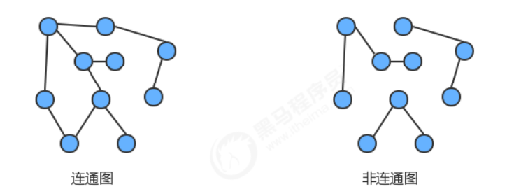

### 8.2.2 图的存储结构

存储图的顶点和边

#### 8.2.2.1 邻接矩阵

- 使用一个V*V的二维数组int[V][V] adj,把索引的值看做是顶点；
-  如果顶点v和顶点w相连，我们只需要将adj[v][w]和adj[w][v]的值设置为1,否则设置为0即可。

#### 8.2.2.2 邻接表

- 使用一个大小为V的数组 Queue[V] adj，把索引看做是顶点；
- 每个索引处adj[v]存储了一个队列，该队列中存储的是所有与该顶点相邻的其他顶点

## 8.3 图的实现

### 8.3.1 API设计

|   类名   | Graph                                                        |
| :------: | ------------------------------------------------------------ |
| 构造方法 | Graph(int V)：创建一个包含V个顶点但不包含边的图              |
| 成员方法 | 1.public int V():获取图中顶点的数量 <br />2.public int E():获取图中边的数量 <br />3.public void addEdge(int v,int w):向图中添加一条边 v-w <br />4.public Queue adj(int v)：获取和顶点v相邻的所有顶点 |
| 成员变量 | 1.private final int V: 记录顶点数量 <br />2.private int E: 记录边数量 <br />3.private Queue[] adj: 邻接表 |

### 8.3.2 代码实现

```java
package com.main.graph;

import com.main.queue.Queue;

public class Graph {
    // 顶点个数
    private final int V;
    // 边的数目
    private int E;
    // 邻接表数组
    private Queue<Integer>[] adj;

    public Graph(int v) {
        V = v;
        E = 0;
        adj = new Queue[v];

        for (int i = 0; i < adj.length; i++) {
            adj[i] = new Queue<>();
        }
    }

    /**
     * 向图中添加一条边 v-w
     * @param v
     * @param w
     */
    public void addEdge(int v, int w) {
        adj[v].enqueue(w);
        adj[w].enqueue(v);
        E++;
    }

    /**
     * 获取顶点 v 相邻的所有顶点
     * @param v
     * @return
     */
    public Queue<Integer> adj(int v) {
        return adj[v];
    }

    public int V() {
        return V;
    }

    public int E() {
        return E;
    }
}
```

## 8.4 图的搜索

### 8.4.1 深度优先搜索

所谓的深度优先搜索，指的是在搜索时，如果遇到一个结点既有子结点，又有兄弟结点，那么先找子结点，然后找 兄弟结点

```java
package com.main.graph;

public class DepthFirstSearch {
    // 索引代表图顶点，值代表当前顶点是否已经被搜索
    private boolean[] marked;
    // 记录多少个顶点与s顶点相通
    private int count;

    public DepthFirstSearch(Graph graph, int s) {
        marked = new boolean[graph.V()];
        count = 0;
        dfs(graph, s);
    }

    /**
     * 使用深度优先搜索找出G图总v顶点的所有相通顶点
     * 1. 首先将 v 顶点标识为已搜索
     * 2. 判断当前 w 顶点有没有被搜索过，if not，则递归调用 dfs 方法
     * @param graph
     * @param v
     */
    private void dfs(Graph graph, int v) {
        marked[v] = true;
        for (Integer w : graph.adj(v)) {
            if (!marked(w)) {
                dfs(graph, w);
            }
        }
        count++;
    }

    /**
     * 判断w顶点是否与s顶点相通
     * @param w
     * @return
     */
    public boolean marked(int w) {
        return marked[w];
    }

    public int count() {
        return count;
    }

}
```

### 8.4.2 广度优先搜索

所谓的深度优先搜索，指的是在搜索时，如果遇到一个结点既有子结点，又有兄弟结点，那么先找兄弟结点，再找子节点

```java
package com.main.graph;

import com.main.queue.Queue;

public class BreadthFirstSearch {
    // 索引代表图顶点，值代表当前顶点是否已经被搜索
    private boolean[] marked;
    // 与s顶点相通顶点的个数
    private int count;
    //
    private Queue<Integer> waitForSearch;

    public BreadthFirstSearch(Graph graph, int s) {
        marked = new boolean[graph.V()];
        count = 0;
        waitForSearch = new Queue<>();
        bfs(graph, s);
    }

    /**
     * 广度优先搜索 类似于 树的层序遍历
     * @param graph
     * @param v
     */
    private void bfs(Graph graph, int v) {
        waitForSearch.enqueue(v);
        while (!waitForSearch.isEmpty()) {
            // 从辅助 队列 中弹出一个元素 node
            int node = waitForSearch.dequeue();
            if (!marked(node)) {
                // 如果这个节点没有被搜索，则搜索，标记 ; 否则就跳出这次循环
                marked[node] = true;
                count++;
            } else {
                continue;
            }
            // 将这个node转换的邻接元素入队  waitForSearch
            for (Integer w : graph.adj(node)) {
                waitForSearch.enqueue(w);
            }
        }
    }

    public boolean marked(int v) {
        return marked[v];
    }

    public int count() {
        return count;
    }
}
```

## 8.5 路径查找

### 8.5.1 API设计

|   类名   | DepthFirstPaths                                              |
| :------: | ------------------------------------------------------------ |
| 构造方法 | DepthFirstPaths(Graph G,int s)：构造深度优先搜索对象，使用深度优先搜索找出G图中起点为 s的所有路径 |
| 成员方法 | 1.private void dfs(Graph G, int v)：使用深度优先搜索找出G图中v顶点的所有相邻顶点 <br />2.public boolean hasPathTo(int v):判断v顶点与s顶点是否存在路径 <br />3.public Stack pathTo(int v):找出从起点s到顶点v的路径(就是该路径经过的顶点) |
| 成员变量 | 1.private boolean[] marked: 索引代表顶点，值表示当前顶点是否已经被搜索 <br />2.private int s:起点 <br />3.private int[] edgeTo:索引代表顶点，值代表从起点s到当前顶点路径上的最后一个顶点 |

### 8.5.2 代码实现

```java
package com.main.graph;

import com.main.stack.Stack;

public class DepthFirstPaths {
    // 索引代表顶点，值代表当前顶点是否被搜索
    private boolean[] marked;
    // 起点
    private int s;
    // 索引代表顶点，值代表从起点s到当前顶点路径上的最后一个顶点
    private int[] edgeTo;

    public DepthFirstPaths(Graph graph, int s) {
        marked = new boolean[graph.V()];
        edgeTo = new int[graph.V()];
        this.s = s;
        dfs(graph, s);
    }

    /**
     * 深度优先算法
     * @param graph
     * @param v
     */
    public void dfs(Graph graph, int v) {
        marked[v] = true;
        // v 是 w 的“子节点”
        for (Integer w : graph.adj(v)) {
            if (!marked[w]) {
                // 到达 w 顶点的最后一个元素是v
                edgeTo[w] = v;
                dfs(graph, w);
            }
        }
    }

    /**
     * 判断 v 顶点与 s 顶点是否存在路径
     * @param v
     * @return
     */
    public boolean hasPathTo(int v) {
        return marked[v];
    }

    /**
     * 找出从起点 s 到 目的点 v 的路径
     * @param v
     * @return
     */
    public Stack<Integer> pathTo(int v) {
        if (!hasPathTo(v)) {
            return null;
        }
        Stack<Integer> path = new Stack<>();
        // 通过循环，直接从 edgeTo 数组中找到一条路径
        for (int i = v; i != s; i = edgeTo[i]) {
            path.push(i);
        }
        path.push(s);
        return path;
    }

}
```

## 8.6 有向图

### 8.6.1 定义及相关术语

**定义**： 有向图是一副具有方向性的图，是由一组顶点和一组有方向的边组成的，每条方向的边都连着一对有序的顶点。 

**出度**： 由某个顶点指出的边的个数称为该顶点的出度。 

**入度**： 指向某个顶点的边的个数称为该顶点的入度。 

**有向路径**： 由一系列顶点组成，对于其中的每个顶点都存在一条有向边，从它指向序列中的下一个顶点。 

**有向环**： 一条至少含有一条边，且起点和终点相同的有向路径。

一幅图两个顶点（v，w）有四种联系方式：1. 没有边相连；2. 存在从v到w的边v—>w; 3. 存在从w到v的边w—>v; 4. 既存在w到v的边，也存在v到w的边，即双向连接；

### 8.6.2 API设计

|   类名   | DirectGraph                                                  |
| :------: | ------------------------------------------------------------ |
| 构造方法 | DirectGraph(int V)：创建一个包含V个顶点但不包含边的有向图    |
| 成员方法 | 1.public int V():获取图中顶点的数量 <br />2.public int E():获取图中边的数量 <br />3.public void addEdge(int v,int w):向有向图中添加一条边 v->w <br />4.public Queue adj(int v)：获取由v指出的边所连接的所有顶点 <br />5.private Digraph reverse():该图的反向图 |
| 成员变量 | 1.private final int V: 记录顶点数量 2.private int E: 记录边数量 3.private Queue[] adj: 邻接表 |

### 8.6.3 代码实现

```java
package com.main.graph;

import com.main.queue.Queue;

/**
 * 有向图
 */
public class DirectGraph {
    private final int V;
    private int E;
    private Queue<Integer>[] adj;

    public DirectGraph(int v) {
        V = v;
        E = 0;
        adj = new Queue[v];
        // 初始化 每个顶点的 连接表
        for (int i = 0; i < v; i++) {
            adj[i] = new Queue<>();
        }
    }

    /**
     * 添加一条单向边  v->w
     * @param v
     * @param w
     */
    public void addEdge(int v, int w) {
        adj[v].enqueue(w);
        E++;
    }

    /**
     * 获取 顶点 v 中邻接表
     * @param v
     * @return
     */
    public Queue<Integer> adj(int v) {
        return adj[v];
    }

    /**
     * 反转有向图
     * @return
     */
    private DirectGraph reverse() {
        DirectGraph directGraph = new DirectGraph(V);
        for (int v = 0; v < V; v++) {
            for (Integer w : directGraph.adj(v)) {
                directGraph.addEdge(w, v);
            }
        }
        return directGraph;
    }

    public int V() {
        return V;
    }

    public int E() {
        return E;
    }

}
```

## 8.7 拓扑顺序

### 8.7.1 检测有向图是否有环

如果学习x课程前必须先学习y课程，学习y课程前必须先学习z课程，学习z课程前必须先学习x课程，那么一定是有 问题了，我们就没有办法学习了，因为这三个条件没有办法同时满足。其实这三门课程x、y、z的条件组成了一个 环。

#### 8.7.1.1 API设计

|   类名   | DirectedCycle                                                |
| :------: | ------------------------------------------------------------ |
| 构造方法 | DirectedCycle(Digraph G)：创建一个检测环对象，检测图G中是否有环 |
| 成员方法 | 1.private void dfs(Digraph G,int v)：基于深度优先搜索，检测图G中是否有环 <br />2.public boolean hasCycle():判断图中是否有环 |
| 成员变量 | 1.private boolean[] marked: 索引代表顶点，值表示当前顶点是否已经被搜索 <br />2.private boolean hasCycle: 记录图中是否有环 <br />3.private boolean[] onStack:索引代表顶点，使用栈的思想，记录当前顶点有没有已经处于正在 搜索的有向路径上 |

#### 8.7.1.2 代码实现

在API中添加了onStack[] 布尔数组，索引为图的顶点，当我们深度搜索时： 

1. 在如果当前顶点正在搜索，则把对应的onStack数组中的值改为true，标识进栈； 
2.  如果当前顶点搜索完毕，则把对应的onStack数组中的值改为false，标识出栈； 
3. 如果即将要搜索某个顶点，但该顶点已经在栈中，则图中有环；

```java
package com.main.graph;

public class DirectedCycle {
    // 索引代表顶点，值代表是否被搜索
    private boolean[] marked;
    // 图中是否有环
    private boolean hasCycle;
    // 索引代表顶点，值代表是否被搜索，记录当前顶点有没有处于正在搜索的有向路径上
    private boolean[] onStack;

    public DirectedCycle(DirectGraph directGraph) {
        marked = new boolean[directGraph.V()];
        onStack = new boolean[directGraph.V()];
        hasCycle = false;
        // 需要从图中的每一个顶点都调用一次dfs算法
        for (int i = 0; i < directGraph.V(); i++) {
            // 当前顶点没有被搜索过，则调用 dfs 算法
            if (!marked[i]) {
                dfs(directGraph, i);
            }
        }
    }

    /**
     * 深度优先搜索检测 有向图中是否有环
     * 1. 将当前顶点设置为已经搜索
     * 2. 当前顶点入栈： onStack 设置当前顶点为已经被搜索
     * 3. 进行dfs算法（中途检测到环，就返回）
     * 4. 将当前顶点出栈
     * @param directGraph
     * @param v
     */
    public void dfs(DirectGraph directGraph, int v) {
        marked[v] = true;
        onStack[v] = true;
        for (Integer w : directGraph.adj(v)) {
            if (!marked[w]) {
                dfs(directGraph, w);
            }
            // 只要检测到环，就返回
            if (onStack[w] == true) {
                hasCycle = true;
                return;
            }
        }
        // 当前节点已经搜索完毕，则当前顶点出栈
        onStack[v] = false;
    }

    public boolean hasCycle() {
        return hasCycle;
    }

}
```

### 8.7.2 基于深度优先搜索的顶点排序

#### 8.7.2.1 API设计

|   类名   | DepthFirstOrder                                              |
| :------: | ------------------------------------------------------------ |
| 构造方法 | DepthFirstOrder(Digraph G)：创建一个顶点排序对象，生成顶点线性序列； |
| 成员方法 | 1.private void dfs(Digraph G,int v)：基于深度优先搜索，生成顶点线性序列 <br />2.public Stack reversePost():获取顶点线性序列 |
| 成员变量 | 1.private boolean[] marked: 索引代表顶点，值表示当前顶点是否已经被搜索 <br />2.private Stack reversePost: 使用栈，存储顶点序列 |


#### 8.7.2.2 代码实现

在API的设计中，我们添加了一个栈reversePost用来存储顶点，当我们深度搜索图时，每搜索完毕一个顶点，把该 顶点放入到reversePost中，这样就可以实现顶点排序.

```java
package com.main.graph;

import com.main.stack.Stack;

/**
 * 实现有向图的顶点排序
 * 1. 图的转移路径 只能是从一个方向到另一个方向，不能“倒回去”
 */
public class DepthFirstOrder {
    private boolean[] marked;
    private Stack<Integer> reversePost;

    public DepthFirstOrder(DirectGraph directGraph) {
        marked = new boolean[directGraph.V()];
        reversePost = new Stack<>();
        // 对每一个顶点实现dfs
        for (int v = 0; v < directGraph.V(); v++) {
            if (!marked[v]) {
                dfs(directGraph, v);
            }
        }
    }

    /**
     * 从顶点v开始 进行深度优先搜索
     * 1. 以v顶点为入口，开始搜索
     * 2. 一直递归搜索到最远的顶点，让其入栈
     * 3. 返回到上一个顶点（第二远的顶点）
     *  3.1. 如果这个顶点没有其他子顶点了，让其入栈
     *  3.2. 如果有其他子顶点，则继续递归搜索
     * @param directGraph
     * @param v
     */
    private void dfs(DirectGraph directGraph, int v) {
        marked[v]  = true;
        for (Integer w : directGraph.adj(v)) {
            if (!marked[w]) {
                dfs(directGraph, w);
            }
        }
        // 当前节点v已经搜索完毕，让v入栈
        reversePost.push(v);
    }

    public Stack<Integer> reversePost() {
        return reversePost;
    }
}
```

### 8.7.3 拓扑排序的实现

前面已经实现了环的检测以及顶点排序，那么拓扑排序就很简单了，基于一幅图，先检测有没有环，如果没有环， 则调用顶点排序即可

#### API设计


#### 代码实现

```java
package com.main.graph;

import com.main.stack.Stack;

public class TopLogical {

    // 顶点的拓扑排序
    private Stack<Integer> order;

    public TopLogical(DirectGraph directGraph) {
        DirectedCycle directedCycle = new DirectedCycle(directGraph);
        if (!directedCycle.hasCycle()) {
            DepthFirstOrder depthFirstOrder = new DepthFirstOrder(directGraph);
            order = depthFirstOrder.reversePost();
        }
    }


    public boolean isCycle() {
        return order == null;
    }

    public Stack<Integer> order() {
        return order;
    }
}
```

## 8.8 加权无向图

### 8.8.1 Edge

加权无向图中的边我们就不能简单的使用v-w两个顶点表示了，而必须要给边关联一个权重值，因此我们可以使用 对象来描述一条边。

#### **API设计**

|   类名   | Edge implements Comparable                                   |
| :------: | ------------------------------------------------------------ |
| 构造方法 | Edge(int v,int w,double weight)：通过顶点v和w，以及权重weight值构造一个边对象 |
| 成员方法 | 1.public double weight():获取边的权重值 <br />2.public int either():获取边上的一个点 <br />3.public int other(int vertex)):获取边上除了顶点vertex外的另外一个顶点 <br />4.public int compareTo(Edge that)：比较当前边和参数that边的权重，如果当前边权重大，返回 1，如果一样大，返回0，如果当前权重小，返回-1 |
| 成员变量 | 1.private final int v：顶点一 <br />2.private final int w：顶点二 <br />3.private final double weight：当前边的权重 |

#### **代码实现：**

```java
package com.main.graph;

public class Edge implements Comparable<Edge> {

    private final int v;
    private final int w;
    private final double weight;


    public Edge(int v, int w, double weight) {
        this.v = v;
        this.w = w;
        this.weight = weight;
    }

    public double weight() {
        return weight;
    }

    /**
     * 获取edge中任意一个顶点
     * @return
     */
    public int either() {
        return v;
    }

    /**
     * 获取 边 的另外一个顶点
     * @param vertex
     * @return
     */
    public int other(int vertex) {
        if (vertex == v) {
            return w;
        } else {
            return v;
        }
    }


    @Override
    public int compareTo(Edge that) {
        if (this.weight > that.weight) {
            return 1;
        } else if (this.weight < that.weight) {
            return -1;
        } else {
            return 0;
        }
    }
}
```

### 8.8.2 加权无向图的实现

#### API

|   类名   | EdgeWeightedGraph                                            |
| :------: | ------------------------------------------------------------ |
| 构造方法 | EdgeWeightedGraph(int V)：创建一个含有V个顶点的空加权无向图  |
| 成员方法 | 1.public int V():获取图中顶点的数量 <br />2.public int E():获取图中边的数量 <br />3.public void addEdge(Edge e):向加权无向图中添加一条边e <br />4.public Queue adj(int v)：获取和顶点v关联的所有边 <br />5.public Queue edges()：获取加权无向图的所有边 |
| 成员变量 | 1.private final int V: 记录顶点数量 <br />2.private int E: 记录边数量 <br />3.private Queue[] adj: 邻接表 |

#### 代码

```java
package com.main.graph;

import com.main.queue.Queue;

public class EdgeWeightedGraph {
    // 顶点的数量
    private final int V;
    private int E;
    // 邻接表
    private Queue<Edge>[] adj;

    public EdgeWeightedGraph(int v) {
        V = v;
        E = 0;
        adj = new Queue[v];
        for (int i = 0; i < v; i++) {
            adj[i] = new Queue<>();
        }
    }

    /**
     * 获取加权无向图的所有边
     * @return
     */
    public Queue<Edge> edges() {
        Queue<Edge> allEdges = new Queue<>();
        for (int v = 0; v < V; v++) {
            for (Edge w : adj(v)) {
                // 避免重复获取 edge
                if (w.other(v) < v) {
                    allEdges.enqueue(w);
                }
            }
        }
        return allEdges;
    }

    /**
     * 获取顶点v关联的所有边
     * @param v
     * @return
     */
    public Queue<Edge> adj(int v) {
        return adj[v];
    }

    /**
     * 获取加权无向图中的 所有的边 edge
     */
    public void addEdge(Edge edge) {
        int v = edge.either();
        int w = edge.other(v);
        adj[v].enqueue(edge);
        adj[w].enqueue(edge);
        E++;
    }

    public int V() {
        return V;
    }

    public int E() {
        return E;
    }
}
```

## 8.9 最小生成树

### 8.9.1 定义及概念

**定义：**图的生成树是它的一棵含有其所有顶点的无环连通子图，一副加权无向图的最小生成树它的一棵权值(树中所有边 的权重之和)最小的生成

**约定：**

- 只考虑连通图。最小生成树的定义说明它只能存在于连通图中，如果图不是连通的，那么分别计算每个连通图子图 的最小生成树，合并到一起称为最小生成森林。
- 所有边的权重都各不相同。如果不同的边权重可以相同，那么一副图的最小生成树就可能不唯一了，虽然我们的算 法可以处理这种情况，但为了好理解，我们约定所有边的权重都各不相同。

### 8.9.2 最小生成树原理

#### 8.9.2.1 树的性质

1. 用一条边接树中的任意两个顶点都会产生一个新的环
2. 从树中删除任意一条边，将会得到两棵独立的树；

#### 8.9.2.2 切分原理

要从一副连通图中找出该图的最小生成树，需要通过切分定理完成。

**切分**： 将图的所有顶点按照某些规则分为两个非空且没有交集的集合。

**横切边**： 连接两个属于不同集合的顶点的边称之为横切边

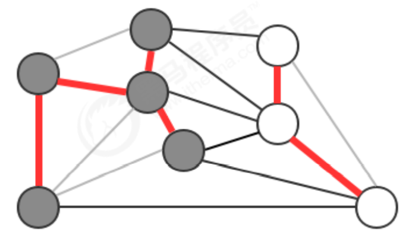

**切分定理**：在一副加权图中，给定任意的切分，它的横切边中的权重最小者必然属于图中的最小生成树。

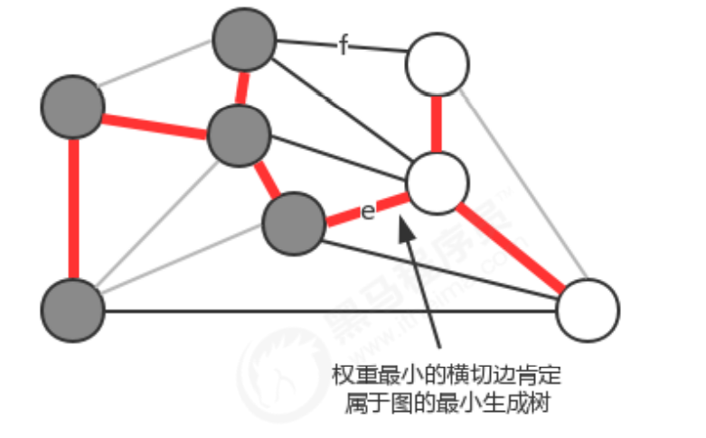

注意:一次切分产生的多个横切边中，权重最小的边不一定是所有横切边中唯一属于图的最小生成树的边

### 8.9.3 贪心算法

贪心算法是计算图的最小生成树的基础算法，它的基本原理就是切分定理，**使用切分定理找到最小生成树的一条 边，不断的重复直到找到最小生成树的所有边。如果图有V个顶点，那么需要找到V-1条边，就可以表示该图的最小 生成树。**

计算图的最小生成树的算法有很多种，但这些算法都可以看做是贪心算法的一种特殊情况，这些算法的不同之处在 于保存切分和判定权重最小的横切边的方式。

### 8.9.4 Prim算法

#### 8.9.4.1 API 设计

|   类名   | PrimMST                                                      |
| :------: | ------------------------------------------------------------ |
| 构造方法 | PrimMST(EdgeWeightedGraph G)：根据一副加权无向图，创建最小生成树计算对象； |
| 成员方法 | 1.private void visit(EdgeWeightedGraph G, int v)：将顶点v添加到最小生成树中，并且更新数据 <br />2.public Queue edges():获取最小生成树的所有边 |
| 成员变量 | 1.private Edge[] edgeTo: 索引代表顶点，值表示当前顶点和最小生成树之间的最短边 <br />2.private double[] distTo: 索引代表顶点，值表示当前顶点和最小生成树之间的最短边的权重 <br />3.private boolean[] marked:索引代表顶点，如果当前顶点已经在树中，则值为true，否则为 false <br />4.private IndexMinPriorityQueue pq:存放树中顶点与非树中顶点之间的有效横切边 |


#### 8.9.4.2 算法实现原理

使用**最小索引优先队列**存放树中顶点与非树中顶点的有效横切边，让最小索引优先队列的索引值表示图的顶点，让最小索引优先队列中的值表示从其他某个顶点到当前 顶点的边权重。

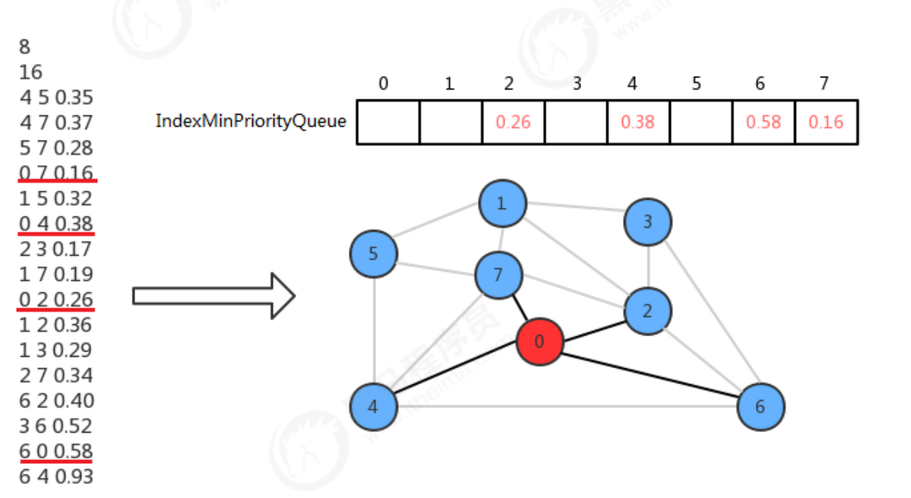

1. 初始化状态，先默认0是最小生成树中的唯一顶点，其他的顶点都不在最小生成树中，此时横切边就是顶点0的邻接 表中0-2,0-4,0-6,0-7这四条边，我们只需要将索引优先队列的2、4、6、7索引处分别存储这些边的权重值就可以表示了。
2. 现在只需要从这四条横切边中找出权重最小的边，然后把对应的顶点加进来即可。所以找到0-7这条边，添加。此时0、7都为最小生成树的顶点，7的邻接表中的边也是横切边，需要做以下两个操作：
   - 让0-7这条边失效：调用 最小索引优先队列 的delMin方法
   - 检查顶点是否有多条连接最小生成树的边， 只需要保留最短的一条。相应的调用 changeItem(int index, T t) 方法
3. 重复上面的操作，直到把所有的顶点都添加到最小生成树中  === 此时最小索引优先队列为空。


#### 8.9.4.2 代码

```java
package com.main.graph;

import com.main.queue.IndexMinPriorityQueue;
import com.main.queue.Queue;

public class PrimMST {

    // 索引值代表顶点，值代表当前顶点和最小生成树的最短边
    private Edge[] edgeTo;
    // 索引值代表顶点，值代表当前顶点和最小生成树的最短边的权重
    private double[] distTo;
    // 索引值代表顶点，值代表当前顶点是否被搜索过
    private boolean[] marked;
    // 存放最小生成树中的顶点 和 非最小生成树中顶点的有效横切边
    private IndexMinPriorityQueue<Double> pq;

    /**
     * 1. 初始化 三个数组 和一个队列
     * 2. distTo数组在初始化的时候 要设置为很大的一个值（无穷大）
     * 3. 默认让第0个顶点进入到最小生成树中(树中只有一个顶点，0顶点默认没有与其他顶点相连)，所以dist[0] 设置为 0.0
     * 4. 遍历索引最小优先队列pq，拿到pq里的最小值和对应的顶点，把该顶点加入到最小生成树中
     * @param edgeWeightedGraph 加权无向图
     */
    public PrimMST(EdgeWeightedGraph edgeWeightedGraph) {
        edgeTo = new Edge[edgeWeightedGraph.V()];
        distTo = new double[edgeWeightedGraph.V()];
        marked = new boolean[edgeWeightedGraph.V()];
        pq = new IndexMinPriorityQueue<>(edgeWeightedGraph.V());

        for (int i = 0; i < distTo.length; i++) {
            distTo[i] = Double.POSITIVE_INFINITY;
        }
        distTo[0] = 0.0;
        pq.insert(0, 0.0);
        while (!pq.isEmpty()) {
            visit(edgeWeightedGraph, pq.delMin());
        }
    }
    /**
     * 1. 将v顶点添加到最小生成树中
     * 2. 遍历顶点v的邻接表[e1, e2, ..., en]， 更新数据
     *  2.1. 拿到e，当前顶点v, 获取e边的另外一个顶点w
     *  2.2. 如果w在最小生成树中，则停止本次循环；否则下一步
     *  2.3. 如果 e 边的权重大于 w顶点到最小生成树的最短边的权重；是则停止本次循环；否则下一步
     *  2.4. 更新数据
     * @param edgeWeightedGraph
     * @param v
     */
    private void visit(EdgeWeightedGraph edgeWeightedGraph, int v) {
        marked[v] = true;
        for (Edge edge : edgeWeightedGraph.adj(v)) {
            int w = edge.other(v);
            if (marked[w]) {
                continue;
            }
            if (edge.weight() < distTo[w]) {
                edgeTo[w] = edge;
                distTo[w] = edge.weight();
                if (pq.contains(w)) {
                    pq.changeItem(w, edge.weight());
                } else {
                    pq.insert(w, edge.weight());
                }
            }
        }
    }

    /**
     * 获取最小生成树的所有边
     * @return
     */
    public Queue<Edge> edges() {
        Queue<Edge> edges = new Queue<>();
        for (int i = 0; i < edgeTo.length; i++) {
            if (edgeTo[i] != null) {
                edges.enqueue(edgeTo[i]);
            }
        }
        return edges;
    }
}
```

### 8.9.5 Kruskl算法

#### 8.9.5.1 定义及概念

kruskal算法是计算一副加权无向图的最小生成树的另外一种算法，它的**主要思想是按照边的权重(从小到大)处理它 们，将边加入最小生成树中，加入的边不会与已经加入最小生成树的边构成环，直到树中含有V-1条边为止。**

**kruskal算法和prim算法的区别：**

Prim算法是一条边一条边的构造最小生成树，每一步都为一棵树添加一条边。kruskal算法构造最小生成树的时候 也是一条边一条边地构造，但它的切分规则是不一样的。它每一次寻找的边会连接一片森林中的两棵树。如果一副 加权无向图由V个顶点组成，初始化情况下每个顶点都构成一棵独立的树，则V个顶点对应V棵树，组成一片森林， kruskal算法每一次处理都会将两棵树合并为一棵树，直到整个森林中只剩一棵树为止

#### 8.9.5.2 API设计

|   类名   | KruskalMST                                                   |
| :------: | ------------------------------------------------------------ |
| 构造方法 | KruskalMST(EdgeWeightedGraph G)：根据一副加权无向图，创建最小生成树计算对象； |
| 成员方法 | 1.public Queue edges():获取最小生成树的所有边                |
| 成员变量 | 1.private Queue mst：保存最小生成树的所有边 <br />2.private UF_Tree_Weighted uf: 索引代表顶点，使用uf.connect(v,w)可以判断顶点v和顶点w是否在同一颗树中，使用uf.union(v,w) 可以把顶点v所在的树和顶点w所在的树合并 <br />3.private MinPriorityQueue pq: 存储图中所有的边，使用最小优先队列，对边按照权重进行排序 |

#### 8.9.5.3 算法实现原理

在设计API的时候，使用了一个MinPriorityQueue pq存储图中所有的边，每次使用pq.delMin()取出权重最小的边，并得到该边关联的两个顶点v和w，通过uf.connect(v,w)判断v和w是否已经连通，如果连通，则证明这两个顶 点在同一棵树中，那么就不能再把这条边添加到最小生成树中，因为在一棵树的任意两个顶点上添加一条边，都会形成环，而最小生成树不能有环的存在，如果不连通，则通过uf.connect(v,w)把顶点v所在的树和顶点w所在的树 合并成一棵树，并把这条边加入到mst队列中，这样如果把所有的边处理完，最终mst中存储的就是最小生树的所 有边。

#### 8.9.5.4 代码

```java
package com.main.graph;

import com.main.queue.IndexMinPriorityQueue;
import com.main.queue.Queue;
import com.main.uf.UF_Tree_Weighted;

public class KruskalMST {

    // 保存最小生成树的所有边
    private Queue<Edge> mst;
    // 索引代表顶点，使用户 uf.connect(v,w)可以判断v和w是否在同一颗树中，
    // 使用uf.union(v,w)可以把v所在的树和w所在的树合并
    private UF_Tree_Weighted uf;
    // 存储所有的边，对边进行排序
    private IndexMinPriorityQueue<Edge> pq;


    public KruskalMST(EdgeWeightedGraph edgeWeightedGraph) {
        // 初始化 mst 队列
        mst = new Queue<>();
        // 初始化并查集uf，其容量和图的顶点数相同
        uf = new UF_Tree_Weighted(edgeWeightedGraph.V());
        // 初始化pq队列，容量为 图顶点数+1，并且插入所有的边
        pq = new IndexMinPriorityQueue<>(edgeWeightedGraph.E() + 1);
        for (Edge edge : edgeWeightedGraph.edges()) {
            pq.insert(edge);
        }

        // 循环结束的条件：pq队列为空 && mst的边为V-1条
        while (!pq.isEmpty() && mst.size() != edgeWeightedGraph.E()-1) {
            // 获取 pq 中最小边， 以及其两个顶点v,w
            Edge edge = pq.delMinNode();
            int v = edge.either();
            int w = edge.other(v);

            // 判断v和w是否连通， 不连通在通过uf.union(v,w)合并到一个树
            if (!uf.connected(v, w)) {
                uf.union(v, w);
                mst.enqueue(edge);
            }
        }
    }


    public Queue<Edge> edges() {
        return mst;
    }
}
```


## 8.10 加权有向图

### 8.10.1 加权有向边

#### 8.10.1.1 API设计

|   类名   | DirectedEdge                                                 |
| :------: | ------------------------------------------------------------ |
|    法    | DirectedEdge(int v,int w,double weight)：通过顶点v和w，以及权重weight值构造一个边对象 |
| 成员方法 | 1.public double weight():获取边的权重值 <br />2.public int from():获取有向边的起点 <br />3.public int to():获取有向边的终点 |
| 成员变量 | 1.private final int v：起点 <br />2.private final int w：终点 <br />3.private final double weight：当前边的权重 |

#### 8.10.1.2 代码

```java
package com.main.graph;

public class DirectedEdge {
    private int v;
    private int w;
    private double weight;

    public DirectedEdge(int v, int w, double weight) {
        this.v = v;
        this.w = w;
        this.weight = weight;
    }

    // 返回起点
    public int from() {
        return v;
    }

    // 返回终点
    public int to() {
        return w;
    }
    
    // 返回边的权重
    public double weight() {
        return weight;
    }
}
```

### 8.10.2 加权有向图

#### 8.10.2.1 API设计

|   类名   | EdgeWeightedDigraph                                          |
| :------: | ------------------------------------------------------------ |
| 构造方法 | EdgeWeightedDigraph(int V)：创建一个含有V个顶点的空加权有向图 |
| 成员方法 | 1.public int V():获取图中顶点的数量 <br />2.public int E():获取图中边的数量 <br />3.public void addEdge(DirectedEdge e):向加权有向图中添加一条边e <br />4.public Queue adj(int v)：获取由顶点v指出的所有的边 <br />5.public Queue edges()：获取加权有向图的所有边 |
| 成员变量 | 1.private final int V: 记录顶点数量 <br />2.private int E: 记录边数量 <br />3.private Queue[] adj: 邻接表 |

#### 8.10.2.1 代码

```java
package com.main.graph;

import com.main.queue.Queue;

public class EdgeWeightedDirectedGraph {
    private final int V;
    private int E;
    private Queue<DirectedEdge>[] adj;


    public EdgeWeightedDirectedGraph(int capacity) {
        V = capacity;
        E = 0;
        for (int i = 0; i < capacity; i++) {
            adj[i] = new Queue<>();
        }
    }

    /**
     * 获取加权图中的所有边
     * @return
     */
    public Queue<DirectedEdge> edges() {
        Queue<DirectedEdge> lists = new Queue<>();
        for (Queue<DirectedEdge> list : adj) {
            for (DirectedEdge edge : list) {
                list.enqueue(edge);
            }
        }
        return lists;
    }

    /**
     * 获取顶点v指出的所有边
     * @param v
     * @return
     */
    public Queue<DirectedEdge> adj(int v) {
        return adj[v];
    }

    /**
     * 向图中加入一条有向边
     * @param edge
     */
    public void addEdge(DirectedEdge edge) {
        int v = edge.from();
        adj[v].enqueue(edge);
        E++;
    }


    /**
     * 返回边数
     * @return
     */
    public int E() {
        return E;
    }

    /**
     * 返回定点数
     * @return
     */
    public int V() {
        return V;
    }
}
```


## 8.11 最短路径

### 11.1 定义 性质

**定义：**

在一副加权有向图中，从顶点s到顶点t的最短路径是所有从顶点s到顶点t的路径中总权重最小的那条路径。

**性质：**

1. 路径具有方向性； 
2. 权重不一定等价于距离。权重可以是距离、时间、花费等内容，权重最小指的是成本最低 
3. 只考虑连通图。一副图中并不是所有的顶点都是可达的，如果s和t不可达，那么它们之间也就不存在最短路径， 为了简化问题，这里只考虑连通图。 
4. 最短路径不一定是唯一的。从一个顶点到达另外一个顶点的权重最小的路径可能会有很多条，这里只需要找出一 条即可。

**最短路径树**： 给定一副加权有向图和一个顶点s，以s为起点的一棵最短路径树是图的一副子图，它包含顶点s以及从s可达的所有 顶点。这棵有向树的根结点为s，树的每条路径都是有向图中的一条最短路径。

### 8.11.2 API设计

|   类名   | DijkstraSP                                                   |
| :------: | ------------------------------------------------------------ |
| 构造方法 | public DijkstraSP(EdgeWeightedDigraph G, int s)：根据一副加权有向图G和顶点s，创建一个计 算顶点为s的最短路径树对象 |
| 成员方法 | 1.private void relax(EdgeWeightedDigraph G, int v)：松弛图G中的顶点v <br />2.public double distTo(int v):获取从顶点s到顶点v的最短路径的总权重 <br />3.public boolean hasPathTo(int v):判断从顶点s到顶点v是否可达 <br />4.public Queue pathTo(int v):查询从起点s到顶点v的最短路径中所有的边 |
| 成员变量 | 1.private DirectedEdge[] edgeTo: 索引代表顶点，值表示从顶点s到当前顶点的最短路径上的最 后一条边 <br />2.private double[] distTo: 索引代表顶点，值从顶点s到当前顶点的最短路径的总权重 <br />3.private IndexMinPriorityQueue pq:存放树中顶点与非树中顶点之间的有效横切边 |

### 8.11.3 松弛技术

顶点s和终点d，s到d有很多路径，将原本的路径变为新的路径（新路径更短），这就是松弛。

**边的松弛：**

放松边v->w意味着检查从s到w的最短路径是否先从s到v，然后再从v到w？

- 如果是，则v-w这条边需要加入到最短路径树中，更新edgeTo和distTo中的内容：edgeTo[w]=表示v->w这条边的 DirectedEdge对象，distTo[w]=distTo[v]+v->w这条边的权重；
- 如果不是，则忽略v->w这条边。

**顶点的松弛：**

顶点的松弛是基于边的松弛完成的，只需要把某个顶点指出的所有边松弛，那么该顶点就松弛完毕。例如要松弛顶 点v，只需要遍历v的邻接表，把每一条边都松弛，那么顶点v就松弛了

### 8.11.4 Dijkstra算法

``` java
package com.main.graph;

import com.main.queue.IndexMinPriorityQueue;
import com.main.queue.Queue;
import com.main.stack.Stack;

public class DijkstraSP {

    // 索引代表顶点，值表示 顶点s 到当前顶点 最短路径上的最后一条边
    private DirectedEdge[] edgeTo;
    // 索引代表顶点，值代表顶点s到当前顶点的最短路径的路径长度（权重和）
    private double[] distTo;
    // 存放最短路径树中的顶点 和 非最小生成树中顶点的有效横切边
    private IndexMinPriorityQueue<Double> pq;

    /**
     * 生成一个计算最短路径的对象
     *
     * @param graph 加权有向图
     * @param s 最短路径的起点
     */
    public DijkstraSP(EdgeWeightedDirectedGraph graph, int s) {
        edgeTo = new DirectedEdge[graph.V()];
        distTo = new double[graph.V()];
        for (int i = 0; i < distTo.length; i++) {
            distTo[i] = Double.POSITIVE_INFINITY;
        }
        pq = new IndexMinPriorityQueue<>(graph.V());
        distTo[s] = 0.0;
        pq.insert(s, 0.0);
        // 遍历所有有效边队列 松弛图 graph 中的顶点
        while (!pq.isEmpty()) {
            relax(graph, pq.delMin());
        }
    }

    /**
     * 松弛图graph中的顶点v
     * 松弛顶点v就是松弛顶点v的每一条边， 遍历邻接表，e ：
     * 1. 获取边e的终点w
     * 2. 判断：s->w 的距离是否大于 s->v 与 边e的权重之和
     *  2.1 大于：修改s->2 的路径：更新数据 edgeTo[w]=e, distTo[v]+=e.weight()
     *  2.2 不大于 忽略。
     *  2.3 将顶点 w 更新到队列pq中
     * @param graph
     * @param v
     */
    public void relax(EdgeWeightedDirectedGraph graph, int v) {
        for (DirectedEdge edge : graph.adj(v)) {
            int w = edge.to();
            if (distTo[w] > distTo[v] + edge.weight()) {
                edgeTo[w] = edge;
                distTo[w] = distTo[v] + edge.weight();
                if (pq.contains(w)) {
                    pq.changeItem(w, distTo[w]);
                } else {
                    pq.insert(w, distTo[w]);
                }
            }
        }
    }

    /**
     * 获取s顶点到v顶点的最短路径长度
     * @param v
     * @return
     */
    public double distTo(int v) {
        return distTo[v];
    }


    /**
     * 判断从顶点s是否能够到达顶点v
     * @param v 目标点
     * @return
     */
    public boolean hasPathTo(int v) {
        return distTo[v] < Double.POSITIVE_INFINITY;
    }

    /**
     * 获取顶点s到顶点v的最短路径
     * 1. 首先判断是否可达
     * 2. 从顶点v开始，逆向寻找，一直找到s为止 edgeTo[s]==null
     * @param v 目的地
     * @return Queue
     */
    public Queue<DirectedEdge> pathTo(int v) {
        if (!hasPathTo(v)) {
            System.out.println("顶点" + v + "不可达");
            return null;
        }
        Queue<DirectedEdge> path = new Queue<>();
        DirectedEdge edge = null;
        while (true) {
            edge = edgeTo[v];
            if (edge == null) {
                break;
            }
            path.enqueue(edge);
            v = edge.from();
        }
        return path;
    }

    public Stack<DirectedEdge> shortestPathTo(int v) {
        if (!hasPathTo(v)) {
            return null;
        }
        Stack<DirectedEdge> path = new Stack<>();
        DirectedEdge edge;
        while (true) {
            edge = edgeTo[v];
            if (edge == null) {
                break;
            }
            path.push(edge);
            v = edge.from();
        }
        return path;
    }
}
```

#### 8.11.4.1. 邻接矩阵实现

```java
public class CodeTrain1 {
    private static long[] distTo;
    private static int[] pre;
    private static boolean[] completed;
    private static final long INF = Long.MAX_VALUE;

    public static void main(String[] args) {
        Scanner sc = new Scanner(System.in);
        int testCount = sc.nextInt();
        boolean[] res = new boolean[testCount];
        for (int i = 0; i < testCount; i++) {
            int N = sc.nextInt(), M = sc.nextInt(), src = sc.nextInt() - 1, dest = sc.nextInt() - 1;
            long[][] map = new long[N][N];
            for (long[] ints : map) Arrays.fill(ints, INF);
            distTo = new long[N];
            pre = new int[N];
            completed = new boolean[N];
            for (int j = 0; j < M; j++) {
                int from = sc.nextInt() - 1, to = sc.nextInt() - 1, cost = sc.nextInt();
                map[from][to] = cost;
                map[to][from] = cost;
            }
            dijkstra(map, src);
            Stack<Integer> path = pathTo(dest);
        }
    }

    private static void dijkstra(long[][] map, int start) {
        init(map, start);
        for (int i = 0; i < distTo.length; i++) {
            long temp = INF;
            int t = start;
            for (int j = 0; j < distTo.length; j++) {
                if (!completed[j] && distTo[j] < temp) {
                    temp = distTo[j];
                    t = j;
                }
            }
            if (t == start) return;
            completed[t] = true;
            for (int j = 0; j < distTo.length; j++) {
                if (!completed[j] && map[t][j] < INF) {
                    if (distTo[j] > distTo[t] + map[t][j]) {
                        distTo[j] = distTo[t] + map[t][j];
                        pre[j] = t;
                    }
                }
            }
        }
    }

    private static void init(long[][] map, int start) {
        for (int i = 0; i < distTo.length; i++) {
            distTo[i] = map[start][i];
            completed[i] = false;
            if (distTo[i] == INF) {
                pre[i] = -1;
            } else {
                pre[i] = start;
            }
        }
        distTo[start] = 0;
        completed[start] = true;
    }

    private static Stack<Integer> pathTo(int dest) {
        Stack<Integer> res = new Stack<>();
        while (pre[dest] != -1) {
            res.add(dest);
            dest = pre[dest];
        }
        return res;
    }
}
```

#### 8.11.4.2. 求所有的最短路径


# 9.并查集

## 9.1 并查集结构

## 9.2 并查集API设计

## 9.3 并查集实现

## 9.4 并查集运用举例

## 9.5 UF_Tree 算法优化

## 9.6 路径压缩

## 9.7 畅通工程