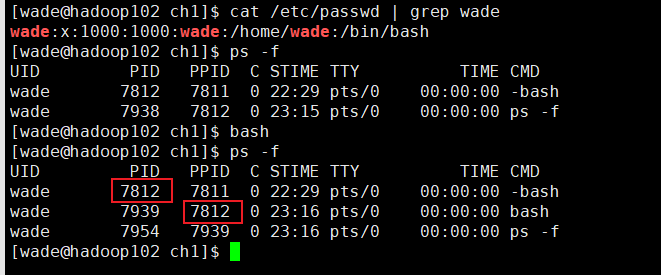
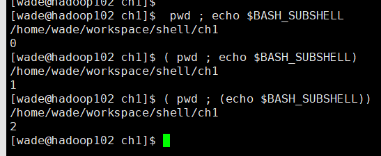

# linux cmd

## 1.基本命令

## 1.1. 文件系统

## 2.更多命令：

### 监测程序

#### 探测进程 ps

默认情况下，ps命令只会显示运行在当前控制台下的属于当前用户的进 程。

Unix风格的ps命令参数

| 参数        | 描述                                                      |
| ----------- | --------------------------------------------------------- |
| -A          | 显示所有进程                                              |
| -N          | 显示与指定参数不符的所有进程                              |
| -a          | 显示除控制进程（session leader①）和无终端进程外的所有进程 |
| -d          | 显示除控制进程外的所有进程                                |
| -e          | 显示所有进程                                              |
| -C cmdlist  | 显示包含在cmdlist列表中的进程                             |
| -G grplist  | 显示组ID在grplist列表中的进程                             |
| -U userlist | 显示属主的用户ID在userlist列表中的进程                    |
| -g grplist  | 显示会话或组ID在grplist列表中的进程②                      |
| -p pidlist  | 显示PID在pidlist列表中的进程                              |
| -s sesslist | 显示会话ID在sesslist列表中的进程                          |
| -t ttylist  | 显示终端ID在ttylist列表中的进程                           |
| -u userlist | 显示有效用户ID在userlist列表中的进程                      |
| -F          | 显示更多额外输出（相对-f参数而言）                        |
| -O format   | 显示默认的输出列以及format列表指定的特定列                |
| -M          | 显示进程的安全信息                                        |
| -c          | 显示进程的额外调度器信息                                  |
| -f          | 显示完整格式的输出                                        |
| -j          | 显示任务信息                                              |
| -l          | 显示长列表                                                |
| -o format   | 仅显示由format指定的列                                    |
| -y          | 不要显示进程标记（process flag，表明进程状态的标记）      |
| -Z          | 显示安全标签（security context）①信息                     |
| -H          | 用层级格式来显示进程（树状，用来显示父进程）              |
| -n namelist | 定义了WCHAN列显示的值                                     |
| -w          | 采用宽输出模式，不限宽度显示                              |
| -L          | 显示进程中的线程                                          |
| -V          | 显示ps命令的版本号                                        |
|             |                                                           |

`-f`参数则扩展了输 出，这些扩展的列包含了有用的信息。 

- UID：启动这些进程的用户。 
- PID：进程的进程ID。 
- PPID：父进程的进程号（如果该进程是由另一个进程启动的）。 
- C：进程生命周期中的CPU利用率。
-  STIME：进程启动时的系统时间。 
- TTY：进程启动时的终端设备。 
-  TIME：运行进程需要的累计CPU时间。 
-  CMD：启动的程序名称。 

`-l`参数多出了一些列

- F：内核分配给进程的系统标记。 
- S：进程的状态（O代表正在运行；S代表在休眠；R代表可运行，正等待运行；Z代表僵 化，进程已结束但父进程已不存在；T代表停止）。 
- PRI：进程的优先级（越大的数字代表越低的优先级）。
- NI：谦让度值用来参与决定优先级。 
-  ADDR：进程的内存地址。 
- SZ：假如进程被换出，所需交换空间的大致大小。 
-  WCHAN：进程休眠的内核函数的地址。 

#### 实时监测进程 top

后一部分显示了当前运行中的进程的详细列表，有些列跟ps命令的输出类似。 

- PID：进程的ID。 
- USER：进程属主的名字。 
-  PR：进程的优先级。 
- NI：进程的谦让度值。 
- VIRT：进程占用的虚拟内存总量。 
- RES：进程占用的物理内存总量。 
- SHR：进程和其他进程共享的内存总量。
-  S：进程的状态（D代表可中断的休眠状态，R代表在运行状态，S代表休眠状态，T代表 跟踪状态或停止状态，Z代表僵化状态）。 
- %CPU：进程使用的CPU时间比例。 
-  %MEM：进程使用的内存占可用内存的比例。 

#### 结束进程 kill killall

Linux 进程信号

| 信号 | 名称 | 描述                       |
| ---- | ---- | -------------------------- |
| 1    | HUP  | 挂起                       |
| 2    | INT  | 中断                       |
| 3    | QUIT | 结束运行                   |
| 9    | KILL | 无条件终止                 |
| 11   | SEGV | 段错误                     |
| 15   | TERM | 尽可能终止                 |
| 17   | STOP | 无条件停止运行，但不终止   |
| 18   | TSTP | 停止或者暂停               |
| 19   | CONT | 在STOP或者TSTP之后恢复执行 |

使用 `kill -信号 pid`，默认是15

killall 通过 进程名来结束。例如`kill http*` 结束所有http开头的进程。

### 监测磁盘空间

#### mount 挂载设备

#### 使用df 命令 

df命令可以让你很方便地查看所有已挂载 磁盘的使用情况， -h参数增加可读性。

#### 使用du 命令 

du命令可以显示某个特定目录（默认情况下是当前目录）的 磁盘使用情况。这一方法可用来快速判断系统上某个目录下是不是有超大文件。 

-  -c：显示所有已列出文件总的大小。 
- -h：按用户易读的格式输出大小，即用K替代千字节，用M替代兆字节，用G替代吉字 节。 
-  -s：显示每个输出参数的总计。 

### 处理数据文件

#### 排序 sort

`sort`命令是对数据进行排序的。 默认情况下，sort命令按照会话指定的默认语言的排序规则对文本文件中的数据行排序。 

| 单破折线 | 双破折线                                 | 描  述                                                       |
| -------- | ---------------------------------------- | ------------------------------------------------------------ |
| -b       | --ignore-leading-blanks                  | 排序时忽略起始的空白                                         |
| -C       | --check-quit                             | 不排序，如果数据无序也不报告                                 |
| -c       | --check                                  | 不排序，但检查输入数据是不是已排序；未排序的话，报告         |
| -d       | --dictionary-order                       | 仅考虑空白和字母，不考虑特殊字符                             |
| -f       | --ignore-case                            | 默认情况下，会将大写字母排在前面；这个参数会忽略大小写       |
| -g       | --general-number-sort                    | 按通用数值来排序（跟-n不同，把值当浮点数来排序，支持科学 计数法表示的值） |
| -i       | --ignore-nonprinting                     | 在排序时忽略不可打印字符                                     |
| -k       | --key=POS1[,POS2]                        | 排序从POS1位置开始；如果指定了POS2的话，到POS2位置结 束      |
| -M       | --month-sort                             | 用三字符月份名按月份排序                                     |
| -m       | --merge                                  | 将两个已排序数据文件合并                                     |
| -n       | --numeric-sort                           | 按字符串数值来排序（并不转换为浮点数）                       |
| -o       | --output=file                            | 将排序结果写出到指定的文件中                                 |
| -R       | --random-sort  --random-source=FILE | 按随机生成的散列表的键值排序  指定-R参数用到的随机字节的源文件 |
| -r       | --reverse                                | 反序排序（                                                   |
| -S       | --buffer-size=SIZE                       | 指定使用的内存大小                                           |
| -s       | --stable                                 | 禁用最后重排序比较                                           |
| -T       | --temporary-directory=DIR                | 指定一个位置来存储临时工作文件                               |
| -t       | --field-separator=SEP                    | 指定一个用来区分键位置的字符                                 |
| -u       | --unique                                 | 和-c参数一起使用时，检查严格排序；不和-c参数一起用时，仅 输出第一例相似的两行 |
| -z       | --zero-terminated                        | 用NULL字符作为行尾，而不是用换行符                           |

-k和-t参数在对按字段分隔的数据进行排序时非常有用，例如/etc/passwd文件。可以用-t 参数来指定字段分隔符，然后用-k参数来指定排序的字段。

#### 搜索 grep

命令格式：`grep [options] pattern [file]`

- -v：反向搜索
- -n：显示所在的行号
- -c：输出匹配的行数
- -e：指定多个匹配模式
- pattern：可以使用正则表达式

egrep命令是grep的一个衍生，支持POSIX扩展正则表达式。POSIX扩展正则表达式含有更 多的可以用来指定匹配模式的字符（参见第20章）。fgrep则是另外一个版本，支持将匹配模式 指定为用换行符分隔的一列固定长度的字符串。这样就可以把这列字符串放到一个文件中，然后 在fgrep命令中用其在一个大型文件中搜索字符串了。 

#### 压缩 gzip zip  compress bzip2

| 工具     | 文件扩展名 | 描述                                              |
| -------- | ---------- | ------------------------------------------------- |
| bzip2    | .bz2       | 采用Burrows-Wheeler块排序文本压缩算法和霍夫曼编码 |
| compress | .Z         | 最初的Unix文件压缩工具，已经快没人用了            |
| gzip     | .gz        | GNU压缩工具，用Lempel-Ziv编码                     |
| zip      | .zip       | Windows上PKZIP工具的Unix实现                      |

gzip包含有下面的工具：

-  gzip：用来压缩文件。 
- gzcat：用来查看压缩过的文本文件的内容。 
- gunzip：用来解压文件。 

#### 归档 tar

命令格式：`tar function [options] object1 object2 ...`

tar命令 function 

| function | 长名称                 | 描述                                                         |
| -------- | ---------------------- | ------------------------------------------------------------ |
| -A       | --concatenate          | 将一个已有tar归档文件追加到另一个已有tar归档文件             |
| -c       | --create               | 创建一个新的tar归档文件                                      |
| -d       | --diff   --delete | 检查归档文件和文件系统的不同之处                             |
| -r       | --append               | 追加文件到已有tar归档文件末尾                                |
| -t       | --list                 | 列出已有tar归档文件的内容                                    |
| -u       | --update               | 将比tar归档文件中已有的同名文件新的文件追加到该tar归档文件中 |
| -x       | --extract              | 从已有tar归档文件中提取文件                                  |
|          |                        |                                                              |

tar命令option

| option  | 描述                              |
| ------- | --------------------------------- |
| -C dir  | 切换到指定目录                    |
| -f file | 输出结果到文件或者设备file        |
| -j      | 将输出重定向给bzip2命令来压缩内容 |
| -p      | 保留所有文件权限                  |
| -v      | 在处理文件时显示文件              |
| -z      | 将输出重定向给gzip命令来压缩文件  |

## 3.Shell

### Shell类型

只讨论bash shell

在/etc/passwd文件中，在用户ID记 录的第7个字段中列出了默认的shell程序

### Shell父子关系

在CLI提示符后输入/bin/bash命令或其他等效的bash命令时，会创建一个新的shell程序。 这个shell程序被称为子shell（child shell）。子shell也拥有CLI提示符，同样会等待命令输入。 

在生成子shell进程时，只有部分父进程的环境被复制到子shell环境中。

| 参数      | 描述                                        |
| --------- | ------------------------------------------- |
| -c string | 从string中读取命令并进行处理                |
| -i        | 启动一个能够接收用户输入的交互shell         |
| -l        | 以登录shell的形式启动                       |
| -r        | 启动一个受限shell，用户会被限制在默认目录中 |
| -s        | 从标准输入中读取命令                        |

可以利用exit命令有条不紊地退出子shell。 

### 进程列表

你可以在一行中指定要依次运行的一系列命令。这可以通过命令列表来实现，只需要在命令 之间加入分号（;）即可。 例如：`pwd ; ls ; cd /etc ; pwd ; cd ; pwd ; ls `，这些命令依次执行，不存在任何问题。

但是这不是进程列表，加上括号后就是进程列表 `(pwd ; ls ; cd /etc ; pwd ; cd ; pwd ; ls)`。括号的加入使 命令列表变成了进程列表，**生成了一个子shell**来执行对应的命令。 

>进程列表是一种命令分组（command grouping）。另一种命令分组是将命令放入花括号中， 并在命令列表尾部加上分号（;）。语法为{ command; }。使用花括号进行命令分组并不 会像进程列表那样创建出子shell。 

在进程列表加入 `echo $BASH_SUBSHELL`，查看是否生成了子shell。如果该命令返回0，就表明没有子shell。如果返回 1或者其他更大的数字，就表明存在子shell。 

